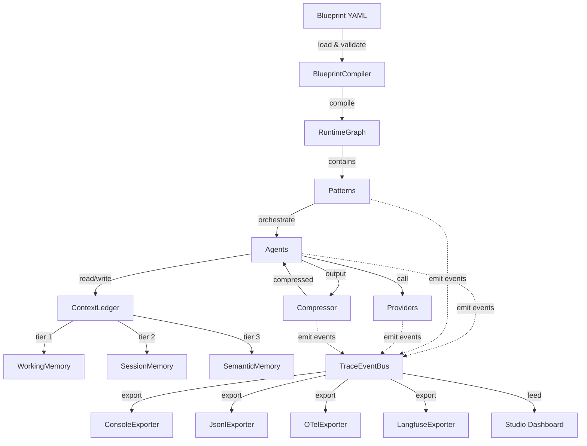

# PyAgent

**A production stack for multi-agent LLM systems** — declare systems in YAML, orchestrate with 18 named patterns, persist state with three-tier memory, and observe everything with OTel tracing and a web dashboard.

[](LICENSE)
[](https://www.python.org/downloads/)

```bash
pip install pyagent-all   # full stack
```

## Architecture Pillars

PyAgent is built around four pillars that mirror the lifecycle of a production multi-agent system:

### 📋 Blueprint — declare your system

| Package | What it does | Install |
|---------|-------------|---------|
| **pyagent-blueprint** | YAML spec → validated schema → compiled `RuntimeGraph`. Validate, test, diff, and render from the CLI. | `pip install pyagent-blueprint` |

### ⚡ Execution — run your patterns

| Package | What it does | Install |
|---------|-------------|---------|
| **pyagent-patterns** | 18 orchestration patterns: Pipeline, Supervisor, Fan-Out, Debate, Swarm, ReAct and more | `pip install pyagent-patterns` |
| **pyagent-providers** | Multi-provider registry, routing strategies, fallback chains, capability negotiation, cost optimizer | `pip install pyagent-providers` |
| **pyagent-router** | Difficulty scoring, cost estimation, model selection middleware — cheap tasks to cheap models | `pip install pyagent-router` |
| **pyagent-compress** | Inter-agent message compression, agent pruning, interaction pruning, token budgets | `pip install pyagent-compress` |

### 🧠 Context & Memory — remember across turns

| Package | What it does | Install |
|---------|-------------|---------|
| **pyagent-context** | Three-tier memory (working/session/semantic), trust metadata, compression policies, PII redaction | `pip install pyagent-context` |

### 📊 Observability — watch it run

| Package | What it does | Install |
|---------|-------------|---------|
| **pyagent-trace** | `TraceEventBus` pub/sub, OTel spans, Langfuse export, cost tracking, record/replay | `pip install pyagent-trace` |
| **pyagent-studio** | `kubectl`-style CLI + FastAPI web dashboard: simulate, diff, trace explorer, governance | `pip install pyagent-studio` |

---

> Install everything at once: `pip install pyagent-all`  
> Full documentation: [pyagent.org](https://pyagent.org)

---

## Table of Contents

- [Connecting your LLM](#connecting-your-llm)
- [Core concepts](#core-concepts)
- [Pattern catalog](#pattern-catalog-18-patterns-across-4-tiers)
  - [Tier 1 — Orchestration](#tier-1--orchestration)
  - [Tier 2 — Resolution](#tier-2--resolution)
  - [Tier 3 — Structural](#tier-3--structural)
  - [Tier 4 — Iterative & Advanced](#tier-4--iterative--advanced)
- [Pattern composition](#pattern-composition)
- [Pattern Advisor](#pattern-advisor)
- [pyagent-router](#pyagent-router)
- [pyagent-compress](#pyagent-compress)
- [pyagent-trace](#pyagent-trace)
- [Guardrails](#guardrails)
- [Recovery](#recovery)
- [pyagent-providers](#pyagent-providers)
- [pyagent-context](#pyagent-context)
- [pyagent-blueprint](#pyagent-blueprint)
- [pyagent-studio](#pyagent-studio)
- [End-to-end integration](#end-to-end-integration)
- [When to use which pattern](#when-to-use-which-pattern)
- [Cookbook](#cookbook)
- [Contributing](#contributing)

## Connecting your LLM

PyAgent has no provider dependencies. Every pattern accepts any object satisfying the `LLMCallable` Protocol:

```python
class LLMCallable(Protocol):
    async def __call__(self, messages: list[Message]) -> str: ...
```

Copy the adapter for your provider and pass it wherever examples show `llm`.

### OpenAI

```python
from openai import AsyncOpenAI
from pyagent_patterns.base import Message

class OpenAILLM:
    def __init__(self, model: str = "gpt-4o-mini", api_key: str | None = None):
        self._client = AsyncOpenAI(api_key=api_key)  # falls back to OPENAI_API_KEY
        self._model = model

    async def __call__(self, messages: list[Message]) -> str:
        response = await self._client.chat.completions.create(
            model=self._model,
            messages=[{"role": m.role.value, "content": m.content} for m in messages],
        )
        return response.choices[0].message.content or ""

llm = OpenAILLM("gpt-4o-mini")    # fast, cheap
llm = OpenAILLM("gpt-4o")         # capable
llm = OpenAILLM("o3-mini")        # reasoning
```

### Anthropic

```python
import anthropic
from pyagent_patterns.base import Message, Role

class AnthropicLLM:
    def __init__(self, model: str = "claude-sonnet-4-20250514", api_key: str | None = None):
        self._client = anthropic.AsyncAnthropic(api_key=api_key)
        self._model = model

    async def __call__(self, messages: list[Message]) -> str:
        # Anthropic requires system messages separated from conversation
        system = next(
            (m.content for m in messages if m.role == Role.SYSTEM),
            "You are a helpful assistant.",
        )
        chat_msgs = [
            {"role": m.role.value, "content": m.content}
            for m in messages
            if m.role != Role.SYSTEM
        ]
        response = await self._client.messages.create(
            model=self._model,
            max_tokens=4096,
            system=system,
            messages=chat_msgs,
        )
        return response.content[0].text

llm = AnthropicLLM("claude-haiku-3-5-20241022")    # fast, cheap
llm = AnthropicLLM("claude-sonnet-4-20250514")     # balanced
```

### Google Gemini

```python
import asyncio
import google.generativeai as genai
from pyagent_patterns.base import Message, Role

class GeminiLLM:
    def __init__(self, model: str = "gemini-2.5-flash", api_key: str | None = None):
        import os
        genai.configure(api_key=api_key or os.environ["GOOGLE_API_KEY"])
        self._model_name = model

    async def __call__(self, messages: list[Message]) -> str:
        system = next((m.content for m in messages if m.role == Role.SYSTEM), None)
        model = genai.GenerativeModel(self._model_name, system_instruction=system)
        history = [
            {"role": "user" if m.role == Role.USER else "model", "parts": [m.content]}
            for m in messages[:-1]
            if m.role != Role.SYSTEM
        ]
        last = next(m.content for m in reversed(messages) if m.role == Role.USER)
        response = await asyncio.to_thread(
            model.start_chat(history=history).send_message, last
        )
        return response.text

llm = GeminiLLM("gemini-2.5-flash")    # fast, cheap
llm = GeminiLLM("gemini-2.5-pro")      # capable
```

### LangChain (any provider)

```python
from langchain_core.messages import HumanMessage, AIMessage, SystemMessage
from pyagent_patterns.base import Message, Role

class LangChainLLM:
    """Wraps any LangChain BaseChatModel — OpenAI, Anthropic, Gemini, Ollama, Bedrock..."""

    def __init__(self, chat_model):
        self._model = chat_model

    async def __call__(self, messages: list[Message]) -> str:
        mapping = {Role.SYSTEM: SystemMessage, Role.USER: HumanMessage}
        lc_msgs = [mapping.get(m.role, AIMessage)(content=m.content) for m in messages]
        return (await self._model.ainvoke(lc_msgs)).content

# Works with any LangChain model
from langchain_openai import ChatOpenAI
from langchain_anthropic import ChatAnthropic
from langchain_google_genai import ChatGoogleGenerativeAI
from langchain_ollama import ChatOllama

llm = LangChainLLM(ChatOpenAI(model="gpt-4o-mini"))
llm = LangChainLLM(ChatAnthropic(model="claude-sonnet-4-20250514"))
llm = LangChainLLM(ChatGoogleGenerativeAI(model="gemini-2.5-flash"))
llm = LangChainLLM(ChatOllama(model="llama3.2"))  # local
```

### LiteLLM (100+ providers)

```python
import litellm
from pyagent_patterns.base import Message

class LiteLLM:
    def __init__(self, model: str):
        self._model = model

    async def __call__(self, messages: list[Message]) -> str:
        response = await litellm.acompletion(
            model=self._model,
            messages=[{"role": m.role.value, "content": m.content} for m in messages],
        )
        return response.choices[0].message.content or ""

llm = LiteLLM("gpt-4o-mini")
llm = LiteLLM("anthropic/claude-sonnet-4-20250514")
llm = LiteLLM("gemini/gemini-2.5-flash")
llm = LiteLLM("ollama/llama3.2")                       # local
llm = LiteLLM("bedrock/anthropic.claude-3-5-sonnet")    # AWS Bedrock
llm = LiteLLM("azure/gpt-4o")                          # Azure OpenAI
```

### Testing without API calls

```python
from pyagent_patterns.base import MockLLM

# Returns responses in order, cycling when exhausted
llm = MockLLM(responses=["Step 1 output", "Step 2 output", "Final answer"])

# Optionally simulate latency
llm = MockLLM(responses=["response"], delay=0.1)

# Echo mode — repeats last user message
llm = MockLLM()
```

## Core concepts

```python
import asyncio
from pyagent_patterns.base import Agent, Message, Context, Result

# Agent: an LLM with a name and optional system prompt
agent = Agent(
    name="analyst",
    llm=OpenAILLM("gpt-4o-mini"),
    system_prompt="You are a senior financial analyst. Be precise and cite data.",
    description="Analyses financial metrics and produces structured reports.",
)

# Run any pattern the same way
result: Result = asyncio.run(pattern.run("Your task here"))

# Result fields
result.output              # str — final text output
result.messages            # list[Message] — all messages generated
result.metadata            # dict — pattern-specific data (rounds, route, scores, trace, etc.)
result.duration_seconds    # float — wall-clock time
result.token_estimate      # int — rough total token count
result.cost_estimate       # float — rough cost in USD

# Pass an existing context to chain patterns
ctx = Context(task="original task", metadata={"session_id": "abc123"})
result = asyncio.run(pattern.run("follow-up task", context=ctx))
```

## Pattern catalog (18 patterns across 4 tiers)

### Tier 1 — Orchestration

#### 1. Pipeline

Sequential chain — each agent's output is the next agent's input. Best for: ETL, document processing, multi-step transformation. LLM calls: N (one per stage).

```python
import asyncio
from pyagent_patterns.base import Agent
from pyagent_patterns.orchestration import Pipeline

pipeline = Pipeline(stages=[
    Agent("extractor", AnthropicLLM("claude-haiku-3-5-20241022"),
          system_prompt="Extract every claim, figure, and named entity from the text. Be exhaustive."),
    Agent("fact_checker", OpenAILLM("gpt-4o-mini"),
          system_prompt="Identify which extracted items are verifiable facts vs opinions or speculation."),
    Agent("writer", AnthropicLLM("claude-sonnet-4-20250514"),
          system_prompt="Write a concise, structured brief. Lead with the most important fact."),
])

result = asyncio.run(pipeline.run(
    "Tesla Q3 2025 earnings: Revenue $25.2B (+8% YoY), auto gross margin 17.1%, "
    "energy storage deployments up 73% YoY, FSD miles driven passed 2B total..."
))
print(result.output)
# metadata: {"stages": 3, "stage_names": ["extractor", "fact_checker", "writer"]}

# Stream stage completions as they finish
async def stream_example():
    async for chunk in pipeline.stream("Process this document"):
        print(chunk)  # "[Stage 1/3 — extractor] Revenue: $25.2B..."

asyncio.run(stream_example())
```

#### 2. Supervisor

Classify → route → collect. A coordinator dispatches to the right specialist. Best for: Customer support bots, multi-domain Q&A, triage systems. LLM calls: 2–3 (classify + specialist + optional formatter).

```python
from pyagent_patterns.orchestration import Supervisor

supervisor = Supervisor(
    classifier=Agent(
        "router", AnthropicLLM("claude-haiku-3-5-20241022"),  # cheap — classification is a simple task
        system_prompt="Classify into exactly one of: billing, technical, returns, general. "
                      "Respond with ONLY the category name, nothing else.",
    ),
    routes={
        "billing": Agent("billing_agent", AnthropicLLM("claude-sonnet-4-20250514"),
                         system_prompt="Handle billing disputes, refunds, and subscription questions. "
                                       "Always acknowledge frustration and offer concrete next steps."),
        "technical": Agent("technical_agent", OpenAILLM("gpt-4o"),
                           system_prompt="Handle technical troubleshooting and API issues. "
                                         "Provide step-by-step debugging instructions."),
        "returns": Agent("returns_agent", AnthropicLLM("claude-sonnet-4-20250514"),
                         system_prompt="Handle return requests. Explain the return policy clearly "
                                       "and initiate the process where applicable."),
        "general": Agent("general_agent", AnthropicLLM("claude-haiku-3-5-20241022"),
                         system_prompt="Handle general inquiries warmly and helpfully."),
    },
    formatter=Agent(
        "formatter", AnthropicLLM("claude-haiku-3-5-20241022"),
        system_prompt="Format the response professionally. Remove any internal notes. Keep it under 200 words.",
    ),
    default_route="general",
)

result = asyncio.run(supervisor.run("I was charged twice for my Pro subscription this month"))
print(result.output)
# metadata: {"route_key": "billing", "classifier_output": "billing"}
```

#### 3. Fan-Out / Fan-In

Parallel execution across N agents, all receiving the same task, results aggregated. Best for: Multi-perspective analysis, parallel research, ensemble approaches. LLM calls: N (parallel) + 1 aggregator. Wall-clock time: max(agent latencies) + aggregator.

```python
from pyagent_patterns.orchestration import FanOutFanIn

analysis = FanOutFanIn(
    agents=[
        Agent("bull", GeminiLLM("gemini-2.5-flash"),
              system_prompt="Argue the strongest possible bullish investment case. Cite revenue growth, "
                            "market share, and competitive moats. Use specific data points."),
        Agent("bear", GeminiLLM("gemini-2.5-flash"),
              system_prompt="Argue the strongest possible bearish case. Address valuation, competitive "
                            "threats, macro risks, and execution risks with data."),
        Agent("neutral", GeminiLLM("gemini-2.5-flash"),
              system_prompt="Give a balanced assessment. Acknowledge both the bull and bear cases, "
                            "identify the key swing factors, and assign probability weights."),
    ],
    aggregator=Agent(
        "analyst", GeminiLLM("gemini-2.5-pro"),  # upgrade aggregator for quality synthesis
        system_prompt="Synthesise all three perspectives into a structured investment memo: "
                      "Executive Summary, Bull Case, Bear Case, Key Risks, Verdict.",
    ),
)

result = asyncio.run(analysis.run("Investment thesis for Nvidia at current valuation"))
print(result.output)
# metadata: {"parallel_agents": 3, "agent_names": ["bull", "bear", "neutral"]}

# Stream individual agent results as they complete
async def stream_fan_out():
    async for chunk in analysis.stream("Evaluate Nvidia investment thesis"):
        print(chunk)  # "[bull] Strong revenue growth driven by data center..."

asyncio.run(stream_fan_out())
```

#### 4. Hierarchical

Manager → Team Leads → Workers. Multi-level delegation and synthesis. Best for: Complex projects with defined sub-teams, enterprise workflows. LLM calls: 1 manager + T leads + W workers (teams run in parallel).

```python
from pyagent_patterns.orchestration import Hierarchical
from pyagent_patterns.orchestration.hierarchical import Team
from langchain_openai import ChatOpenAI
from langchain_anthropic import ChatAnthropic

# Mix providers across the hierarchy
manager_llm = LangChainLLM(ChatOpenAI(model="gpt-4o"))
lead_llm = LangChainLLM(ChatOpenAI(model="gpt-4o-mini"))
worker_llm = LangChainLLM(ChatAnthropic(model="claude-haiku-3-5-20241022"))

hierarchical = Hierarchical(
    manager=Agent(
        "engineering_director", manager_llm,
        system_prompt="Decompose the initiative into team subtasks. Then synthesise all team outputs "
                      "into a coherent technical spec. Call out integration points between teams.",
    ),
    teams=[
        Team(
            name="Backend",
            lead=Agent("backend_lead", lead_llm,
                       system_prompt="Lead the backend design. Coordinate worker outputs into a "
                                     "cohesive backend architecture document."),
            workers=[
                Agent("api_engineer", worker_llm,
                      system_prompt="Design the REST API endpoints, request/response schemas, and auth."),
                Agent("db_engineer", worker_llm,
                      system_prompt="Design database schema, indexes, migrations, and query patterns."),
                Agent("infra_engineer", worker_llm,
                      system_prompt="Design the deployment architecture, scaling strategy, and monitoring."),
            ],
        ),
        Team(
            name="Frontend",
            lead=Agent("frontend_lead", lead_llm,
                       system_prompt="Lead the frontend design. Coordinate worker outputs into a "
                                     "cohesive frontend spec."),
            workers=[
                Agent("ui_engineer", worker_llm,
                      system_prompt="Design the component architecture and state management approach."),
                Agent("ux_researcher", worker_llm,
                      system_prompt="Define user flows, accessibility requirements, and success metrics."),
            ],
        ),
    ],
)

result = asyncio.run(hierarchical.run(
    "Design a real-time collaborative document editor like Google Docs"
))
# metadata: {"teams": 2, "total_workers": 5, "team_names": ["Backend", "Frontend"]}
```

#### 5. Orchestrator-Workers

Orchestrator plans dynamically at runtime, assigns to the right workers for this specific task. Best for: Open-ended goals where subtasks aren't known upfront. LLM calls: 1 planning + N workers (dynamic) + 1 synthesis.

```python
from pyagent_patterns.orchestration import OrchestratorWorkers

orchestrator_workers = OrchestratorWorkers(
    orchestrator=Agent(
        "planner", OpenAILLM("gpt-4o"),
        system_prompt="You have a pool of specialist workers. Plan the work by deciding which workers "
                      "to use and what to assign each one. Only assign workers that are genuinely needed. "
                      'Respond as JSON: {"assignments": [{"worker": "name", "subtask": "description"}]}. '
                      "Then synthesise all worker outputs into a final deliverable.",
    ),
    workers=[
        Agent("researcher", OpenAILLM("gpt-4o-mini"),
              system_prompt="Research topics thoroughly. Find recent, credible information."),
        Agent("coder", OpenAILLM("gpt-4o-mini"),
              system_prompt="Write clean, idiomatic Python with type hints, docstrings, and error handling."),
        Agent("tester", OpenAILLM("gpt-4o-mini"),
              system_prompt="Write comprehensive pytest test suites. Cover happy path, edge cases, and errors."),
        Agent("doc_writer", OpenAILLM("gpt-4o-mini"),
              system_prompt="Write clear technical documentation. Include usage examples and gotchas."),
        Agent("reviewer", OpenAILLM("gpt-4o"),
              system_prompt="Review code and documentation for correctness, completeness, and quality."),
    ],
)

result = asyncio.run(orchestrator_workers.run(
    "Build a production-ready async HTTP client with retry logic, circuit breaking, "
    "rate limiting, and full test coverage"
))
# metadata: {"assignments": [...], "workers_used": 4}
```

### Tier 2 — Resolution

#### 6. Self-Reflection

Generate → critique → refine loop. Stops early when critic approves. Best for: Code generation, essay writing, any task where quality > speed. LLM calls: 2 per round × 1–N rounds.

```python
from pyagent_patterns.resolution import SelfReflection

self_reflection = SelfReflection(
    agent=Agent(
        "coder", OpenAILLM("gpt-4o-mini"),
        system_prompt="Write production-quality Python code with type hints, docstrings, and proper "
                      "error handling. Consider edge cases upfront.",
    ),
    critic=Agent(
        "reviewer", OpenAILLM("gpt-4o"),  # stronger model catches more issues
        system_prompt="Review code strictly for: (1) correctness with edge cases, (2) proper error "
                      "handling, (3) type hints throughout, (4) clear docstrings, (5) PEP 8 compliance. "
                      "Be specific about any issues. If the code is production-ready, respond with 'APPROVED'.",
    ),
    max_rounds=3,
    stop_phrase="APPROVED",
)

result = asyncio.run(self_reflection.run(
    "Write an async function that retries HTTP requests with exponential backoff and jitter. "
    "The function should handle connection errors, timeouts, and rate limiting (429) separately."
))
print(result.output)
# metadata: {"rounds": 2, "max_rounds": 3, "early_stop": True}
```

#### 7. Cross-Reflection

Generator produces; independent peer reviewer critiques; generator revises. Best for: Peer review workflows, editor/writer pipelines, reducing bias. LLM calls: 3 minimum (generate + review + revise per round).

```python
from pyagent_patterns.resolution import CrossReflection

cross_reflection = CrossReflection(
    generator=Agent(
        "author", AnthropicLLM("claude-sonnet-4-20250514"),
        system_prompt="Write technically rigorous content for senior software engineers. "
                      "Be precise with terminology, use concrete examples, and avoid hand-waving.",
    ),
    reviewer=Agent(
        "editor", OpenAILLM("gpt-4o"),  # different provider = independent perspective
        system_prompt="Review for: (1) technical accuracy — every claim must be verifiable, "
                      "(2) clarity — would a senior engineer unfamiliar with this topic follow along, "
                      "(3) concrete examples — are there enough working examples, "
                      "(4) completeness — are important gotchas covered. "
                      "Be specific and actionable. If fully satisfied, respond with 'APPROVED'.",
    ),
    max_rounds=2,
    stop_phrase="APPROVED",
)

result = asyncio.run(cross_reflection.run(
    "Explain the trade-offs between optimistic and pessimistic locking in distributed systems, "
    "with a concrete PostgreSQL example for each"
))
# metadata: {"rounds": 2, "generator": "author", "reviewer": "editor"}
```

#### 8. Debate

Adversarial argumentation across rounds, resolved by a judge. Best for: High-stakes decisions, architecture choices, investment analysis. LLM calls: D debaters × R rounds + 1 judge.

```python
from pyagent_patterns.resolution import Debate

debate = Debate(
    debaters=[
        Agent("build_advocate", GeminiLLM("gemini-2.5-flash"),
              system_prompt="Argue strongly for building in-house. Focus on: control, customisation, "
                            "long-term cost, competitive differentiation, and talent development. "
                            "Use specific technical and strategic arguments. Counter your opponent directly."),
        Agent("buy_advocate", GeminiLLM("gemini-2.5-flash"),
              system_prompt="Argue strongly for a vendor solution. Focus on: time-to-market, "
                            "reliability, team focus, total cost of ownership, and vendor innovation pace. "
                            "Use ROI calculations and risk arguments. Counter your opponent directly."),
    ],
    judge=Agent(
        "cto", GeminiLLM("gemini-2.5-pro"),
        system_prompt="You are a pragmatic CTO with 20 years of experience. "
                      "Evaluate both sides based on the arguments made, not your priors. "
                      "Render a clear verdict, explain which arguments were most compelling, "
                      "and list the conditions under which you'd change your decision.",
    ),
    rounds=3,
    positions=["BUILD", "BUY"],
)

result = asyncio.run(debate.run(
    "Should we build our own vector database or adopt Pinecone for our AI product?"
))
print(result.output)
# metadata: {"rounds": 3, "positions": ["BUILD", "BUY"], "debate_log": [...]}
# debate_log contains every argument from every round, useful for audit trails
```

#### 9. Voting

N agents answer independently in parallel; majority or weighted vote wins. Best for: Fault tolerance, ensemble confidence, reducing variance. LLM calls: N agents (all in parallel).

```python
from pyagent_patterns.resolution import Voting
from pyagent_patterns.resolution.voting import VotingStrategy

# Multi-provider ensemble — different providers make different mistakes
voting = Voting(
    voters=[
        Agent("openai_voter", LiteLLM("gpt-4o"),
              system_prompt="Answer with a single word or short phrase first, then explain your reasoning."),
        Agent("anthropic_voter", LiteLLM("anthropic/claude-sonnet-4-20250514"),
              system_prompt="Answer with a single word or short phrase first, then explain your reasoning."),
        Agent("gemini_voter", LiteLLM("gemini/gemini-2.5-pro"),
              system_prompt="Answer with a single word or short phrase first, then explain your reasoning."),
    ],
    strategy=VotingStrategy.MAJORITY,
    normalize=True,  # asks each voter for a concise answer first, then explanation
)

result = asyncio.run(voting.run(
    "For a new Python microservice handling 50k RPS with complex relational data, "
    "which database: PostgreSQL, MongoDB, or Cassandra?"
))
print(result.output)              # "PostgreSQL"
print(result.metadata["tally"])   # {"PostgreSQL": 2, "Cassandra": 1}

# Weighted voting — trust more capable models more
weighted_voting = Voting(
    voters=[
        Agent("junior_model", OpenAILLM("gpt-4o-mini"),
              system_prompt="Answer concisely, one word or phrase first."),
        Agent("senior_model", OpenAILLM("gpt-4o"),
              system_prompt="Answer concisely, one word or phrase first."),
        Agent("principal_model", OpenAILLM("o3-mini"),
              system_prompt="Answer concisely, one word or phrase first."),
    ],
    strategy=VotingStrategy.WEIGHTED,
    weights=[0.5, 1.0, 2.0],  # principal's vote counts 4× junior's
    normalize=True,
)

result = asyncio.run(weighted_voting.run("Is eventual consistency safe for a payment ledger?"))
# metadata: {"strategy": "weighted", "votes": [...], "tally": {...}, "winner": "..."}
```

#### 10. Evaluator-Optimizer

Generator produces; evaluator scores against explicit criteria; generator revises until threshold. Best for: Content with explicit quality bars — reports, documentation, APIs. LLM calls: 2 per round (generate + evaluate) × rounds.

```python
from pyagent_patterns.resolution import EvaluatorOptimizer

evaluator_optimizer = EvaluatorOptimizer(
    generator=Agent(
        "writer", OpenAILLM("gpt-4o-mini"),
        system_prompt="Write accurate, well-structured technical guides.",
    ),
    evaluator=Agent(
        "evaluator", AnthropicLLM("claude-sonnet-4-20250514"),  # different provider reduces bias
        system_prompt="Evaluate strictly against the provided criteria. "
                      "Format your response as:\nSCORE: N\nFEEDBACK: [specific, actionable notes]",
    ),
    criteria=[
        "technical accuracy — every claim must be verifiable and correct",
        "two or more working code examples that actually demonstrate the concept",
        "coverage of at least two common failure modes or gotchas",
        "clear structure with introduction, body, and conclusion",
        "appropriate depth for senior engineers — no hand-waving",
    ],
    max_rounds=3,
    pass_threshold=8,  # score out of 10
)

result = asyncio.run(evaluator_optimizer.run(
    "Write a technical guide on implementing optimistic locking in PostgreSQL "
    "for a high-concurrency e-commerce inventory system"
))
# metadata: {"rounds": 2, "scores": [5, 9], "final_score": 9, "passed": True, "criteria": [...]}
```

### Tier 3 — Structural

#### 11. Role-Based

Agents with distinct roles collaborate in structured turn-taking rounds. Most common pattern in production systems (46.8% per arxiv:2511.08475). Best for: Team simulation, product design reviews, collaborative content. LLM calls: N agents × rounds.

```python
from pyagent_patterns.structural import RoleBased

llm = AnthropicLLM("claude-sonnet-4-20250514")

role_based = RoleBased(
    agents=[
        Agent("product_manager", llm,
              system_prompt="You are a senior PM. Focus on user value, business impact, and prioritisation. "
                            "Push back on scope creep. Always ask 'what problem does this solve?'"),
        Agent("designer", llm,
              system_prompt="You are a principal UX designer. Focus on usability, accessibility (WCAG 2.1 AA), "
                            "and reducing cognitive load. Reference real user research where applicable."),
        Agent("engineer", llm,
              system_prompt="You are a principal engineer. Focus on feasibility, technical debt, "
                            "scalability concerns, and realistic effort estimates."),
        Agent("data_scientist", llm,
              system_prompt="You are a data scientist. Focus on measurability, experimentation design, "
                            "statistical validity, and defining success metrics upfront."),
    ],
    rounds=2,
    shared_context=True,  # all agents see the full conversation history
)

result = asyncio.run(role_based.run(
    "Design the A/B testing strategy for rolling out our new recommendation algorithm. "
    "We serve 50M users globally across iOS, Android, and web."
))
# metadata: {"rounds": 2, "roles": ["product_manager", ...], "shared_context": True}
```

#### 12. Layered

Agents in hierarchical abstraction layers — lower layers gather, upper layers synthesise. Best for: Multi-level analysis, data pipelines, progressive summarisation. LLM calls: Sum of agents across all layers (parallel within each layer).

```python
from pyagent_patterns.structural import Layered
from pyagent_patterns.structural.layered import Layer

flash = GeminiLLM("gemini-2.5-flash")
pro = GeminiLLM("gemini-2.5-pro")

layered = Layered(layers=[
    Layer("Collection", agents=[
        Agent("sales_collector", flash,
              system_prompt="Extract only sales KPIs: revenue, volume, churn rate, NPS, ARR."),
        Agent("ops_collector", flash,
              system_prompt="Extract only operational KPIs: p99 latency, uptime, error rate, deploy freq."),
        Agent("finance_collector", flash,
              system_prompt="Extract only financial KPIs: burn rate, runway, CAC, LTV, gross margin."),
        Agent("people_collector", flash,
              system_prompt="Extract only people KPIs: headcount, attrition, open reqs, engagement."),
    ]),
    Layer("Analysis", agents=[
        Agent("trend_analyst", flash,
              system_prompt="Identify trends, anomalies, and meaningful correlations across all data provided."),
        Agent("risk_analyst", flash,
              system_prompt="Identify the top 3 risks and 3 opportunities visible in the data."),
    ]),
    Layer("Synthesis", agents=[
        Agent("exec_summariser", pro,
              system_prompt="Write a board-level summary. Lead with the single most important insight. "
                            "Use precise numbers. Keep it under 300 words."),
    ]),
])

result = asyncio.run(layered.run(
    "Produce a weekly business health report from this week's cross-functional data"
))
# metadata: {"layer_count": 3, "layer_names": ["Collection", "Analysis", "Synthesis"],
#             "agents_per_layer": [4, 2, 1]}
```

#### 13. Topology

Explicit control over agent communication structure: Chain, Star, or Mesh. Best for: When you need precise control over information flow and cost.

```python
from pyagent_patterns.structural import Topology
from pyagent_patterns.structural.topology import TopologyType

llm = LangChainLLM(ChatOpenAI(model="gpt-4o-mini"))

code_reviewers = [
    Agent("syntax_reviewer", llm,
          system_prompt="Review code for syntax errors, naming conventions, and PEP 8."),
    Agent("logic_reviewer", llm,
          system_prompt="Review code for logical errors, off-by-one errors, and edge cases."),
    Agent("security_reviewer", llm,
          system_prompt="Review code for injection vulnerabilities, auth issues, and data exposure."),
    Agent("performance_reviewer", llm,
          system_prompt="Review code for N+1 queries, memory leaks, and unnecessary allocations."),
]

# Chain: A → B → C → D (4 calls, fully sequential, each builds on previous)
chain = Topology(agents=code_reviewers, topology=TopologyType.CHAIN)

# Star: hub (agent 0) collects from all spokes in parallel, then synthesises (5 calls total)
star = Topology(agents=code_reviewers, topology=TopologyType.STAR, hub_index=0)

# Mesh: every agent sees all others per round — most thorough, most expensive
mesh = Topology(agents=code_reviewers, topology=TopologyType.MESH, rounds=2)

# Choose based on budget and thoroughness requirements:
result = asyncio.run(star.run("Review this authentication middleware for production readiness"))
# metadata: {"topology": "star"}
```

#### 14. Blackboard

Agents read from and write to a shared key-value store. No direct agent-to-agent coupling. Best for: Long pipelines where agents build incrementally on each other's partial results. LLM calls: N agents × rounds.

```python
from pyagent_patterns.structural import Blackboard
from pyagent_patterns.structural.blackboard import BlackboardAgent

llm = OpenAILLM("gpt-4o-mini")

blackboard = Blackboard(
    agents=[
        BlackboardAgent(
            Agent("entity_extractor", llm,
                  system_prompt="Extract all company names, people, and products mentioned. "
                                "Format: entity_list: Company A, Person B, Product C"),
            reads=["task"],
            writes=["entity_list"],
        ),
        BlackboardAgent(
            Agent("sentiment_analyser", llm,
                  system_prompt="Score sentiment for each entity (positive/neutral/negative). "
                                "Format: sentiment: CompanyA=positive, PersonB=negative"),
            reads=["task", "entity_list"],
            writes=["sentiment"],
        ),
        BlackboardAgent(
            Agent("relationship_mapper", llm,
                  system_prompt="Identify relationships between entities (acquires, partners, competes). "
                                "Format: relationships: CompanyA acquires CompanyB, ..."),
            reads=["task", "entity_list"],
            writes=["relationships"],
        ),
        BlackboardAgent(
            Agent("report_writer", OpenAILLM("gpt-4o"),  # upgrade for final synthesis
                  system_prompt="Write a structured intelligence brief using all available data. "
                                "Include: Key Entities, Sentiment Summary, Relationship Map, Implications."),
            reads=["entity_list", "sentiment", "relationships"],
            writes=["final_report"],
        ),
    ],
    rounds=1,
    initial_state={"domain": "technology sector", "date": "2025-Q4"},
)

result = asyncio.run(blackboard.run(
    "Analyse today's tech M&A headlines and their market implications"
))
print(result.metadata["final_state"]["final_report"])
# metadata: {"rounds": 1, "final_state": {"entity_list": ..., "sentiment": ..., ...}}
```

### Tier 4 — Iterative & Advanced

#### 15. Talker-Reasoner

Fast cheap talker (System 1) handles routine queries; slow expensive reasoner (System 2) handles complex ones. Based on: Kahneman's dual-process theory + DeepMind 2024 paper. Best for: Chat interfaces with mixed query complexity. Significant cost savings at scale. LLM calls: 1 (easy) or 2–3 (complex).

```python
from pyagent_patterns.advanced import TalkerReasoner

talker_reasoner = TalkerReasoner(
    talker=Agent(
        "fast_responder", LiteLLM("gpt-4o-mini"),  # ~$0.000015/call
        system_prompt="Answer questions concisely and directly. "
                      "If the question requires deep analysis, complex reasoning, or you are uncertain, "
                      "respond with 'ESCALATE' as the first word.",
    ),
    reasoner=Agent(
        "deep_thinker", LiteLLM("o3-mini"),  # ~$0.003/call — only used when needed
        system_prompt="Reason step by step. Show your work. Consider multiple approaches before answering. "
                      "Be thorough and precise.",
    ),
    complexity_threshold=["ESCALATE", "I'm not sure", "I don't know", "complex", "uncertain"],
)

# Simple → talker handles it (~$0.000015)
result = asyncio.run(talker_reasoner.run("What HTTP status code indicates rate limiting?"))
print(result.metadata)  # {"system": "talker", "escalated": False}

# Complex → escalates to reasoner (~$0.003)
result = asyncio.run(talker_reasoner.run(
    "Design a globally consistent rate limiter that handles 10M RPS with sub-millisecond p99 "
    "and survives partial network partitions"
))
print(result.metadata)  # {"system": "reasoner", "escalated": True}

# Optional: add an explicit classifier agent for precise routing
talker_reasoner_with_classifier = TalkerReasoner(
    talker=Agent("fast", LiteLLM("gpt-4o-mini"), system_prompt="Answer concisely."),
    reasoner=Agent("deep", LiteLLM("o3-mini"), system_prompt="Reason step by step."),
    classifier=Agent("router", LiteLLM("gpt-4o-mini"),
                     system_prompt="Classify as SIMPLE or COMPLEX. Respond with ONLY one word."),
)
```

#### 16. Swarm

Decentralised agents interact with random neighbours each round. No central controller. Best for: Exploring diverse solution spaces, creative brainstorming, emergent consensus. LLM calls: N agents × rounds.

```python
from pyagent_patterns.advanced import Swarm

swarm = Swarm(
    agents=[
        Agent("pragmatist", GeminiLLM("gemini-2.5-flash"),
              system_prompt="Favour practical, proven solutions with low operational risk. "
                            "Be skeptical of new technology."),
        Agent("innovator", GeminiLLM("gemini-2.5-flash"),
              system_prompt="Favour novel approaches and cutting-edge technology. "
                            "Be willing to accept short-term complexity for long-term gains."),
        Agent("minimalist", GeminiLLM("gemini-2.5-flash"),
              system_prompt="Favour the simplest possible solution. Aggressively question complexity. "
                            "Prefer boring technology."),
        Agent("scale_advocate", GeminiLLM("gemini-2.5-flash"),
              system_prompt="Favour solutions that can scale to 100x current load without rearchitecting."),
        Agent("cost_optimizer", GeminiLLM("gemini-2.5-flash"),
              system_prompt="Favour solutions that minimise infrastructure and operational costs. "
                            "Always ask: what's the monthly bill at scale?"),
    ],
    rounds=3,
    neighbor_count=2,    # each agent interacts with 2 random peers per round
    aggregation="vote",  # "vote" = majority consensus, "last" = all final states concatenated
)

result = asyncio.run(swarm.run(
    "What storage technology should we use for our ML feature store? "
    "We need point lookups <5ms, batch writes of 10M records/day, and historical time-travel."
))
print(result.output)  # winning consensus answer
# metadata: {"agents": 5, "rounds": 3, "aggregation": "vote", "final_states": {...}}
```

#### 17. Human-in-the-Loop

Agent processes task; human approval gate before output proceeds. Best for: Safety-critical tasks, compliance workflows, high-stakes content generation. LLM calls: 1 + optional revision calls.

```python
from pyagent_patterns.advanced import HumanInTheLoop
from pyagent_patterns.advanced.human_in_the_loop import HumanDecision, auto_approve

# Interactive: presents to terminal, waits for human input
def terminal_review(output: str, metadata: dict) -> HumanDecision:
    print(f"\n{'='*60}")
    print(f"[Revision {metadata['revision']}] Task: {metadata['task'][:80]}...")
    print(f"{'='*60}")
    print(output)
    print(f"{'='*60}")
    choice = input("Action: [y]approve / [n]reject / [e]edit: ").strip().lower()
    if choice == "y":
        return HumanDecision(approved=True)
    if choice == "e":
        edited = input("Paste your edited version: ")
        return HumanDecision(approved=True, modified_output=edited)
    feedback = input("Feedback for revision: ")
    return HumanDecision(approved=False, feedback=feedback)

# Programmatic: use for CI/CD pipelines and automated quality gates
def policy_check(output: str, metadata: dict) -> HumanDecision:
    forbidden_terms = ["competitor pricing", "unreleased features", "internal roadmap"]
    for term in forbidden_terms:
        if term.lower() in output.lower():
            return HumanDecision(
                approved=False,
                feedback=f"Policy violation: remove references to '{term}'"
            )
    if len(output) > 2000:
        return HumanDecision(
            approved=False,
            feedback=f"Too long ({len(output)} chars). Keep under 2000."
        )
    return HumanDecision(approved=True)

hitl = HumanInTheLoop(
    agent=Agent(
        "email_drafter", AnthropicLLM("claude-sonnet-4-20250514"),
        system_prompt="Draft professional, empathetic customer-facing emails. "
                      "Be solution-focused. Never over-promise.",
    ),
    review_fn=policy_check,  # swap for terminal_review in interactive contexts
    max_revisions=3,
)

result = asyncio.run(hitl.run(
    "Draft an apology email to a customer whose data was inaccessible for 6 hours due to an outage"
))
# metadata: {"approved": True, "revisions": 0, "human_modified": False}
```

#### 18. ReAct

Reason → Act → Observe cycle with tool use. Continues until task is solved or max steps reached. Best for: Any task requiring external data — search, code execution, APIs, databases. LLM calls: 1 per step × max_steps.

```python
import httpx
from pyagent_patterns.advanced import ReAct

# Define tool functions (sync — ReAct handles them synchronously)
def web_search(query: str) -> str:
    """Search the web. Returns top 3 result snippets."""
    response = httpx.get(
        "https://api.search.brave.com/res/v1/web/search",
        params={"q": query, "count": 3},
        headers={"X-Subscription-Token": "YOUR_BRAVE_KEY"},
        timeout=10,
    )
    results = response.json().get("web", {}).get("results", [])
    return "\n".join(f"- {r['title']}: {r['description']}" for r in results)

def run_python(code: str) -> str:
    """Execute Python code. Returns stdout or error message."""
    import subprocess
    import textwrap

    result = subprocess.run(
        ["python3", "-c", textwrap.dedent(code)],
        capture_output=True,
        text=True,
        timeout=15,
    )
    return result.stdout.strip() or result.stderr.strip()

def get_stock_quote(ticker: str) -> str:
    """Get current stock price and key metrics for a ticker."""
    response = httpx.get(
        f"https://query1.finance.yahoo.com/v8/finance/chart/{ticker}", timeout=10
    )
    data = response.json()["chart"]["result"][0]["meta"]
    return (
        f"{ticker}: ${data['regularMarketPrice']:.2f} "
        f"(P/E: {data.get('trailingPE', 'N/A')}, "
        f"Mkt Cap: ${data.get('marketCap', 0)/1e9:.1f}B)"
    )

def query_database(sql: str) -> str:
    """Query the internal analytics database."""
    import sqlite3

    conn = sqlite3.connect("analytics.db")
    cursor = conn.execute(sql)
    rows = cursor.fetchmany(10)
    cols = [d[0] for d in cursor.description]
    return "\n".join([str(cols)] + [str(row) for row in rows])

react = ReAct(
    agent=Agent(
        "research_analyst", OpenAILLM("gpt-4o"),  # tool use benefits from a capable model
        system_prompt="You are a financial research analyst with access to web search, "
                      "Python execution, stock data, and database queries.",
    ),
    tools={
        "web_search": web_search,
        "run_python": run_python,
        "get_stock": get_stock_quote,
        "query_database": query_database,
    },
    max_steps=8,
    finish_token="FINISH",
)

result = asyncio.run(react.run(
    "Compare Nvidia, AMD, and Intel's P/E ratios. Then calculate which is cheapest "
    "relative to their 5-year revenue CAGR. Show your calculation."
))
print(result.output)
# metadata: {"steps": 6, "tools_used": ["get_stock", "get_stock", "get_stock", "run_python"],
#             "trace": [{"step": 1, "response": "Thought: ...", "action": "get_stock", ...}, ...]}
```

## Pattern composition

Every pattern implements the same base class, so any pattern can be used anywhere an `Agent` is expected.

```python
from pyagent_patterns.orchestration import Pipeline, FanOutFanIn
from pyagent_patterns.resolution import SelfReflection

# Nested: FanOut of Pipelines, then wrapped in SelfReflection
web_pipeline = Pipeline(stages=[
    Agent("web_searcher", OpenAILLM("gpt-4o-mini"),
          system_prompt="Search the web for relevant sources."),
    Agent("web_extractor", OpenAILLM("gpt-4o-mini"),
          system_prompt="Extract key claims and data points."),
])

db_pipeline = Pipeline(stages=[
    Agent("db_querier", AnthropicLLM("claude-haiku-3-5-20241022"),
          system_prompt="Query internal knowledge base."),
    Agent("db_formatter", AnthropicLLM("claude-haiku-3-5-20241022"),
          system_prompt="Format results clearly."),
])

research_phase = FanOutFanIn(
    agents=[web_pipeline, db_pipeline],  # patterns used as agents
    aggregator=Agent("synthesiser", OpenAILLM("gpt-4o"),
                     system_prompt="Synthesise all sources."),
)

# Wrap the entire research phase with self-reflection quality control
final = SelfReflection(
    agent=research_phase,  # SelfReflection wrapping a FanOut of Pipelines
    critic=Agent("critic", OpenAILLM("gpt-4o"),
                 system_prompt="Check for gaps and inaccuracies. "
                               "If complete, respond with 'APPROVED'."),
    max_rounds=2,
)

result = asyncio.run(final.run("What are the latest advances in long-context LLM architectures?"))
```

## Pattern Advisor

Not sure which pattern to use? Describe your task and constraints:

```python
from pyagent_patterns.advisor import PatternAdvisor, Constraints, Quality, Latency

advisor = PatternAdvisor()

# High quality writing task
rec = advisor.recommend(
    "Write and iteratively refine a technical guide on distributed transactions",
    Constraints(quality=Quality.HIGH)
)
print(rec.pattern)              # "self_reflection"
print(rec.reason)               # "High quality creative/code task → generate-critique-refine loop"
print(rec.estimated_calls)      # 4
print(rec.estimated_cost_range) # "$0.004-0.012"
print(rec.alternatives)         # ["cross_reflection", "evaluator_optimizer"]

# Cost-sensitive routing
rec = advisor.recommend(
    "Answer user support questions",
    Constraints(max_cost_usd=0.005)
)
print(rec.pattern)  # "talker_reasoner"

# Fault-tolerant consensus
rec = advisor.recommend(
    "Medical diagnosis assistance",
    Constraints(quality=Quality.CRITICAL, fault_tolerant=True)
)
print(rec.pattern)  # "voting"

# Multi-step team coordination
rec = advisor.recommend(
    "Coordinate a team to build and document a feature",
    Constraints(multi_step=True, quality=Quality.HIGH)
)
print(rec.pattern)  # "hierarchical"
```

## pyagent-router

```bash
pip install pyagent-router
```

Difficulty-aware model selection. Picks the cheapest model whose capability range covers the task.
Supported models out of the box: `gpt-4.1-nano`, `gpt-4o-mini`, `gpt-4.1-mini`, `gpt-4o`, `gpt-4.1`, `claude-sonnet-4`, `claude-haiku-3.5`, `gemini-2.5-flash`, `gemini-2.5-pro`, `o3-mini`, `o3`.

### ModelSelector — pick the right model automatically

```python
from pyagent_router import ModelSelector
from pyagent_router.selector import Capability

selector = ModelSelector()

# Basic selection
result = selector.select("What is the capital of France?")
print(result.model)                    # "gpt-4.1-nano"
print(result.reason)                   # "Difficulty 1/10 (easy) → gpt-4.1-nano (cheapest at $0.000001)"
print(result.alternatives)             # ["gpt-4o-mini", "gpt-4.1-mini"]
print(result.cost_estimate.total_cost) # 0.0000012

# With capability filter
result = selector.select(
    "Prove that the halting problem is undecidable",
    required_capability=Capability.REASONING,
)
print(result.model)  # "o3-mini"

# Integrate with your LLM adapters for automatic routing
def make_llm_for_task(task: str) -> object:
    selection = selector.select(task)
    model = selection.model
    print(f"→ {model} (difficulty {selection.difficulty.score}/10, ~${selection.cost_estimate.total_cost:.6f})")
    if "claude" in model:
        return AnthropicLLM(model)
    elif "gemini" in model:
        return GeminiLLM(model)
    else:
        return OpenAILLM(model)

# Use in a pipeline where different tasks get different models
llm = make_llm_for_task("What is 2+2?")                                   # → gpt-4.1-nano
llm = make_llm_for_task("Design a distributed rate limiter for 10M RPS")   # → o3-mini
```

### RouterMiddleware — wrap agents with automatic routing

```python
from pyagent_router import RouterMiddleware
from pyagent_router.selector import Capability

# Registry of all available models
model_registry = {
    "gpt-4.1-nano": OpenAILLM("gpt-4.1-nano"),
    "gpt-4o-mini": OpenAILLM("gpt-4o-mini"),
    "gpt-4o": OpenAILLM("gpt-4o"),
    "claude-haiku-3.5": AnthropicLLM("claude-haiku-3-5-20241022"),
    "claude-sonnet-4": AnthropicLLM("claude-sonnet-4-20250514"),
    "gemini-2.5-flash": GeminiLLM("gemini-2.5-flash"),
    "o3-mini": OpenAILLM("o3-mini"),
}

middleware = RouterMiddleware(
    model_registry=model_registry,
    required_capability=Capability.CODE,  # optional: only consider code-capable models
)

# Wrap individual agents
agent = Agent("coder", OpenAILLM("gpt-4o"), system_prompt="Write Python code.")
routed_agent = middleware.wrap(agent)

# Now every call automatically selects the cheapest appropriate model
# Easy task → gpt-4.1-nano; hard task → o3-mini
result = await routed_agent.run([Message.user("Write a hello world function")])
print(result.metadata["routed_model"])   # "gpt-4.1-nano"
print(result.metadata["difficulty"])     # 1
print(result.metadata["estimated_cost"]) # 0.000001
print(result.metadata["reason"])         # "Difficulty 1/10 → gpt-4.1-nano ..."

# Wrap all agents in a pattern at once
pipeline = Pipeline(stages=[
    Agent("planner", OpenAILLM("gpt-4o"), system_prompt="Plan the approach."),
    Agent("executor", OpenAILLM("gpt-4o-mini"), system_prompt="Execute the plan."),
])
pipeline._stages = middleware.wrap_all(pipeline._stages)
```

### DifficultyScorer — score tasks directly

```python
from pyagent_router import DifficultyScorer

scorer = DifficultyScorer()

easy = scorer.score("What does HTTP 404 mean?")
print(easy.score, easy.category, easy.is_easy)  # 1, "easy", True
print(easy.signals)  # {"length": 0.02, "keywords": 0.0, ...}

hard = scorer.score(
    "Design a Byzantine fault-tolerant consensus algorithm for a financial system "
    "that must process 1M transactions per second with sub-100ms finality"
)
print(hard.score, hard.category, hard.is_hard)  # 9, "hard", True

# Add custom signals for domain-specific difficulty
def has_regulatory_requirement(task: str) -> float:
    keywords = ["HIPAA", "GDPR", "SOC 2", "PCI DSS", "compliance", "audit"]
    return 1.0 if any(k.lower() in task.lower() for k in keywords) else 0.0

custom_scorer = DifficultyScorer(custom_signals={"regulatory": has_regulatory_requirement})
result = custom_scorer.score("Build a HIPAA-compliant patient data API")
print(result.score)  # boosted by regulatory signal
```

### CostEstimator — compare costs across models

```python
from pyagent_router import CostEstimator

estimator = CostEstimator()

# Compare all models for a task
task = "Explain the CAP theorem with three concrete examples"
estimates = estimator.compare(task)
for est in estimates[:5]:
    print(f"{est.model:25s} ${est.total_cost:.7f} ({est.input_tokens} in, {est.output_tokens} out)")
# gpt-4.1-nano              $0.0000011 (45 in, 22 out)
# gpt-4o-mini               $0.0000034 (45 in, 22 out)
# gemini-2.5-flash           $0.0000034 (45 in, 22 out)
# gpt-4.1-mini              $0.0000090 (45 in, 22 out)
# claude-haiku-3.5           $0.0000180 (45 in, 22 out)

# Estimate a specific model
est = estimator.estimate_from_text("gpt-4o", task)
print(f"gpt-4o: ${est.total_cost:.6f} ({est.input_tokens} tokens)")

# Add custom model pricing
from pyagent_router.estimator import ModelPricing

custom_pricing = {**estimator._pricing, "my-custom-model": ModelPricing(0.50, 2.00)}
custom_estimator = CostEstimator(pricing=custom_pricing)
```

## pyagent-compress

```bash
pip install pyagent-compress
```

Reduces inter-agent token transfer. In long pipelines, verbose intermediate outputs compound quickly — 5 stages × 2000 tokens each = 10,000 tokens of context consumed before the final stage starts.

### MessageCompressor — compress individual messages

```python
from pyagent_compress import MessageCompressor

# Default: 50% target compression
compressor = MessageCompressor(target_ratio=0.5)

# Aggressive: 30% target
compressor = MessageCompressor(
    target_ratio=0.3,
    min_sentence_length=20,   # drop very short sentences
    remove_filler=True,       # strip "let me think", "basically", "in other words", etc.
)

verbose_output = """
Let me think about this carefully. Okay so basically what we have here is a
situation where the system needs to handle concurrent writes. In other words, we
need to think about race conditions.

I believe that the most important thing is to use transactions. The system should
implement SERIALIZABLE isolation level because it ensures that all transactions
are executed as if they were serial. Studies show that this prevents 100% of dirty reads.
The database must also use row-level locking.

Additionally, we need retry logic for deadlock situations, with exponential backoff
starting at 10ms. Finally, the application should use connection pooling with a
maximum of 20 connections.
"""

result = compressor.compress(verbose_output)
print(result.compressed)           # key sentences, filler removed
print(f"Saved: {result.savings_pct:.0%}")  # e.g. "Saved: 47%"
print(result.original_tokens)      # 120
print(result.compressed_tokens)    # 64
```

### CompressMiddleware — wrap agents with automatic compression

```python
from pyagent_compress import CompressMiddleware, MessageCompressor

# Compress outputs from all intermediate stages in a pipeline
compressor = MessageCompressor(target_ratio=0.4)
middleware = CompressMiddleware(compressor=compressor)

pipeline = Pipeline(stages=[
    middleware.wrap(Agent("researcher", llm,
                         system_prompt="Research thoroughly. Include all relevant details.")),
    middleware.wrap(Agent("analyst", llm,
                         system_prompt="Analyse the research findings.")),
    # Final stage: no compression — we want the full output
    Agent("writer", OpenAILLM("gpt-4o"), system_prompt="Write the final report."),
])

result = asyncio.run(pipeline.run("Research and analyse quantum computing hardware trends"))

# Check compression stats from wrapped agents
for stage in pipeline._stages[:2]:
    if hasattr(stage, "compression_log"):
        for entry in stage.compression_log:
            print(f"{stage.name}: saved {entry['savings_pct']:.0%} "
                  f"({entry['original_tokens']} → {entry['compressed_tokens']} tokens)")
```

### TokenBudget — enforce workflow-wide token limits

```python
from pyagent_compress import TokenBudget, CompressMiddleware

# Set a 50k total token budget, 10k per agent
budget = TokenBudget(
    workflow_limit=50_000,
    per_agent_limit=10_000,
    strict=True,  # raises BudgetExceeded if exceeded; False = track only
)

middleware = CompressMiddleware(budget=budget)

# Custom per-agent limits
budget.register_agent("researcher", limit=15_000)  # researcher gets more budget
budget.register_agent("writer", limit=5_000)        # writer gets less

print(budget.remaining())              # 50000 (workflow remaining)
print(budget.remaining("researcher"))  # 15000 (researcher remaining)

# After running some agents:
print(budget.total_used)               # tokens consumed so far
print(budget.workflow_utilization)     # 0.34 → 34% of budget used
print(budget.summary())
# {
#     "workflow": {"limit": 50000, "used": 17000, "remaining": 33000, "utilization": 0.34},
#     "researcher": {"limit": 15000, "used": 12000, "remaining": 3000, "utilization": 0.80},
#     ...
# }
```

### AgentPruner — detect non-contributing agents

```python
from pyagent_compress import AgentPruner, InteractionPruner

# Detect agents that are repeating others rather than adding value
pruner = AgentPruner(
    min_contribution=0.3,  # agents scoring below 0.3 should be pruned
    window_size=5,         # look at last 5 messages per agent
)

# After running a multi-agent pattern:
scores = pruner.score_agents(result.messages, task="Design a distributed cache")
for score in scores:
    print(f"{score.agent_name}: {score.score:.2f} "
          f"(unique info: {score.unique_info:.2f}, messages: {score.message_count})")
# analyst_1: 0.72 (unique info: 0.65, messages: 3)
# analyst_2: 0.18 (unique info: 0.08, messages: 3)  ← prune this one
# analyst_3: 0.61 (unique info: 0.54, messages: 3)

agents_to_prune = pruner.should_prune(scores)
print(f"Prune: {agents_to_prune}")  # ["analyst_2"]

# Detect early consensus to skip remaining rounds
interaction_pruner = InteractionPruner(
    consensus_threshold=0.7,  # 70% similarity = consensus reached
    min_rounds=1,             # always run at least 1 round
)

if interaction_pruner.has_consensus(current_round_outputs, current_round=2):
    print("Consensus reached — skipping remaining rounds")
```

## pyagent-trace

```bash
pip install pyagent-trace
```

OpenTelemetry integration for multi-agent systems. Emits structured spans with `pyagent.*` attributes for every pattern run, agent call, and routing/compression decision.

### traced_pattern decorator — auto-trace a pattern class

```python
from pyagent_trace import traced_pattern
from pyagent_patterns.orchestration import Pipeline

# Decorate the class — every .run() call now emits an OTel span
@traced_pattern
class TracedPipeline(Pipeline):
    pass

# Or apply to an existing class
TracedDebate = traced_pattern(Debate)

# Configure OTel exporter first (Jaeger, Honeycomb, Grafana Tempo, OTLP...)
from opentelemetry import trace
from opentelemetry.sdk.trace import TracerProvider
from opentelemetry.sdk.trace.export import BatchSpanProcessor
from opentelemetry.exporter.otlp.proto.grpc.trace_exporter import OTLPSpanExporter

provider = TracerProvider()
provider.add_span_processor(BatchSpanProcessor(OTLPSpanExporter(endpoint="http://localhost:4317")))
trace.set_tracer_provider(provider)

# Now all runs emit spans automatically
pipeline = TracedPipeline(stages=[...])
result = asyncio.run(pipeline.run("My task"))
# → OTel span: "pyagent.pattern.pipeline"
#   attributes: pyagent.pattern.type, pyagent.exec.duration_ms,
#               pyagent.exec.token_estimate, pyagent.cost.total_usd
```

### traced_agent — trace individual agents

```python
from pyagent_trace import traced_agent

agent = traced_agent(Agent("analyst", OpenAILLM("gpt-4o"), system_prompt="Analyse data."))
# Every agent.run() now emits a "pyagent.agent.analyst" span
```

### CostTracker — track costs across a workflow

```python
from pyagent_trace import CostTracker

tracker = CostTracker()

# Record costs manually or integrate with your routing middleware
tracker.record("pipeline", "extractor", "gpt-4o-mini", 500, 200, 0.00019)
tracker.record("pipeline", "analyst", "gpt-4o", 800, 400, 0.00600)
tracker.record("supervisor", "classifier", "claude-haiku-3.5", 200, 50, 0.00018)
tracker.record("supervisor", "specialist", "claude-sonnet-4", 1200, 600, 0.01260)

print(f"Total: ${tracker.total_cost:.5f}")  # $0.01897
print(f"Tokens: {tracker.total_tokens}")    # 3950

# Breakdowns
print(tracker.by_pattern())  # {"pipeline": 0.00619, "supervisor": 0.01278}
print(tracker.by_agent())    # {"extractor": 0.00019, "analyst": 0.00600, ...}
print(tracker.by_model())    # {"gpt-4o-mini": 0.00019, "gpt-4o": 0.00600, ...}

print(tracker.summary())
# {
#     "total_cost_usd": 0.01897,
#     "total_tokens": 3950,
#     "entries": 4,
#     "by_pattern": {...},
#     "by_agent": {...},
#     "by_model": {...}
# }
```

### Recorder — record and replay pattern executions

```python
from pyagent_trace import Recorder

recorder = Recorder()
recorder.start("debate")

# Record LLM calls as they happen (integrate in your pattern or middleware)
recorder.record_llm_call(
    agent_name="bull_debater",
    messages=[Message.user("Argue the bull case for NVDA")],
    response="Strong data center growth driven by AI training demand...",
    metadata={"round": 1, "model": "gemini-2.5-flash"},
)

recorder.end(result.output)

# Save full trace to disk
recorder.save("traces/debate_nvda_2025-11-15.jsonl")

# Load and inspect later
entries = Recorder.load("traces/debate_nvda_2025-11-15.jsonl")
for entry in recorder.llm_calls:
    print(f"[{entry.agent_name}] → {entry.response[:80]}...")
    print(f"  Metadata: {entry.metadata}")
```

### PatternSpanEmitter — manual span control

```python
from pyagent_trace import PatternSpanEmitter

emitter = PatternSpanEmitter()

# Emit a span for a custom pattern
span = emitter.pattern_span("custom_workflow", attributes={"workflow.version": "2.0"})

# Nested agent span
agent_span = emitter.agent_span("my_agent", parent_span=span)
# ... run agent ...
agent_span.end()

# Record result on the parent span
emitter.set_pattern_result(
    span=span,
    output_length=1240,
    rounds=3,
    duration_ms=4200.0,
    token_estimate=3500,
    cost_estimate=0.0045,
)

# Record routing decision
emitter.set_routing_info(
    span=span,
    difficulty=7,
    selected_model="claude-sonnet-4",
    cost_estimate=0.0038,
    category="hard",
)

# Record compression savings
emitter.set_compression_info(
    span=span,
    input_tokens=2000,
    output_tokens=950,
    savings_pct=0.525,
)

span.end()
```

## Guardrails

Four insertion points: input validation, inter-agent, tool-call, and output validation.

```python
from pyagent_patterns.guardrails import GuardrailChain, PIIGuard, LengthGuard, ContentGuard

# PIIGuard: detect and redact personal data
pii_guard = PIIGuard(redact=True)  # redact=False raises instead of redacting
result = pii_guard.check("Contact john.doe@example.com or call 555-123-4567")
# result.passed = True, result.sanitized_content = "Contact [REDACTED-EMAIL] or call [REDACTED-PHONE]"
# Detects: email, phone, SSN, credit card numbers

# LengthGuard: enforce output length limits
length_guard = LengthGuard(max_chars=5000, truncate=True)  # truncate=False rejects instead
result = length_guard.check("x" * 6000)
# result.passed = True, result.sanitized_content = "x" * 5000 + "... [truncated]"

# ContentGuard: block specific words or patterns
content_guard = ContentGuard(
    deny_words=["competitor_name", "internal roadmap", "unreleased"],
    deny_patterns=[r"(?i)price.{0,20}competitor", r"confidential\s+\w+\s+data"],
)

# Chain multiple guardrails — all must pass, sanitized content flows through
chain = GuardrailChain([
    PIIGuard(redact=True),
    LengthGuard(max_chars=3000, truncate=True),
    ContentGuard(deny_words=["confidential", "secret"]),
])

# Apply to any agent output before passing to the next stage
agent_output = "Here is the analysis for john@company.com: ..."
result = chain.check(agent_output)
if result.passed:
    safe_output = result.sanitized_content or agent_output
    # proceed with safe_output
else:
    print(f"Guardrail blocked: {result.message}")
```

## Recovery

Three-level recovery for production resilience.

```python
from pyagent_patterns.recovery import BoundedExecution, CircuitBreaker

# BoundedExecution: retry → fallback → graceful degradation
bounded = BoundedExecution(
    pattern=Pipeline(stages=[
        Agent("primary", OpenAILLM("gpt-4o"),
              system_prompt="Handle this task thoroughly."),
    ]),
    fallback=Pipeline(stages=[
        Agent("backup", AnthropicLLM("claude-haiku-3-5-20241022"),
              system_prompt="Provide a best-effort response."),
    ]),
    max_retries=2,           # retry primary this many times before escalating
    timeout_seconds=30.0,    # total wall-clock budget
    max_tokens=50_000,       # token budget before escalating
)

result = asyncio.run(bounded.run("Complex analysis task"))
print(result.metadata["recovery_level"])
# 0 = primary succeeded
# 1 = fallback used
# 2 = graceful degradation

# CircuitBreaker: prevent cascading failures
circuit = CircuitBreaker(
    failure_threshold=3,            # open after 3 consecutive failures
    reset_timeout_seconds=60.0,     # try again after 60s
    fallback_result="[Service temporarily unavailable. Please try again in a moment.]",
)

# Wraps pattern execution with circuit protection
result = asyncio.run(circuit.execute(my_pattern, "task"))
print(circuit.state)  # CircuitState.CLOSED | OPEN | HALF_OPEN

# Combine both for full resilience
resilient_pattern = BoundedExecution(
    pattern=Pipeline(stages=[Agent("primary", OpenAILLM("gpt-4o"), system_prompt="...")]),
    fallback=Pipeline(stages=[Agent("fallback", GeminiLLM("gemini-2.5-flash"), system_prompt="...")]),
    max_retries=2,
    timeout_seconds=45.0,
)

result = asyncio.run(circuit.execute(resilient_pattern, "Handle this production request"))
```

## pyagent-providers

Multi-provider abstraction layer for LLM applications. Register, route, negotiate, and optimize across providers.

```python
from pyagent_providers import ProviderRegistry, ProviderRouter, FallbackChain, MockProvider

# Registry of named providers
registry = ProviderRegistry()
registry.register("primary", MockProvider(name="gpt-4o", model="gpt-4o"))
registry.register("fallback", MockProvider(name="gpt-mini", model="gpt-4o-mini"))

# Router: pick provider by strategy (capability_first, cost_first, latency_first, round_robin)
router = ProviderRouter(registry, strategy="cost_first")
result = await router.route(messages)

# FallbackChain: try primary, fall back to secondary on failure
chain = FallbackChain(providers=[
    registry.get("primary"),
    registry.get("fallback"),
])
result = await chain.complete(messages)

# CapabilityNegotiator: find providers matching requirements
from pyagent_providers import CapabilityNegotiator
negotiator = CapabilityNegotiator(registry)
matches = negotiator.find(required=["function_calling", "streaming"])

# CostOptimizer: rank providers by cost for a workload
from pyagent_providers import CostOptimizer
optimizer = CostOptimizer(registry)
ranked = optimizer.rank_by_cost(prompt_tokens=1000, completion_tokens=500)
```

`ProviderProtocol` implements `__call__`, so any provider works as an `Agent`'s `llm` parameter:

```python
from pyagent_patterns.base import Agent
agent = Agent("analyst", llm=registry.get("primary"), system_prompt="Analyse data.")
```

## pyagent-context

Structured context memory with trust metadata, three-tier storage, compression, and retrieval.

```python
from pyagent_context import ContextItem, ContextLedger, TrustLevel, Sensitivity
from pyagent_context import WorkingMemory, SessionMemory, InMemorySemanticStore
from pyagent_context import ContextCompressor, TrustAwareRetriever, ContextRedactor

# ContextItem: atomic unit of context with trust and sensitivity
item = ContextItem(
    content="Revenue was $25.2B in Q3 2025",
    source="database",
    trust=TrustLevel.VERIFIED,
    sensitivity=Sensitivity.INTERNAL,
)

# ContextLedger: append-only log with token-budgeted message conversion
ledger = ContextLedger()
ledger.append(item)
messages = ledger.to_messages(budget=4000)  # high-trust items prioritized

# Three-tier memory
working = WorkingMemory(max_items=20, max_tokens=8000)  # current turn
session = SessionMemory(backend="sqlite", path="session.db")  # cross-turn persistence
semantic = InMemorySemanticStore()  # TF-IDF similarity search
semantic.add(item)
results = semantic.search("billing question", top_k=3)

# Context compression (4 policies: none, fifo, semantic_lossless, sawtooth)
compressor = ContextCompressor(policy="semantic_lossless")
compressed = compressor.compress(ledger.items(), target_tokens=4000)

# Trust-aware retrieval (composite score: trust + recency + relevance)
retriever = TrustAwareRetriever()
results = retriever.retrieve(ledger.items(), query="billing", top_k=5)

# Redaction: filter by sensitivity before sending to LLM
redactor = ContextRedactor(max_sensitivity=Sensitivity.INTERNAL)
safe_items = redactor.redact(ledger.items())  # PII items excluded
```

## pyagent-blueprint

Declarative YAML specs for multi-agent systems — validate, compile, test, diff, render, and scaffold.

```yaml
# blueprint.yaml
api_version: pyagent/v1
metadata:
  name: customer-support
  version: 1.0.0

providers:
  primary: { model: gpt-4.1-mini }
  fallback: { model: gpt-4.1-nano }

context:
  memory: { working_max_tokens: 128000 }
  compression: { policy: semantic_lossless, target_ratio: 0.6 }

agents:
  classifier:
    prompt: "Classify into: billing, tech, general"
    provider: primary
  billing:
    prompt: "Handle billing inquiries"
    provider: primary
    guardrails: [pii_redact]

workflows:
  support:
    pattern: supervisor
    agents:
      classifier: classifier
      routes: { billing: billing }

contracts:
  support:
    input: { type: string, max_tokens: 2000 }
    output: { type: string }
    sla: { latency_p95_ms: 5000, cost_max_usd: 0.05 }

observability:
  tracing: { enabled: true }
  cost_budget: { daily_usd: 100.0, alert_threshold: 0.8 }
```

```python
from pyagent_blueprint import (
    load_blueprint, BlueprintCompiler, BlueprintValidator,
    BlueprintRenderer, BlueprintDiffer, BlueprintTester, BlueprintGenerator,
)

# Load → Validate → Compile → Run
spec = load_blueprint("blueprint.yaml")
issues = BlueprintValidator().validate(spec)        # static analysis
graph = BlueprintCompiler().compile(spec)            # YAML → RuntimeGraph
result = await graph.run("support", "I can't see my invoice")

# Render documentation
print(BlueprintRenderer().to_mermaid(spec))          # Mermaid flowchart
print(BlueprintRenderer().to_markdown(spec))         # full Markdown doc

# Semantic diff between versions
changes = BlueprintDiffer().diff(old_spec, new_spec)
print(BlueprintDiffer().summary(changes))            # BREAKING / WARNING / INFO

# Contract conformance tests
results = await BlueprintTester().test(spec)

# Generate scaffold
yaml_str = BlueprintGenerator().generate(pattern="supervisor", agents=["a", "b", "c"])
```

**CLI**: `pyagent-blueprint validate|compile|render|test|diff|generate`

## pyagent-studio

CLI + web control plane for designing, simulating, debugging, and governing agent blueprints.

```bash
# CLI commands
pyagent apply blueprint.yaml                    # load, validate, summarize
pyagent simulate blueprint.yaml support "Help"  # run with MockLLM
pyagent simulate blueprint.yaml support "Help" --live  # run with real LLMs
pyagent dashboard                               # launch web UI
```

**Web dashboard** (FastAPI + HTMX + Pico CSS — zero JS build step):

| Page | Description |
|------|-------------|
| **Overview** | Blueprint summary, validation status, quick actions |
| **Agents** | Agent table with prompts, providers, guardrails |
| **Workflows** | Workflow DAGs with Mermaid diagrams |
| **Simulate** | Run workflows with MockLLM or live providers |
| **Traces** | Live SSE trace stream + historical JSONL viewer |
| **Governance** | Compliance score, validation issues, blueprint diff |
| **Providers** | LLM model catalog, health checks |

**Headless services** for scripting and CI:

```python
from pyagent_studio import BlueprintService, SimulationService, GovernanceService, TraceService

svc = BlueprintService()
spec = svc.load("blueprint.yaml")
issues = svc.validate()

sim = SimulationService()
result = await sim.run(spec, "support", "Help me with billing")

gov = GovernanceService()
report = gov.check_compliance(spec)
print(gov.format_report(report))

traces = TraceService()
spans = traces.load("traces/run.jsonl")
print(traces.summary())
```

## End-to-End Integration

All PyAgent packages are designed to work together in a layered architecture:



**The consumer workflow:**

1. **Specify** — Define your agent system in a YAML blueprint (agents, workflows, providers, contracts, observability, context)
2. **Compile** — `BlueprintCompiler` transforms the spec into a `RuntimeGraph` of executable patterns
3. **Orchestrate** — Use design patterns (Pipeline, Supervisor, Debate, etc.) to structure agent collaboration
4. **Provide** — Integrate LLM providers with `ProviderRegistry`, `FallbackChain`, and `CostOptimizer`
5. **Trace** — Attach a `TraceEventBus` to agents and patterns; events propagate to exporters and Studio
6. **Compress** — Wrap agents with `CompressMiddleware`; enforce `TokenBudget` limits across workflows
7. **Remember** — Use `ContextLedger` with three-tier memory for context persistence across turns
8. **Observe** — Launch Studio to track agent communication, costs, compression savings, and context flow

### Hook-Based Integration

Agents and patterns support **opt-in hooks** for cross-cutting concerns — zero overhead when not wired, fault-tolerant, and chainable:

```python
from pyagent_patterns.base import Agent, MockLLM
from pyagent_trace.events import TraceEventBus
from pyagent_trace.cost import CostTracker
from pyagent_context import ContextLedger
from pyagent_compress import MessageCompressor

bus = TraceEventBus()

# Fluent chaining — setters return self
agent = (
    Agent("analyst", MockLLM(responses=["Revenue grew 25%"]), system_prompt="Analyse data.")
    .set_trace_bus(bus)                              # emit trace events
    .set_context(ContextLedger())                    # read/write context
    .set_compressor(MessageCompressor(0.5))          # compress output
    .set_cost_tracker(CostTracker(event_bus=bus))    # track costs
)

result = await agent.run("What are the key trends?")
# → trace events emitted, context updated, output compressed, cost recorded
```

#### TracedProvider

Wrap any provider to emit trace events on every LLM call:

```python
from pyagent_providers import TracedProvider

traced = TracedProvider(registry.get("primary"), event_bus=bus)
agent = Agent("analyst", llm=traced)
# → emits provider_call_start / provider_call_end / provider_call_error
```

#### RuntimeGraph Bulk Wiring

When using blueprints, wire hooks to **all** compiled patterns and agents at once:

```python
from pyagent_blueprint import load_blueprint, BlueprintCompiler

graph = BlueprintCompiler().compile(load_blueprint("blueprint.yaml"))

graph.wire_trace(bus)                                # all patterns + agents
graph.wire_context(ContextLedger())                  # all agents
graph.wire_compressor(MessageCompressor(0.5))        # all agents
graph.wire_cost_tracker(CostTracker(event_bus=bus))  # all agents

result = await graph.run("support", "Help with billing")
```

The compiler also emits **warnings** when your blueprint declares features that need manual wiring (tracing, context compression, cost budget) — reminding you to call the appropriate `wire_*` method.

## When to use which pattern

Still unsure?

```python
from pyagent_patterns.advisor import PatternAdvisor, Constraints, Quality

rec = PatternAdvisor().recommend("describe your task", Constraints(quality=Quality.HIGH))
print(rec.pattern, "—", rec.reason)
```

## Running Tests

```bash
PYTHONPATH=packages/pyagent-patterns/src:packages/pyagent-router/src:packages/pyagent-compress/src:packages/pyagent-trace/src:packages/pyagent-providers/src:packages/pyagent-context/src:packages/pyagent-blueprint/src:packages/pyagent-studio/src \
  python -m pytest packages/ -v
```

## Running Benchmarks

```bash
PYTHONPATH=packages/pyagent-patterns/src:packages/pyagent-router/src:packages/pyagent-compress/src:packages/pyagent-trace/src:packages/pyagent-providers/src:packages/pyagent-context/src:packages/pyagent-blueprint/src:packages/pyagent-studio/src \
  python -m benchmarks.run
```

## Cookbook

Complete, runnable multi-agent orchestration examples across 21 domains (Customer Support, Finance,
Healthcare, Legal, DevOps, Security, Blueprint Ops, and more) — each a copy-paste-ready recipe with
full code and expected output: **[pyagent.org/cookbook](https://pyagent.org/cookbook/)**. Filter by
pattern, provider, or package on the [Tags page](https://pyagent.org/cookbook/tags/).

## Documentation

Full docs with Mermaid sequence diagrams, code examples, and API reference: [pyagent.org](https://pyagent.org)

```bash
pip install mkdocs-material mkdocstrings[python] mkdocs-redirects mkdocs-llmstxt
mkdocs serve  # Preview at http://localhost:8000
```

## Contributing

The easiest way to contribute is to add a new pattern:

1. Look at an existing pattern in `packages/pyagent-patterns/src/pyagent_patterns/` for structure
2. Open an issue describing the pattern, its use case, and the paper or source it's based on
3. Submit a PR with: implementation + tests + docstring + entry in the pattern catalog

You can also **add a [Cookbook](https://pyagent.org/cookbook/) example** — a complete, runnable
multi-agent recipe for a domain. See the contributing guide at
[pyagent.org/contributing](https://pyagent.org/contributing/) for the example template and tags.

Other welcome contributions: new provider adapters in the docs/examples, bug reports, benchmarks, and documentation improvements.

- Issues: [https://github.com/pyagent-core/pyagent/issues](https://github.com/pyagent-core/pyagent/issues)

MIT License · Python 3.11+ · Zero mandatory dependencies in core
