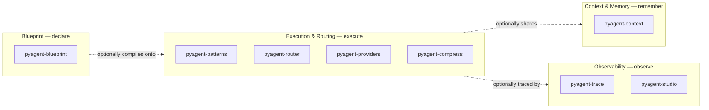

# The PyAgent Architecture Model

PyAgent organizes a multi-agent LLM system into four concerns, each solved by an independent
package, each independently adoptable. None of them owns or contains the others — you can install
and use any one alone.

The dotted arrows are deliberate: Blueprint can compile a system that uses Execution, Context, and
Observability together — but none of the four *requires* another to be useful on its own. A team
doing hand-written Python orchestration can adopt `pyagent-trace` for observability alone, or
`pyagent-context` for memory alone, without ever touching a YAML file.

## The four pillars

| Pillar | Verb | Solves | Packages |
|---|---|---|---|
| [Blueprint](blueprint.md) | Declare | Multi-agent system design as a reviewable, versioned artifact instead of scattered code | `pyagent-blueprint` |
| [Execution & Routing](execution.md) | Execute | Running real multi-agent workflows against real providers, with cost-aware model selection | `pyagent-patterns`, `pyagent-router`, `pyagent-providers`, `pyagent-compress` |
| [Context & Memory](context.md) | Remember | State that persists and propagates safely across agents and turns | `pyagent-context` |
| [Observability](observability.md) | Observe | Knowing what actually happened, what it cost, and being able to replay it | `pyagent-trace`, `pyagent-studio` |

## Selection matrix

Use this to map a requirement onto the pillar(s) that solve it — most systems need a subset, not
all four.

| Your requirement | Pillar |
|---|---|
| Version-control the system's design, review changes like infrastructure | Blueprint |
| Run more than one agent, hand off between them, or route by task type | Execution & Routing |
| Route cheap tasks to cheap models automatically | Execution & Routing (`pyagent-router`) |
| Stay within a token/cost budget across a run | Execution & Routing (`pyagent-compress`) |
| Fail over to a second provider when one is down | Execution & Routing (`pyagent-providers`) |
| Share state between agents within or across a run | Context & Memory |
| Redact PII or restrict what one agent can see of another's context | Context & Memory |
| Know what a run actually did, debug it, or replay it | Observability (`pyagent-trace`) |
| Get a web UI for traces, diffs, and provider health | Observability (`pyagent-studio`) |

## Minimum viable PyAgent architecture

Not every system needs all four pillars — most don't, at first. A single agent making one LLM call
needs none of them (see [why-blueprint.md's "When you don't need PyAgent at all"](../why-blueprint.md#when-you-dont-need-pyagent-at-all)).
A reasonable minimum for a real multi-agent system:

- **Two or more agents with a routing decision between them** → `pyagent-patterns` alone (Execution
  & Routing), no Blueprint, no Context, no Observability required. This is the floor.
- **Add cost sensitivity** → `pyagent-router` on top, still no YAML, no memory tier, no tracing.
- **Add "I need to know what happened when it breaks"** → `pyagent-trace`, still hand-written
  Python otherwise.
- **Add "the design needs to survive a team, not just me"** → this is where `pyagent-blueprint`
  earns its cost — reviewable, diffable, versioned design stops being optional once more than one
  person touches the system.

Each step is additive and independently reversible — nothing here requires committing to the other
three pillars up front.

## See also

- [Why Blueprint?](../why-blueprint.md) — the specific case for the declarative-spec approach
- [Capability catalog](../capabilities.md) — every pillar's real, machine-readable capability list
- [What is PyAgent?](../about.md) — the canonical entity page
