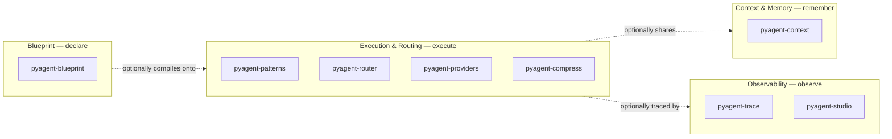

# The PyAgent Architecture Model

PyAgent organizes a multi-agent LLM system into four concerns, each solved by an independent
package, each independently adoptable. None of them owns or contains the others — you can install
and use any one alone.



The dotted arrows are deliberate: Blueprint can compile a system that uses Execution, Context, and
Observability together — but none of the four *requires* another to be useful on its own. A team
doing hand-written Python orchestration can adopt `pyagent-trace` for observability alone, or
`pyagent-context` for memory alone, without ever touching a YAML file.

## The four pillars

| Pillar | Verb | Solves | Packages |
|---|---|---|---|
| [Blueprint](blueprint.md) | Declare | Multi-agent system design as a reviewable, versioned artifact instead of scattered code | `pyagent-blueprint` |
| [Execution & Routing](#execution-routing) | Execute | Running real multi-agent workflows against real providers, with cost-aware model selection | `pyagent-patterns`, `pyagent-router`, `pyagent-providers`, `pyagent-compress` |
| [Context & Memory](#context-memory) | Remember | State that persists and propagates safely across agents and turns | `pyagent-context` |
| [Observability](observability.md) | Observe | Knowing what actually happened, what it cost, and being able to replay it | `pyagent-trace`, `pyagent-studio` |

## Execution & Routing

**Verb: Execute.** Four independently installable packages: `pyagent-patterns`, `pyagent-router`,
`pyagent-providers`, `pyagent-compress`. None require Blueprint, Context, or Observability.

### What it solves

Running more than one agent raises questions hand-written loops answer inconsistently every time:
how do agents hand off to each other (a named, testable pattern vs. ad-hoc glue code), which model
handles which task (a fixed choice vs. cost-aware routing), what happens when a provider is down
(a crash vs. a fallback chain), and how message history stays within budget on long runs.

### When to use

- More than one agent, with a real coordination need between them — routing, review, debate,
  parallel dispatch. See the [pattern catalog](../packages/patterns/index.md) for all 18 named
  shapes and their individual `use_when`/`avoid_when`.
- Cost varies meaningfully by task difficulty and you want cheap tasks on cheap models
  automatically (`pyagent-router`).
- You have 2+ interchangeable providers and want automatic fallback or cost/latency/capability-based
  routing between them (`pyagent-providers`).
- Long-running sessions are approaching a token budget (`pyagent-compress`).

### When not to use

- A single agent, single call, nothing to hand off to — see
  [why-blueprint.md](../why-blueprint.md#when-you-dont-need-pyagent-at-all) and the pattern catalog's
  own [note on when no pattern applies](../packages/patterns/index.md#pattern-selection-guide).
- Only one model/provider is ever used — `pyagent-router` and `pyagent-providers`' routing add
  indirection with nothing to select between.
- History never approaches a token budget — `pyagent-compress` is pure overhead.

### Tradeoffs

Named patterns are a real constraint: they cover the 18 documented shapes, not arbitrary dynamic
control flow. Difficulty-based routing (`pyagent-router`) is heuristic by default — its accuracy
caps whatever routes on top of it. Fallback chains (`pyagent-providers`) can silently degrade
quality if a fallback provider has different capabilities than the primary, without monitoring.

### Packages

- `pip install pyagent-patterns` — 18 patterns, zero dependencies, async-first.
- `pip install pyagent-router` — `DifficultyScorer`, `ModelSelector`, `CostEstimator`.
- `pip install pyagent-providers` — `ProviderRegistry`, `ProviderRouter`, `FallbackChain`,
  `CapabilityNegotiator`, `CostOptimizer`.
- `pip install pyagent-compress` — `TokenBudget`, `MessageCompressor`, `AgentPruner`,
  `InteractionPruner`.

### Example

```python
from pyagent_patterns import Supervisor

result = await Supervisor(
    classifier=classifier_agent,
    routes={"billing": billing_agent, "tech": tech_agent},
).run("I was charged twice")
```

See the [Router guide](../guides/router.md), [Providers guide](../guides/providers.md), and
[Compression guide](../guides/compression.md) for full detail on each package.

Execution's patterns can be declared inside a [Blueprint](blueprint.md) `workflows:` block instead
of written in Python. Agents in a run can share state via [Context & Memory](#context-memory).
Every pattern and adapter emits events consumable by [Observability](observability.md) — none of
that integration is required to use the patterns standalone.

## Context & Memory

**Verb: Remember.** The Context & Memory pillar is `pyagent-context` — one package, independently
installable.

### What it solves

Multi-agent state has three different lifetimes that get conflated when handled ad hoc: state that
only needs to survive one turn, state shared across a run, and state that needs to persist across
separate sessions. On top of that, not every agent should automatically see everything — an
external-tool-facing agent shouldn't get the same context an internal-only agent does, and PII
needs redaction before it crosses that boundary.

### When to use

- Multiple agents in a run need to share state across turns.
- Some agents (e.g. external-facing) shouldn't automatically receive everything internal agents see
  — trust levels need enforcing, not just convention.
- Context may contain PII that needs redaction before reaching a downstream agent or tool.
- Long sessions are approaching a token budget and need compression, not just truncation.
- You need an audit trail of which agent produced or saw which piece of context.

### When not to use

- **Persistent memory is unnecessary** for a single agent, single call, with nothing to persist
  across turns or runs — there's no cross-agent context to manage, and reaching for a memory tier
  here adds a dependency for zero benefit.
- Every agent in the system is equally trusted with all context — `TrustLevel`/`TrustAwareRetriever`
  add design work (classifying every item) for no enforcement benefit.
- Context is entirely non-sensitive synthetic data — `ContextRedactor`/`Sensitivity` classification
  is pure overhead.

### Tradeoffs

`WorkingMemory` is cheapest but nothing survives the turn. `SessionMemory` is scoped to one run —
nothing carries to the next session automatically. `SemanticMemoryProtocol`'s built-in
`InMemorySemanticStore` doesn't persist across process restarts — a durable backend is a protocol
implementation you provide. Redaction and compression are both lossy by design; over-aggressive
rules can strip context an agent legitimately needed.

### Package

`pip install pyagent-context` — `WorkingMemory`, `SessionMemory`, `SemanticMemoryProtocol`,
`ContextLedger`, `TrustLevel`, `Sensitivity`, `ContextRedactor`, `TrustAwareRetriever`,
`CompressionPolicy`, `ContextCompressor`.

### Example

```python
from pyagent_context import ContextLedger, TrustLevel

ledger = ContextLedger()
ledger.add(item, trust_level=TrustLevel.INTERNAL)
visible = ledger.retrieve_for(agent="external_tool_agent")  # trust-filtered
```

See the [Context guide](../guides/context.md) for the complete three-tier memory model, trust
levels, and redaction API.

Context is often shared by agents wired together via [Execution & Routing](#execution-routing),
and can be declared inside a [Blueprint](blueprint.md)'s `context:` block. Context-tier changes and
redaction events are traceable via [Observability](observability.md) — none of that is required to
use the memory tiers standalone.

## Selection matrix

Use this to map a requirement onto the pillar(s) that solve it — most systems need a subset, not
all four.

| Your requirement | Pillar |
|---|---|
| Version-control the system's design, review changes like infrastructure | Blueprint |
| Run more than one agent, hand off between them, or route by task type | Execution & Routing |
| Route cheap tasks to cheap models automatically | Execution & Routing (`pyagent-router`) |
| Stay within a token/cost budget across a run | Execution & Routing (`pyagent-compress`) |
| Fail over to a second provider when one is down | Execution & Routing (`pyagent-providers`) |
| Share state between agents within or across a run | Context & Memory |
| Redact PII or restrict what one agent can see of another's context | Context & Memory |
| Know what a run actually did, debug it, or replay it | Observability (`pyagent-trace`) |
| Get a web UI for traces, diffs, and provider health | Observability (`pyagent-studio`) |

## Minimum viable PyAgent architecture

Not every system needs all four pillars — most don't, at first. A single agent making one LLM call
needs none of them (see [why-blueprint.md's "When you don't need PyAgent at all"](../why-blueprint.md#when-you-dont-need-pyagent-at-all)).
A reasonable minimum for a real multi-agent system:

- **Two or more agents with a routing decision between them** → `pyagent-patterns` alone (Execution
  & Routing), no Blueprint, no Context, no Observability required. This is the floor.
- **Add cost sensitivity** → `pyagent-router` on top, still no YAML, no memory tier, no tracing.
- **Add "I need to know what happened when it breaks"** → `pyagent-trace`, still hand-written
  Python otherwise.
- **Add "the design needs to survive a team, not just me"** → this is where `pyagent-blueprint`
  earns its cost — reviewable, diffable, versioned design stops being optional once more than one
  person touches the system.

Each step is additive and independently reversible — nothing here requires committing to the other
three pillars up front.

## See also

- [Why Blueprint?](../why-blueprint.md) — the specific case for the declarative-spec approach
- [Capability catalog](../capabilities.md) — every pillar's real, machine-readable capability list
- [What is PyAgent?](../about.md) — the canonical entity page
