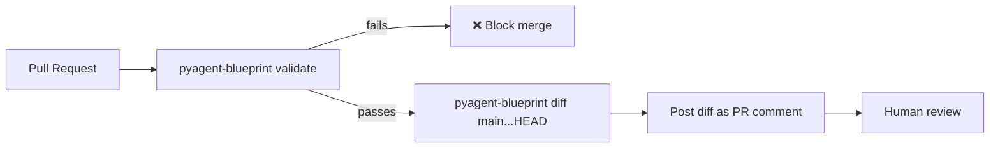

# How to Validate and Diff Blueprints in CI

Treat a blueprint manifest like any other piece of infrastructure: validate it statically and diff
it semantically as part of every pull request, before a reviewer even opens the YAML.

**Patterns used:** Supervisor (the underlying workflow being validated — the CI steps below work
for any workflow's manifest)

---

## Architecture



---

## Implementation

`.github/workflows/blueprint-ci.yml`:

```yaml
name: Blueprint CI
on:
  pull_request:
    paths:
      - "blueprints/**.yaml"

jobs:
  validate-and-diff:
    runs-on: ubuntu-latest
    steps:
      - uses: actions/checkout@v4
        with:
          fetch-depth: 0  # need main's history for the diff step

      - name: Set up Python
        uses: actions/setup-python@v5
        with:
          python-version: "3.11"

      - name: Install pyagent-blueprint
        run: pip install pyagent-blueprint

      - name: Validate every changed blueprint
        run: |
          git diff --name-only origin/main...HEAD -- 'blueprints/*.yaml' | while read -r f; do
            echo "Validating $f"
            pyagent-blueprint validate "$f"
          done

      - name: Semantic diff against main
        run: |
          git diff --name-only origin/main...HEAD -- 'blueprints/*.yaml' | while read -r f; do
            git show "origin/main:$f" > /tmp/old.yaml 2>/dev/null || echo "api_version: pyagent/v1" > /tmp/old.yaml
            echo "### Diff for $f" >> diff_output.md
            pyagent-blueprint diff /tmp/old.yaml "$f" >> diff_output.md
          done

      - name: Post diff as PR comment
        uses: actions/github-script@v7
        with:
          script: |
            const fs = require('fs');
            const body = fs.readFileSync('diff_output.md', 'utf8');
            github.rest.issues.createComment({
              issue_number: context.issue.number,
              owner: context.repo.owner,
              repo: context.repo.repo,
              body,
            });
```

Both `pyagent-blueprint validate` and `pyagent-blueprint diff` are real CLI commands — `validate`
runs Pydantic schema validation plus static analysis (dangling agent references, etc.) and exits
non-zero on any error-severity issue; `diff` produces a semantic diff over the blueprint IR (which
agent, route, provider, or SLA actually changed), not a line-level text diff of YAML.

---

## When to Use

| Situation | Use this recipe? |
|-----------|-------------------|
| Blueprints live in version control and go through PR review | ✅ Yes |
| You want reviewers to see *what changed semantically*, not a YAML text diff | ✅ Yes |
| You have no CI system at all yet | ⚠️ Adapt the two CLI calls to your CI provider — the commands themselves are provider-agnostic |

---

## Cost Profile

Zero LLM cost — `validate` and `diff` are pure static analysis over the manifest, no model calls.

---

## See Also

- [What is an agent blueprint?](../../concepts/agent-blueprint.md)
- [Contract testing with MockLLM](contract-testing.md)
- [Browse all recipes](../index.md)
