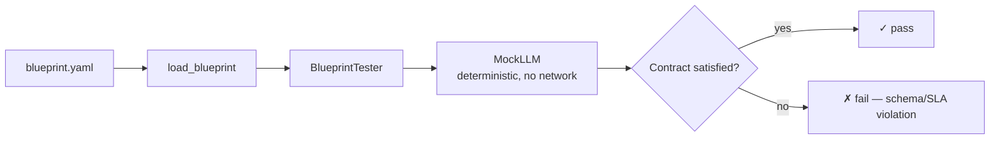

# How to Contract-Test Blueprints with MockLLM

Before spending a single token on a live model, `pyagent-blueprint test` runs a blueprint's declared
contracts (input/output shape, SLAs) against `MockLLM` — a deterministic stand-in that exercises the
exact same compiled workflow graph without any network call.

**Patterns used:** Pipeline (the underlying workflow being tested — this recipe applies to any
workflow's manifest)

---

## Architecture



---

## Implementation

```bash
pyagent-blueprint test research-pipeline.yaml
```

This is a real CLI command (`cli.py`'s `test` subcommand) — it loads the blueprint, instantiates
`pyagent_blueprint.tester.BlueprintTester`, and runs `tester.test(spec)` against `MockLLM`, printing
a pass/fail summary and exiting non-zero if any contract fails. Wire it into CI the same way as
validation:

```yaml
# .github/workflows/blueprint-ci.yml (continued from ci-cd-validation.md)
      - name: Contract-test every changed blueprint
        run: |
          git diff --name-only origin/main...HEAD -- 'blueprints/*.yaml' | while read -r f; do
            pyagent-blueprint test "$f"
          done
```

To call the same tester directly from Python (e.g. inside a pytest suite alongside your own
application tests):

```python
import asyncio
from pyagent_blueprint.loader import load_blueprint
from pyagent_blueprint.tester import BlueprintTester

spec = load_blueprint("research-pipeline.yaml")
tester = BlueprintTester()
results = asyncio.run(tester.test(spec))
print(tester.summary(results))
assert all(r.passed for r in results)
```

---

## When to Use

| Situation | Use this recipe? |
|-----------|-------------------|
| You want to catch a broken contract (schema, SLA) before deploying | ✅ Yes |
| You want CI feedback without incurring live API cost | ✅ Yes |
| You need to test actual model *output quality*, not just contract shape | ❌ `MockLLM` is deterministic — pair this with a small live-model smoke test suite for output-quality checks |

---

## Cost Profile

Zero LLM cost — `MockLLM` never makes a network call. This is exactly why it belongs in CI, run on
every PR, rather than gated behind a manual "run the expensive test suite" step.

---

## See Also

- [CI/CD validation and diff](ci-cd-validation.md)
- [Declaring recovery and budgets](governance-in-yaml.md)
- [Browse all recipes](../index.md)
