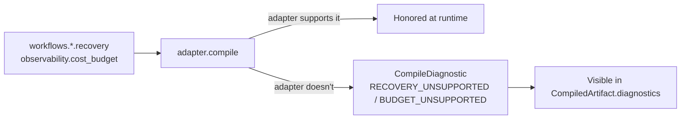

# How to Declare Recovery Policies and Budgets in YAML

A blueprint's `workflows.*.recovery` and `observability.cost_budget` blocks are declarative
governance — no Python retry loop or cost-tracking code to write. What makes this safe in
production is what happens when a target runtime **can't** honor a declared feature: the compiler
reports a stable diagnostic code, it never silently drops it.

**Patterns used:** Supervisor

---

## Architecture



---

## Implementation

```yaml
api_version: pyagent/v1
metadata:
  name: customer-support
  version: 1.0.0
providers:
  primary:
    model: gpt-4.1-mini
  fallback:
    model: gpt-4.1-nano
agents:
  classifier:
    prompt: "Classify into: billing, tech, general"
    provider: primary
  billing:
    prompt: "Handle billing inquiries"
    provider: primary
  tech:
    prompt: "Handle technical support"
    provider: primary
workflows:
  support:
    pattern: supervisor
    agents:
      classifier: classifier
      routes:
        billing: billing
        tech: tech
    recovery:
      max_retries: 2
      timeout_seconds: 30
      fallback_provider: fallback
observability:
  cost_budget:
    daily_usd: 100.0
    alert_threshold: 0.8
```

Compile it and inspect the diagnostics on the returned `CompiledArtifact` — using the real
`AdapterRegistry` and the exact fixture this recipe is based on
(`packages/pyagent-blueprint/tests/fixtures/customer_support.yaml`):

```python
from pyagent_blueprint.adapter import AdapterRegistry
from pyagent_blueprint.ir import BlueprintIR
from pyagent_blueprint.loader import load_blueprint

spec = load_blueprint("customer-support.yaml")
ir = BlueprintIR.from_spec(spec)

for name in ("pyagent", "single_agent"):
    adapter = AdapterRegistry.discover()[name]()
    artifact = adapter.compile(ir)
    print(name, "->", sorted({d.code.code for d in artifact.diagnostics}))
```

Run against the actual fixture, both adapters — including the bundled native `pyagent` one —
currently report `RECOVERY_UNSUPPORTED` and `BUDGET_UNSUPPORTED` (alongside `SLA_UNSUPPORTED` from
the `contracts.*.sla` block, `MEMORY_TIER_UNSUPPORTED` from `context.memory`, and
`GUARDRAIL_UNSUPPORTED` from an agent's `guardrails:` list): the enforcement layer for these
specific G2/G8 gaps is intentionally not yet wired into any adapter — this is documented, expected
behavior per the engineering roadmap's open gap table, not a bug. The point isn't that one adapter
enforces it and another doesn't (today, neither does); it's that **you know, deterministically and
by stable code, exactly which declared governance features aren't yet enforced** — rather than the
YAML silently having no effect with no way to detect that from your own code. Any future adapter
(or the current ones, as enforcement lands) that *does* honor a feature simply omits that code from
`artifact.diagnostics` — the same inspection snippet above is how you'd verify that, too.

---

## When to Use

| Situation | Use this recipe? |
|-----------|-------------------|
| You need retries/fallback and a cost ceiling declared once, checked against every adapter | ✅ Yes |
| You're evaluating whether a new runtime adapter is production-ready for your workflow | ✅ Yes — check `artifact.diagnostics` is empty for the features you rely on |
| Your governance requirement isn't yet one of the modeled diagnostic codes | ⚠️ See `diagnostics.py`'s registry (`BUDGET_UNSUPPORTED`, `SLA_UNSUPPORTED`, `MEMORY_TIER_UNSUPPORTED`, `CHECKPOINT_UNSUPPORTED`, `RECOVERY_UNSUPPORTED`, `GUARDRAIL_UNSUPPORTED`) for what's currently covered |

---

## Cost Profile

Declaring the policy costs nothing — the budget/recovery block is metadata evaluated at compile
time. Whether it's *enforced* at runtime depends entirely on the chosen adapter, which is exactly
what the diagnostic check above surfaces.

---

## See Also

- [Why Blueprint?](../../why-blueprint.md) — the full adapter capability table
- [CI/CD validation and diff](ci-cd-validation.md)
- [Browse all recipes](../index.md)
