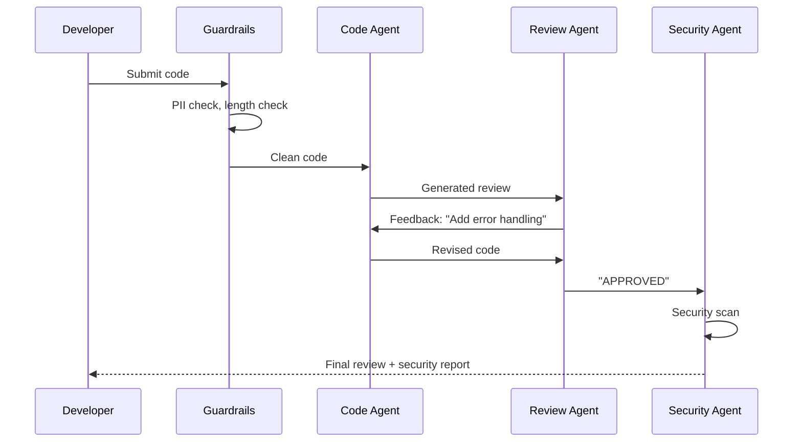

# Cookbook: Code Review Agent

A multi-agent code review system using Cross-Reflection + Guardrails.

## Architecture



## Implementation

```python
import asyncio
from pyagent_patterns.base import Agent, MockLLM
from pyagent_patterns.resolution import CrossReflection
from pyagent_patterns.orchestration import Pipeline
from pyagent_patterns.guardrails import GuardrailChain, LengthGuard, PIIGuard

# Step 1: Input guardrails
guardrails = GuardrailChain([
    LengthGuard(max_chars=50_000, truncate=True),
    PIIGuard(redact=True),
])

# Step 2: Code review via cross-reflection
code_review = CrossReflection(
    generator=Agent("coder", coder_llm, system_prompt="Review and improve the code"),
    reviewer=Agent("reviewer", reviewer_llm, system_prompt="Critique code quality"),
    max_rounds=3,
)

# Step 3: Security scan
security_pipeline = Pipeline(stages=[
    Agent("security", security_llm, system_prompt="Scan for vulnerabilities"),
])

async def review_code(code: str) -> dict:
    # Guardrail check
    check = guardrails.check(code)
    if not check.passed:
        return {"error": check.message}
    safe_code = check.sanitized_content or code

    # Review
    review_result = await code_review.run(f"Review this code:\n```\n{safe_code}\n```")

    # Security scan
    security_result = await security_pipeline.run(f"Security scan:\n{review_result.output}")

    return {
        "review": review_result.output,
        "security": security_result.output,
        "rounds": review_result.metadata["rounds"],
    }
```

## With Routing (cost optimization)

```python
from pyagent_router import RouterMiddleware

middleware = RouterMiddleware(
    model_registry={"gpt-4o": expensive_llm, "gpt-4o-mini": cheap_llm},
)

# Security agent always uses expensive model; reviewer auto-routes
routed_reviewer = middleware.wrap(reviewer_agent)
```
