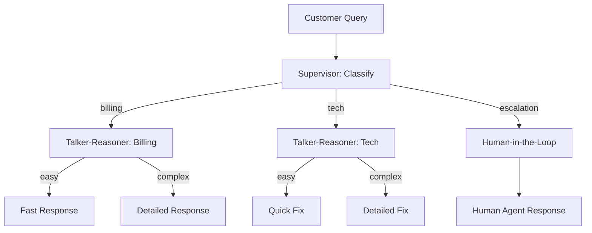

# Cookbook: Customer Support

Supervisor + Talker-Reasoner + Human-in-the-Loop for tiered support.

## Architecture



## Implementation

```python
import asyncio
from pyagent_patterns.base import Agent, MockLLM
from pyagent_patterns.orchestration import Supervisor
from pyagent_patterns.advanced import TalkerReasoner, HumanInTheLoop
from pyagent_patterns.advanced.human_in_the_loop import HumanDecision
from pyagent_patterns.guardrails import GuardrailChain, PIIGuard, LengthGuard
from pyagent_patterns.recovery import BoundedExecution

# Guardrails: protect customer PII
guardrails = GuardrailChain([
    PIIGuard(redact=True),
    LengthGuard(max_chars=5000),
])

# Tier 1: Fast billing bot (cheap model)
billing_bot = TalkerReasoner(
    talker=Agent("billing_fast", cheap_llm, system_prompt="Quick billing answers"),
    reasoner=Agent("billing_deep", expensive_llm, system_prompt="Detailed billing analysis"),
)

# Tier 2: Tech support (with escalation)
tech_bot = TalkerReasoner(
    talker=Agent("tech_fast", cheap_llm, system_prompt="Quick tech fixes"),
    reasoner=Agent("tech_deep", expensive_llm, system_prompt="Deep technical troubleshooting"),
)

# Tier 3: Human escalation
def human_review(output, metadata):
    # In production: route to human agent via queue
    print(f"[HUMAN REVIEW NEEDED] {output[:100]}...")
    return HumanDecision(approved=True, modified_output=output)

human_handler = HumanInTheLoop(
    agent=Agent("human_prep", cheap_llm, system_prompt="Prepare summary for human agent"),
    review_fn=human_review,
)

# Main supervisor
supervisor = Supervisor(
    classifier=Agent("classifier", cheap_llm),
    routes={
        "billing": billing_bot,   # Note: patterns can be nested!
        "tech": tech_bot,
        "escalation": human_handler,
    },
)

# Wrap with recovery
safe_support = BoundedExecution(
    pattern=supervisor,
    timeout_seconds=30.0,
    max_retries=2,
)

async def handle_query(query: str) -> str:
    check = guardrails.check(query)
    safe_query = check.sanitized_content or query
    result = await safe_support.run(safe_query)
    return result.output
```

## Cost Profile

| Query Type | Model Used | Avg Cost |
|-----------|-----------|----------|
| Simple billing | gpt-4o-mini | $0.001 |
| Complex billing | gpt-4o | $0.004 |
| Simple tech | gpt-4o-mini | $0.001 |
| Complex tech | gpt-4o | $0.005 |
| Human escalation | gpt-4o-mini + human | $0.001 + human time |
