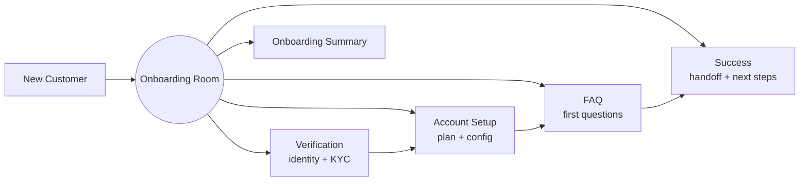

# How to Build a Multi-Agent Customer Onboarding Workflow in Python

New-customer onboarding spans identity checks, account configuration, first-questions, and a warm
hand-off to success. This recipe uses the **Role-Based** pattern — inspired by AutoGen's
group-chat onboarding example — so each specialist holds its role and reacts to the others,
producing a complete onboarding plan in one coordinated pass.

**Patterns used:** Role-Based

---

## Architecture



---

## Implementation

```python
import asyncio
from pyagent_patterns.base import Agent
from pyagent_patterns.structural import RoleBased
from pyagent_providers import AnthropicLLM, OpenAILLM

onboarding = RoleBased(
    agents=[
        Agent(
            "verification",
            OpenAILLM("gpt-4o-mini"),
            system_prompt=(
                "You handle identity verification. Confirm what's needed (email, org, KYC tier) "
                "and list any missing items. Never request more data than the plan requires."
            ),
        ),
        Agent(
            "account_setup",
            OpenAILLM("gpt-4o-mini"),
            system_prompt=(
                "You configure the account: plan, seats, integrations, and sensible defaults. "
                "Produce a concrete setup checklist."
            ),
        ),
        Agent(
            "faq",
            AnthropicLLM("claude-haiku-3-5-20241022"),
            system_prompt=(
                "You answer the customer's first questions clearly and link to the right docs. "
                "Anticipate the top-3 questions for this plan."
            ),
        ),
        Agent(
            "success",
            AnthropicLLM("claude-sonnet-4-20250514"),
            system_prompt=(
                "You are the success manager. Summarize the onboarding, define the 30-day "
                "activation goals, and write a warm hand-off note for the human CSM."
            ),
        ),
    ],
    rounds=1,
)

result = asyncio.run(onboarding.run(
    "New customer: a 25-person design agency on the Team plan, wants Slack + SSO, "
    "main goal is client project tracking."
))
print(result.output)
print(f"Roles: {result.metadata['roles']}")
```

---

## Expected output

```text
ONBOARDING SUMMARY — Northwind Design (Team plan, 25 seats)

Verification: email + org confirmed; SSO domain pending IT approval.
Setup:        25 seats provisioned, Slack connected, project-tracking template applied.
FAQ:          answered "how do invites work / SSO setup / mobile app".
Success:      30-day goal = 10 active projects; hand-off note sent to CSM Dana.

Roles: ['verification', 'account_setup', 'faq', 'success']
```

For ticket *routing* after onboarding, pair this with the [Support Router](support-router.md).

---

## Customization

### Add a compliance role

```python
onboarding.agents.append(
    Agent("compliance", OpenAILLM("gpt-4o-mini"),
          system_prompt="Confirm KYC tier, data-residency, and DPA requirements for this plan."),
)
```

### Automate account creation with tools

Give the setup role a [ReAct](../../packages/patterns/advanced/react.md) tool that calls your provisioning API.

### Localize the welcome

```python
onboarding.agents[2].system_prompt += " Write the FAQ answers in the customer's locale."
```

---

## When to Use

| Situation | Use Role-Based? |
|-----------|-----------------|
| A fixed set of specialists must collaborate on one customer | ✅ Yes |
| You want a single coordinated onboarding artefact | ✅ Yes |
| You're routing an inbound ticket to one specialist | ❌ Use [Supervisor](../../packages/patterns/orchestration/supervisor.md) |
| Each step strictly gates the next with approvals | ❌ Use [Pipeline](../../packages/patterns/orchestration/pipeline.md) |

---

## Cost Profile

| Driver | Typical model | Avg cost | Volume (1k onboardings/mo) |
|--------|--------------|----------|-----------------------------|
| 4 roles × 1 round | mini + haiku + sonnet | $0.006 | $6/mo… ×1k = $6 → ~$180/mo |
| **Per onboarding** | mix | **~$0.006** | **~$180/mo** |

---

## See Also

- [Role-Based pattern](../../packages/patterns/structural/role-based.md)
- [Support Router](support-router.md) — route post-onboarding tickets to specialists
- [Browse all recipes](../index.md)
