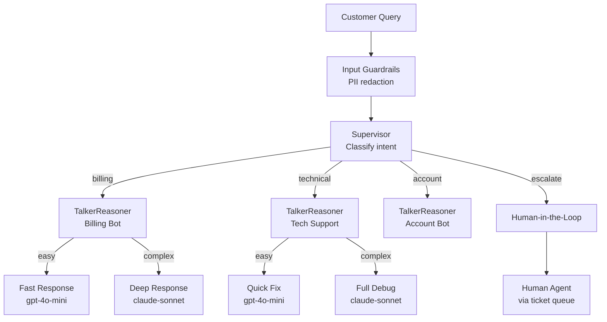

# How to Build a Multi-Agent Customer Support Router in Python

A tiered multi-agent customer support system that classifies queries, routes to specialist bots, uses cheap models for simple questions and expensive ones only for complex issues, and escalates to human agents when automated handling fails.

**Patterns used:** Supervisor, TalkerReasoner, HumanInTheLoop, BoundedExecution, GuardrailChain, RouterMiddleware

---

## Architecture



---

## Implementation

```python
import asyncio
from pyagent_patterns.base import Agent, Message
from pyagent_patterns.orchestration import Supervisor
from pyagent_patterns.advanced import TalkerReasoner, HumanInTheLoop
from pyagent_patterns.advanced.human_in_the_loop import HumanDecision
from pyagent_patterns.recovery import BoundedExecution
from pyagent_patterns.guardrails import GuardrailChain, PIIGuard, LengthGuard
from pyagent_router.middleware import RouterMiddleware
from pyagent_providers import AnthropicLLM, OpenAILLM

# ── LLMs ──────────────────────────────────────────────────────────────────────
fast_llm  = OpenAILLM("gpt-4o-mini")
smart_llm = AnthropicLLM("claude-sonnet-4-20250514")

model_registry = {
    "gpt-4o-mini":              fast_llm,
    "claude-sonnet-4-20250514": smart_llm,
}
router = RouterMiddleware(model_registry=model_registry)

# ── Guardrails ─────────────────────────────────────────────────────────────────
input_guard = GuardrailChain([
    LengthGuard(max_chars=3_000, truncate=True),
    PIIGuard(redact=True),   # protect customer PII in logs
])

# ── Tier 1: Billing bot (TalkerReasoner) ─────────────────────────────────────
billing_bot = TalkerReasoner(
    talker=router.wrap(
        Agent("billing_fast", fast_llm,
              system_prompt=(
                  "You are a billing support agent. Answer quickly and clearly. "
                  "You handle: invoice questions, payment methods, refund policies, "
                  "subscription changes, and pricing. Be concise — 2-3 sentences max."
              )),
    ),
    reasoner=router.wrap(
        Agent("billing_deep", smart_llm,
              system_prompt=(
                  "You are a senior billing specialist. Handle complex cases: "
                  "disputed charges, partial refunds, multi-seat subscription adjustments, "
                  "enterprise billing questions. Provide step-by-step resolution."
              )),
    ),
    handoff_threshold=5,   # difficulty ≥ 5 goes to reasoner
)

# ── Tier 2: Technical support bot ────────────────────────────────────────────
tech_bot = TalkerReasoner(
    talker=router.wrap(
        Agent("tech_fast", fast_llm,
              system_prompt=(
                  "You are a tech support agent. Handle common issues: login problems, "
                  "password resets, browser compatibility, basic integrations. "
                  "Give step-by-step instructions."
              )),
    ),
    reasoner=router.wrap(
        Agent("tech_deep", smart_llm,
              system_prompt=(
                  "You are a senior engineer doing technical support. Handle complex issues: "
                  "API integration failures, webhook debugging, performance problems, "
                  "data sync issues, custom configurations. Ask clarifying questions if needed."
              )),
    ),
    handoff_threshold=4,
)

# ── Tier 3: Account management bot ───────────────────────────────────────────
account_bot = TalkerReasoner(
    talker=router.wrap(
        Agent("account_fast", fast_llm,
              system_prompt=(
                  "You are an account support agent. Handle: username changes, "
                  "email updates, team member management, permissions, and SSO setup."
              )),
    ),
    reasoner=router.wrap(
        Agent("account_deep", smart_llm,
              system_prompt=(
                  "You are a senior account specialist. Handle: GDPR data requests, "
                  "account mergers, complex permission structures, enterprise SSO, "
                  "data export and deletion requests."
              )),
    ),
    handoff_threshold=6,
)

# ── Tier 4: Human escalation ──────────────────────────────────────────────────
def queue_human_review(output: str, metadata: dict) -> HumanDecision:
    """Route to human agent via your support queue (e.g. Zendesk, Linear)."""
    ticket_id = _create_support_ticket(
        summary=output[:200],
        priority="high" if "urgent" in output.lower() else "normal",
        metadata=metadata,
    )
    print(f"[TICKET CREATED] #{ticket_id}")
    # Return a holding response while human picks it up
    return HumanDecision(
        approved=True,
        modified_output=(
            f"I've escalated your issue to our specialist team. "
            f"Ticket #{ticket_id} has been created. "
            f"You'll hear back within 2 business hours."
        ),
    )

human_handler = HumanInTheLoop(
    agent=router.wrap(
        Agent("human_prep", fast_llm,
              system_prompt=(
                  "Prepare a concise summary for the human support agent: "
                  "1. Customer issue (1 sentence) "
                  "2. What was already tried "
                  "3. Recommended action"
              )),
    ),
    review_fn=queue_human_review,
    high_risk_keywords=["legal", "lawsuit", "fraud", "hacked", "emergency"],
)

# ── Classifier (Supervisor routing) ──────────────────────────────────────────
classifier = Agent(
    "classifier", fast_llm,
    system_prompt=(
        "Classify customer support queries into exactly one category. "
        "Reply with ONLY the category name.\n"
        "Categories:\n"
        "  billing   — payments, invoices, refunds, subscriptions\n"
        "  technical — bugs, errors, API, integrations, performance\n"
        "  account   — login, permissions, team, SSO, data requests\n"
        "  escalate  — angry customers, legal threats, complex edge cases, "
        "              anything you're unsure about"
    ),
)

supervisor = Supervisor(
    classifier=classifier,
    routes={
        "billing":   billing_bot,
        "technical": tech_bot,
        "account":   account_bot,
        "escalate":  human_handler,
    },
)

# ── Recovery wrapper ──────────────────────────────────────────────────────────
safe_supervisor = BoundedExecution(
    pattern=supervisor,
    fallback=Agent(
        "fallback_agent", fast_llm,
        system_prompt=(
            "You are a helpful support agent. A technical issue occurred with our "
            "routing system. Apologise briefly and ask the customer to try again "
            "or contact support@example.com."
        ),
    ),
    max_retries=2,
    timeout_seconds=25.0,
)

# ── Main handler ──────────────────────────────────────────────────────────────
async def handle_query(customer_query: str) -> dict:
    # Guardrail check
    check = input_guard.check(customer_query)
    if not check.passed:
        return {"response": "I'm sorry, I couldn't process your message.", "blocked": True}
    safe_query = check.sanitized_content or customer_query

    # Run through support workflow
    result = await safe_supervisor.run(safe_query)

    return {
        "response":       result.output,
        "category":       result.metadata.get("route"),
        "model_used":     result.metadata.get("routed_model", "unknown"),
        "recovery_level": result.metadata.get("recovery_level", 0),
        "escalated":      result.metadata.get("route") == "escalate",
    }


def _create_support_ticket(summary: str, priority: str, metadata: dict) -> str:
    # Replace with your ticketing system integration
    return "SUP-" + str(hash(summary))[-6:]


# ── Run it ────────────────────────────────────────────────────────────────────
if __name__ == "__main__":
    queries = [
        "Why was I charged twice this month?",
        "My API webhooks stopped firing after the latest update",
        "I need to delete all my data immediately under GDPR",
        "This is unacceptable, I'm calling my lawyer",
    ]

    async def demo():
        for query in queries:
            print(f"\nQuery: {query}")
            result = await handle_query(query)
            print(f"Category:  {result['category']}")
            print(f"Model:     {result['model_used']}")
            print(f"Response:  {result['response'][:120]}...")

    asyncio.run(demo())
```

---

## Expected Output

```
Query: Why was I charged twice this month?
Category:  billing
Model:     gpt-4o-mini   ← easy billing question, fast model
Response:  This can happen if two subscriptions are active simultaneously or if a
           payment retry was processed. To confirm, please check your invoices at
           Settings → Billing → Invoice history...

Query: My API webhooks stopped firing after the latest update
Category:  technical
Model:     claude-sonnet-4-20250514   ← complex technical issue, smart model
Response:  Webhook failures after an update are often caused by: 1) SSL certificate
           changes, 2) payload format changes in the new version, 3) endpoint timeout
           thresholds. Let's debug this step by step: First, check your webhook logs...

Query: I need to delete all my data immediately under GDPR
Category:  account
Model:     claude-sonnet-4-20250514   ← GDPR = high difficulty, smart model
Response:  We take GDPR requests seriously. Here's the process: 1) Submit a formal
           Data Subject Access Request at privacy.example.com/dsar. 2) We'll confirm
           receipt within 24 hours. 3) Deletion completes within 30 days per GDPR Art. 17...

Query: This is unacceptable, I'm calling my lawyer
Category:  escalate
Model:     gpt-4o-mini + human
Response:  I've escalated your issue to our specialist team. Ticket #SUP-847291 has
           been created. You'll hear back within 2 business hours.
[TICKET CREATED] #SUP-847291
```

---

## Customisation

### Add a knowledge base tool

```python
from pyagent_patterns.advanced import ReAct

def search_kb(query: str) -> str:
    # Search your Confluence/Notion/Help Center
    return kb_client.search(query, top_k=3)

tech_bot_with_kb = ReAct(
    agent=Agent("tech_kb", smart_llm, system_prompt="Answer using the knowledge base."),
    tools={"search_kb": search_kb},
    max_steps=3,
)
```

### Multi-turn conversation

```python
conversation_history: list[Message] = []

async def chat(user_message: str) -> str:
    conversation_history.append(Message.user(user_message))
    result = await safe_supervisor.run(conversation_history)
    conversation_history.append(Message.assistant(result.output))
    return result.output
```

### SLA-based routing

```python
def route_by_sla(query: str, customer_tier: str) -> str:
    if customer_tier == "enterprise":
        return "escalate"   # always get human for enterprise
    if "urgent" in query.lower() or "down" in query.lower():
        return "escalate"
    return None   # let the classifier decide
```

---

## Cost Profile

| Query type | Typical model | Avg cost | Volume (1k/day) |
|-----------|--------------|----------|-----------------|
| Simple billing | gpt-4o-mini | $0.0003 | $300/mo |
| Complex billing | claude-sonnet | $0.003 | — |
| Simple tech | gpt-4o-mini | $0.0003 | $300/mo |
| Complex tech | claude-sonnet | $0.004 | — |
| GDPR / legal | claude-sonnet | $0.005 | — |
| Human escalation | gpt-4o-mini + human | $0.0003 + agent time | — |
| **Blended average** | mix | **~$0.001** | **~$900/mo** |

Routing saves ~70% vs always using claude-sonnet for everything.

---

## See Also

- [Supervisor pattern](../../packages/patterns/orchestration/supervisor.md)
- [TalkerReasoner pattern](../../packages/patterns/advanced/talker-reasoner.md)
- [HumanInTheLoop pattern](../../packages/patterns/advanced/human-in-the-loop.md)
- [Guardrails Guide](../../guides/guardrails.md)
- [Recovery Guide](../../guides/recovery.md)
