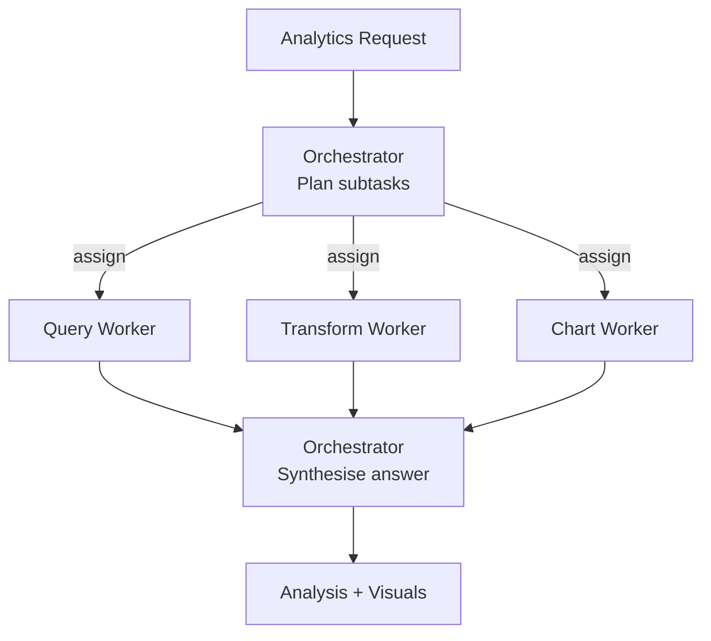

# How to Build a Multi-Agent Analytics Task Decomposer in Python

An open-ended analytics request ("show me why churn rose last quarter") needs planning: which
queries, which transforms, which charts. This recipe uses the **Orchestrator-Workers** pattern — a
planner decomposes the request into the subtasks it actually needs, dispatches them to specialist
workers, and synthesizes the answer.

**Patterns used:** Orchestrator-Workers

---

## Architecture



---

## Implementation

```python
import asyncio
from pyagent_patterns.base import Agent
from pyagent_patterns.orchestration import OrchestratorWorkers
from pyagent_providers import AnthropicLLM, OpenAILLM

analytics = OrchestratorWorkers(
    orchestrator=Agent(
        "analytics_lead",
        AnthropicLLM("claude-sonnet-4-20250514"),
        system_prompt=(
            "You plan analytics work. From the request, decide which workers are needed and what to "
            'assign each — skip any that don\'t apply. Respond as JSON: '
            '{"assignments": [{"worker": "name", "subtask": "description"}]}. After workers return, '
            "synthesize a clear answer with the numbers and a recommended chart."
        ),
    ),
    workers=[
        Agent(
            "query",
            OpenAILLM("gpt-4o-mini"),
            system_prompt="Write the SQL to answer the subtask. State assumptions about the schema.",
        ),
        Agent(
            "transform",
            OpenAILLM("gpt-4o-mini"),
            system_prompt="Describe the transforms (joins, aggregations, cohorting) the analysis needs.",
        ),
        Agent(
            "chart",
            OpenAILLM("gpt-4o-mini"),
            system_prompt="Recommend the best chart type and encodings for the result, and why.",
        ),
    ],
)

result = asyncio.run(analytics.run(
    "Why did customer churn rise in Q3? Break it down by plan tier and tenure."
))
print(result.output)
print(f"Workers used: {result.metadata['workers_used']}")
```

---

## Expected output

```text
CHURN ANALYSIS — Q3

Query:     monthly churn by plan_tier × tenure_bucket (SQL provided).
Transform: cohort by signup month; rolling 3-month churn rate.
Finding:   churn rose from 3.1% → 4.4%, concentrated in Basic-tier accounts <6 months.
Chart:     small-multiples line chart (one panel per tier) — shows the Basic spike clearly.

Workers used: ['query', 'transform', 'chart']
```

The planner skips workers a request doesn't need, so a simple "count active users" question costs
one worker, not three.

---

## Customization

### Add a chart worker

```python
analytics.workers.append(
    Agent("viz", OpenAILLM("gpt-4o-mini"),
          system_prompt="Given the result shape, output a Vega-Lite spec for the recommended chart."),
)
```

### Constrain the SQL dialect

```python
analytics.workers[0].system_prompt += " Target Snowflake SQL; use QUALIFY and window functions where helpful."
```

### Hand off to a tool-using analyst

For questions that need live data, route to the [SQL Analytics Assistant](sql-analyst.md) (ReAct + tools).

---

## When to Use

| Situation | Use Orchestrator-Workers? |
|-----------|---------------------------|
| The needed subtasks depend on the request | ✅ Yes |
| You want one synthesized analysis from specialists | ✅ Yes |
| Every request runs the same fixed stages | ❌ Use [Pipeline](../../packages/patterns/orchestration/pipeline.md) |
| One agent should reason-and-run queries with tools | ❌ Use [ReAct](../../packages/patterns/advanced/react.md) (see [SQL Analyst](sql-analyst.md)) |

---

## Cost Profile

| Stage | Typical model | Avg cost | Volume (10k requests/mo) |
|-------|--------------|----------|---------------------------|
| Orchestrator (plan + synthesize) | claude-sonnet | $0.005 | $50/mo |
| Workers (up to 3) | gpt-4o-mini | $0.0009 | $9/mo |
| **Per request** | mix | **~$0.006** | **~$60/mo** |

---

## See Also

- [Orchestrator-Workers pattern](../../packages/patterns/orchestration/orchestrator-workers.md)
- [SQL Analyst](sql-analyst.md) — a single ReAct agent that writes and runs SQL
- [Product Launch Planner](../ecommerce-retail/product-launch-planner.md) — the same pattern for retail
- [Browse all recipes](../index.md)
