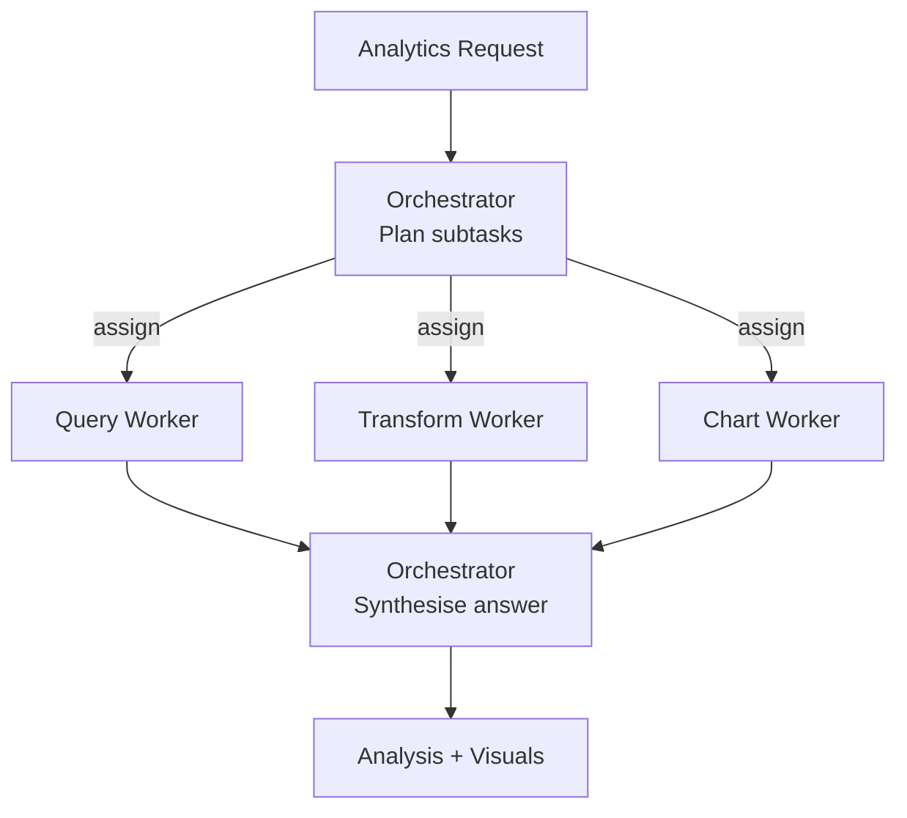

# How to Build a Multi-Agent Analytics Task Decomposer in Python

An open-ended analytics request ("show me why churn rose last quarter") needs planning: which
queries, which transforms, which charts. This recipe uses the **Orchestrator-Workers** pattern — a
planner decomposes the request into the subtasks it actually needs, dispatches them to specialist
workers, and synthesizes the answer.

**Patterns used:** Orchestrator-Workers

---

## Requirements

- **Functional** — accept an open-ended analytics question, plan the subtasks it actually requires
  (query/transform/chart, not necessarily all three), dispatch to specialist workers, and
  synthesize a final answer.
- **Non-functional** — the planner should only invoke the workers a specific question actually
  needs — a question needing no chart shouldn't pay for one.
- **Audit** — the final answer should be traceable to which worker(s) the planner invoked and why.
- **Not required** — no persistent memory across separate analytics questions; each is planned and
  answered independently.

## Architecture decisions

| Decision | Why | Why not the alternative |
|---|---|---|
| **Orchestrator-Workers**, not Pipeline | The subtasks an analytics question needs aren't known until the question itself is analyzed — "why did churn rise" might need query+transform+chart, "what's our MRR" might need only query. | A **Pipeline** would force every question through query→transform→chart regardless of whether all three are relevant, wasting cost on unneeded stages. |
| Single planner (`analytics_lead`) owns both decomposition and synthesis | The same agent that understood the original question is best positioned to judge whether the workers' outputs actually answer it. | Splitting planning and synthesis into separate agents would need the synthesis agent to re-derive intent from the plan alone, risking drift from the original question. |
| All three workers on `fast`, planner on `smart` | Query-writing, transform-description, and chart-recommendation are narrow, well-specified tasks; only the planning/synthesis step benefits from stronger reasoning. | Using `smart` for the workers too would multiply cost for tasks that don't need the extra reasoning quality. |

## Four-pillar mapping

| Requirement | Pillar | Capability |
|---|---|---|
| Dynamic subtask planning + dispatch | Execution | `OrchestratorWorkers` pattern |
| Track daily analytics spend | Observability | `observability.cost_budget` |
| Trace planning + worker calls | Observability | `observability.tracing` |

## Blueprint (declarative form)

The real, verified file at `examples/cookbook/data-analytics/analytics_decomposer/blueprint.yaml`,
compiled against `PyAgentAdapter` as part of this repo's test suite:

```yaml
api_version: pyagent/v1
metadata:
  name: analytics-decomposer
  version: 1.0.0
  description: Orchestrator breaks analytics request into query, transform, and chart workers

providers:
  fast:  { model: gpt-4o-mini }
  smart: { model: claude-sonnet-4-20250514 }

agents:
  analytics_lead: { provider: smart, prompt: "Plan analytics work. Assign workers. Synthesize answer." }
  query:          { provider: fast,  prompt: "Write SQL for the subtask." }
  transform:      { provider: fast,  prompt: "Describe transforms needed for the analysis." }
  chart:          { provider: fast,  prompt: "Recommend chart type and encodings." }

workflows:
  analyze:
    pattern: orchestrator_workers
    agents: { orchestrator: analytics_lead, workers: [query, transform, chart] }

observability:
  tracing: { enabled: true }
  cost_budget: { daily_usd: 50.0, alert_threshold: 0.8 }
```

```bash
pyagent-blueprint validate analytics-decomposer.yaml
pyagent-blueprint test analytics-decomposer.yaml
```

## Production checklist

Ran this exact blueprint through `PyAgentAdapter.compile()` and inspected the real diagnostics:

- ✅ **The workflow runs as declared** — `analyze` compiles and executes against the native pattern
  registry with no diagnostics.
- ⚠️ **`observability.cost_budget` is declared but not auto-enforced** — compiling emits
  `BUDGET_UNSUPPORTED`: the $50/day budget is recorded but not enforced. Wire real enforcement via
  `graph.wire_cost_tracker(tracker)`.
- **Worker count and cost are inherently less predictable than a fixed pipeline** — because the
  planner decides which of the 3 workers to invoke per-question, cost varies question-to-question;
  if you need tight cost bounds, budget for the worst case (all 3 workers), not the average.
- **No actual SQL execution or chart rendering happens in this blueprint** — `query`/`transform`/
  `chart` produce *descriptions* of what to do; wiring them to a real database/plotting library is
  downstream work this recipe doesn't cover.

---

## Architecture



---

## Implementation

```python
import asyncio
from pyagent_patterns.base import Agent
from pyagent_patterns.orchestration import OrchestratorWorkers
from pyagent_providers import AnthropicLLM, OpenAILLM

analytics = OrchestratorWorkers(
    orchestrator=Agent(
        "analytics_lead",
        AnthropicLLM("claude-sonnet-4-20250514"),
        system_prompt=(
            "You plan analytics work. From the request, decide which workers are needed and what to "
            'assign each — skip any that don\'t apply. Respond as JSON: '
            '{"assignments": [{"worker": "name", "subtask": "description"}]}. After workers return, '
            "synthesize a clear answer with the numbers and a recommended chart."
        ),
    ),
    workers=[
        Agent(
            "query",
            OpenAILLM("gpt-4o-mini"),
            system_prompt="Write the SQL to answer the subtask. State assumptions about the schema.",
        ),
        Agent(
            "transform",
            OpenAILLM("gpt-4o-mini"),
            system_prompt="Describe the transforms (joins, aggregations, cohorting) the analysis needs.",
        ),
        Agent(
            "chart",
            OpenAILLM("gpt-4o-mini"),
            system_prompt="Recommend the best chart type and encodings for the result, and why.",
        ),
    ],
)

result = asyncio.run(analytics.run(
    "Why did customer churn rise in Q3? Break it down by plan tier and tenure."
))
print(result.output)
print(f"Workers used: {result.metadata['workers_used']}")
```

---

## Expected output

```text
CHURN ANALYSIS — Q3

Query:     monthly churn by plan_tier × tenure_bucket (SQL provided).
Transform: cohort by signup month; rolling 3-month churn rate.
Finding:   churn rose from 3.1% → 4.4%, concentrated in Basic-tier accounts <6 months.
Chart:     small-multiples line chart (one panel per tier) — shows the Basic spike clearly.

Workers used: ['query', 'transform', 'chart']
```

The planner skips workers a request doesn't need, so a simple "count active users" question costs
one worker, not three.

---

## Customization

### Add a chart worker

```python
analytics.workers.append(
    Agent("viz", OpenAILLM("gpt-4o-mini"),
          system_prompt="Given the result shape, output a Vega-Lite spec for the recommended chart."),
)
```

### Constrain the SQL dialect

```python
analytics.workers[0].system_prompt += " Target Snowflake SQL; use QUALIFY and window functions where helpful."
```

### Hand off to a tool-using analyst

For questions that need live data, route to the [SQL Analytics Assistant](sql-analyst.md) (ReAct + tools).

---

## When to Use

| Situation | Use Orchestrator-Workers? |
|-----------|---------------------------|
| The needed subtasks depend on the request | ✅ Yes |
| You want one synthesized analysis from specialists | ✅ Yes |
| Every request runs the same fixed stages | ❌ Use [Pipeline](../../packages/patterns/orchestration/pipeline.md) |
| One agent should reason-and-run queries with tools | ❌ Use [ReAct](../../packages/patterns/advanced/react.md) (see [SQL Analyst](sql-analyst.md)) |

---

## Cost Profile

| Stage | Typical model | Avg cost | Volume (10k requests/mo) |
|-------|--------------|----------|---------------------------|
| Orchestrator (plan + synthesize) | claude-sonnet | $0.005 | $50/mo |
| Workers (up to 3) | gpt-4o-mini | $0.0009 | $9/mo |
| **Per request** | mix | **~$0.006** | **~$60/mo** |

---

## See Also

- [Orchestrator-Workers pattern](../../packages/patterns/orchestration/orchestrator-workers.md)
- [SQL Analyst](sql-analyst.md) — a single ReAct agent that writes and runs SQL
- [Product Launch Planner](../ecommerce-retail/product-launch-planner.md) — the same pattern for retail
- [Browse all recipes](../index.md)
