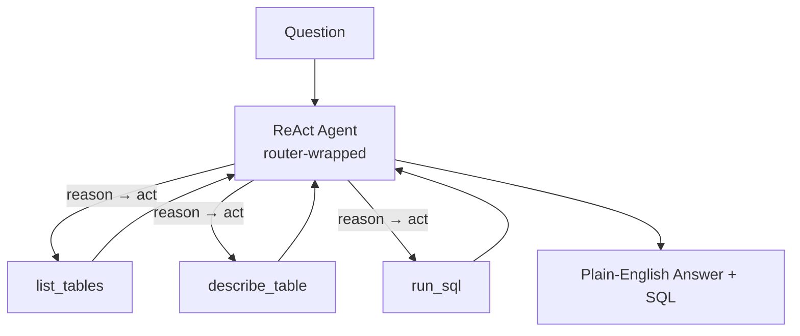

# How to Build a Multi-Agent SQL Analytics Assistant in Python

"Which three regions grew revenue fastest last quarter?" shouldn't require knowing the schema. This
recipe uses the **ReAct** pattern: the agent reasons, inspects the schema, writes SQL, runs it as a
tool, and reads the result — looping until it can answer in plain English — with difficulty-aware
**routing** so simple lookups use a cheap model and gnarly analysis uses a strong one.

**Patterns used:** [ReAct](../../packages/patterns/advanced/react.md) ·
[Router](../../guides/router.md)

---

## Architecture



---

## Implementation

```bash
pip install pyagent-patterns pyagent-router pyagent-providers
```

```python
import asyncio
from pyagent_patterns.base import Agent
from pyagent_patterns.advanced import ReAct
from pyagent_router.middleware import RouterMiddleware
from pyagent_providers import AnthropicLLM


# ── Tools the agent can call (replace with your warehouse client) ───────────────
def list_tables() -> str:
    """Return the available tables."""
    return "tables: sales(region, amount, closed_at), customers(id, region, tier)"

def describe_table(name: str) -> str:
    """Return a table's columns."""
    schemas = {"sales": "region TEXT, amount NUMERIC, closed_at DATE"}
    return schemas.get(name.strip(), f"unknown table: {name}")

def run_sql(query: str) -> str:
    """Execute read-only SQL and return rows as text."""
    if not query.strip().lower().startswith("select"):
        return "ERROR: only SELECT statements are allowed"
    return "rows: [('APAC', 0.31), ('LATAM', 0.27), ('EMEA', 0.12)]"  # ← your DB call here


# ── Difficulty-aware routing: cheap model for lookups, strong for analysis ──────
router = RouterMiddleware(model_registry={
    "claude-haiku-3-5-20241022": AnthropicLLM("claude-haiku-3-5-20241022"),
    "claude-sonnet-4-20250514": AnthropicLLM("claude-sonnet-4-20250514"),
})

analyst = ReAct(
    agent=router.wrap(
        Agent(
            "sql_reasoner",
            AnthropicLLM("claude-sonnet-4-20250514"),
            system_prompt=(
                "You answer data questions. Inspect the schema before writing SQL, run only SELECT "
                "queries, and base every claim on returned rows. When done, give a 2-sentence answer "
                "and show the SQL you ran. End with FINISH."
            ),
        )
    ),
    tools={"list_tables": list_tables, "describe_table": describe_table, "run_sql": run_sql},
    max_steps=6,
)

async def main():
    result = await analyst.run("Which 3 regions grew revenue fastest last quarter?")
    print(result.output)
    print(f"Steps: {result.metadata['steps']}, tools used: {result.metadata['tools_used']}")

asyncio.run(main())
```

---

## Expected Output

```text
The fastest-growing regions last quarter were APAC (+31%), LATAM (+27%), and EMEA (+12%).

SQL:
SELECT region, (sum(amount) FILTER (WHERE closed_at >= '2025-07-01') /
                sum(amount) FILTER (WHERE closed_at < '2025-07-01')) - 1 AS growth
FROM sales GROUP BY region ORDER BY growth DESC LIMIT 3;

Steps: 4, tools used: ['list_tables', 'describe_table', 'run_sql']
```

The agent decides *when* to inspect the schema vs. run a query based on what each step returns — and
the `run_sql` tool enforces read-only access so a hallucinated `DROP` can never execute.

---

## Customization

### Hard read-only + row caps

The `run_sql` guard above rejects non-`SELECT`; add a `LIMIT` injector and a statement timeout in your
DB client so a runaway query can't pin the warehouse.

### Inject the live schema

```python
def describe_table(name: str) -> str:
    return your_warehouse.get_columns(name)  # real introspection instead of a static map
```

### Chart the result

Feed the answer into a charting agent with [Orchestrator-Workers](../../packages/patterns/orchestration/orchestrator-workers.md) —
see the [Analytics Task Decomposer](analytics-decomposer.md).

---

## When to Use

| Situation | Fit |
|-----------|-----|
| The agent must call tools and react to results | ✅ ReAct |
| Mixed simple/complex questions, cost matters | ✅ Router |
| The set of analytics subtasks is planned up front | ❌ Use [Orchestrator-Workers](../../packages/patterns/orchestration/orchestrator-workers.md) |
| A fixed query → transform → chart sequence | ❌ Use [Pipeline](../../packages/patterns/orchestration/pipeline.md) |

---

## Cost Profile

| Question type | Routed model | Avg cost | Notes |
|--------------|-------------|----------|-------|
| Simple lookup | claude-haiku | $0.001 | 1-2 steps |
| Multi-step analysis | claude-sonnet | $0.012 | 4-6 steps |
| **Blended per question** | mix | **~$0.005** | routing keeps lookups cheap |

`max_steps` caps the worst case; routing keeps the common case (simple lookups) on the cheap model.

---

## See Also

- [ReAct pattern](../../packages/patterns/advanced/react.md) · [Router guide](../../guides/router.md)
- [Analytics Task Decomposer](analytics-decomposer.md) — plan query/transform/chart subtasks
- [Fraud Investigation Assistant](../security/fraud-investigation.md) — another tool-using ReAct agent
- [Browse all recipes](../index.md)
