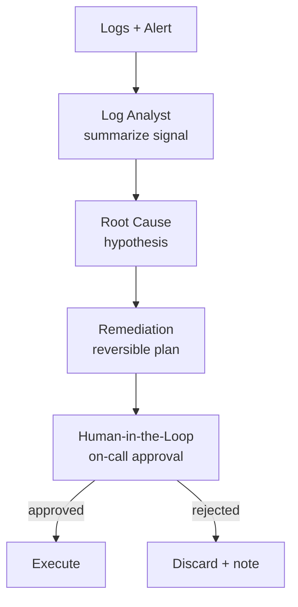

# How to Build a Multi-Agent Incident Triage Pipeline in Python

At 3 a.m. the bottleneck is reading logs and forming a hypothesis fast — but you never want an agent
taking production actions on its own. This recipe runs a **Pipeline** that summarizes the error
signal, hypothesizes a root cause, and drafts a *reversible* remediation, then uses
**Human-in-the-Loop** to require an on-call engineer's approval before anything that touches prod.

**Patterns used:** [Pipeline](../../packages/patterns/orchestration/pipeline.md) ·
[Human-in-the-Loop](../../packages/patterns/advanced/human-in-the-loop.md)

---

## Requirements

- **Functional** — summarize the error signal, hypothesize a root cause, draft a reversible
  remediation, and format it as a runbook step for on-call approval.
- **Non-functional** — triage (log analysis through remediation drafting) should run at machine
  speed; only the actual production-touching action waits on a human.
- **Audit** — the runbook step presented for approval must show its full reasoning chain: what
  failed, the hypothesized cause, and why the remediation is believed safe.
- **Not required** — no automatic execution of the remediation — this recipe stops at a
  human-approvable runbook step, it never touches production itself.

## Architecture decisions

| Decision | Why | Why not the alternative |
|---|---|---|
| **Pipeline** for triage | Every incident goes through the same fixed sequence — analyze logs, hypothesize cause, draft remediation — regardless of the specific failure. | **Supervisor** would imply routing to different specialists by incident category; here every incident gets identical staged treatment. |
| **Human-in-the-Loop** gates only the final runbook step, not the whole triage | Log analysis and root-cause hypothesis are safe to automate fully; only the step that could touch production needs a human. | Gating the entire pipeline on human review would eliminate the speed benefit that matters most at 3 a.m. |
| `runbook_writer` explicitly flags `HIGH_RISK` for delete/drop/scale-to-zero/failover/restart | These are the specific action classes that are hard or impossible to reverse — the flag exists to make that risk visible to the approving human, not just implicit in the prose. | Leaving risk classification implicit would put the burden on the on-call engineer to infer it from free text under time pressure. |

## Four-pillar mapping

| Requirement | Pillar | Capability |
|---|---|---|
| Staged log analysis → root cause → remediation | Execution | `Pipeline` pattern |
| Human sign-off before prod-touching action | Execution | `HumanInTheLoop` pattern |
| Track daily triage spend | Observability | `observability.cost_budget` |
| Trace each triage stage | Observability | `observability.tracing` |

## Blueprint (declarative form)

The real, verified file at `examples/cookbook/devops-sre/incident_triage/blueprint.yaml`, compiled
against `PyAgentAdapter` as part of this repo's test suite:

```yaml
api_version: pyagent/v1
metadata:
  name: incident-triage
  version: 1.0.0
  description: Pipeline that triages incidents with human sign-off before prod changes

providers:
  fast:  { model: gpt-4o-mini }
  smart: { model: claude-sonnet-4-20250514 }

agents:
  log_analyst:    { provider: fast,  prompt: "Summarize error signal: what's failing, since when, blast radius." }
  root_cause:     { provider: smart, prompt: "Most likely root cause with supporting evidence." }
  remediation:    { provider: smart, prompt: "Safe reversible remediation. Start with TOUCHES_PROD: yes/no." }
  runbook_writer: { provider: fast,  prompt: "Format as runbook step. Flag HIGH_RISK for delete/drop/scale-to-zero/failover/restart." }

workflows:
  triage:
    pattern: pipeline
    agents: { stages: [log_analyst, root_cause, remediation] }
  gate:
    pattern: human_in_the_loop
    agents: { agent: runbook_writer }

observability:
  tracing: { enabled: true }
  cost_budget: { daily_usd: 50.0, alert_threshold: 0.8 }
```

```bash
pyagent-blueprint validate incident-triage.yaml
pyagent-blueprint test incident-triage.yaml
```

## Production checklist

Ran this exact blueprint through `PyAgentAdapter.compile()` and inspected the real diagnostics:

- ✅ **Both workflows run as declared** — `triage` and `gate` each compile and execute against the
  native pattern registry with no diagnostics on workflow structure.
- ⚠️ **`observability.cost_budget` is declared but not auto-enforced** — compiling emits
  `BUDGET_UNSUPPORTED`: the $50/day budget is recorded but not enforced. Wire real enforcement via
  `graph.wire_cost_tracker(tracker)`.
- **The `TOUCHES_PROD`/`HIGH_RISK` flagging is prompt-driven, not schema-enforced** — the blueprint
  declares the agents that produce these flags, but nothing in the spec itself guarantees a
  malformed or missing flag is caught before reaching the human approver. That's a real gap if
  false negatives on risk classification are a concern for your deployment.
- **No recovery policy is declared** — if a stage fails mid-run (e.g. the LLM call errors), this
  blueprint doesn't specify a retry policy.

---

## Architecture



---

## Implementation

```bash
pip install pyagent-patterns pyagent-providers
```

```python
import asyncio, os
import httpx
from pyagent_patterns.base import Agent
from pyagent_patterns.orchestration import Pipeline
from pyagent_patterns.advanced import HumanInTheLoop
from pyagent_patterns.advanced.human_in_the_loop import HumanDecision
from pyagent_providers import AnthropicLLM, OpenAILLM

fast_llm = OpenAILLM("gpt-4o-mini")
smart_llm = AnthropicLLM("claude-sonnet-4-20250514")

# ── Triage pipeline: analyze → root cause → remediation ─────────────────────────
triage = Pipeline(stages=[
    Agent("log_analyst", fast_llm,
          system_prompt="Summarize the error signal from these logs: what's failing, since when, blast radius."),
    Agent("root_cause", smart_llm,
          system_prompt="Given the summary, give the single most likely root cause with supporting evidence."),
    Agent("remediation", smart_llm,
          system_prompt=(
              "Propose a safe, reversible remediation with exact steps and a rollback. "
              "Begin with TOUCHES_PROD: yes/no on the first line."
          )),
])

# ── Human gate: any prod-touching remediation needs on-call approval ────────────
def on_call_gate(output: str, metadata: dict) -> HumanDecision:
    if output.lower().startswith("touches_prod: no"):
        return HumanDecision(approved=True, modified_output=f"Auto-applied (non-prod):\n{output}")
    approved = asyncio.get_event_loop().run_until_complete(_page_on_call_and_wait(output))
    return HumanDecision(approved=approved,
                         modified_output=output if approved else "REJECTED by on-call — escalate to IC.")

triage_with_gate = HumanInTheLoop(
    agent=Agent("runbook_writer", fast_llm,
                system_prompt="Format the remediation as a runbook step the on-call engineer can approve."),
    review_fn=on_call_gate,
    high_risk_keywords=["delete", "drop", "scale to zero", "failover", "restart prod"],
)

SAMPLE_INCIDENT = (
    "ALERT: checkout 5xx rate 12% for 8 min. Logs: 'connection pool exhausted' on payments-svc; "
    "db connections pinned at 100/100; deploy of payments-svc 14 min ago."
)

async def main():
    triaged = await triage.run(SAMPLE_INCIDENT)
    final = await triage_with_gate.run(triaged.output)
    print(final.output)

async def _page_on_call_and_wait(summary: str, timeout_s: float = 300.0) -> bool:
    """Post incident to PagerDuty and poll for on-call approval. Returns True = approved."""
    routing_key = os.environ["PAGERDUTY_ROUTING_KEY"]
    async with httpx.AsyncClient(timeout=30.0) as client:
        r = await client.post(
            "https://events.pagerduty.com/v2/enqueue",
            json={
                "routing_key": routing_key,
                "event_action": "trigger",
                "payload": {"summary": summary[:200], "severity": "critical", "source": "pyagent"},
            },
        )
        r.raise_for_status()
        dedup_key = r.json()["dedup_key"]

        deadline = asyncio.get_event_loop().time() + timeout_s
        while asyncio.get_event_loop().time() < deadline:
            resp = await client.get(
                f"https://api.pagerduty.com/incidents?incident_key={dedup_key}",
                headers={"Authorization": f"Token token={os.environ['PAGERDUTY_API_KEY']}"},
            )
            incidents = resp.json().get("incidents", [])
            if incidents and incidents[0].get("status") == "acknowledged":
                return True
            await asyncio.sleep(5.0)
    return False  # timed out — escalate manually

asyncio.run(main())
```

---

## Expected Output

```text
TOUCHES_PROD: yes
Root cause: the 14-min-ago payments-svc deploy lowered the DB pool ceiling; pool now saturated → 5xx.
Remediation:
  1. Raise payments-svc DB pool 100 → 250 (config flag, no restart).
  2. If still saturated in 3 min, roll back the payments-svc deploy.
Rollback: revert the pool flag; redeploy prior payments-svc image.

[PAGED on-call for approval — prod change]
```

A non-prod fix (e.g. clearing a stale cache in staging) applies itself; the prod pool change pages a
human first — automation for the diagnosis, control for the action.

---

## Customization

### Pull live context with a tool agent

Replace the static log analyst with a [ReAct](../../packages/patterns/advanced/react.md) agent that
queries your logging/metrics APIs — see the [Fraud Investigation Assistant](../security/fraud-investigation.md).

### Auto-open a postmortem doc

```python
from pyagent_patterns.orchestration import Pipeline
postmortem = Agent("postmortem", fast_llm, system_prompt="Draft a blameless postmortem from the triage result.")
triage_plus_doc = Pipeline(stages=[triage, postmortem])
```

### Tighten the high-risk keyword gate

```python
triage_with_gate.high_risk_keywords += ["truncate", "migration", "dns", "iam"]
```

---

## When to Use

| Situation | Fit |
|-----------|-----|
| Fixed analyze → root-cause → remediate stages | ✅ Pipeline |
| Prod actions must be human-approved | ✅ Human-in-the-Loop |
| The agent must query tools mid-investigation | ❌ Use [ReAct](../../packages/patterns/advanced/react.md) |
| Several responders should debate the cause | ❌ Use [Debate](../../packages/patterns/resolution/debate.md) |

---

## Cost Profile

| Stage | Typical model | Avg cost | Volume (200 incidents/mo) |
|-------|--------------|----------|----------------------------|
| Log analyst | gpt-4o-mini | $0.0005 | $0.10 |
| Root cause + remediation | claude-sonnet | $0.007 | $1.40 |
| **Per incident** | mix | **~$0.0075** | **~$1.50/mo** |

Triage cost is negligible next to the minutes of MTTR it saves; the human gate is where the real safety lives.

---

## See Also

- [Pipeline pattern](../../packages/patterns/orchestration/pipeline.md) ·
  [Human-in-the-Loop pattern](../../packages/patterns/advanced/human-in-the-loop.md)
- [Alert Triage](../security/log-triage.md) — the same shape for security alerts
- [Browse all recipes](../index.md)
