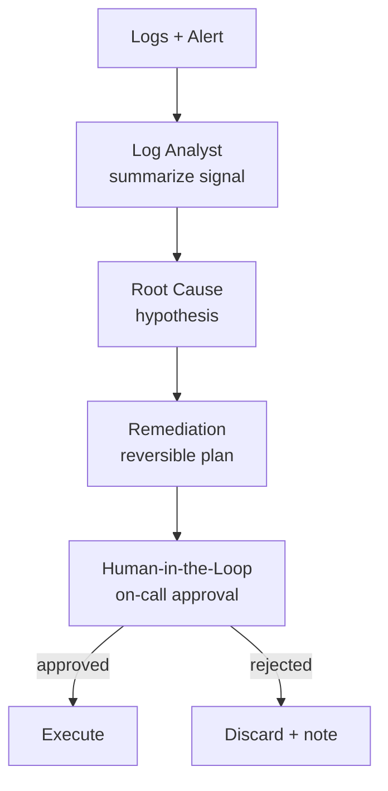

# How to Build a Multi-Agent Incident Triage Pipeline in Python

At 3 a.m. the bottleneck is reading logs and forming a hypothesis fast — but you never want an agent
taking production actions on its own. This recipe runs a **Pipeline** that summarizes the error
signal, hypothesizes a root cause, and drafts a *reversible* remediation, then uses
**Human-in-the-Loop** to require an on-call engineer's approval before anything that touches prod.

**Patterns used:** [Pipeline](../../packages/patterns/orchestration/pipeline.md) ·
[Human-in-the-Loop](../../packages/patterns/advanced/human-in-the-loop.md)

---

## Architecture



---

## Implementation

```bash
pip install pyagent-patterns pyagent-providers
```

```python
import asyncio, os
import httpx
from pyagent_patterns.base import Agent
from pyagent_patterns.orchestration import Pipeline
from pyagent_patterns.advanced import HumanInTheLoop
from pyagent_patterns.advanced.human_in_the_loop import HumanDecision
from pyagent_providers import AnthropicLLM, OpenAILLM

fast_llm = OpenAILLM("gpt-4o-mini")
smart_llm = AnthropicLLM("claude-sonnet-4-20250514")

# ── Triage pipeline: analyze → root cause → remediation ─────────────────────────
triage = Pipeline(stages=[
    Agent("log_analyst", fast_llm,
          system_prompt="Summarize the error signal from these logs: what's failing, since when, blast radius."),
    Agent("root_cause", smart_llm,
          system_prompt="Given the summary, give the single most likely root cause with supporting evidence."),
    Agent("remediation", smart_llm,
          system_prompt=(
              "Propose a safe, reversible remediation with exact steps and a rollback. "
              "Begin with TOUCHES_PROD: yes/no on the first line."
          )),
])

# ── Human gate: any prod-touching remediation needs on-call approval ────────────
def on_call_gate(output: str, metadata: dict) -> HumanDecision:
    if output.lower().startswith("touches_prod: no"):
        return HumanDecision(approved=True, modified_output=f"Auto-applied (non-prod):\n{output}")
    approved = asyncio.get_event_loop().run_until_complete(_page_on_call_and_wait(output))
    return HumanDecision(approved=approved,
                         modified_output=output if approved else "REJECTED by on-call — escalate to IC.")

triage_with_gate = HumanInTheLoop(
    agent=Agent("runbook_writer", fast_llm,
                system_prompt="Format the remediation as a runbook step the on-call engineer can approve."),
    review_fn=on_call_gate,
    high_risk_keywords=["delete", "drop", "scale to zero", "failover", "restart prod"],
)

SAMPLE_INCIDENT = (
    "ALERT: checkout 5xx rate 12% for 8 min. Logs: 'connection pool exhausted' on payments-svc; "
    "db connections pinned at 100/100; deploy of payments-svc 14 min ago."
)

async def main():
    triaged = await triage.run(SAMPLE_INCIDENT)
    final = await triage_with_gate.run(triaged.output)
    print(final.output)

async def _page_on_call_and_wait(summary: str, timeout_s: float = 300.0) -> bool:
    """Post incident to PagerDuty and poll for on-call approval. Returns True = approved."""
    routing_key = os.environ["PAGERDUTY_ROUTING_KEY"]
    async with httpx.AsyncClient(timeout=30.0) as client:
        r = await client.post(
            "https://events.pagerduty.com/v2/enqueue",
            json={
                "routing_key": routing_key,
                "event_action": "trigger",
                "payload": {"summary": summary[:200], "severity": "critical", "source": "pyagent"},
            },
        )
        r.raise_for_status()
        dedup_key = r.json()["dedup_key"]

        deadline = asyncio.get_event_loop().time() + timeout_s
        while asyncio.get_event_loop().time() < deadline:
            resp = await client.get(
                f"https://api.pagerduty.com/incidents?incident_key={dedup_key}",
                headers={"Authorization": f"Token token={os.environ['PAGERDUTY_API_KEY']}"},
            )
            incidents = resp.json().get("incidents", [])
            if incidents and incidents[0].get("status") == "acknowledged":
                return True
            await asyncio.sleep(5.0)
    return False  # timed out — escalate manually

asyncio.run(main())
```

---

## Expected Output

```text
TOUCHES_PROD: yes
Root cause: the 14-min-ago payments-svc deploy lowered the DB pool ceiling; pool now saturated → 5xx.
Remediation:
  1. Raise payments-svc DB pool 100 → 250 (config flag, no restart).
  2. If still saturated in 3 min, roll back the payments-svc deploy.
Rollback: revert the pool flag; redeploy prior payments-svc image.

[PAGED on-call for approval — prod change]
```

A non-prod fix (e.g. clearing a stale cache in staging) applies itself; the prod pool change pages a
human first — automation for the diagnosis, control for the action.

---

## Customization

### Pull live context with a tool agent

Replace the static log analyst with a [ReAct](../../packages/patterns/advanced/react.md) agent that
queries your logging/metrics APIs — see the [Fraud Investigation Assistant](../security/fraud-investigation.md).

### Auto-open a postmortem doc

```python
from pyagent_patterns.orchestration import Pipeline
postmortem = Agent("postmortem", fast_llm, system_prompt="Draft a blameless postmortem from the triage result.")
triage_plus_doc = Pipeline(stages=[triage, postmortem])
```

### Tighten the high-risk keyword gate

```python
triage_with_gate.high_risk_keywords += ["truncate", "migration", "dns", "iam"]
```

---

## When to Use

| Situation | Fit |
|-----------|-----|
| Fixed analyze → root-cause → remediate stages | ✅ Pipeline |
| Prod actions must be human-approved | ✅ Human-in-the-Loop |
| The agent must query tools mid-investigation | ❌ Use [ReAct](../../packages/patterns/advanced/react.md) |
| Several responders should debate the cause | ❌ Use [Debate](../../packages/patterns/resolution/debate.md) |

---

## Cost Profile

| Stage | Typical model | Avg cost | Volume (200 incidents/mo) |
|-------|--------------|----------|----------------------------|
| Log analyst | gpt-4o-mini | $0.0005 | $0.10 |
| Root cause + remediation | claude-sonnet | $0.007 | $1.40 |
| **Per incident** | mix | **~$0.0075** | **~$1.50/mo** |

Triage cost is negligible next to the minutes of MTTR it saves; the human gate is where the real safety lives.

---

## See Also

- [Pipeline pattern](../../packages/patterns/orchestration/pipeline.md) ·
  [Human-in-the-Loop pattern](../../packages/patterns/advanced/human-in-the-loop.md)
- [Alert Triage](../security/log-triage.md) — the same shape for security alerts
- [Browse all recipes](../index.md)
