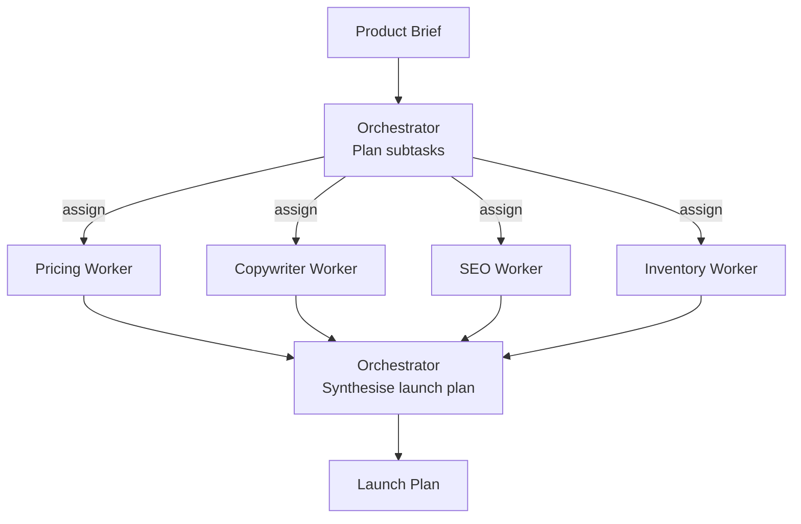

# How to Build a Multi-Agent Product Launch Planner in Python

A retail product launch touches pricing, marketing copy, SEO, and inventory — and which of
those actually need work depends on the product. This recipe uses the **Orchestrator-Workers**
pattern: a planner agent inspects the brief, decides which specialist workers to invoke and what
to assign each, then synthesizes their output into a single launch plan.

**Patterns used:** Orchestrator-Workers

---

## Architecture



---

## Implementation

```python
import asyncio
from pyagent_patterns.base import Agent
from pyagent_patterns.orchestration import OrchestratorWorkers
from pyagent_providers import AnthropicLLM, OpenAILLM

launch_planner = OrchestratorWorkers(
    orchestrator=Agent(
        "launch_lead",
        AnthropicLLM("claude-sonnet-4-20250514"),
        system_prompt=(
            "You plan e-commerce product launches. From the brief, decide which specialist "
            "workers are genuinely needed and what to assign each — skip any that don't apply. "
            'Respond as JSON: {"assignments": [{"worker": "name", "subtask": "description"}]}. '
            "After all workers complete, synthesize their output into one launch plan with a "
            "go-live checklist."
        ),
    ),
    workers=[
        Agent(
            "pricing",
            OpenAILLM("gpt-4o-mini"),
            system_prompt=(
                "Recommend a launch price and promo strategy. Consider margin targets, "
                "competitor price bands, and an intro discount. Justify the number."
            ),
        ),
        Agent(
            "copywriter",
            AnthropicLLM("claude-sonnet-4-20250514"),
            system_prompt=(
                "Write the product title, a 50-word description, and three bullet benefits. "
                "Match the brand voice in the brief."
            ),
        ),
        Agent(
            "seo",
            OpenAILLM("gpt-4o-mini"),
            system_prompt=(
                "Produce an SEO pack: 8 target keywords, a 60-char meta title, and a "
                "155-char meta description. Prioritize high-intent search terms."
            ),
        ),
        Agent(
            "inventory",
            OpenAILLM("gpt-4o-mini"),
            system_prompt=(
                "Recommend an opening stock quantity and reorder point from the demand "
                "estimate and lead time in the brief. Flag stockout risk."
            ),
        ),
    ],
)

brief = (
    "Launch: a reusable stainless-steel water bottle, premium eco brand. "
    "COGS $9, target margin 60%. Competitors sell $28-$35. Supplier lead time 4 weeks, "
    "expected first-month demand ~1,200 units."
)
result = asyncio.run(launch_planner.run(brief))
print(result.output)
print(f"Workers used: {result.metadata['workers_used']}")
```

---

## Expected output

```text
LAUNCH PLAN — EcoFlask Pro

Pricing:   $29.99 launch price (67% margin) with a 15% first-week intro code.
Copy:      "EcoFlask Pro — 24-Hour Cold, Zero Plastic" + 3 benefit bullets.
SEO:       meta title + 8 keywords (insulated water bottle, reusable …).
Inventory: open with 1,500 units, reorder point 400 (4-week lead time).

Go-live checklist: [pricing approved] [PDP copy live] [meta tags set] [stock received]

Workers used: ['pricing', 'copywriter', 'seo', 'inventory']
```

---

## Customization

### Add a worker

```python
launch_planner.workers.append(
    Agent("logistics", OpenAILLM("gpt-4o-mini"),
          system_prompt="Plan fulfilment: carrier, packaging, and per-region shipping SLAs."),
)
```

### Constrain to a budget

```python
launch_planner.orchestrator.system_prompt += " Keep the total launch spend under $25,000 and show the allocation."
```

### Emit a launch timeline

Chain a timeline stage with a [Pipeline](../../packages/patterns/orchestration/pipeline.md):

```python
from pyagent_patterns.orchestration import Pipeline
gantt = Agent("scheduler", OpenAILLM("gpt-4o-mini"), system_prompt="Turn the plan into a week-by-week launch timeline.")
planner_with_timeline = Pipeline(stages=[launch_planner, gantt])
```

---

## When to Use

| Situation | Use Orchestrator-Workers? |
|-----------|---------------------------|
| Which subtasks are needed depends on the input | ✅ Yes — the orchestrator decides at runtime |
| You want one synthesized deliverable from many specialists | ✅ Yes |
| The set of steps is always the same, in order | ❌ Use [Pipeline](../../packages/patterns/orchestration/pipeline.md) |
| All workers should run on every input | ❌ Use [Fan-Out / Fan-In](../../packages/patterns/orchestration/fan-out-fan-in.md) |

---

## Cost Profile

| Stage | Typical model | Avg cost | Volume (1k launches/mo) |
|-------|--------------|----------|--------------------------|
| Orchestrator (plan + synthesis) | claude-sonnet | $0.006 | $180/mo |
| Workers (up to 4) | gpt-4o-mini | $0.0012 | $36/mo |
| **Blended per launch** | mix | **~$0.007** | **~$210/mo** |

Skipping irrelevant workers keeps cost proportional to the work each launch actually needs.

---

## See Also

- [Orchestrator-Workers pattern](../../packages/patterns/orchestration/orchestrator-workers.md)
- [Analytics Task Decomposer](../data-analytics/analytics-decomposer.md) — the same pattern for data work
- [Browse all recipes](../index.md)
