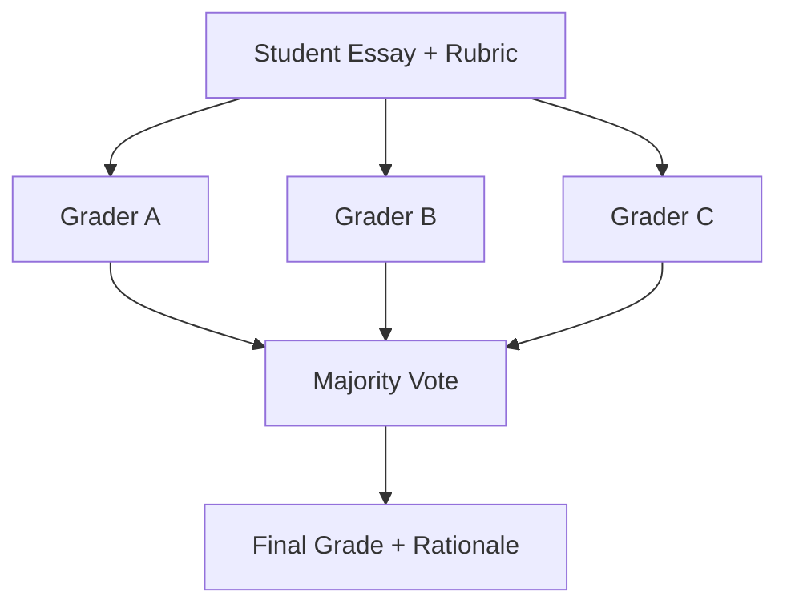

# How to Build a Multi-Agent Essay Grading System in Python

A single LLM grader is noisy and easy to bias. This recipe uses the **Voting** pattern: several
grader agents score the same essay independently against the same rubric, and a majority vote
produces a defensible final grade — exactly how a panel of human markers reduces individual bias.

**Patterns used:** Voting

---

## Architecture



---

## Implementation

```python
import asyncio
from pyagent_patterns.base import Agent
from pyagent_patterns.resolution import Voting
from pyagent_providers import AnthropicLLM, GeminiLLM, OpenAILLM

RUBRIC = (
    "Grade the essay A, B, C, D, or F using this rubric: thesis clarity, evidence, "
    "structure, and grammar. Reply with the single letter grade on line 1, then a "
    "one-sentence justification on line 2."
)

grader = Voting(
    voters=[
        Agent("grader_openai", OpenAILLM("gpt-4o"), system_prompt=RUBRIC),
        Agent("grader_anthropic", AnthropicLLM("claude-sonnet-4-20250514"), system_prompt=RUBRIC),
        Agent("grader_gemini", GeminiLLM("gemini-2.5-pro"), system_prompt=RUBRIC),
    ],
    strategy="majority",
)

essay = (
    "Title: Why Cities Should Invest in Public Transit\n\n"
    "Public transit reduces traffic, cuts emissions, and connects communities. "
    "When cities fund buses and trains, fewer cars crowd the roads ... "
    "(800-word student submission)"
)
result = asyncio.run(grader.run(f"{essay}"))
print(result.output)
print(f"Tally: {result.metadata['tally']}, winner: {result.metadata['winner']}")
```

---

## Expected output

```text
Grade: B
Justification: A clear thesis and good structure, but evidence is thin and a few
grammar slips weaken otherwise solid reasoning.

Tally: {'B': 2, 'A': 1}, winner: B
```

Because three independent graders must converge, a single over-generous or harsh model can't
swing the grade on its own — and the tally is an audit trail you can show a student.

---

## Customization

### Weighted graders

```python
grader = Voting(
    voters=[Agent("grader_openai", OpenAILLM("gpt-4o"), system_prompt=RUBRIC), ...],
    strategy="weighted",
    weights=[2.0, 1.0, 1.0],  # trust the strongest grader more
)
```

### Add a rubric-specific grader

```python
grader.voters.append(
    Agent("grammar_grader", OpenAILLM("gpt-4o-mini"),
          system_prompt="Grade ONLY grammar and mechanics A-F. Letter on line 1, reason on line 2."),
)
```

### Return per-grader transparency

The `result.metadata['tally']` and `['votes']` give you each grader's score — surface them to students
as an appeal trail.

---

## When to Use

| Situation | Use Voting? |
|-----------|-------------|
| You need a robust answer that resists single-model bias | ✅ Yes |
| The decision is a discrete choice (grade, label, yes/no) | ✅ Yes — majority/consensus fits |
| You want graders to debate and persuade each other | ❌ Use [Debate](../../packages/patterns/resolution/debate.md) |
| One agent should critique and improve a draft | ❌ Use [Self-Reflection](../../packages/patterns/resolution/self-reflection.md) |

---

## Cost Profile

| Query type | Typical model | Avg cost | Volume (1k essays/day) |
|-----------|--------------|----------|-------------------------|
| 3 independent graders | gpt-4o / sonnet / gemini-pro | $0.012 | $360/mo |
| **Per essay** | mix | **~$0.012** | **~$360/mo** |

Use cheaper models (e.g. three `*-mini` voters) for formative feedback; reserve the premium
panel for high-stakes summative grading.

---

## See Also

- [Voting pattern](../../packages/patterns/resolution/voting.md)
- [Loan Underwriting Committee](../finance-trading/loan-underwriting.md) — a debating panel for credit decisions
- [Browse all recipes](../index.md)
