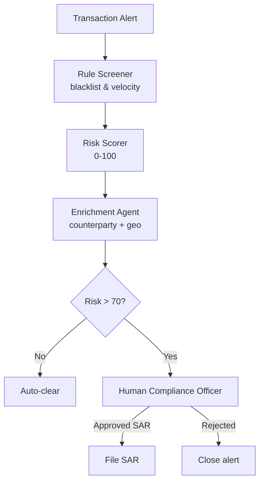

# How to Build a Multi-Agent AML Transaction Monitoring System in Python

Anti-money-laundering (AML) monitoring needs to be fast for low-risk transactions and cautious for
high-risk ones. This recipe chains two patterns: a **Pipeline** that screens, scores, and enriches
each alert — then **Human-in-the-Loop** that routes anything above the risk threshold to a compliance
officer before a SAR is filed.

**Patterns used:** [Pipeline](../../packages/patterns/orchestration/pipeline.md),
[Human-in-the-Loop](../../packages/patterns/advanced/human-in-the-loop.md)

---

## Architecture



---

## Implementation

```bash
pip install pyagent-patterns pyagent-providers
```

```python
import asyncio
from pyagent_patterns.base import Agent
from pyagent_patterns.orchestration import Pipeline
from pyagent_patterns.advanced import HumanInTheLoop
from pyagent_patterns.advanced.human_in_the_loop import HumanDecision
from pyagent_providers import AnthropicLLM, OpenAILLM

fast_llm = OpenAILLM("gpt-4o-mini")
smart_llm = AnthropicLLM("claude-sonnet-4-20250514")

# Stage 1 — triage pipeline
aml_pipeline = Pipeline(stages=[
    Agent(
        "rule_screener", fast_llm,
        system_prompt=(
            "Screen the transaction for rule-based red flags: sanctions matches, velocity breaches "
            "(>3 transactions in 1h), structuring (amounts just under $10k), and high-risk jurisdictions. "
            "Output a bullet list of flags found (or NONE)."
        ),
    ),
    Agent(
        "risk_scorer", smart_llm,
        system_prompt=(
            "Given the rule flags, assign a risk score 0-100 and a risk tier: "
            "Low (<30), Medium (30-70), High (>70). Explain the top two scoring drivers."
        ),
    ),
    Agent(
        "enrichment", fast_llm,
        system_prompt=(
            "Enrich the alert with counterparty context: known business type, jurisdiction risk, "
            "prior SAR history (simulate from input). Produce a one-paragraph case summary."
        ),
    ),
])

# Simulated human review function
def compliance_review(output: str, metadata: dict) -> HumanDecision:
    """In production, surface the case in your compliance UI and await officer input."""
    print(f"\n[COMPLIANCE REVIEW REQUIRED]\n{output}\n")
    answer = input("File SAR? (yes/no): ").strip().lower()
    return HumanDecision(approved=(answer == "yes"), modified_output=output)

# Stage 2 — gated human review for high-risk alerts
sar_writer = HumanInTheLoop(
    agent=Agent(
        "sar_drafter", smart_llm,
        system_prompt=(
            "Draft a FinCEN SAR narrative from the case summary: subject, activity description, "
            "dates, amounts, and why the activity is suspicious. Be factual and concise."
        ),
    ),
    review_fn=compliance_review,
    high_risk_keywords=["High", "sanctions", "structuring"],
)

async def monitor(alert: str) -> None:
    triage = await aml_pipeline.run(alert)
    print(triage.output)

    # Route to human review only for high-risk
    if "High" in triage.output or "sanctions" in triage.output.lower():
        sar_result = await sar_writer.run(triage.output)
        if sar_result.metadata.get("approved"):
            print("\nSAR filed:\n", sar_result.output)
        else:
            print("\nAlert closed — officer rejected SAR.")
    else:
        print("\nAuto-cleared (Low/Medium risk).")

ALERT = (
    "Transaction: $9,850 wire from ACC-7731 (US) to ACME Consulting Ltd (Cyprus). "
    "Third such transfer in 48h. Counterparty newly registered; no prior relationship."
)

asyncio.run(monitor(ALERT))
```

---

## Expected Output

```text
Rule flags: structuring ($9,850 — just under $10k ×3), high-risk jurisdiction (Cyprus), velocity breach.
Risk: 88 — High. Drivers: structuring pattern + new counterparty in high-risk jurisdiction.
Case: ACME Consulting Ltd registered 30 days ago, no known business activity, Cyprus jurisdiction
(FATF grey-listed). Three transfers total $29,550 in 48h.

[COMPLIANCE REVIEW REQUIRED]
<case summary above>
File SAR? (yes/no): yes

SAR filed:
Subject: ACC-7731. Activity: three wire transfers totalling $29,550 to a newly registered Cyprus
shell, structured below the $10k reporting threshold. Suspicious indicators: velocity, structuring,
high-risk jurisdiction.
```

Low- and medium-risk alerts are auto-cleared without a human review, so the compliance officer sees
only cases that genuinely need judgment.

---

## Customization

### Replace the interactive prompt with a compliance UI

```python
import httpx

def compliance_review(output: str, metadata: dict) -> HumanDecision:
    resp = httpx.post("https://compliance.internal/api/review", json={"case": output})
    decision = resp.json()  # {"approved": true, "notes": "..."}
    return HumanDecision(approved=decision["approved"], modified_output=output)
```

### Lower the risk threshold

```python
if triage.output.count("High") > 0 or "Medium" in triage.output:
    sar_result = await sar_writer.run(triage.output)
```

### Batch alerts

```python
alerts = [...]
results = await asyncio.gather(*(monitor(a) for a in alerts))
```

---

## When to Use

| Situation | Fit |
|-----------|-----|
| Fixed screen → score → enrich stages | ✅ Pipeline |
| High-risk outputs need a human gate | ✅ Human-in-the-Loop |
| Risk threshold varies per alert type | ✅ Compose both |
| Every alert needs human review | ❌ Remove pipeline; use HITL only |

---

## Cost Profile

| Stage | Typical model | Avg cost | Volume (50k alerts/mo) |
|-------|--------------|----------|------------------------|
| Screener + enrichment | gpt-4o-mini | $0.0006 | $30 |
| Risk scorer | claude-sonnet | $0.004 | $200 |
| SAR drafter (High only, ~5%) | claude-sonnet | $0.006 | $15 |
| **Per alert** | mix | **~$0.005** | **~$245/mo** |

---

## See Also

- [Pipeline pattern](../../packages/patterns/orchestration/pipeline.md)
- [Human-in-the-Loop pattern](../../packages/patterns/advanced/human-in-the-loop.md)
- [Fraud Investigation Assistant](../security/fraud-investigation.md) — ReAct agent for deep investigation
- [Loan Underwriting Committee](loan-underwriting.md) — debate pattern for credit decisions
- [Browse all recipes](../index.md)
