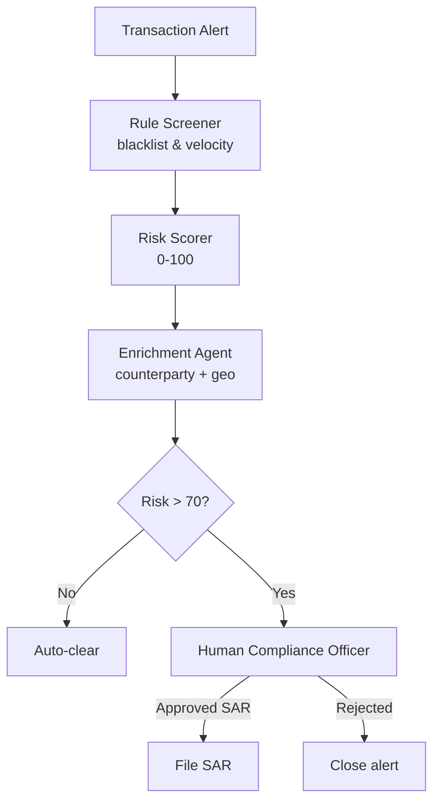

# How to Build a Multi-Agent AML Transaction Monitoring System in Python

Anti-money-laundering (AML) monitoring needs to be fast for low-risk transactions and cautious for
high-risk ones. This recipe chains two patterns: a **Pipeline** that screens, scores, and enriches
each alert — then **Human-in-the-Loop** that routes anything above the risk threshold to a compliance
officer before a SAR is filed.

**Patterns used:** [Pipeline](../../packages/patterns/orchestration/pipeline.md),
[Human-in-the-Loop](../../packages/patterns/advanced/human-in-the-loop.md)

---

## Requirements

- **Functional** — screen every transaction alert for rule-based red flags, assign a 0-100 risk
  score, enrich with counterparty context, and draft a FinCEN SAR narrative for any alert a
  compliance officer approves.
- **Non-functional** — auto-clear low/medium-risk alerts without human involvement; never file a
  SAR without an officer's explicit approval.
- **Audit** — every SAR must be traceable to the specific rule flags and risk score that triggered
  it — the pipeline's staged output is that trail.
- **Not required** — no cross-alert correlation, no persistent case memory between alerts (each
  alert is evaluated independently).

## Architecture decisions

| Decision | Why | Why not the alternative |
|---|---|---|
| **Pipeline** for triage | Every alert goes through the same fixed sequence — screen, score, enrich — regardless of content. | **Supervisor** would imply routing to different specialists by category; every alert here gets identical treatment, just with different outputs. |
| **Human-in-the-Loop** gates only the SAR-filing step, not the whole pipeline | Auto-clearing low-risk alerts at machine speed is the whole point; only the consequential, hard-to-reverse action (filing a SAR) needs a human. | Gating the entire pipeline on human review would eliminate the speed benefit for the ~majority of alerts that are low-risk. |
| Two-tier model routing (`fast` for screening/enrichment, `smart` for scoring/drafting) | Rule screening and enrichment are pattern-matching tasks; risk scoring and SAR drafting need the reasoning a stronger model provides. | Using `smart` everywhere triples cost for stages that don't need it; using `fast` everywhere risks under-scoring genuine risk. |

## Four-pillar mapping

| Requirement | Pillar | Capability |
|---|---|---|
| Screen, score, enrich in sequence | Execution | `Pipeline` pattern |
| Gate SAR filing on human approval | Execution | `HumanInTheLoop` pattern |
| Track daily compliance spend | Observability | `observability.cost_budget` |
| Trace each screen/score/enrich call | Observability | `observability.tracing` |
| Compress case history to control cost | Context | `context.compression` (`semantic_lossless`) |

## Blueprint (declarative form)

The same triage pipeline declared as a `pyagent-blueprint` manifest — this is the real, verified
file at `examples/cookbook/finance-trading/aml_monitoring/blueprint.yaml`, compiled against
`PyAgentAdapter` as part of this repo's test suite, not a hand-typed illustration. **Honest gap:**
the blueprint currently declares only the `triage` pipeline (rule_screener → risk_scorer →
enrichment) — the `HumanInTheLoop`-gated SAR-drafting step shown in the Python implementation below
isn't yet expressed as a second workflow in the YAML. This recipe is a real example of a pattern
this session's own backlog review flagged: Blueprint coverage lagging the hand-written Python it's
meant to describe.

```yaml
api_version: pyagent/v1
metadata:
  name: aml-monitoring
  version: 1.0.0
  description: AML transaction screening pipeline with compliance officer gate

providers:
  fast:  { model: gpt-4o-mini }
  smart: { model: claude-sonnet-4-20250514 }

agents:
  rule_screener: { provider: fast,  prompt: "Screen for sanctions, velocity, structuring, jurisdiction flags." }
  risk_scorer:   { provider: smart, prompt: "Assign risk score 0-100 and tier. Explain top drivers." }
  enrichment:    { provider: fast,  prompt: "Enrich with counterparty context. One-paragraph summary." }
  sar_drafter:   { provider: smart, prompt: "Draft a FinCEN SAR narrative: subject, activity, dates, amounts." }

workflows:
  triage:
    pattern: pipeline
    agents:
      stages: [rule_screener, risk_scorer, enrichment]

observability:
  tracing: { enabled: true }
  cost_budget: { daily_usd: 500.0, alert_threshold: 0.8 }

context:
  compression: { policy: semantic_lossless, target_ratio: 0.6 }
```

```bash
pyagent-blueprint validate aml-monitoring.yaml
pyagent-blueprint test aml-monitoring.yaml
```

## Production checklist

Ran this exact blueprint through `PyAgentAdapter.compile()` and inspected the real diagnostics:

- ✅ **The triage pipeline runs as declared** — `triage` compiles and executes against the native
  pattern registry with no diagnostics on that path.
- ⚠️ **`observability.cost_budget` is declared but not auto-enforced** — compiling this blueprint
  emits `BUDGET_UNSUPPORTED`: the $500/day budget is recorded in the spec but nothing stops a run
  from exceeding it. Wire real enforcement via `graph.wire_cost_tracker(tracker)`.
- ⚠️ **`context.compression` is declared but not auto-wired** — compiling emits
  `MEMORY_TIER_UNSUPPORTED`: the `semantic_lossless` policy is recorded but not applied. Call
  `graph.wire_compressor(compressor)` if you need it actually enforced.
- **The human-approval gate exists only in the Python implementation, not the blueprint** (see the
  honest gap noted above) — if you need this declared and diffable, that's real, not-yet-done work,
  not a documentation oversight.
- **No persistent memory tier is declared** — each alert is evaluated independently by design (see
  Requirements); if cross-alert pattern detection becomes a requirement later, that's a
  `pyagent-context` `SessionMemory` addition, not a redesign.

---

## Architecture



---

## Implementation

```bash
pip install pyagent-patterns pyagent-providers
```

```python
import asyncio, os
from typing import Literal
import httpx
from pyagent_patterns.base import Agent
from pyagent_patterns.orchestration import Pipeline
from pyagent_patterns.advanced import HumanInTheLoop
from pyagent_patterns.advanced.human_in_the_loop import HumanDecision
from pyagent_providers import AnthropicLLM, OpenAILLM

fast_llm = OpenAILLM("gpt-4o-mini")
smart_llm = AnthropicLLM("claude-sonnet-4-20250514")

# Stage 1 — triage pipeline
aml_pipeline = Pipeline(stages=[
    Agent(
        "rule_screener", fast_llm,
        system_prompt=(
            "Screen the transaction for rule-based red flags: sanctions matches, velocity breaches "
            "(>3 transactions in 1h), structuring (amounts just under $10k), and high-risk jurisdictions. "
            "Output a bullet list of flags found (or NONE)."
        ),
    ),
    Agent(
        "risk_scorer", smart_llm,
        system_prompt=(
            "Given the rule flags, assign a risk score 0-100 and a risk tier: "
            "Low (<30), Medium (30-70), High (>70). Explain the top two scoring drivers."
        ),
    ),
    Agent(
        "enrichment", fast_llm,
        system_prompt=(
            "Enrich the alert with counterparty context: known business type, jurisdiction risk, "
            "prior SAR history (simulate from input). Produce a one-paragraph case summary."
        ),
    ),
])

def _parse_tier(output: str) -> Literal["Low", "Medium", "High"]:
    for tier in ("High", "Medium", "Low"):
        if f"— {tier}" in output or f"tier: {tier}" in output.lower():
            return tier
    return "Medium"

async def _post_case(output: str) -> str:
    """Submit case to compliance queue; returns ticket_id."""
    async with httpx.AsyncClient(timeout=30.0) as client:
        r = await client.post(
            os.environ["COMPLIANCE_API_URL"] + "/cases",
            json={"summary": output[:500], "source": "aml-agent"},
            headers={"Authorization": f"Bearer {os.environ['COMPLIANCE_API_KEY']}"},
        )
        r.raise_for_status()
        return r.json()["ticket_id"]

async def _poll_decision(ticket_id: str, timeout_s: float = 300.0) -> bool:
    """Poll until a compliance officer approves or rejects. Returns True = approved."""
    async with httpx.AsyncClient(timeout=timeout_s) as client:
        deadline = asyncio.get_event_loop().time() + timeout_s
        while asyncio.get_event_loop().time() < deadline:
            r = await client.get(
                f"{os.environ['COMPLIANCE_API_URL']}/cases/{ticket_id}",
                headers={"Authorization": f"Bearer {os.environ['COMPLIANCE_API_KEY']}"},
            )
            data = r.json()
            if data["status"] in ("approved", "rejected"):
                return data["status"] == "approved"
            await asyncio.sleep(5.0)
    return False  # timed out → conservative reject

def compliance_review(output: str, metadata: dict) -> HumanDecision:
    """Route high-risk cases to the compliance API and wait for an officer decision."""
    loop = asyncio.get_event_loop()
    ticket_id = loop.run_until_complete(_post_case(output))
    approved  = loop.run_until_complete(_poll_decision(ticket_id))
    print(f"[COMPLIANCE] ticket={ticket_id} approved={approved}")
    return HumanDecision(approved=approved, modified_output=output)

# Stage 2 — gated human review for high-risk alerts
sar_writer = HumanInTheLoop(
    agent=Agent(
        "sar_drafter", smart_llm,
        system_prompt=(
            "Draft a FinCEN SAR narrative from the case summary: subject, activity description, "
            "dates, amounts, and why the activity is suspicious. Be factual and concise."
        ),
    ),
    review_fn=compliance_review,
    high_risk_keywords=["High", "sanctions", "structuring"],
)

async def monitor(alert: str) -> None:
    triage = await aml_pipeline.run(alert)
    print(triage.output)

    # Route to human review only for high-risk (Pydantic parse — no fragile string match)
    if _parse_tier(triage.output) == "High":
        sar_result = await sar_writer.run(triage.output)
        if sar_result.metadata.get("approved"):
            print("\nSAR filed:\n", sar_result.output)
        else:
            print("\nAlert closed — officer rejected SAR.")
    else:
        print("\nAuto-cleared (Low/Medium risk).")

ALERT = (
    "Transaction: $9,850 wire from ACC-7731 (US) to ACME Consulting Ltd (Cyprus). "
    "Third such transfer in 48h. Counterparty newly registered; no prior relationship."
)

asyncio.run(monitor(ALERT))
```

---

## Expected Output

```text
Rule flags: structuring ($9,850 — just under $10k ×3), high-risk jurisdiction (Cyprus), velocity breach.
Risk: 88 — High. Drivers: structuring pattern + new counterparty in high-risk jurisdiction.
Case: ACME Consulting Ltd registered 30 days ago, no known business activity, Cyprus jurisdiction
(FATF grey-listed). Three transfers total $29,550 in 48h.

[COMPLIANCE REVIEW REQUIRED]
<case summary above>
File SAR? (yes/no): yes

SAR filed:
Subject: ACC-7731. Activity: three wire transfers totalling $29,550 to a newly registered Cyprus
shell, structured below the $10k reporting threshold. Suspicious indicators: velocity, structuring,
high-risk jurisdiction.
```

Low- and medium-risk alerts are auto-cleared without a human review, so the compliance officer sees
only cases that genuinely need judgment.

---

## Customization

### Replace the interactive prompt with a compliance UI

```python
import httpx

def compliance_review(output: str, metadata: dict) -> HumanDecision:
    resp = httpx.post("https://compliance.internal/api/review", json={"case": output})
    decision = resp.json()  # {"approved": true, "notes": "..."}
    return HumanDecision(approved=decision["approved"], modified_output=output)
```

### Lower the risk threshold

```python
if triage.output.count("High") > 0 or "Medium" in triage.output:
    sar_result = await sar_writer.run(triage.output)
```

### Batch alerts

```python
alerts = [...]
results = await asyncio.gather(*(monitor(a) for a in alerts))
```

---

## When to Use

| Situation | Fit |
|-----------|-----|
| Fixed screen → score → enrich stages | ✅ Pipeline |
| High-risk outputs need a human gate | ✅ Human-in-the-Loop |
| Risk threshold varies per alert type | ✅ Compose both |
| Every alert needs human review | ❌ Remove pipeline; use HITL only |

---

## Cost Profile

| Stage | Typical model | Avg cost | Volume (50k alerts/mo) |
|-------|--------------|----------|------------------------|
| Screener + enrichment | gpt-4o-mini | $0.0006 | $30 |
| Risk scorer | claude-sonnet | $0.004 | $200 |
| SAR drafter (High only, ~5%) | claude-sonnet | $0.006 | $15 |
| **Per alert** | mix | **~$0.005** | **~$245/mo** |

---

## See Also

- [Pipeline pattern](../../packages/patterns/orchestration/pipeline.md)
- [Human-in-the-Loop pattern](../../packages/patterns/advanced/human-in-the-loop.md)
- [Fraud Investigation Assistant](../security/fraud-investigation.md) — ReAct agent for deep investigation
- [Loan Underwriting Committee](loan-underwriting.md) — debate pattern for credit decisions
- [Browse all recipes](../index.md)
