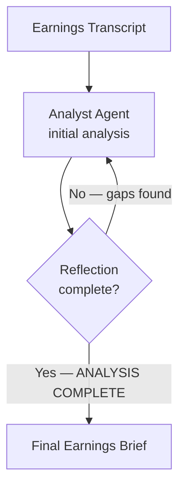

# How to Build a Multi-Agent Earnings Call Analyzer in Python

A first-pass earnings summary misses things: buried guidance updates, CFO tone shifts,
management's dodge on capex. This recipe uses **Self-Reflection** — the agent produces an initial
analysis, then critiques and improves it in a tight loop until it passes a completeness check.

**Patterns used:** [Self-Reflection](../../packages/patterns/resolution/self-reflection.md)

---

## Architecture



---

## Implementation

```bash
pip install pyagent-patterns pyagent-providers
```

```python
import asyncio
from pyagent_patterns.base import Agent
from pyagent_patterns.resolution import SelfReflection
from pyagent_providers import AnthropicLLM

smart_llm = AnthropicLLM("claude-sonnet-4-20250514")

earnings_analyzer = SelfReflection(
    agent=Agent(
        "earnings_analyst", smart_llm,
        system_prompt=(
            "You analyze earnings call transcripts for buy-side investors. Each iteration:\n"
            "1. Extract: EPS beat/miss vs consensus, revenue growth YoY, and full-year guidance revision.\n"
            "2. Flag: any change in management tone (confident / cautious / evasive), and one key risk.\n"
            "3. Self-check: have you covered EPS, revenue, guidance, tone, AND risk? "
            "If any are missing or vague, note the gap and improve. "
            'When all five are clear and specific, end with "ANALYSIS COMPLETE".'
        ),
    ),
    max_rounds=3,
    stop_phrase="ANALYSIS COMPLETE",
)

TRANSCRIPT = """
[Q2 Earnings Call — ACME Corp]
CEO: "We delivered another strong quarter. Revenue came in at $1.24B, up 14% year-over-year."
CFO: "EPS was $1.82, and I would note consensus was $1.68. Free cash flow was $310M.
      On guidance — we are tightening the full-year revenue range to $4.9–5.0B from $4.7–5.1B
      and raising the midpoint. Margin expansion remains on track."
Analyst Q: "Can you comment on capex plans for H2?"
CFO: "We will continue to invest prudently. I don't want to get into specific numbers today."
CEO: "We feel very good about our competitive position."
"""

async def main():
    result = await earnings_analyzer.run(TRANSCRIPT)
    print(result.output)
    print(f"\nRounds: {result.metadata['rounds']}")

asyncio.run(main())
```

---

## Expected Output

```text
EARNINGS BRIEF — ACME Corp Q2

EPS:      $1.82 vs $1.68 consensus — beat by 8.3%.
Revenue:  $1.24B, +14% YoY — above street.
Guidance: Full-year range tightened to $4.9–5.0B (raised midpoint from ~$4.9B); positive signal.
Tone:     CEO confident; CFO measured. Notable: CFO declined to quantify H2 capex ("don't want
          to get into specific numbers") — potentially evasive on investment step-up.
Risk:     Capex opacity — if H2 spend accelerates materially, FCF guidance could disappoint.

ANALYSIS COMPLETE

Rounds: 2
```

The agent caught the CFO's capex dodge on the second pass — the first round flagged the tone but
hadn't surfaced the specific risk it implied.

---

## Customization

### Raise the quality bar

```python
earnings_analyzer.agent.system_prompt += (
    "\n4. Sentiment: score management confidence 1-10 based on hedging language."
)
```

### Multi-ticker batch

```python
tickers = {"ACME": TRANSCRIPT_ACME, "BETA": TRANSCRIPT_BETA}
results = await asyncio.gather(*(earnings_analyzer.run(t) for t in tickers.values()))
for name, r in zip(tickers, results):
    print(f"--- {name} ---\n{r.output}\n")
```

### Compare to prior quarter

```python
prompt = f"Compare this quarter to the prior quarter.\n\nPRIOR:\n{prior}\n\nCURRENT:\n{current}"
result = await earnings_analyzer.run(prompt)
```

---

## When to Use

| Situation | Use Self-Reflection? |
|-----------|----------------------|
| First-pass analysis reliably misses details | ✅ Yes |
| You can specify a clear completeness check | ✅ Yes |
| Multiple independent analysts should compare views | ❌ Use [Fan-Out / Fan-In](../../packages/patterns/orchestration/fan-out-fan-in.md) |
| Two agents should argue a bull/bear case | ❌ Use [Debate](../../packages/patterns/resolution/debate.md) |

---

## Cost Profile

| Stage | Typical model | Avg cost | Volume (200 calls/quarter) |
|-------|--------------|----------|---------------------------|
| 1–3 reflection rounds | claude-sonnet | $0.012 | $2.40 |
| **Per transcript** | claude-sonnet | **~$0.012** | **~$2.40/quarter** |

---

## See Also

- [Self-Reflection pattern](../../packages/patterns/resolution/self-reflection.md)
- [Trading Signal Desk](trading-signals.md) — parallel strategy agents fan-out/in
- [Portfolio Review](portfolio-review.md) — multi-analyst memo with evaluator-optimizer
- [Browse all recipes](../index.md)
