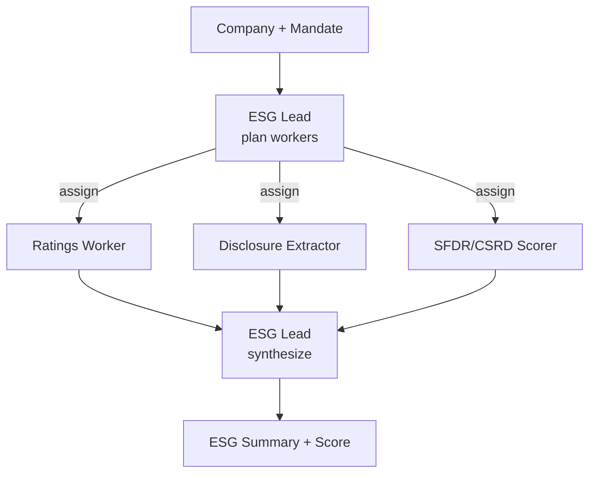

# How to Build a Multi-Agent ESG Report Analyzer in Python

ESG analysis pulls from many sources — third-party ratings, a company's own disclosures, and a
regulatory framework — and which sources matter depends on the mandate. This recipe uses the
**Orchestrator-Workers** pattern: a lead decides which workers to dispatch (ratings, disclosure
extraction, SFDR/CSRD scoring), then synthesizes their output into one sustainability summary.

**Patterns used:** [Orchestrator-Workers](../../packages/patterns/orchestration/orchestrator-workers.md)

---

## Architecture



---

## Implementation

```bash
pip install pyagent-patterns pyagent-providers
```

```python
import asyncio
from pyagent_patterns.base import Agent
from pyagent_patterns.orchestration import OrchestratorWorkers
from pyagent_providers import AnthropicLLM, OpenAILLM

fast_llm = OpenAILLM("gpt-4o-mini")
smart_llm = AnthropicLLM("claude-sonnet-4-20250514")

esg = OrchestratorWorkers(
    orchestrator=Agent(
        "esg_lead", smart_llm,
        system_prompt=(
            "You analyze a company's ESG profile for an investor mandate. Decide which workers are "
            "needed and assign each a subtask — skip any the mandate doesn't require. Respond as JSON: "
            '{"assignments": [{"worker": "name", "subtask": "..."}]}. Then synthesize a summary with '
            "an overall ESG rating (A-E), the top strength, the top controversy, and an SFDR article fit."
        ),
    ),
    workers=[
        Agent(
            "ratings", fast_llm,
            system_prompt="Summarize the company's third-party ESG ratings and any rating disagreements.",
        ),
        Agent(
            "disclosure_extractor", smart_llm,
            system_prompt="Extract the company's reported Scope 1/2/3 emissions, targets, and board-diversity data.",
        ),
        Agent(
            "sfdr_scorer", smart_llm,
            system_prompt="Score alignment with SFDR/CSRD: PAI coverage, taxonomy eligibility, and gaps.",
        ),
        Agent(
            "controversy", fast_llm,
            system_prompt="List recent ESG controversies (labor, governance, environmental) with severity.",
        ),
    ],
)

async def main():
    result = await esg.run(
        "Analyze ACME Energy for an SFDR Article 8 fund. Mandate excludes thermal coal; "
        "emphasize emissions trajectory and governance."
    )
    print(result.output)
    print(f"Workers used: {result.metadata['workers_used']}")

asyncio.run(main())
```

---

## Expected Output

```text
ESG SUMMARY — ACME Energy  (SFDR Article 8 screen)

Overall: C (improving) — credible 2030 target but high Scope 3.
Strength: board independence 80%, science-based target validated.
Controversy: 2024 spill settlement (medium); no thermal-coal exposure (passes the exclusion).
SFDR: Article 8 fit OK; PAI coverage partial — water & biodiversity metrics missing.

Workers used: ['ratings', 'disclosure_extractor', 'sfdr_scorer', 'controversy']
```

The lead skips workers the mandate doesn't need (e.g. no controversy scan for a passive index screen),
so cost tracks the depth each analysis actually requires.

---

## Customization

### Plug in live ratings/filings tools

Replace the static workers with [ReAct](../../packages/patterns/advanced/react.md) agents that pull
MSCI/Sustainalytics scores and the latest 10-K / CSRD filing — see the [SQL Analytics Assistant](../data-analytics/sql-analyst.md).

### Batch a fund's holdings

```python
async def screen_fund(companies: list[str]) -> list[str]:
    out = await asyncio.gather(*(esg.run(c) for c in companies))
    return [r.output for r in out]
```

### Stricter exclusion enforcement

```python
esg.orchestrator.system_prompt += " If any hard-excluded activity is found, output EXCLUDE and stop."
```

---

## When to Use

| Situation | Use Orchestrator-Workers? |
|-----------|---------------------------|
| Which ESG sources to use depends on the mandate | ✅ Yes |
| You want one synthesized rating from many specialists | ✅ Yes |
| Every analysis runs the same fixed stages | ❌ Use [Pipeline](../../packages/patterns/orchestration/pipeline.md) |
| Teams of analysts each have their own sub-work | ❌ Use [Hierarchical](../../packages/patterns/orchestration/hierarchical.md) |

---

## Cost Profile

| Stage | Typical model | Avg cost | Volume (2k companies/yr) |
|-------|--------------|----------|---------------------------|
| Lead (plan + synthesize) | claude-sonnet | $0.008 | $16 |
| Workers (up to 4) | mini + sonnet | $0.010 | $20 |
| **Per company** | mix | **~$0.018** | **~$36/yr** |

---

## See Also

- [Orchestrator-Workers pattern](../../packages/patterns/orchestration/orchestrator-workers.md)
- [Regulatory Compliance Checker](../legal-compliance/compliance-checker.md) — hierarchical gap analysis
- [Wealth Rebalancing Crew](wealth-rebalancing.md) — applies an ESG mandate to allocations
- [Browse all recipes](../index.md)
