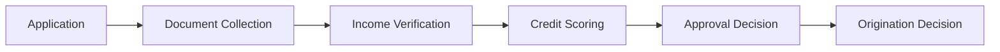

# How to Build a Multi-Agent Loan Origination Workflow in Python

Loan origination is a state machine: collect documents, verify income, pull credit, then approve —
each stage building on the last and able to reject with a reason. This recipe uses the **Topology**
pattern in a **chain** configuration, where each agent passes its findings (and the accumulating
file) forward to the next stage.

**Patterns used:** Topology (chain)

---

## Architecture



---

## Implementation

```python
import asyncio
from pyagent_patterns.base import Agent
from pyagent_patterns.structural import Topology, TopologyType
from pyagent_providers import OpenAILLM, AnthropicLLM

origination = Topology(
    agents=[
        Agent(
            "document_collection",
            OpenAILLM("gpt-4o-mini"),
            system_prompt=(
                "Stage 1 — documents. List required documents and confirm which are present. "
                "If anything mandatory is missing, mark INCOMPLETE with the reason and pass forward."
            ),
        ),
        Agent(
            "income_verification",
            OpenAILLM("gpt-4o-mini"),
            system_prompt=(
                "Stage 2 — income. Using the documents, verify stated income and compute DTI. "
                "Flag inconsistencies. Pass the verified figures and prior notes forward."
            ),
        ),
        Agent(
            "credit_scoring",
            AnthropicLLM("claude-sonnet-4-20250514"),
            system_prompt=(
                "Stage 3 — credit. From the file, summarize credit history and assign a risk tier "
                "(A-E) with the key drivers. Pass everything forward."
            ),
        ),
        Agent(
            "approval",
            AnthropicLLM("claude-sonnet-4-20250514"),
            system_prompt=(
                "Stage 4 — decision. Given documents, income, and credit tier, decide APPROVE, "
                "REFER, or DECLINE with reasons. If any earlier stage flagged INCOMPLETE, REFER."
            ),
        ),
    ],
    topology=TopologyType.CHAIN,
)

result = asyncio.run(origination.run(
    "Mortgage application: $420k loan, stated income $135k (W-2 + 2 paystubs attached), "
    "credit pulled, 12% down, no bank statements provided yet."
))
print(result.output)
print(f"Topology: {result.metadata['topology']}")
```

---

## Expected output

```text
ORIGINATION DECISION — REFER

Documents: paystubs + W-2 present; bank statements MISSING → INCOMPLETE.
Income:    $135k verified from W-2; DTI 31% (within limits).
Credit:    Tier B — clean history, one inquiry.
Decision:  REFER — strong file but missing bank statements; request and re-run stage 1.

Topology: chain
```

A chain makes the state machine explicit: each stage can reject with a reason, and the accumulating
file is what flows forward.

---

## Customization

### Add a pricing stage

```python
origination.agents.append(
    Agent("pricing", AnthropicLLM("claude-sonnet-4-20250514"),
          system_prompt="Stage 5 — price the approved loan: rate, term, and fees from the risk tier."),
)
```

### Switch to a plain pipeline

If the flow is strictly linear, a [Pipeline](../../packages/patterns/orchestration/pipeline.md) is simpler;
keep Topology when you may add star/mesh review later.

### Capture reject reasons

```python
origination.agents[-1].system_prompt += " On DECLINE, output a machine-readable reason code."
```

---

## When to Use

| Situation | Use Topology (chain)? |
|-----------|------------------------|
| A linear state machine where each stage gates the next | ✅ Yes — chain |
| Reviewers must reconcile views, not just pass forward | ❌ Use `TopologyType.MESH` ([Peer-Review Mesh](../scientific/peer-review.md)) |
| The committee debates a single decision | ❌ Use [Debate](../../packages/patterns/resolution/debate.md) |

> A plain [Pipeline](../../packages/patterns/orchestration/pipeline.md) also chains stages; reach
> for Topology when you may later switch the same agents to a star or mesh structure.

---

## Cost Profile

| Stage | Typical model | Avg cost | Volume (1k apps/day) |
|-------|--------------|----------|-----------------------|
| Docs + income | gpt-4o-mini | $0.0006 | $18/mo |
| Credit + approval | claude-sonnet | $0.008 | $240/mo |
| **Per application** | mix | **~$0.009** | **~$270/mo** |

---

## See Also

- [Topology pattern](../../packages/patterns/structural/topology.md)
- [Loan Underwriting Committee](loan-underwriting.md) — the debate that follows a clean file
- [Fraud Investigation Assistant](../security/fraud-investigation.md) — tool-using investigation
- [Browse all recipes](../index.md)
