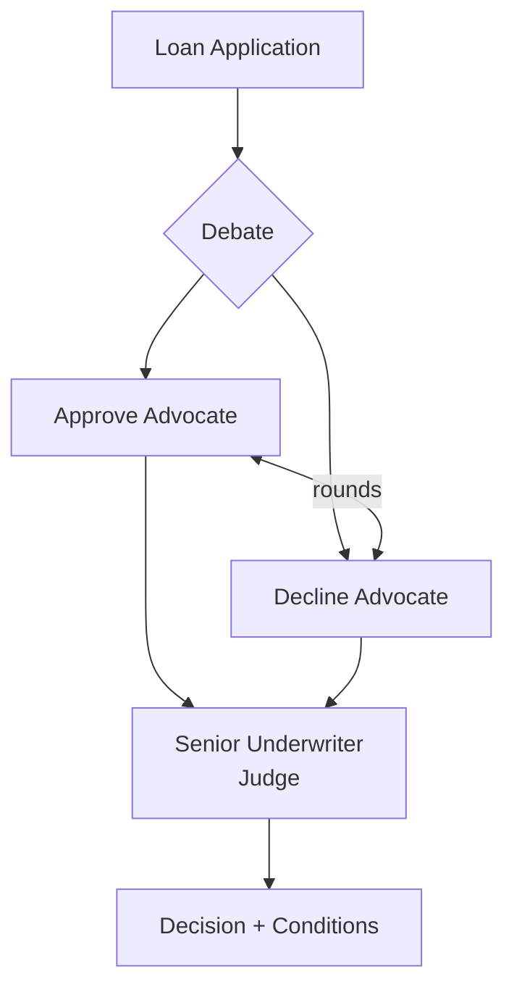

# How to Build a Multi-Agent Loan Underwriting Committee in Python

Good credit decisions surface both the case *for* and *against* an application before a senior
decides. This recipe uses the **Debate** pattern: an approve-advocate and a decline-advocate argue
the loan with specific evidence, and a senior-underwriter judge weighs the exchange into a decision
with conditions — an auditable alternative to a single opaque score.

**Patterns used:** Debate

---

## Architecture



---

## Implementation

```python
import asyncio
from pyagent_patterns.base import Agent
from pyagent_patterns.resolution import Debate
from pyagent_providers import AnthropicLLM, GeminiLLM

committee = Debate(
    debaters=[
        Agent(
            "approve_advocate",
            GeminiLLM("gemini-2.5-pro"),
            system_prompt=(
                "Argue to APPROVE this loan. Cite debt-to-income, credit history, collateral, and "
                "stable income. Pre-empt the decline case with mitigants and proposed conditions."
            ),
        ),
        Agent(
            "decline_advocate",
            GeminiLLM("gemini-2.5-pro"),
            system_prompt=(
                "Argue to DECLINE this loan. Focus on repayment risk, thin file, concentration, and "
                "downside scenarios. Rebut the approve case with specific counter-evidence."
            ),
        ),
    ],
    judge=Agent(
        "senior_underwriter",
        AnthropicLLM("claude-sonnet-4-20250514"),
        system_prompt=(
            "You are the senior underwriter. Weigh both arguments and decide: APPROVE, "
            "APPROVE WITH CONDITIONS, or DECLINE. State the key reasons and any conditions "
            "(rate, term, collateral, covenants). Be explicit about the deciding factor."
        ),
    ),
    rounds=2,
)

result = asyncio.run(committee.run(
    "Application: $250k 7-year business loan. DTI 38%, credit score 690, 2 years trading, "
    "revenue $480k (growing), $90k equipment as collateral, one prior late payment."
))
print(result.output)
print(f"Rounds: {result.metadata['rounds']}")
```

---

## Expected output

```text
DECISION — APPROVE WITH CONDITIONS

Deciding factor: collateral + revenue growth offset the thin file and one late payment.
Conditions: rate +1.5% risk premium, personal guarantee, quarterly financials covenant,
            cap utilization until 12 clean months.
Approve case: serviceable DTI, growing revenue, secured.
Decline case: short trading history, single collateral asset.

Rounds: 2
```

The transcript of both advocates and the judge's reasoning is your audit trail for regulators.

---

## Customization

### Add a third advocate

```python
committee.debaters.append(
    Agent("policy_advocate", GeminiLLM("gemini-2.5-pro"),
          system_prompt="Argue from lending-policy and regulatory limits (LTV, DTI caps)."),
)
```

### Tune the debate depth

```python
committee = Debate(debaters=committee._debaters, judge=committee._judge, rounds=3)
```

### Structured decision

```python
committee.judge.system_prompt += " Output as JSON: {decision, rate, conditions[], deciding_factor}."
```

---

## When to Use

| Situation | Use Debate? |
|-----------|-------------|
| A decision benefits from explicit for/against argument | ✅ Yes |
| You need an auditable rationale, not just a score | ✅ Yes |
| Independent graders should vote a label | ❌ Use [Voting](../../packages/patterns/resolution/voting.md) |
| A document moves through fixed processing steps | ❌ Use [Loan Origination Workflow](loan-origination.md) |

---

## Cost Profile

| Driver | Typical model | Avg cost | Volume (1k apps/mo) |
|--------|--------------|----------|----------------------|
| 2 debaters × 2 rounds | gemini-pro | $0.012 | $360/mo |
| Judge | claude-sonnet | $0.006 | $180/mo |
| **Per application** | mix | **~$0.018** | **~$540/mo** |

---

## See Also

- [Debate pattern](../../packages/patterns/resolution/debate.md)
- [Loan Origination Workflow](loan-origination.md) — the document pipeline that precedes underwriting
- [Browse all recipes](../index.md)
