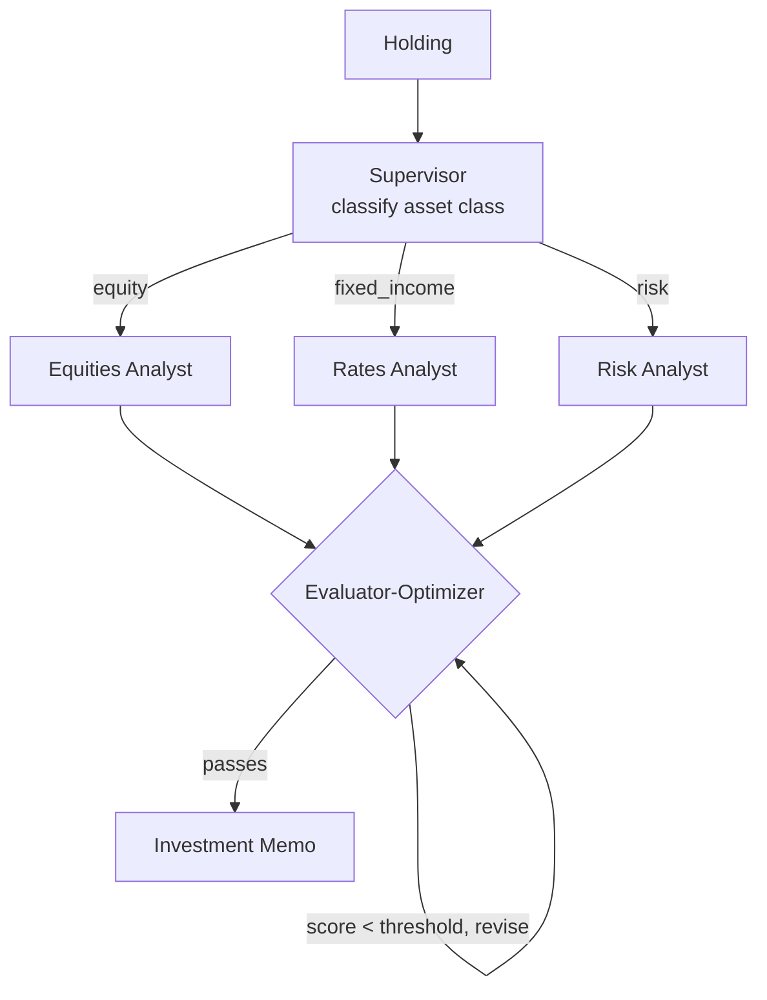

# How to Build a Multi-Agent Portfolio Review Workflow in Python

A good portfolio memo routes each holding to the right specialist *and* doesn't ship until it's
actually rigorous. This recipe uses a **Supervisor** to send each position to an equities,
fixed-income, or risk analyst, then an **Evaluator-Optimizer** loop that scores the memo against
explicit criteria and revises it until it clears the bar.

**Patterns used:** [Supervisor](../../packages/patterns/orchestration/supervisor.md) ·
[Evaluator-Optimizer](../../packages/patterns/resolution/evaluator-optimizer.md)

---

## Requirements

- **Functional** — route each holding to the analyst best suited to its asset class; produce a memo
  that clears an explicit quality bar before it ships.
- **Non-functional** — cost stays low enough to review a whole book monthly (see Cost Profile below);
  most memos converge in ≤2 optimization rounds.
- **Audit** — the memo's rationale, downside, and sizing must be explicit, not implicit — the
  quality gate exists specifically to force this.
- **Not required** — no cross-holding negotiation, no persistent memory between reviews, no
  human approval gate (this recipe assumes analyst output, not a trade order).

## Architecture decisions

| Decision | Why | Why not the alternative |
|---|---|---|
| **Supervisor** for routing | Holdings fall into distinct, known categories (equity / fixed income / risk), and each specialist is meaningfully better than a generalist at its category. | **Orchestrator-Workers** is for when subtasks aren't known upfront — asset class *is* known upfront here, so the dynamic-planning overhead buys nothing. |
| **Evaluator-Optimizer** for the memo | The quality bar is explicit and scorable (recommendation, rationale, downside, sizing) — exactly the "measurable criteria, worth iterating" case. | **Self-Reflection** would work but loses the independent-scoring signal; **Cross-Reflection** adds a second full analyst pass for feedback that's qualitative, not needed when the criteria are already checklist-shaped. |
| **Two workflows, not one pattern** | `route` and `tighten` are declared as separate named workflows in one blueprint. There's no `supervisor_plus_evaluator_optimizer` pattern — PyAgent composes patterns by wiring multiple named workflows in one file, not by nesting patterns inside each other. | A single fused pattern would need a new class in `pyagent_patterns` just for this composition; two workflows reuse existing patterns and let each stage be tested independently. |

## Four-pillar mapping

| Requirement | Pillar | Capability |
|---|---|---|
| Route by asset class | Execution | `Supervisor` pattern |
| Score against explicit criteria | Execution | `EvaluatorOptimizer` pattern |
| Track daily spend | Observability | `observability.cost_budget` |
| Trace each classify/analyze/score call | Observability | `observability.tracing` |
| Version the workflow as it evolves | Blueprint | `pyagent-blueprint diff` between revisions |

## Blueprint (declarative form)

The same system declared as a `pyagent-blueprint` manifest — this is the real, verified file at
`examples/cookbook/finance-trading/portfolio_review/blueprint.yaml`, compiled and run against
`PyAgentAdapter` with `MockLLM` as part of this repo's test suite, not a hand-typed illustration:

```yaml
api_version: pyagent/v1
metadata:
  name: portfolio-review
  version: 1.0.0
  description: Supervisor routes holding to specialist; evaluator-optimizer tightens memo

providers:
  fast:  { model: claude-haiku-3-5-20241022 }
  smart: { model: claude-sonnet-4-20250514 }

agents:
  router:   { provider: fast,  prompt: "Classify as equity, fixed_income, or risk." }
  equities: { provider: smart, prompt: "Analyze equity: thesis, valuation, catalysts, risks." }
  rates:    { provider: smart, prompt: "Analyze bond: duration, credit quality, rate sensitivity." }
  risk:     { provider: smart, prompt: "Assess concentration, correlation, tail scenarios." }
  writer:   { provider: smart, prompt: "Write investment memo: recommendation, rationale, risks." }
  reviewer: { provider: smart, prompt: "Score memo 1-10 against criteria. Demand fixes if below bar." }

workflows:
  route:
    pattern: supervisor
    agents:
      classifier: router
      routes: { equity: equities, fixed_income: rates, risk: risk }
    config:
      default_route: risk
  tighten:
    pattern: evaluator_optimizer
    agents:
      generator: writer
      evaluator: reviewer
    config:
      criteria: ["clear recommendation", "evidence-backed rationale", "explicit downside", "position sizing"]
      pass_threshold: 8
      max_rounds: 3

observability:
  tracing: { enabled: true }
  cost_budget: { daily_usd: 100.0, alert_threshold: 0.8 }
```

```bash
pyagent-blueprint validate portfolio-review.yaml
pyagent-blueprint test portfolio-review.yaml
```

## Production checklist

Ran this exact blueprint through `PyAgentAdapter.compile()` and inspected the real diagnostics
rather than assuming what's enforced:

- ✅ **Routing and scoring run as declared** — `route` and `tighten` compile and execute against the
  native pattern registry with no diagnostics.
- ⚠️ **`observability.cost_budget` is declared but not auto-enforced** — compiling this blueprint
  emits `BUDGET_UNSUPPORTED`: the $100/day budget is recorded in the spec but nothing stops a run
  from exceeding it. Wire real enforcement via `graph.wire_cost_tracker(tracker)` if you need a hard
  stop, not just a declared intent.
- **No recovery policy is declared** on either workflow — if you add one (retries, timeout,
  fallback provider), know that it's `RECOVERY_UNSUPPORTED` by the same adapter until you wire it
  manually; this blueprint simply doesn't declare one, so that diagnostic doesn't fire here.
- **No human approval gate** — this composes cleanly with
  [Human-in-the-Loop](../../packages/patterns/advanced/human-in-the-loop.md) as a third workflow if
  a memo needs sign-off before it reaches a client, e.g. for `daily_usd` above a threshold.

---

## Architecture



---

## Implementation

```bash
pip install pyagent-patterns pyagent-providers
```

```python
import asyncio
from pyagent_patterns.base import Agent
from pyagent_patterns.orchestration import Supervisor
from pyagent_patterns.resolution import EvaluatorOptimizer
from pyagent_providers import AnthropicLLM

fast_llm = AnthropicLLM("claude-haiku-3-5-20241022")
smart_llm = AnthropicLLM("claude-sonnet-4-20250514")

# ── Supervisor routes each holding to the right specialist analyst ──────────────
desk = Supervisor(
    classifier=Agent(
        "router", fast_llm,
        system_prompt="Classify the holding as exactly one of: equity, fixed_income, risk. Reply with only the label.",
    ),
    routes={
        "equity": Agent("equities", smart_llm,
                        system_prompt="Analyze the equity position: thesis, valuation multiples, key catalysts and risks."),
        "fixed_income": Agent("rates", smart_llm,
                              system_prompt="Analyze the bond position: duration, credit quality, and rate sensitivity."),
        "risk": Agent("risk", smart_llm,
                      system_prompt="Assess portfolio-level risk: concentration, correlation, and tail scenarios."),
    },
    default_route="risk",
)

# ── Evaluator-Optimizer tightens the memo against explicit criteria ─────────────
memo = EvaluatorOptimizer(
    generator=Agent("writer", smart_llm,
                    system_prompt="Write a concise investment memo from the analysis: recommendation, rationale, risks."),
    evaluator=Agent("reviewer", smart_llm,
                    system_prompt="Score the memo 1-10 against the criteria. Demand specific fixes for any criterion below bar."),
    criteria=["clear recommendation", "evidence-backed rationale", "explicit downside", "position sizing"],
    pass_threshold=8,
    max_rounds=3,
)

async def main():
    analysis = await desk.run("AAPL — 12% of the book, up 30% YTD, trading at 30x forward earnings")
    result = await memo.run(analysis.output)
    print(result.output)
    print(f"Converged in {result.metadata['rounds']} rounds, final score {result.metadata['final_score']}")

asyncio.run(main())
```

---

## Expected Output

```text
INVESTMENT MEMO — AAPL

Recommendation: TRIM to 8% of book.
Rationale: strong franchise and cash generation, but 30x forward earnings prices in a lot; the 12%
weight is now a concentration risk after the 30% run.
Downside: multiple compression to 24x → ~20% drawdown on the position.
Sizing: trim 4 points; redeploy into the underweight fixed-income sleeve.

Converged in 2 rounds, final score 9
```

The Evaluator-Optimizer is what forces "explicit downside" and "position sizing" to actually appear —
the criteria the first draft skipped and the loop demanded.

---

## Customization

### Tune the bar and criteria

```python
memo.pass_threshold = 9                      # stricter for IC-ready memos
memo.criteria.append("comparison vs benchmark")
```

### Review the whole book

```python
async def review_book(holdings: list[str]) -> list[str]:
    out = []
    for h in holdings:
        analysis = await desk.run(h)
        out.append((await memo.run(analysis.output)).output)
    return out
```

### Add a data-gathering analyst

Give the analysts live numbers by routing through a [ReAct](../../packages/patterns/advanced/react.md)
agent that queries market data — see the [SQL Analytics Assistant](../data-analytics/sql-analyst.md).

---

## When to Use

| Situation | Fit |
|-----------|-----|
| Route each item to one specialist | ✅ Supervisor |
| Output must iterate to an explicit quality bar | ✅ Evaluator-Optimizer |
| Two analysts should argue bull vs bear | ❌ Use [Debate](../../packages/patterns/resolution/debate.md) ([Loan Underwriting](loan-underwriting.md)) |
| One agent critiques its own draft | ❌ Use [Self-Reflection](../../packages/patterns/resolution/self-reflection.md) |

---

## Cost Profile

| Stage | Typical model | Avg cost | Volume (1k holdings/mo) |
|-------|--------------|----------|--------------------------|
| Classifier | claude-haiku | $0.0005 | $0.50 |
| Analyst | claude-sonnet | $0.005 | $5 |
| Memo (≤3 optimize rounds) | claude-sonnet | $0.012 | $12 |
| **Per holding** | mix | **~$0.0175** | **~$17.5/mo** |

`pass_threshold` and `max_rounds` trade memo quality against cost — most memos clear the bar in two rounds.

---

## See Also

- [Supervisor pattern](../../packages/patterns/orchestration/supervisor.md) ·
  [Evaluator-Optimizer pattern](../../packages/patterns/resolution/evaluator-optimizer.md)
- [Loan Underwriting Committee](loan-underwriting.md) — a debating credit panel
- [SQL Analytics Assistant](../data-analytics/sql-analyst.md) — tool-using analyst
- [Browse all recipes](../index.md)
