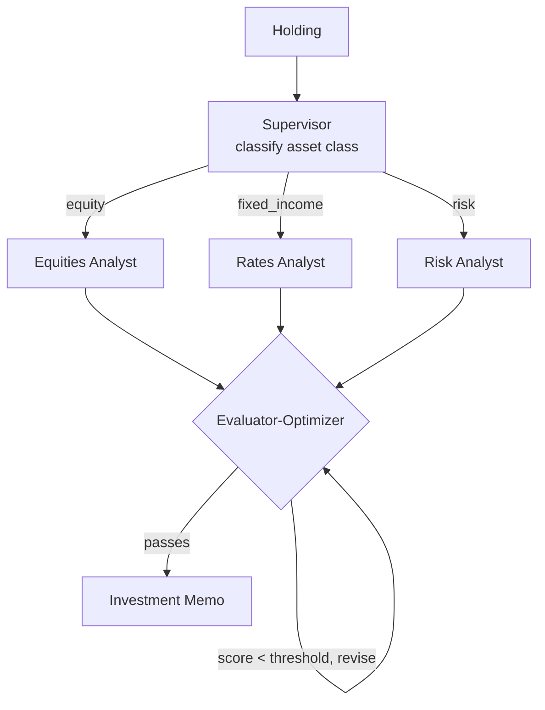

# How to Build a Multi-Agent Portfolio Review Workflow in Python

A good portfolio memo routes each holding to the right specialist *and* doesn't ship until it's
actually rigorous. This recipe uses a **Supervisor** to send each position to an equities,
fixed-income, or risk analyst, then an **Evaluator-Optimizer** loop that scores the memo against
explicit criteria and revises it until it clears the bar.

**Patterns used:** [Supervisor](../../packages/patterns/orchestration/supervisor.md) ·
[Evaluator-Optimizer](../../packages/patterns/resolution/evaluator-optimizer.md)

---

## Architecture



---

## Implementation

```bash
pip install pyagent-patterns pyagent-providers
```

```python
import asyncio
from pyagent_patterns.base import Agent
from pyagent_patterns.orchestration import Supervisor
from pyagent_patterns.resolution import EvaluatorOptimizer
from pyagent_providers import AnthropicLLM

fast_llm = AnthropicLLM("claude-haiku-3-5-20241022")
smart_llm = AnthropicLLM("claude-sonnet-4-20250514")

# ── Supervisor routes each holding to the right specialist analyst ──────────────
desk = Supervisor(
    classifier=Agent(
        "router", fast_llm,
        system_prompt="Classify the holding as exactly one of: equity, fixed_income, risk. Reply with only the label.",
    ),
    routes={
        "equity": Agent("equities", smart_llm,
                        system_prompt="Analyze the equity position: thesis, valuation multiples, key catalysts and risks."),
        "fixed_income": Agent("rates", smart_llm,
                              system_prompt="Analyze the bond position: duration, credit quality, and rate sensitivity."),
        "risk": Agent("risk", smart_llm,
                      system_prompt="Assess portfolio-level risk: concentration, correlation, and tail scenarios."),
    },
    default_route="risk",
)

# ── Evaluator-Optimizer tightens the memo against explicit criteria ─────────────
memo = EvaluatorOptimizer(
    generator=Agent("writer", smart_llm,
                    system_prompt="Write a concise investment memo from the analysis: recommendation, rationale, risks."),
    evaluator=Agent("reviewer", smart_llm,
                    system_prompt="Score the memo 1-10 against the criteria. Demand specific fixes for any criterion below bar."),
    criteria=["clear recommendation", "evidence-backed rationale", "explicit downside", "position sizing"],
    pass_threshold=8,
    max_rounds=3,
)

async def main():
    analysis = await desk.run("AAPL — 12% of the book, up 30% YTD, trading at 30x forward earnings")
    result = await memo.run(analysis.output)
    print(result.output)
    print(f"Converged in {result.metadata['rounds']} rounds, final score {result.metadata['final_score']}")

asyncio.run(main())
```

---

## Expected Output

```text
INVESTMENT MEMO — AAPL

Recommendation: TRIM to 8% of book.
Rationale: strong franchise and cash generation, but 30x forward earnings prices in a lot; the 12%
weight is now a concentration risk after the 30% run.
Downside: multiple compression to 24x → ~20% drawdown on the position.
Sizing: trim 4 points; redeploy into the underweight fixed-income sleeve.

Converged in 2 rounds, final score 9
```

The Evaluator-Optimizer is what forces "explicit downside" and "position sizing" to actually appear —
the criteria the first draft skipped and the loop demanded.

---

## Customization

### Tune the bar and criteria

```python
memo.pass_threshold = 9                      # stricter for IC-ready memos
memo.criteria.append("comparison vs benchmark")
```

### Review the whole book

```python
async def review_book(holdings: list[str]) -> list[str]:
    out = []
    for h in holdings:
        analysis = await desk.run(h)
        out.append((await memo.run(analysis.output)).output)
    return out
```

### Add a data-gathering analyst

Give the analysts live numbers by routing through a [ReAct](../../packages/patterns/advanced/react.md)
agent that queries market data — see the [SQL Analytics Assistant](../data-analytics/sql-analyst.md).

---

## When to Use

| Situation | Fit |
|-----------|-----|
| Route each item to one specialist | ✅ Supervisor |
| Output must iterate to an explicit quality bar | ✅ Evaluator-Optimizer |
| Two analysts should argue bull vs bear | ❌ Use [Debate](../../packages/patterns/resolution/debate.md) ([Loan Underwriting](loan-underwriting.md)) |
| One agent critiques its own draft | ❌ Use [Self-Reflection](../../packages/patterns/resolution/self-reflection.md) |

---

## Cost Profile

| Stage | Typical model | Avg cost | Volume (1k holdings/mo) |
|-------|--------------|----------|--------------------------|
| Classifier | claude-haiku | $0.0005 | $0.50 |
| Analyst | claude-sonnet | $0.005 | $5 |
| Memo (≤3 optimize rounds) | claude-sonnet | $0.012 | $12 |
| **Per holding** | mix | **~$0.0175** | **~$17.5/mo** |

`pass_threshold` and `max_rounds` trade memo quality against cost — most memos clear the bar in two rounds.

---

## See Also

- [Supervisor pattern](../../packages/patterns/orchestration/supervisor.md) ·
  [Evaluator-Optimizer pattern](../../packages/patterns/resolution/evaluator-optimizer.md)
- [Loan Underwriting Committee](loan-underwriting.md) — a debating credit panel
- [SQL Analytics Assistant](../data-analytics/sql-analyst.md) — tool-using analyst
- [Browse all recipes](../index.md)
