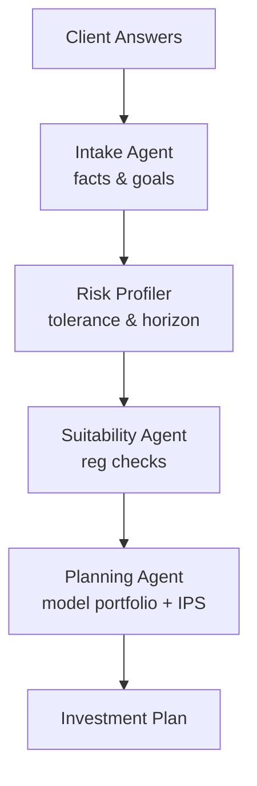

# How to Build a Multi-Agent Robo-Advisor Onboarding Flow in Python

A robo-advisor onboarding conversation has distinct phases: gather facts, profile risk, check
suitability, then build a plan. This recipe uses **Role-Based** conversation — each specialist
agent takes a turn, and the next agent sees the full exchange so context accumulates naturally.

**Patterns used:** [Role-Based](../../packages/patterns/structural/role-based.md)

---

## Architecture



---

## Implementation

```bash
pip install pyagent-patterns pyagent-providers
```

```python
import asyncio
from pyagent_patterns.base import Agent
from pyagent_patterns.structural import RoleBased
from pyagent_providers import AnthropicLLM, OpenAILLM

fast_llm = OpenAILLM("gpt-4o-mini")
smart_llm = AnthropicLLM("claude-sonnet-4-20250514")

onboarding = RoleBased(
    agents=[
        Agent(
            "intake", fast_llm,
            system_prompt=(
                "You are the intake specialist. Extract from the client's answers: "
                "age, employment status, annual income, investable assets, primary goal "
                "(retirement / growth / income / preservation), and target timeline. "
                "Summarize clearly for the next agent."
            ),
        ),
        Agent(
            "risk_profiler", smart_llm,
            system_prompt=(
                "You are the risk-profiling specialist. Using the intake summary, assign: "
                "risk tolerance (Conservative / Moderate / Aggressive), max drawdown comfort (%), "
                "and time horizon (years). Explain the classification in two sentences."
            ),
        ),
        Agent(
            "suitability", fast_llm,
            system_prompt=(
                "You are the suitability analyst. Check the risk profile against regulatory "
                "suitability rules: is the proposed risk level appropriate for the client's age, "
                "income, and liquidity needs? Flag any concerns; otherwise confirm SUITABLE."
            ),
        ),
        Agent(
            "planner", smart_llm,
            system_prompt=(
                "You are the portfolio planner. Based on the profile and suitability check, "
                "output: (1) a model allocation (asset classes + target %) that matches the risk "
                "tier, (2) a one-paragraph Investment Policy Statement (IPS), and "
                "(3) three recommended next steps for the client."
            ),
        ),
    ],
    rounds=1,
)

CLIENT_ANSWERS = """
I'm 34 years old, software engineer earning $145k/year. I have $280k to invest
and want to retire comfortably at 60. I can tolerate some volatility — I lost money
in 2022 and stayed invested. I won't need this money for at least 10 years.
"""

async def main():
    result = await onboarding.run(CLIENT_ANSWERS)
    print(result.output)
    print(f"\nRoles: {result.metadata['agent_names']}, rounds: {result.metadata['rounds']}")

asyncio.run(main())
```

---

## Expected Output

```text
ONBOARDING PLAN

Intake:    Age 34, SE $145k, $280k investable, goal: retirement at 60, horizon 26 years.
Risk:      Aggressive — 26-year horizon, high income, stayed invested through drawdown.
           Max drawdown comfort: ~30%.
Suitability: SUITABLE — aggressive profile appropriate for age, income stability, and horizon.
Portfolio:
  Global Equity ETF      55%
  US Small/Mid-Cap       15%
  International Dev      15%
  Emerging Markets        5%
  Aggregate Bond ETF     10%

IPS: The portfolio targets long-term capital growth with a 55/45 equity tilt favoring broad
global exposure. Rebalance annually or when any asset class drifts >5% from target. Review
risk tolerance at age 50 and shift toward 60/40 conservative as retirement approaches.

Next steps: (1) Open a tax-advantaged account (max 401k + IRA). (2) Set up automatic monthly
contributions. (3) Schedule an annual review each January.

Roles: ['intake', 'risk_profiler', 'suitability', 'planner'], rounds: 1
```

Because each agent sees the full conversation history, the planner has all context — intake facts,
risk classification, and suitability sign-off — without any manual data passing.

---

## Customization

### Add a tax-efficiency specialist

```python
from pyagent_patterns.base import Agent
onboarding.agents.insert(3,
    Agent("tax_advisor", fast_llm,
          system_prompt="Recommend the most tax-efficient account wrappers for the client's situation."),
)
```

### Run a second round for clarification

```python
onboarding = RoleBased(agents=[...], rounds=2)
```

A second round lets the risk profiler revisit the intake after the suitability agent raises a concern.

### Pipe into the rebalancing crew

Feed the IPS from the planner directly into the [Wealth Rebalancing Crew](wealth-rebalancing.md)
pipeline as the client mandate.

---

## When to Use

| Situation | Use Role-Based? |
|-----------|----------------|
| Distinct phases with specialist handoff | ✅ Yes |
| Each agent needs the full prior context | ✅ Yes |
| Agents should run in parallel | ❌ Use [Fan-Out / Fan-In](../../packages/patterns/orchestration/fan-out-fan-in.md) |
| A fixed data-enrichment chain, not a conversation | ❌ Use [Pipeline](../../packages/patterns/orchestration/pipeline.md) |

---

## Cost Profile

| Role | Typical model | Avg cost | Volume (10k onboardings/mo) |
|------|--------------|----------|------------------------------|
| Intake + suitability | gpt-4o-mini | $0.0008 | $8 |
| Risk profiler + planner | claude-sonnet | $0.009 | $90 |
| **Per onboarding** | mix | **~$0.010** | **~$98/mo** |

---

## See Also

- [Role-Based pattern](../../packages/patterns/structural/role-based.md)
- [Wealth Rebalancing Crew](wealth-rebalancing.md) — pipeline that runs after onboarding
- [Loan Origination Workflow](loan-origination.md) — topology-based financial workflow
- [Browse all recipes](../index.md)
