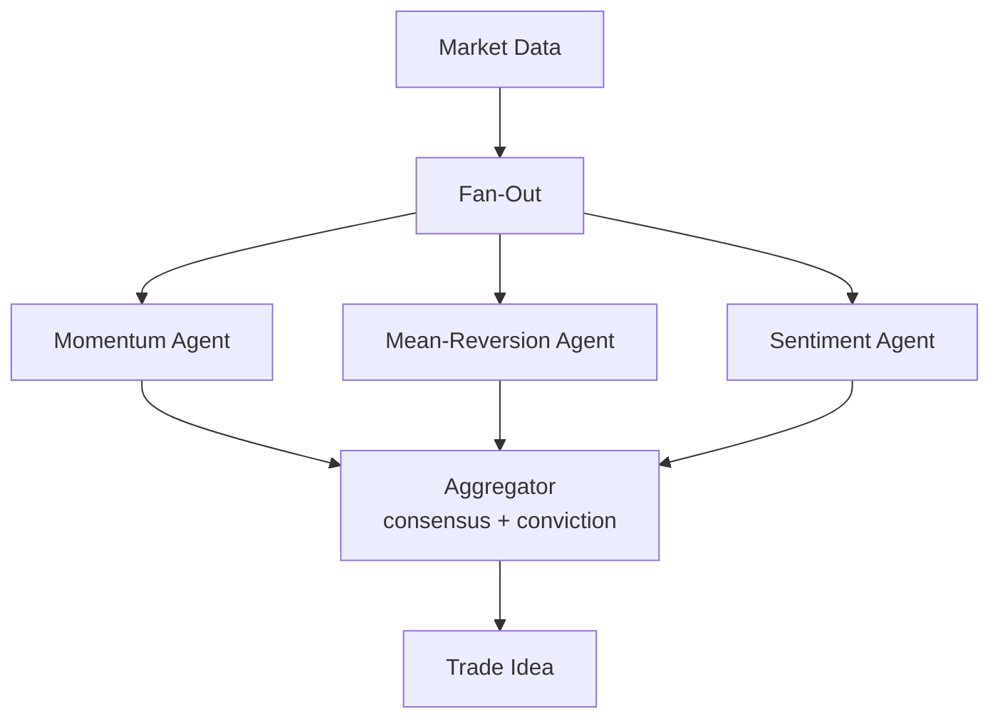

# How to Build a Multi-Agent Trading Signal Desk in Python

Three quant analysts looking at the same market data from different angles — momentum, mean-reversion,
and sentiment — will each reach a different conclusion. This recipe uses **Fan-Out / Fan-In** to run
all three strategy agents in parallel, then an aggregator synthesizes a consensus trade idea with a
conviction score.

**Patterns used:** [Fan-Out / Fan-In](../../packages/patterns/orchestration/fan-out-fan-in.md)

---

## Architecture



---

## Implementation

```bash
pip install pyagent-patterns pyagent-providers
```

```python
import asyncio
from pyagent_patterns.base import Agent
from pyagent_patterns.orchestration import FanOutFanIn
from pyagent_providers import AnthropicLLM, OpenAILLM, GeminiLLM

smart_llm = AnthropicLLM("claude-sonnet-4-20250514")
fast_llm  = OpenAILLM("gpt-4o-mini")

signal_desk = FanOutFanIn(
    agents=[
        Agent(
            "momentum", fast_llm,
            system_prompt=(
                "You are a momentum strategist. Analyze the market data for trend strength: "
                "price vs 20/50/200-day MAs, RSI, volume trend. "
                "Output: signal (BUY/SELL/NEUTRAL), strength (1-5), key reason."
            ),
        ),
        Agent(
            "mean_reversion", fast_llm,
            system_prompt=(
                "You are a mean-reversion strategist. Look for overextension: z-score vs 90-day mean, "
                "Bollinger Band position, RSI extremes. "
                "Output: signal (BUY/SELL/NEUTRAL), strength (1-5), key reason."
            ),
        ),
        Agent(
            "sentiment", GeminiLLM("gemini-2.5-flash"),
            system_prompt=(
                "You are a sentiment strategist. Assess market mood from news/options data: "
                "put/call ratio, VIX level, news tone, analyst revision trend. "
                "Output: signal (BUY/SELL/NEUTRAL), strength (1-5), key reason."
            ),
        ),
    ],
    aggregator=Agent(
        "signal_aggregator", smart_llm,
        system_prompt=(
            "You receive signals from three strategy agents. Weight them equally unless they conflict. "
            "Output a consensus trade idea: direction (LONG/SHORT/FLAT), conviction (1-10), "
            "entry rationale, key risk to the thesis, and suggested position size (% of book)."
        ),
    ),
)

MARKET_DATA = """
Ticker: ACME Corp (ACM)
Price: $142.50  |  1-week change: +8.3%
MA20: $135  MA50: $128  MA200: $115  (price above all MAs)
RSI(14): 71  |  Bollinger: price at upper band
Volume: 2× average over 5 days
Put/Call ratio: 0.55 (bullish skew)  |  VIX: 18 (calm)
News: beat Q2 earnings by 12%; analyst upgrades ×3 this week
"""

async def main():
    result = await signal_desk.run(MARKET_DATA)
    print(result.output)
    print(f"\nAgents: {result.metadata['agent_names']}")

asyncio.run(main())
```

---

## Expected Output

```text
TRADE IDEA — ACM

Consensus:  LONG  |  Conviction: 7/10
Entry:      Momentum BUY (strong, 4/5) + Sentiment BUY (strong, 5/5) outweigh
            Mean-Reversion NEUTRAL (RSI 71 near overbought, 2/5).
Rationale:  Post-earnings trend continuation; institutional accumulation (volume ×2);
            bullish options skew confirms directional bias.
Risk:       RSI elevated — gap-fill pullback to $136 if broader market weakens.
Size:       1.5% of book (above-average conviction, elevated RSI limits size).

Agents: ['momentum', 'mean_reversion', 'sentiment']
```

Conflicting signals are preserved in the aggregator's reasoning rather than silently averaged,
so a risk manager can see exactly why conviction is not 10/10.

---

## Customization

### Add a macro agent

```python
signal_desk.agents.append(
    Agent("macro", fast_llm,
          system_prompt="Assess macro backdrop: rates, USD, commodity prices. Signal + strength + reason."),
)
```

### Weight the signals

```python
signal_desk.aggregator.system_prompt = signal_desk.aggregator.system_prompt.replace(
    "Weight them equally",
    "Weight momentum 40%, mean-reversion 30%, sentiment 30%",
)
```

### Screen a universe in parallel

```python
tickers = ["ACM", "XYZ", "ABC"]
results = await asyncio.gather(*(signal_desk.run(market_data[t]) for t in tickers))
for t, r in zip(tickers, results):
    print(t, r.output[:80])
```

---

## When to Use

| Situation | Use Fan-Out / Fan-In? |
|-----------|----------------------|
| Multiple independent analysts on the same data | ✅ Yes |
| You want parallel execution + one synthesis | ✅ Yes |
| Agents must share context between steps | ❌ Use [Pipeline](../../packages/patterns/orchestration/pipeline.md) |
| Agents should debate until agreement | ❌ Use [Debate](../../packages/patterns/resolution/debate.md) |

---

## Cost Profile

| Stage | Typical model | Avg cost | Volume (500 screens/day) |
|-------|--------------|----------|--------------------------|
| Momentum + mean-reversion | gpt-4o-mini | $0.0008 | $0.40 |
| Sentiment | gemini-2.5-flash | $0.0006 | $0.30 |
| Aggregator | claude-sonnet | $0.005 | $2.50 |
| **Per screen** | mix | **~$0.006** | **~$3.20/day** |

---

## See Also

- [Fan-Out / Fan-In pattern](../../packages/patterns/orchestration/fan-out-fan-in.md)
- [Portfolio Review](portfolio-review.md) — specialist analysts + evaluator-optimizer
- [Earnings Call Analyzer](earnings-call.md) — self-reflection on a single earnings transcript
- [Browse all recipes](../index.md)
