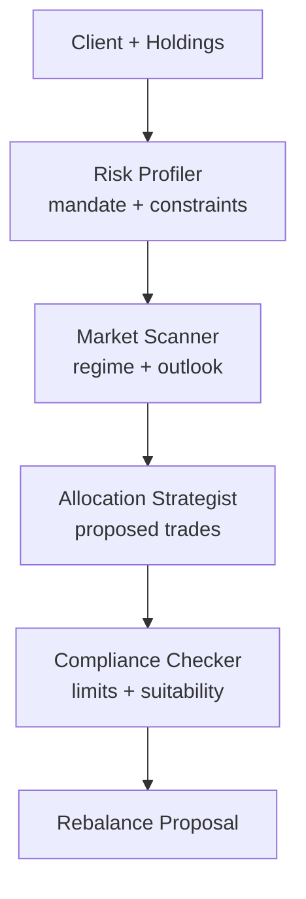

# How to Build a Multi-Agent Wealth Rebalancing Crew in Python

Rebalancing a client's portfolio is a sequence: read the risk profile, scan the market, propose a new
allocation, then check it against compliance limits. This recipe uses the **Pipeline** pattern so each
stage builds on the previous one — a risk profiler frames the mandate, a market scanner adds context,
an allocation strategist proposes trades, and a compliance checker vetoes anything out of policy.

**Patterns used:** [Pipeline](../../packages/patterns/orchestration/pipeline.md)

---

## Architecture



---

## Implementation

```bash
pip install pyagent-patterns pyagent-providers
```

```python
import asyncio
from pyagent_patterns.base import Agent
from pyagent_patterns.orchestration import Pipeline
from pyagent_providers import AnthropicLLM, OpenAILLM

fast_llm = OpenAILLM("gpt-4o-mini")
smart_llm = AnthropicLLM("claude-sonnet-4-20250514")

rebalance = Pipeline(stages=[
    Agent(
        "risk_profiler", fast_llm,
        system_prompt=(
            "Summarize the client mandate from the input: risk tolerance, time horizon, liquidity "
            "needs, and any hard constraints (no tobacco, ESG-only, max single-name 5%). Be explicit."
        ),
    ),
    Agent(
        "market_scanner", smart_llm,
        system_prompt=(
            "Given the mandate, add a brief market view: regime (risk-on/off), rates outlook, and "
            "which asset classes look rich vs cheap. Two sentences each."
        ),
    ),
    Agent(
        "allocation_strategist", smart_llm,
        system_prompt=(
            "Propose a target allocation and the specific buy/sell trades to get there from the "
            "current holdings. Respect the mandate constraints and explain each move in one line."
        ),
    ),
    Agent(
        "compliance_checker", fast_llm,
        system_prompt=(
            "Check the proposed trades against the constraints and suitability. VETO any trade that "
            "breaches a limit (with the reason); otherwise mark APPROVED and produce the final ticket list."
        ),
    ),
])

CLIENT = (
    "Client: 58, retiring in 7 years, moderate risk, needs 3% annual income, ESG-only, max 5% single name. "
    "Holdings: 70% global equity ETF, 20% individual tech (NVDA 8%, AAPL 7%), 10% cash."
)

async def main():
    result = await rebalance.run(CLIENT)
    print(result.output)
    print(f"Stages: {result.metadata['stage_names']}")

asyncio.run(main())
```

---

## Expected Output

```text
REBALANCE PROPOSAL — moderate / 7-yr horizon / ESG-only

Mandate:  moderate risk, 3% income need, ESG screen, 5% single-name cap.
Market:   risk-neutral; rates near peak → add duration; equities fairly valued.
Trades:   TRIM NVDA 8%→5% and AAPL 7%→5% (single-name cap); ADD 12% ESG aggregate bond ETF
          (income + duration); keep 5% cash buffer.
Compliance: APPROVED — all positions ≤ 5%; ESG screen satisfied; income target met (~3.1%).

Stages: ['risk_profiler', 'market_scanner', 'allocation_strategist', 'compliance_checker']
```

The compliance stage is the gate: it catches the single-name breach the strategist might otherwise leave,
so the proposal that reaches an advisor is already suitable.

---

## Customization

### Add an evaluator-optimizer quality gate

Wrap the strategist in an [Evaluator-Optimizer](../../packages/patterns/resolution/evaluator-optimizer.md)
so the allocation iterates until it clears a rigor bar — see [Portfolio Review](portfolio-review.md).

### Gate execution behind a human

```python
from pyagent_patterns.advanced import HumanInTheLoop
from pyagent_patterns.advanced.human_in_the_loop import HumanDecision
approve = HumanInTheLoop(
    agent=Agent("ticket_writer", fast_llm, system_prompt="Format the approved trades as an order ticket."),
    review_fn=lambda out, meta: HumanDecision(approved=_advisor_signs_off(out), modified_output=out),
)
```

### Tax-aware rebalancing

```python
rebalance.stages.insert(3,
    Agent("tax_optimizer", smart_llm,
          system_prompt="Adjust the trades to harvest losses and avoid short-term gains where possible."),
)
```

---

## When to Use

| Situation | Fit |
|-----------|-----|
| A fixed profile → scan → allocate → check sequence | ✅ Pipeline |
| Each stage builds on the previous output | ✅ Pipeline |
| The allocation must iterate to a quality bar | ❌ Use [Evaluator-Optimizer](../../packages/patterns/resolution/evaluator-optimizer.md) |
| Two strategists should argue allocations | ❌ Use [Debate](../../packages/patterns/resolution/debate.md) |

---

## Cost Profile

| Stage | Typical model | Avg cost | Volume (5k clients/quarter) |
|-------|--------------|----------|------------------------------|
| Profiler + compliance | gpt-4o-mini | $0.0008 | $4 |
| Market + allocation | claude-sonnet | $0.008 | $40 |
| **Per rebalance** | mix | **~$0.009** | **~$44/quarter** |

---

## See Also

- [Pipeline pattern](../../packages/patterns/orchestration/pipeline.md)
- [Portfolio Review](portfolio-review.md) — specialist analysts + an evaluator-optimizer memo
- [Robo-Advisor Onboarding](robo-advisor.md) — role-based onboarding that precedes a rebalance
- [Browse all recipes](../index.md)
