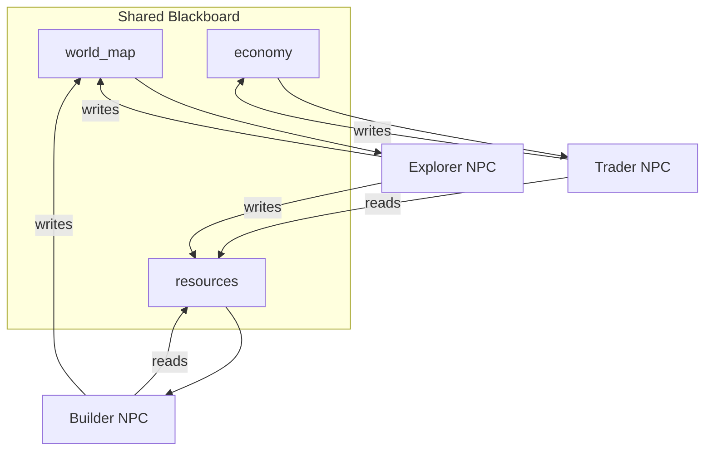

# How to Build an Emergent Multi-Agent NPC World in Python

Scripted NPCs feel static. This recipe uses the **Blackboard** pattern to make a small world come
alive: each NPC reads the parts of a shared world state it cares about and writes back its actions,
so behavior *emerges* from agents reacting to each other's changes — a builder gathers where the
explorer found resources, the trader prices what the builder produces.

**Patterns used:** Blackboard

---

## Architecture



---

## Implementation

```python
import asyncio
from pyagent_patterns.base import Agent
from pyagent_patterns.structural import Blackboard
from pyagent_patterns.structural.blackboard import BlackboardAgent
from pyagent_providers import OpenAILLM

world = Blackboard(
    agents=[
        BlackboardAgent(
            agent=Agent(
                "explorer",
                OpenAILLM("gpt-4o-mini"),
                system_prompt=(
                    "You are an explorer NPC. Scout unexplored tiles and report new terrain "
                    "and resource deposits you find. Write concise structured updates."
                ),
            ),
            reads=["task", "world_map"],
            writes=["world_map", "resources"],
        ),
        BlackboardAgent(
            agent=Agent(
                "builder",
                OpenAILLM("gpt-4o-mini"),
                system_prompt=(
                    "You are a builder NPC. Using known resources, decide what to construct "
                    "and where. Consume resources and add structures to the world map."
                ),
            ),
            reads=["resources", "world_map"],
            writes=["world_map"],
        ),
        BlackboardAgent(
            agent=Agent(
                "trader",
                OpenAILLM("gpt-4o-mini"),
                system_prompt=(
                    "You are a trader NPC. From available resources and structures, set prices "
                    "and propose trades. Update the economy with supply, demand, and prices."
                ),
            ),
            reads=["resources", "world_map"],
            writes=["economy"],
        ),
    ],
    rounds=3,
    initial_state={"world_map": "fog of war; spawn town at (0,0)", "resources": "", "economy": ""},
)

result = asyncio.run(world.run("Simulate one in-game day in the frontier region."))
print(result.output)
print(f"Final world state keys: {list(result.metadata['final_state'].keys())}")
```

---

## Expected output

```text
Day summary:
- Explorer charted tiles (1,0)-(3,2); found iron at (2,1), timber at (3,2).
- Builder raised a sawmill at (3,2) and a forge near the iron, consuming timber.
- Trader set iron 12g, planks 4g; opened a caravan route to the spawn town.

Final world state keys: ['world_map', 'resources', 'economy']
```

Run more `rounds` and the NPCs keep reacting to each other's writes — emergent supply chains and
settlements form without any of it being scripted.

---

## Customization

### Run a longer simulation

```python
world = Blackboard(agents=world._agents, rounds=10, initial_state={"world_map": "...", "resources": "", "economy": ""})
```

### Add an event logger

```python
from pyagent_patterns.structural.blackboard import BlackboardAgent
world.agents.append(
    BlackboardAgent(
        agent=Agent("chronicler", OpenAILLM("gpt-4o-mini"),
                    system_prompt="Write a one-line journal entry summarising what changed this round."),
        reads=["world_map", "resources", "economy"],
        writes=["chronicle"],
    )
)
```

### Seed a scenario

Pre-populate `initial_state` (e.g. a drought, a gold rush) to steer emergent behavior without scripting it.

---

## When to Use

| Situation | Use Blackboard? |
|-----------|-----------------|
| Agents coordinate through shared, evolving state | ✅ Yes |
| You want emergent behavior from local reactions | ✅ Yes |
| There's a fixed order of steps | ❌ Use [Pipeline](../../packages/patterns/orchestration/pipeline.md) |
| A central coordinator should assign all work | ❌ Use [Orchestrator-Workers](../../packages/patterns/orchestration/orchestrator-workers.md) |

---

## Cost Profile

| Driver | Typical model | Avg cost | Notes |
|--------|--------------|----------|-------|
| Per agent-turn | gpt-4o-mini | $0.0004 | 3 NPCs |
| Per round | — | ~$0.0012 | one turn each |
| **Per simulated day (3 rounds)** | gpt-4o-mini | **~$0.0036** | scales with NPCs × rounds |

Cost grows with `agents × rounds`, so cap rounds (or prune idle NPCs) for large worlds.

---

## See Also

- [Blackboard pattern](../../packages/patterns/structural/blackboard.md)
- [Trip-Planning Swarm](../travel-hospitality/trip-planner.md) — another decentralized, emergent approach
- [Browse all recipes](../index.md)
