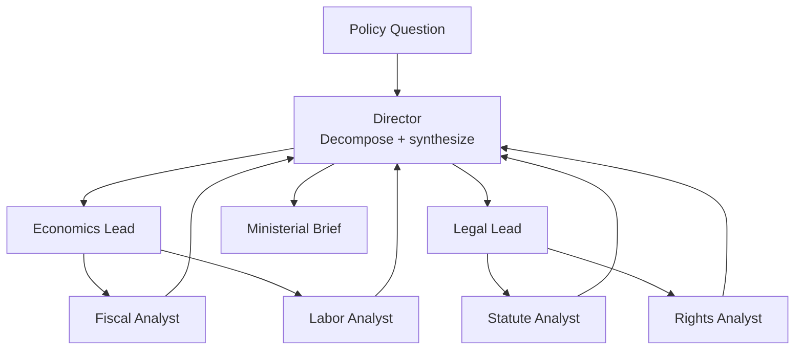

# How to Build a Multi-Agent Policy Briefing Pipeline in Python

A ministerial brief pulls together economic, legal, and social analysis — work that naturally maps
to departments and the analysts within them. This recipe uses the **Hierarchical** pattern: a
director decomposes the question into department subtasks, each department lead coordinates its
analysts, and results flow back up into one synthesized brief.

**Patterns used:** Hierarchical

---

## Architecture



---

## Implementation

```python
import asyncio
from pyagent_patterns.base import Agent
from pyagent_patterns.orchestration import Hierarchical
from pyagent_patterns.orchestration.hierarchical import Team
from pyagent_providers import AnthropicLLM, OpenAILLM

briefing = Hierarchical(
    manager=Agent(
        "policy_director",
        AnthropicLLM("claude-sonnet-4-20250514"),
        system_prompt=(
            "Decompose the policy question into subtasks for the Economics and Legal teams. "
            "After receiving both teams' outputs, synthesize a 1-page ministerial brief: "
            "summary, options, risks, and a recommendation. Flag where teams disagree."
        ),
    ),
    teams=[
        Team(
            name="Economics",
            lead=Agent(
                "economics_lead",
                OpenAILLM("gpt-4o-mini"),
                system_prompt="Coordinate the fiscal and labor analyses into one economic assessment.",
            ),
            workers=[
                Agent(
                    "fiscal_analyst",
                    OpenAILLM("gpt-4o-mini"),
                    system_prompt="Estimate budget impact, revenue effects, and cost over 5 years.",
                ),
                Agent(
                    "labour_analyst",
                    OpenAILLM("gpt-4o-mini"),
                    system_prompt="Assess employment, wage, and regional labor-market effects.",
                ),
            ],
        ),
        Team(
            name="Legal",
            lead=Agent(
                "legal_lead",
                OpenAILLM("gpt-4o-mini"),
                system_prompt="Coordinate statutory and rights analyses into one legal assessment.",
            ),
            workers=[
                Agent(
                    "statute_analyst",
                    OpenAILLM("gpt-4o-mini"),
                    system_prompt="Identify enabling legislation, required amendments, and precedent.",
                ),
                Agent(
                    "rights_analyst",
                    OpenAILLM("gpt-4o-mini"),
                    system_prompt="Assess civil-rights, privacy, and equality-impact considerations.",
                ),
            ],
        ),
    ],
)

result = asyncio.run(briefing.run(
    "Should the city introduce a congestion charge for the downtown core?"
))
print(result.output)
print(f"Teams: {result.metadata['team_names']}, workers: {result.metadata['total_workers']}")
```

---

## Expected output

```text
MINISTERIAL BRIEF — Downtown Congestion Charge

Summary:   A £12/day charge could cut peak traffic ~18% and raise ~£40M/yr.
Economics: net fiscal positive by year 2; labor impact concentrated in logistics.
Legal:     requires a Transport Act amendment; equality assessment needed for low-income drivers.
Options:   (A) full charge, (B) peak-only, (C) phased pilot.
Recommendation: Option C — 12-month pilot with exemptions, then review.

Teams: ['Economics', 'Legal'], workers: 4
```

---

## Customization

### Add a costing worker

```python
briefing.teams[0].workers.append(
    Agent("costing_analyst", OpenAILLM("gpt-4o-mini"),
          system_prompt="Produce a 5-year cost-benefit estimate with assumptions."),
)
```

### Add a third team

```python
from pyagent_patterns.orchestration.hierarchical import Team
briefing.teams.append(
    Team(name="Public Health",
         lead=Agent("ph_lead", OpenAILLM("gpt-4o-mini"), system_prompt="Coordinate the public-health assessment."),
         workers=[Agent("epi", OpenAILLM("gpt-4o-mini"), system_prompt="Assess health and equity impacts.")]),
)
```

### Cheaper drafts

Swap the director to `claude-haiku-3-5-20241022` for internal drafts; reserve sonnet for ministerial briefs.

---

## When to Use

| Situation | Use Hierarchical? |
|-----------|-------------------|
| Work decomposes into departments/teams with their own sub-work | ✅ Yes |
| You need one synthesized output from many specialists | ✅ Yes |
| There's a single flat pool of workers, no team structure | ❌ Use [Orchestrator-Workers](../../packages/patterns/orchestration/orchestrator-workers.md) |
| Specialists should debate to a verdict | ❌ Use [Debate](../../packages/patterns/resolution/debate.md) |

---

## Cost Profile

| Tier | Typical model | Avg cost | Volume (100 briefs/mo) |
|------|--------------|----------|-------------------------|
| Director (decompose + synthesize) | claude-sonnet | $0.008 | $0.80/mo… ×100 = $80 |
| Leads ×2 + analysts ×4 | gpt-4o-mini | $0.004 | $40/mo |
| **Per brief** | mix | **~$0.012** | **~$120/mo** |

---

## See Also

- [Hierarchical pattern](../../packages/patterns/orchestration/hierarchical.md)
- [Literature Review Team](../research-analysis/literature-review.md) — hierarchical research with sub-teams
- [Regulatory Compliance Checker](../legal-compliance/compliance-checker.md) — supervisor–worker compliance analysis
- [Browse all recipes](../index.md)
