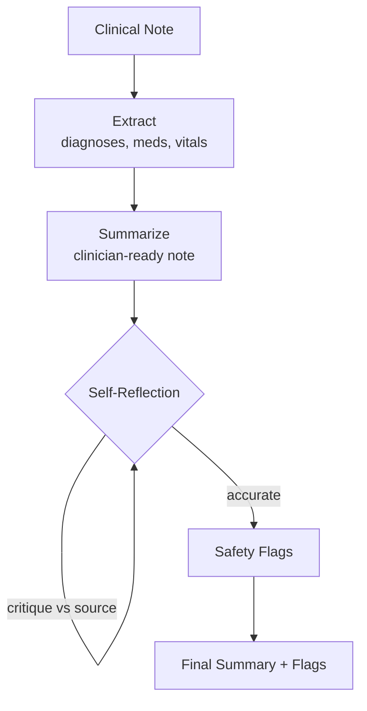

# How to Build a Multi-Agent Clinical Note Summarizer in Python

Clinical notes are dense, inconsistent, and high-stakes — a missed allergy or a hallucinated dose is
a patient-safety event. This recipe extracts structured findings with a **Pipeline**, then runs a
**Self-Reflection** accuracy pass so the summary critiques and corrects itself against the source note
before any clinician sees it.

**Patterns used:** [Pipeline](../../packages/patterns/orchestration/pipeline.md) ·
[Self-Reflection](../../packages/patterns/resolution/self-reflection.md)

---

## Architecture



---

## Implementation

```bash
pip install pyagent-patterns pyagent-providers
```

```python
import asyncio
from pyagent_patterns.base import Agent
from pyagent_patterns.orchestration import Pipeline
from pyagent_patterns.resolution import SelfReflection
from pyagent_patterns.composite import CompositePattern
from pyagent_providers import AnthropicLLM, OpenAILLM

# Cheap model for extraction, stronger model for the safety-critical summary.
fast_llm = OpenAILLM("gpt-4o-mini")
smart_llm = AnthropicLLM("claude-sonnet-4-20250514")

# ── Stage 1+2: extract structured findings, then draft the summary ──────────────
extract_and_draft = Pipeline(stages=[
    Agent(
        "extractor", fast_llm,
        system_prompt=(
            "Extract from the clinical note as structured bullets: active diagnoses, "
            "current medications (name + dose + route), allergies, and the latest vitals. "
            "Copy values verbatim — never infer or round. Mark anything illegible as [UNREADABLE]."
        ),
    ),
    Agent(
        "drafter", smart_llm,
        system_prompt=(
            "Write a concise clinician-ready summary from the extracted bullets: "
            "one-line problem list, active meds, and pending follow-ups. Keep it under 150 words."
        ),
    ),
])

# ── Stage 3: self-reflection accuracy pass (drafts → critiques → corrects) ──────
accuracy_pass = SelfReflection(
    agent=Agent(
        "summary_reviewer", smart_llm,
        system_prompt=(
            "Review the draft summary against the original note. Correct any value that does not "
            "match the source, and append a SAFETY FLAGS section listing: unsupported claims, "
            "missing critical values (e.g. allergies, abnormal vitals), and dose ambiguities. "
            "Reply 'ACCURATE' on the first line when no corrections remain."
        ),
    ),
    max_rounds=2,
    stop_phrase="ACCURATE",
)

clinical_summarizer = CompositePattern(patterns=[extract_and_draft, accuracy_pass])

SAMPLE_NOTE = """\
68M, CHF exacerbation. Hx: HFrEF (EF 30%), T2DM, CKD3. Allergy: penicillin (rash).
Meds: furosemide 40 mg PO BID, metoprolol succ 50 mg daily, metformin 1000 mg BID, lisinopril 10 mg daily.
Vitals: BP 148/92, HR 96, SpO2 91% RA, wt +3 kg from baseline. Plan: increase furosemide, daily weights.
"""

async def main():
    result = await clinical_summarizer.run(SAMPLE_NOTE)
    print(result.output)

asyncio.run(main())
```

---

## Expected Output

```text
PROBLEM LIST: CHF exacerbation (HFrEF, EF 30%), T2DM, CKD stage 3.
ACTIVE MEDS: furosemide 40 mg PO BID (increased this admission), metoprolol succinate 50 mg daily,
             metformin 1000 mg BID, lisinopril 10 mg daily.
FOLLOW-UP: daily weights; reassess volume status.

SAFETY FLAGS:
- Allergy to penicillin documented — verify before any antibiotic order.
- SpO2 91% on room air — below typical threshold; confirm oxygen plan.
- Metformin + CKD3: review for dose adjustment / hold criteria.
```

The Self-Reflection pass is what turns a plausible-sounding summary into one that has been checked
back against the source — the difference that matters in a clinical setting.

---

## Customization

### Add ICD-10 coding

Append a coding stage that maps the problem list to billing codes:

```python
coder = Agent(
    "icd10_coder", fast_llm,
    system_prompt="Map each diagnosis in the problem list to its ICD-10 code. Output 'diagnosis — code'.",
)
coding_pipeline = Pipeline(stages=[extract_and_draft, coder])
```

### Redact PHI before the summary leaves your VPC

Wrap the input in a guardrail so identifiers never reach a third-party model:

```python
from pyagent_patterns.guardrails import GuardrailChain, PIIGuard

phi_guard = GuardrailChain([PIIGuard(redact=True)])
safe_note = phi_guard.check(SAMPLE_NOTE).sanitized_content or SAMPLE_NOTE
```

### Batch a whole shift's notes

```python
async def summarize_all(notes: list[str]) -> list[str]:
    results = await asyncio.gather(*(clinical_summarizer.run(n) for n in notes))
    return [r.output for r in results]
```

---

## When to Use

| Situation | Fit |
|-----------|-----|
| Output must be checked back against a source document | ✅ Self-Reflection |
| Fixed extract → summarize stages | ✅ Pipeline |
| You need multiple independent reviewers to agree | ❌ Use [Voting](../../packages/patterns/resolution/voting.md) ([Essay Grading](../education/essay-grader.md)) |
| A second, different agent should review | ❌ Use [Cross-Reflection](../../packages/patterns/resolution/cross-reflection.md) |

---

## Cost Profile

| Stage | Typical model | Avg cost | Volume (5k notes/day) |
|-------|--------------|----------|------------------------|
| Extract | gpt-4o-mini | $0.0004 | $60/mo |
| Draft + reflection (≤2 rounds) | claude-sonnet | $0.008 | $1,200/mo |
| **Per note** | mix | **~$0.0084** | **~$1.26k/mo** |

Cap `max_rounds` to bound cost; most notes converge in one reflection round.

---

## See Also

- [Pipeline pattern](../../packages/patterns/orchestration/pipeline.md) ·
  [Self-Reflection pattern](../../packages/patterns/resolution/self-reflection.md)
- [Contract Review](../legal-compliance/contract-review.md) — review-before-signoff on legal text
- [Browse all recipes](../index.md)
