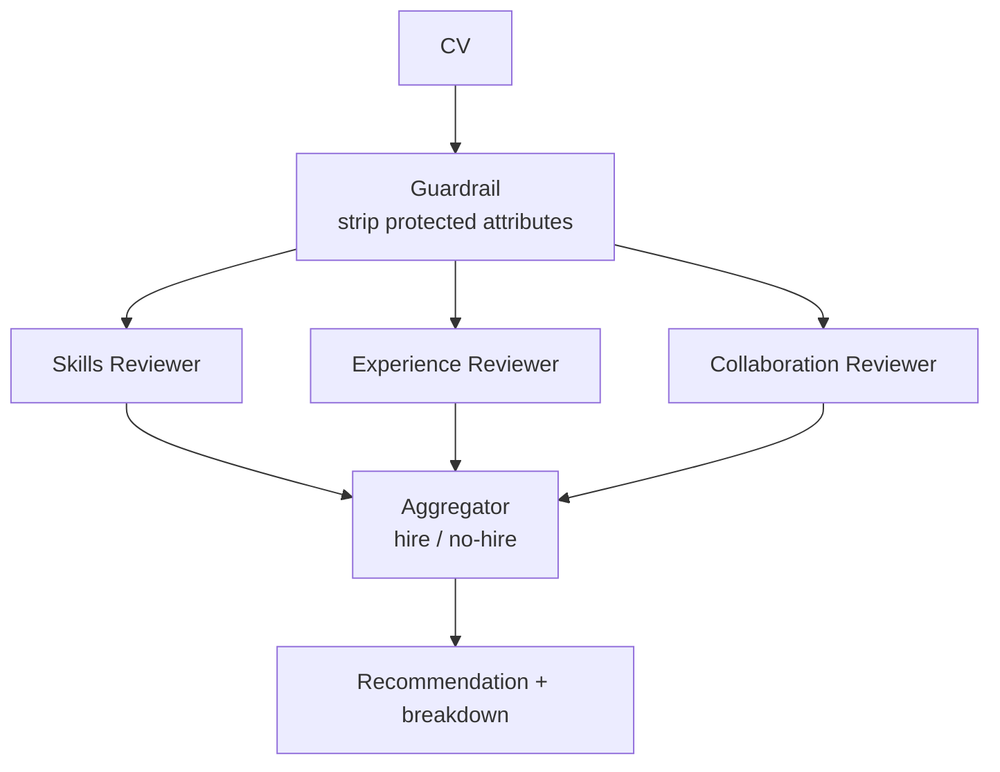

# How to Build a Multi-Agent CV Screening Workflow in Python

Screening is faster and fairer when distinct rubrics are scored independently rather than by one model
forming a halo impression. This recipe anonymizes a CV with a guardrail, then uses **Fan-Out / Fan-In**
to score skills, experience, and collaboration *in parallel*, and an aggregator merges them into one
hire/no-hire recommendation with the rubric breakdown.

**Patterns used:** [Fan-Out / Fan-In](../../packages/patterns/orchestration/fan-out-fan-in.md) ·
[Guardrails](../../guides/guardrails.md)

---

## Architecture



---

## Implementation

```bash
pip install pyagent-patterns pyagent-providers
```

```python
import asyncio
from pyagent_patterns.base import Agent
from pyagent_patterns.orchestration import FanOutFanIn
from pyagent_patterns.guardrails import GuardrailChain, PIIGuard
from pyagent_providers import AnthropicLLM, OpenAILLM

fast_llm = OpenAILLM("gpt-4o-mini")
smart_llm = AnthropicLLM("claude-sonnet-4-20250514")

# ── Strip names, contact details, and other PII before any model sees the CV ────
anonymizer = GuardrailChain([PIIGuard(redact=True)])

# ── Three independent rubric reviewers run in parallel on the same CV ───────────
screener = FanOutFanIn(
    agents=[
        Agent("skills", smart_llm,
              system_prompt="Score 0-10 on the required technical skills. Quote evidence from the CV."),
        Agent("experience", smart_llm,
              system_prompt="Score 0-10 on relevant experience and impact. Quote evidence."),
        Agent("collaboration", fast_llm,
              system_prompt="Score 0-10 on collaboration and ownership signals. Quote evidence."),
    ],
    aggregator=Agent(
        "panel", smart_llm,
        system_prompt=(
            "Combine the three rubric scores into one recommendation: STRONG HIRE / HIRE / NO HIRE. "
            "Show each rubric score, the overall, and the single biggest risk."
        ),
    ),
)

SAMPLE_CV = """\
Senior Backend Engineer, 7 yrs. Built a payments platform handling 4k TPS (Python, Postgres, Kafka).
Led a 5-person team; cut p99 latency 40%. Open-source: maintainer of a popular asyncio library.
"""

async def main():
    safe_cv = anonymizer.check(SAMPLE_CV).sanitized_content or SAMPLE_CV
    result = await screener.run(f"Role: Staff Backend Engineer.\n\nCV:\n{safe_cv}")
    print(result.output)

asyncio.run(main())
```

---

## Expected Output

```text
Skills: 9/10 — async Python + Kafka + Postgres match the stack; evidence: "4k TPS payments platform".
Experience: 8/10 — 7 yrs, real scale and a latency win; slightly light on staff-level scope.
Collaboration: 8/10 — led a 5-person team; OSS maintainer signals ownership.

RECOMMENDATION: HIRE (overall 8.3/10)
Biggest risk: limited evidence of cross-org/staff-level influence — probe in the interview.
```

Running rubrics in parallel keeps each score independent (no halo effect) and gives you an auditable
breakdown rather than one opaque verdict.

---

## Customization

### Weighted aggregation

```python
screener.aggregator.system_prompt += " Weight skills 50%, experience 35%, collaboration 15%."
```

### Add a structured scorecard for your ATS

```python
from pyagent_patterns.orchestration import Pipeline
to_json = Agent("scorecard", fast_llm, system_prompt='Output the result as JSON: {"recommendation":..,"scores":{..}}.')
screener_with_json = Pipeline(stages=[screener, to_json])
```

### Stricter blind screening

Add a `ContentGuard` that also removes school names and graduation years to reduce age/pedigree bias:

```python
from pyagent_patterns.guardrails import ContentGuard
import re
anonymizer = GuardrailChain([
    PIIGuard(redact=True),
    ContentGuard(deny_patterns=[re.compile(r"\b(19|20)\d{2}\b")]),  # strip years
])
```

---

## When to Use

| Situation | Fit |
|-----------|-----|
| Independent rubrics scored in parallel, merged once | ✅ Fan-Out / Fan-In |
| Protected attributes must be stripped first | ✅ Guardrails |
| Reviewers should debate borderline candidates | ❌ Use [Debate](../../packages/patterns/resolution/debate.md) |
| A fixed sequence of screening stages | ❌ Use [Pipeline](../../packages/patterns/orchestration/pipeline.md) |

---

## Cost Profile

| Stage | Typical model | Avg cost | Volume (2k CVs/day) |
|-------|--------------|----------|----------------------|
| 3 parallel reviewers | sonnet + mini | $0.007 | $420/mo |
| Aggregator | claude-sonnet | $0.003 | $180/mo |
| **Per CV** | mix | **~$0.010** | **~$600/mo** |

Parallel fan-out keeps wall-clock to `max(reviewer latency)` rather than the sum.

---

## See Also

- [Fan-Out / Fan-In pattern](../../packages/patterns/orchestration/fan-out-fan-in.md) ·
  [Guardrails guide](../../guides/guardrails.md)
- [Code Review](../software-engineering/code-review.md) — parallel + iterative review of code
- [Browse all recipes](../index.md)
