# Cookbook

Complete, runnable **multi-agent orchestration** examples — each one a self-contained recipe you can
copy, paste, and run. Every example shows the exact `pip install`, the full code, and the expected
output.

**Filter the recipes below** by domain, design pattern, or package — pick any combination (multiple
picks in one group match _any_; across groups they match _all_).

<!-- gen:recipe_browser:start (generated by scripts/gen_docs.py from docs/cookbook/ — do not edit by hand) -->
<div id="recipe-filter-bar"></div>

<div id="recipe-browser" data-total="37">
<article class="cb-card" data-domain="Blueprint Ops" data-pattern="Supervisor" data-package="pyagent-blueprint">
<h3 class="cb-card__title"><a href="blueprint-ops/ci-cd-validation/">Ci Cd Validation</a> <span class="cb-cx cb-cx--beginner">Beginner</span></h3>
<p class="cb-summary">Validate a blueprint and semantically diff it against main in a GitHub Actions PR check</p>
<p class="cb-chips"><button class="cb-chip cb-chip--domain" data-axis="Domain" data-value="Blueprint Ops">Blueprint Ops</button><button class="cb-chip cb-chip--pattern" data-axis="Pattern" data-value="Supervisor">Supervisor</button><button class="cb-chip cb-chip--package" data-axis="Package" data-value="pyagent-blueprint">pyagent-blueprint</button></p>
</article>
<article class="cb-card" data-domain="Blueprint Ops" data-pattern="Pipeline" data-package="pyagent-blueprint">
<h3 class="cb-card__title"><a href="blueprint-ops/contract-testing/">Contract Testing</a> <span class="cb-cx cb-cx--beginner">Beginner</span></h3>
<p class="cb-summary">Run pyagent-blueprint&#x27;s built-in MockLLM contract tests in CI before any real model call</p>
<p class="cb-chips"><button class="cb-chip cb-chip--domain" data-axis="Domain" data-value="Blueprint Ops">Blueprint Ops</button><button class="cb-chip cb-chip--pattern" data-axis="Pattern" data-value="Pipeline">Pipeline</button><button class="cb-chip cb-chip--package" data-axis="Package" data-value="pyagent-blueprint">pyagent-blueprint</button></p>
</article>
<article class="cb-card" data-domain="Blueprint Ops" data-pattern="Supervisor" data-package="pyagent-blueprint">
<h3 class="cb-card__title"><a href="blueprint-ops/governance-in-yaml/">Governance In Yaml</a> <span class="cb-cx cb-cx--intermediate">Intermediate</span></h3>
<p class="cb-summary">Declare SLA/budget and recovery policy in YAML; see the stable diagnostic a non-supporting adapter reports</p>
<p class="cb-chips"><button class="cb-chip cb-chip--domain" data-axis="Domain" data-value="Blueprint Ops">Blueprint Ops</button><button class="cb-chip cb-chip--pattern" data-axis="Pattern" data-value="Supervisor">Supervisor</button><button class="cb-chip cb-chip--package" data-axis="Package" data-value="pyagent-blueprint">pyagent-blueprint</button></p>
</article>
<article class="cb-card" data-domain="Customer Support" data-pattern="Role-Based" data-package="pyagent-patterns">
<h3 class="cb-card__title"><a href="customer-support/onboarding/">Customer Onboarding Workflow</a> <span class="cb-cx cb-cx--intermediate">Intermediate</span></h3>
<p class="cb-summary">Verification, setup, FAQ, and success roles onboard a new customer end to end</p>
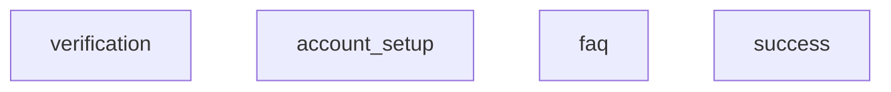
<p class="cb-chips"><button class="cb-chip cb-chip--domain" data-axis="Domain" data-value="Customer Support">Customer Support</button><button class="cb-chip cb-chip--pattern" data-axis="Pattern" data-value="Role-Based">Role-Based</button><button class="cb-chip cb-chip--package" data-axis="Package" data-value="pyagent-patterns">pyagent-patterns</button></p>
</article>
<article class="cb-card" data-domain="Customer Support" data-pattern="Supervisor|Talker-Reasoner|Human-in-the-Loop" data-package="pyagent-patterns|pyagent-router">
<h3 class="cb-card__title"><a href="customer-support/support-router/">Support Router</a> <span class="cb-cx cb-cx--advanced">Advanced</span></h3>
<p class="cb-summary">Classify tickets → route to specialists → escalate to a human</p>
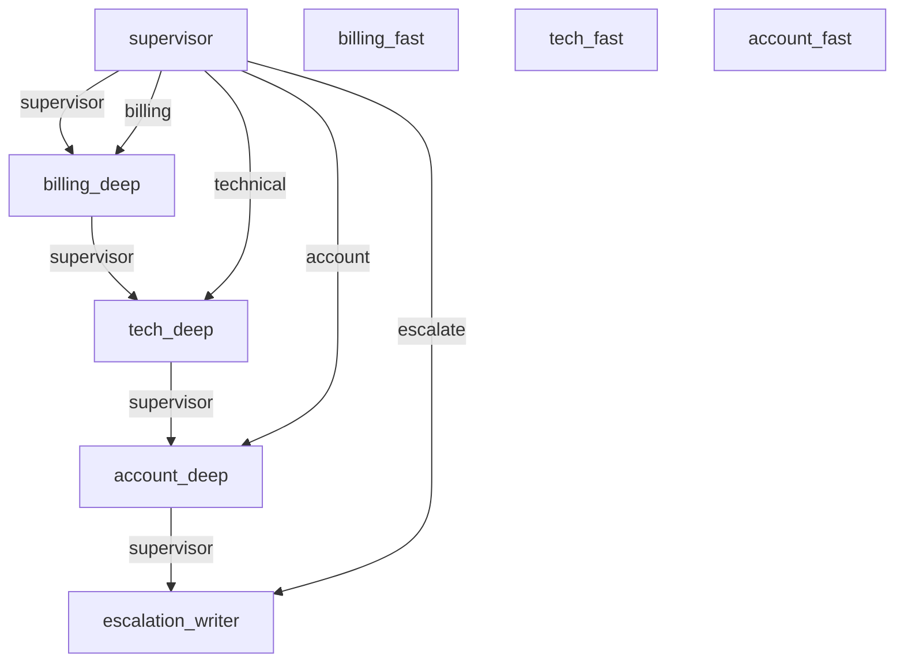
<p class="cb-chips"><button class="cb-chip cb-chip--domain" data-axis="Domain" data-value="Customer Support">Customer Support</button><button class="cb-chip cb-chip--pattern" data-axis="Pattern" data-value="Supervisor">Supervisor</button><button class="cb-chip cb-chip--pattern" data-axis="Pattern" data-value="Talker-Reasoner">Talker-Reasoner</button><button class="cb-chip cb-chip--pattern" data-axis="Pattern" data-value="Human-in-the-Loop">Human-in-the-Loop</button><button class="cb-chip cb-chip--package" data-axis="Package" data-value="pyagent-patterns">pyagent-patterns</button><button class="cb-chip cb-chip--package" data-axis="Package" data-value="pyagent-router">pyagent-router</button></p>
</article>
<article class="cb-card" data-domain="Data &amp; Analytics" data-pattern="Orchestrator-Workers" data-package="pyagent-patterns">
<h3 class="cb-card__title"><a href="data-analytics/analytics-decomposer/">Analytics Task Decomposer</a> <span class="cb-cx cb-cx--intermediate">Intermediate</span></h3>
<p class="cb-summary">Orchestrator breaks an analytics request into query, transform, and chart workers</p>
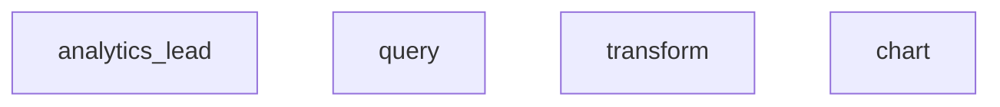
<p class="cb-chips"><button class="cb-chip cb-chip--domain" data-axis="Domain" data-value="Data &amp; Analytics">Data &amp; Analytics</button><button class="cb-chip cb-chip--pattern" data-axis="Pattern" data-value="Orchestrator-Workers">Orchestrator-Workers</button><button class="cb-chip cb-chip--package" data-axis="Package" data-value="pyagent-patterns">pyagent-patterns</button></p>
</article>
<article class="cb-card" data-domain="Data &amp; Analytics" data-pattern="ReAct" data-package="pyagent-patterns|pyagent-router">
<h3 class="cb-card__title"><a href="data-analytics/sql-analyst/">SQL Analyst</a> <span class="cb-cx cb-cx--intermediate">Intermediate</span></h3>
<p class="cb-summary">Reason-act loop that writes and runs SQL to answer questions</p>
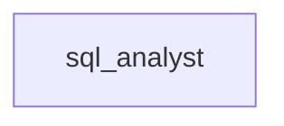
<p class="cb-chips"><button class="cb-chip cb-chip--domain" data-axis="Domain" data-value="Data &amp; Analytics">Data &amp; Analytics</button><button class="cb-chip cb-chip--pattern" data-axis="Pattern" data-value="ReAct">ReAct</button><button class="cb-chip cb-chip--package" data-axis="Package" data-value="pyagent-patterns">pyagent-patterns</button><button class="cb-chip cb-chip--package" data-axis="Package" data-value="pyagent-router">pyagent-router</button></p>
</article>
<article class="cb-card" data-domain="DevOps &amp; SRE" data-pattern="Pipeline|Human-in-the-Loop" data-package="pyagent-patterns">
<h3 class="cb-card__title"><a href="devops-sre/incident-triage/">Incident Triage</a> <span class="cb-cx cb-cx--intermediate">Intermediate</span></h3>
<p class="cb-summary">Stage pipeline that triages incidents with human sign-off</p>
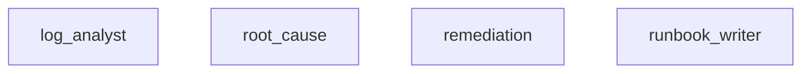
<p class="cb-chips"><button class="cb-chip cb-chip--domain" data-axis="Domain" data-value="DevOps &amp; SRE">DevOps &amp; SRE</button><button class="cb-chip cb-chip--pattern" data-axis="Pattern" data-value="Pipeline">Pipeline</button><button class="cb-chip cb-chip--pattern" data-axis="Pattern" data-value="Human-in-the-Loop">Human-in-the-Loop</button><button class="cb-chip cb-chip--package" data-axis="Package" data-value="pyagent-patterns">pyagent-patterns</button></p>
</article>
<article class="cb-card" data-domain="E-commerce &amp; Retail" data-pattern="Orchestrator-Workers" data-package="pyagent-patterns">
<h3 class="cb-card__title"><a href="ecommerce-retail/product-launch-planner/">Product Launch Planner</a> <span class="cb-cx cb-cx--intermediate">Intermediate</span></h3>
<p class="cb-summary">Orchestrator splits a launch into pricing/copy/SEO/inventory subtasks for workers</p>
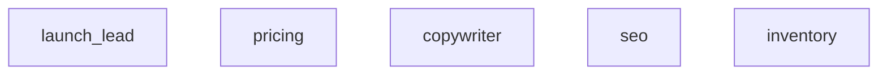
<p class="cb-chips"><button class="cb-chip cb-chip--domain" data-axis="Domain" data-value="E-commerce &amp; Retail">E-commerce &amp; Retail</button><button class="cb-chip cb-chip--pattern" data-axis="Pattern" data-value="Orchestrator-Workers">Orchestrator-Workers</button><button class="cb-chip cb-chip--package" data-axis="Package" data-value="pyagent-patterns">pyagent-patterns</button></p>
</article>
<article class="cb-card" data-domain="Education &amp; Training" data-pattern="Voting" data-package="pyagent-patterns">
<h3 class="cb-card__title"><a href="education/essay-grader/">Essay Grading by Consensus</a> <span class="cb-cx cb-cx--intermediate">Intermediate</span></h3>
<p class="cb-summary">Independent graders score against a rubric; a majority vote sets the grade</p>
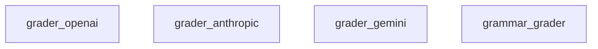
<p class="cb-chips"><button class="cb-chip cb-chip--domain" data-axis="Domain" data-value="Education &amp; Training">Education &amp; Training</button><button class="cb-chip cb-chip--pattern" data-axis="Pattern" data-value="Voting">Voting</button><button class="cb-chip cb-chip--package" data-axis="Package" data-value="pyagent-patterns">pyagent-patterns</button></p>
</article>
<article class="cb-card" data-domain="Finance &amp; Trading" data-pattern="Pipeline|Human-in-the-Loop" data-package="pyagent-patterns">
<h3 class="cb-card__title"><a href="finance-trading/aml-monitoring/">AML Transaction Monitoring</a> <span class="cb-cx cb-cx--advanced">Advanced</span></h3>
<p class="cb-summary">Screen → score → enrich pipeline gates high-risk transactions to a human reviewer</p>
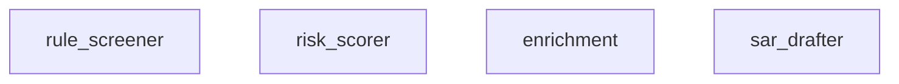
<p class="cb-chips"><button class="cb-chip cb-chip--domain" data-axis="Domain" data-value="Finance &amp; Trading">Finance &amp; Trading</button><button class="cb-chip cb-chip--pattern" data-axis="Pattern" data-value="Pipeline">Pipeline</button><button class="cb-chip cb-chip--pattern" data-axis="Pattern" data-value="Human-in-the-Loop">Human-in-the-Loop</button><button class="cb-chip cb-chip--package" data-axis="Package" data-value="pyagent-patterns">pyagent-patterns</button></p>
</article>
<article class="cb-card" data-domain="Finance &amp; Trading" data-pattern="Orchestrator-Workers" data-package="pyagent-patterns">
<h3 class="cb-card__title"><a href="finance-trading/esg-analyzer/">ESG Report Analyzer</a> <span class="cb-cx cb-cx--advanced">Advanced</span></h3>
<p class="cb-summary">Orchestrator dispatches ratings, disclosure, and SFDR-scoring workers into an ESG summary</p>
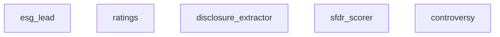
<p class="cb-chips"><button class="cb-chip cb-chip--domain" data-axis="Domain" data-value="Finance &amp; Trading">Finance &amp; Trading</button><button class="cb-chip cb-chip--pattern" data-axis="Pattern" data-value="Orchestrator-Workers">Orchestrator-Workers</button><button class="cb-chip cb-chip--package" data-axis="Package" data-value="pyagent-patterns">pyagent-patterns</button></p>
</article>
<article class="cb-card" data-domain="Finance &amp; Trading" data-pattern="Self-Reflection" data-package="pyagent-patterns">
<h3 class="cb-card__title"><a href="finance-trading/earnings-call/">Earnings Call Analyzer</a> <span class="cb-cx cb-cx--intermediate">Intermediate</span></h3>
<p class="cb-summary">A self-reflecting agent iterates on an earnings transcript until the analysis clears a quality bar</p>
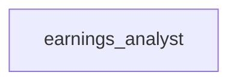
<p class="cb-chips"><button class="cb-chip cb-chip--domain" data-axis="Domain" data-value="Finance &amp; Trading">Finance &amp; Trading</button><button class="cb-chip cb-chip--pattern" data-axis="Pattern" data-value="Self-Reflection">Self-Reflection</button><button class="cb-chip cb-chip--package" data-axis="Package" data-value="pyagent-patterns">pyagent-patterns</button></p>
</article>
<article class="cb-card" data-domain="Finance &amp; Trading" data-pattern="Topology" data-package="pyagent-patterns">
<h3 class="cb-card__title"><a href="finance-trading/loan-origination/">Loan Origination Workflow</a> <span class="cb-cx cb-cx--advanced">Advanced</span></h3>
<p class="cb-summary">Document → income → credit → approval agents pass an application along a chain</p>
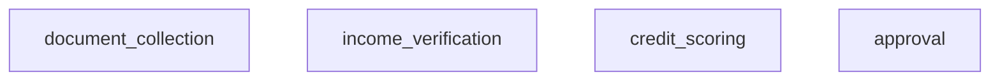
<p class="cb-chips"><button class="cb-chip cb-chip--domain" data-axis="Domain" data-value="Finance &amp; Trading">Finance &amp; Trading</button><button class="cb-chip cb-chip--pattern" data-axis="Pattern" data-value="Topology">Topology</button><button class="cb-chip cb-chip--package" data-axis="Package" data-value="pyagent-patterns">pyagent-patterns</button></p>
</article>
<article class="cb-card" data-domain="Finance &amp; Trading" data-pattern="Debate" data-package="pyagent-patterns">
<h3 class="cb-card__title"><a href="finance-trading/loan-underwriting/">Loan Underwriting Committee</a> <span class="cb-cx cb-cx--advanced">Advanced</span></h3>
<p class="cb-summary">Approve and decline advocates debate an application; a senior underwriter decides</p>
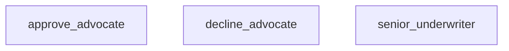
<p class="cb-chips"><button class="cb-chip cb-chip--domain" data-axis="Domain" data-value="Finance &amp; Trading">Finance &amp; Trading</button><button class="cb-chip cb-chip--pattern" data-axis="Pattern" data-value="Debate">Debate</button><button class="cb-chip cb-chip--package" data-axis="Package" data-value="pyagent-patterns">pyagent-patterns</button></p>
</article>
<article class="cb-card" data-domain="Finance &amp; Trading" data-pattern="Supervisor|Evaluator-Optimizer" data-package="pyagent-patterns">
<h3 class="cb-card__title"><a href="finance-trading/portfolio-review/">Portfolio Review</a> <span class="cb-cx cb-cx--intermediate">Intermediate</span></h3>
<p class="cb-summary">Analyst panel with an evaluator-optimizer quality gate</p>
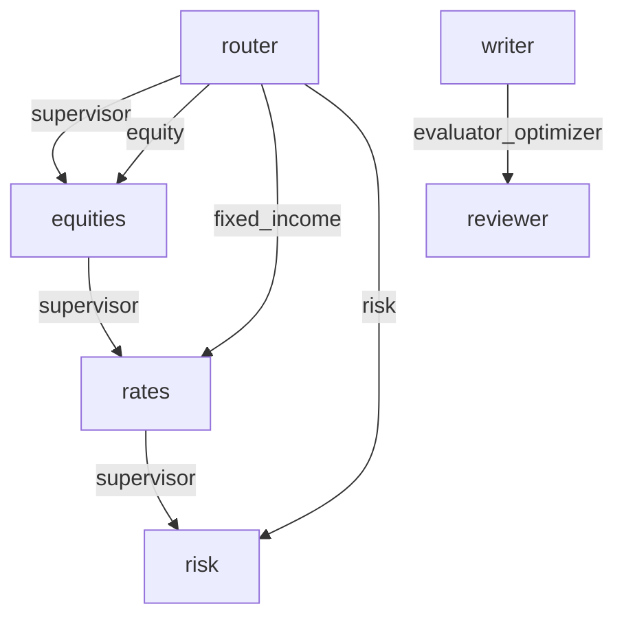
<p class="cb-chips"><button class="cb-chip cb-chip--domain" data-axis="Domain" data-value="Finance &amp; Trading">Finance &amp; Trading</button><button class="cb-chip cb-chip--pattern" data-axis="Pattern" data-value="Supervisor">Supervisor</button><button class="cb-chip cb-chip--pattern" data-axis="Pattern" data-value="Evaluator-Optimizer">Evaluator-Optimizer</button><button class="cb-chip cb-chip--package" data-axis="Package" data-value="pyagent-patterns">pyagent-patterns</button></p>
</article>
<article class="cb-card" data-domain="Finance &amp; Trading" data-pattern="Role-Based" data-package="pyagent-patterns">
<h3 class="cb-card__title"><a href="finance-trading/robo-advisor/">Robo-Advisor Onboarding</a> <span class="cb-cx cb-cx--intermediate">Intermediate</span></h3>
<p class="cb-summary">Intake, risk, suitability, and planning roles rotate to build a client investment plan</p>
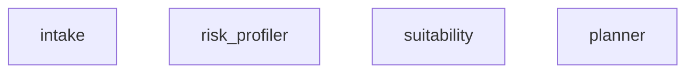
<p class="cb-chips"><button class="cb-chip cb-chip--domain" data-axis="Domain" data-value="Finance &amp; Trading">Finance &amp; Trading</button><button class="cb-chip cb-chip--pattern" data-axis="Pattern" data-value="Role-Based">Role-Based</button><button class="cb-chip cb-chip--package" data-axis="Package" data-value="pyagent-patterns">pyagent-patterns</button></p>
</article>
<article class="cb-card" data-domain="Finance &amp; Trading" data-pattern="Fan-Out / Fan-In" data-package="pyagent-patterns">
<h3 class="cb-card__title"><a href="finance-trading/trading-signals/">Trading Signal Desk</a> <span class="cb-cx cb-cx--advanced">Advanced</span></h3>
<p class="cb-summary">Momentum, mean-reversion, and sentiment agents fan out then aggregate into a trade idea</p>
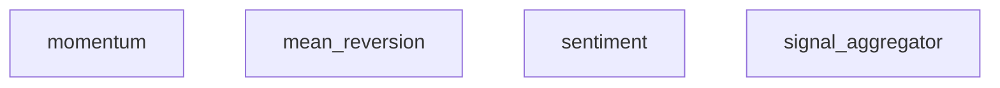
<p class="cb-chips"><button class="cb-chip cb-chip--domain" data-axis="Domain" data-value="Finance &amp; Trading">Finance &amp; Trading</button><button class="cb-chip cb-chip--pattern" data-axis="Pattern" data-value="Fan-Out / Fan-In">Fan-Out / Fan-In</button><button class="cb-chip cb-chip--package" data-axis="Package" data-value="pyagent-patterns">pyagent-patterns</button></p>
</article>
<article class="cb-card" data-domain="Finance &amp; Trading" data-pattern="Pipeline" data-package="pyagent-patterns">
<h3 class="cb-card__title"><a href="finance-trading/wealth-rebalancing/">Wealth Rebalancing Crew</a> <span class="cb-cx cb-cx--intermediate">Intermediate</span></h3>
<p class="cb-summary">Risk → market scan → allocation → compliance pipeline proposes a rebalance</p>
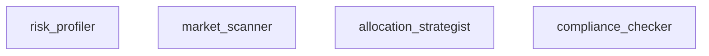
<p class="cb-chips"><button class="cb-chip cb-chip--domain" data-axis="Domain" data-value="Finance &amp; Trading">Finance &amp; Trading</button><button class="cb-chip cb-chip--pattern" data-axis="Pattern" data-value="Pipeline">Pipeline</button><button class="cb-chip cb-chip--package" data-axis="Package" data-value="pyagent-patterns">pyagent-patterns</button></p>
</article>
<article class="cb-card" data-domain="Gaming &amp; Simulation" data-pattern="Blackboard" data-package="pyagent-patterns">
<h3 class="cb-card__title"><a href="gaming/npc-world/">Emergent NPC World</a> <span class="cb-cx cb-cx--advanced">Advanced</span></h3>
<p class="cb-summary">NPC agents read/write a shared world-state blackboard for emergent behavior</p>
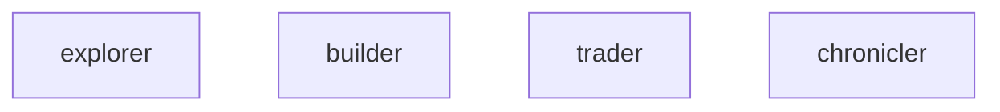
<p class="cb-chips"><button class="cb-chip cb-chip--domain" data-axis="Domain" data-value="Gaming &amp; Simulation">Gaming &amp; Simulation</button><button class="cb-chip cb-chip--pattern" data-axis="Pattern" data-value="Blackboard">Blackboard</button><button class="cb-chip cb-chip--package" data-axis="Package" data-value="pyagent-patterns">pyagent-patterns</button></p>
</article>
<article class="cb-card" data-domain="Government &amp; Public Sector" data-pattern="Hierarchical" data-package="pyagent-patterns">
<h3 class="cb-card__title"><a href="government/policy-briefing/">Policy Briefing Pipeline</a> <span class="cb-cx cb-cx--advanced">Advanced</span></h3>
<p class="cb-summary">A director delegates to department leads and analysts, then synthesizes a brief</p>
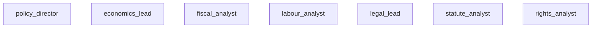
<p class="cb-chips"><button class="cb-chip cb-chip--domain" data-axis="Domain" data-value="Government &amp; Public Sector">Government &amp; Public Sector</button><button class="cb-chip cb-chip--pattern" data-axis="Pattern" data-value="Hierarchical">Hierarchical</button><button class="cb-chip cb-chip--package" data-axis="Package" data-value="pyagent-patterns">pyagent-patterns</button></p>
</article>
<article class="cb-card" data-domain="HR &amp; Recruiting" data-pattern="Fan-Out / Fan-In" data-package="pyagent-patterns">
<h3 class="cb-card__title"><a href="hr-recruiting/cv-screener/">CV Screener</a> <span class="cb-cx cb-cx--intermediate">Intermediate</span></h3>
<p class="cb-summary">Parallel reviewers score a CV; aggregate into one verdict</p>
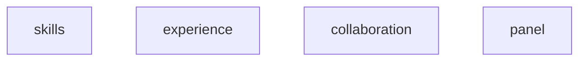
<p class="cb-chips"><button class="cb-chip cb-chip--domain" data-axis="Domain" data-value="HR &amp; Recruiting">HR &amp; Recruiting</button><button class="cb-chip cb-chip--pattern" data-axis="Pattern" data-value="Fan-Out / Fan-In">Fan-Out / Fan-In</button><button class="cb-chip cb-chip--package" data-axis="Package" data-value="pyagent-patterns">pyagent-patterns</button></p>
</article>
<article class="cb-card" data-domain="Healthcare &amp; Life Sciences" data-pattern="Pipeline|Self-Reflection" data-package="pyagent-patterns">
<h3 class="cb-card__title"><a href="healthcare/clinical-summary/">Clinical Summary</a> <span class="cb-cx cb-cx--intermediate">Intermediate</span></h3>
<p class="cb-summary">Summarize clinical notes, then self-critique for accuracy</p>
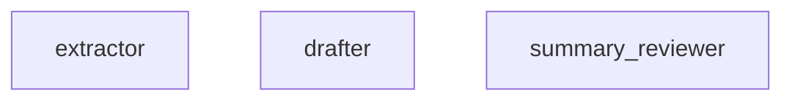
<p class="cb-chips"><button class="cb-chip cb-chip--domain" data-axis="Domain" data-value="Healthcare &amp; Life Sciences">Healthcare &amp; Life Sciences</button><button class="cb-chip cb-chip--pattern" data-axis="Pattern" data-value="Pipeline">Pipeline</button><button class="cb-chip cb-chip--pattern" data-axis="Pattern" data-value="Self-Reflection">Self-Reflection</button><button class="cb-chip cb-chip--package" data-axis="Package" data-value="pyagent-patterns">pyagent-patterns</button></p>
</article>
<article class="cb-card" data-domain="Legal &amp; Compliance" data-pattern="Cross-Reflection" data-package="pyagent-patterns">
<h3 class="cb-card__title"><a href="legal-compliance/contract-review/">Contract Review</a> <span class="cb-cx cb-cx--intermediate">Intermediate</span></h3>
<p class="cb-summary">Draft + independent reviewer loop over contract clauses</p>
```mermaid
graph TD
    counsel[counsel]
    partner[partner]
    counsel -->|cross_reflection| partner
```
<p class="cb-chips"><button class="cb-chip cb-chip--domain" data-axis="Domain" data-value="Legal &amp; Compliance">Legal &amp; Compliance</button><button class="cb-chip cb-chip--pattern" data-axis="Pattern" data-value="Cross-Reflection">Cross-Reflection</button><button class="cb-chip cb-chip--package" data-axis="Package" data-value="pyagent-patterns">pyagent-patterns</button></p>
</article>
<article class="cb-card" data-domain="Legal &amp; Compliance" data-pattern="Hierarchical" data-package="pyagent-patterns">
<h3 class="cb-card__title"><a href="legal-compliance/compliance-checker/">Regulatory Compliance Checker</a> <span class="cb-cx cb-cx--advanced">Advanced</span></h3>
<p class="cb-summary">A director delegates obligation and control teams, then synthesizes a gap analysis</p>
```mermaid
graph TD
    compliance_director[compliance_director]
    obligations_lead[obligations_lead]
    controls_lead[controls_lead]
    requirement_extractor[requirement_extractor]
    scope_analyst[scope_analyst]
    policy_mapper[policy_mapper]
    evidence_checker[evidence_checker]
```
<p class="cb-chips"><button class="cb-chip cb-chip--domain" data-axis="Domain" data-value="Legal &amp; Compliance">Legal &amp; Compliance</button><button class="cb-chip cb-chip--pattern" data-axis="Pattern" data-value="Hierarchical">Hierarchical</button><button class="cb-chip cb-chip--package" data-axis="Package" data-value="pyagent-patterns">pyagent-patterns</button></p>
</article>
<article class="cb-card" data-domain="Marketing &amp; Content" data-pattern="Fan-Out / Fan-In" data-package="pyagent-patterns">
<h3 class="cb-card__title"><a href="marketing-content/campaign-planner/">Campaign Planner</a> <span class="cb-cx cb-cx--beginner">Beginner</span></h3>
<p class="cb-summary">Parallel channel ideas aggregated into one campaign plan</p>
```mermaid
graph TD
    email[email]
    social[social]
    blog[blog]
    campaign_director[campaign_director]
```
<p class="cb-chips"><button class="cb-chip cb-chip--domain" data-axis="Domain" data-value="Marketing &amp; Content">Marketing &amp; Content</button><button class="cb-chip cb-chip--pattern" data-axis="Pattern" data-value="Fan-Out / Fan-In">Fan-Out / Fan-In</button><button class="cb-chip cb-chip--package" data-axis="Package" data-value="pyagent-patterns">pyagent-patterns</button></p>
</article>
<article class="cb-card" data-domain="Media &amp; Entertainment" data-pattern="Role-Based" data-package="pyagent-patterns">
<h3 class="cb-card__title"><a href="media-entertainment/writers-room/">Writers&#x27; Room</a> <span class="cb-cx cb-cx--intermediate">Intermediate</span></h3>
<p class="cb-summary">Showrunner, writer, editor, and continuity roles collaborate on an episode outline</p>
```mermaid
graph TD
    showrunner[showrunner]
    staff_writer[staff_writer]
    script_editor[script_editor]
    continuity[continuity]
    network_exec[network_exec]
```
<p class="cb-chips"><button class="cb-chip cb-chip--domain" data-axis="Domain" data-value="Media &amp; Entertainment">Media &amp; Entertainment</button><button class="cb-chip cb-chip--pattern" data-axis="Pattern" data-value="Role-Based">Role-Based</button><button class="cb-chip cb-chip--package" data-axis="Package" data-value="pyagent-patterns">pyagent-patterns</button></p>
</article>
<article class="cb-card" data-domain="Real Estate &amp; PropTech" data-pattern="Layered" data-package="pyagent-patterns">
<h3 class="cb-card__title"><a href="real-estate/property-valuation/">Property Valuation Stack</a> <span class="cb-cx cb-cx--intermediate">Intermediate</span></h3>
<p class="cb-summary">Data → comparables → narrative layers produce a valuation report</p>
```mermaid
graph TD
    property_facts[property_facts]
    market_facts[market_facts]
    comps[comps]
    adjustments[adjustments]
    report_writer[report_writer]
    reviewer[reviewer]
```
<p class="cb-chips"><button class="cb-chip cb-chip--domain" data-axis="Domain" data-value="Real Estate &amp; PropTech">Real Estate &amp; PropTech</button><button class="cb-chip cb-chip--pattern" data-axis="Pattern" data-value="Layered">Layered</button><button class="cb-chip cb-chip--package" data-axis="Package" data-value="pyagent-patterns">pyagent-patterns</button></p>
</article>
<article class="cb-card" data-domain="Research &amp; Analysis" data-pattern="Hierarchical" data-package="pyagent-patterns">
<h3 class="cb-card__title"><a href="research-analysis/literature-review/">Literature Review Team</a> <span class="cb-cx cb-cx--advanced">Advanced</span></h3>
<p class="cb-summary">A lead delegates discovery and synthesis sub-teams to produce a cited review</p>
```mermaid
graph TD
    research_lead[research_lead]
    discovery_lead[discovery_lead]
    synthesis_lead[synthesis_lead]
    source_finder[source_finder]
    relevance_triage[relevance_triage]
    findings_extractor[findings_extractor]
    citation_writer[citation_writer]
```
<p class="cb-chips"><button class="cb-chip cb-chip--domain" data-axis="Domain" data-value="Research &amp; Analysis">Research &amp; Analysis</button><button class="cb-chip cb-chip--pattern" data-axis="Pattern" data-value="Hierarchical">Hierarchical</button><button class="cb-chip cb-chip--package" data-axis="Package" data-value="pyagent-patterns">pyagent-patterns</button></p>
</article>
<article class="cb-card" data-domain="Research &amp; Analysis" data-pattern="ReAct|Fan-Out / Fan-In|Debate|Pipeline" data-package="pyagent-patterns|pyagent-compress">
<h3 class="cb-card__title"><a href="research-analysis/research-assistant/">Research Assistant</a> <span class="cb-cx cb-cx--advanced">Advanced</span></h3>
<p class="cb-summary">Gather sources, debate, synthesize, and cite</p>
```mermaid
graph TD
    web_agent[web_agent]
    academic_agent[academic_agent]
    industry_agent[industry_agent]
    optimist[optimist]
    sceptic[sceptic]
    judge[judge]
    synthesizer[synthesizer]
```
<p class="cb-chips"><button class="cb-chip cb-chip--domain" data-axis="Domain" data-value="Research &amp; Analysis">Research &amp; Analysis</button><button class="cb-chip cb-chip--pattern" data-axis="Pattern" data-value="ReAct">ReAct</button><button class="cb-chip cb-chip--pattern" data-axis="Pattern" data-value="Fan-Out / Fan-In">Fan-Out / Fan-In</button><button class="cb-chip cb-chip--pattern" data-axis="Pattern" data-value="Debate">Debate</button><button class="cb-chip cb-chip--pattern" data-axis="Pattern" data-value="Pipeline">Pipeline</button><button class="cb-chip cb-chip--package" data-axis="Package" data-value="pyagent-patterns">pyagent-patterns</button><button class="cb-chip cb-chip--package" data-axis="Package" data-value="pyagent-compress">pyagent-compress</button></p>
</article>
<article class="cb-card" data-domain="Sales &amp; CRM" data-pattern="Supervisor|Pipeline" data-package="pyagent-patterns">
<h3 class="cb-card__title"><a href="sales-crm/lead-qualifier/">Lead Qualifier</a> <span class="cb-cx cb-cx--intermediate">Intermediate</span></h3>
<p class="cb-summary">Score and route inbound leads to the right play</p>
```mermaid
graph TD
    scorer[scorer]
    account_exec[account_exec]
    nurture[nurture]
    cold_hold[cold_hold]
    scorer -->|supervisor| account_exec
    account_exec -->|supervisor| nurture
    nurture -->|supervisor| cold_hold
    scorer -->|hot| account_exec
    scorer -->|warm| nurture
    scorer -->|cold| cold_hold
```
<p class="cb-chips"><button class="cb-chip cb-chip--domain" data-axis="Domain" data-value="Sales &amp; CRM">Sales &amp; CRM</button><button class="cb-chip cb-chip--pattern" data-axis="Pattern" data-value="Supervisor">Supervisor</button><button class="cb-chip cb-chip--pattern" data-axis="Pattern" data-value="Pipeline">Pipeline</button><button class="cb-chip cb-chip--package" data-axis="Package" data-value="pyagent-patterns">pyagent-patterns</button></p>
</article>
<article class="cb-card" data-domain="Scientific &amp; Academic" data-pattern="Topology" data-package="pyagent-patterns">
<h3 class="cb-card__title"><a href="scientific/peer-review/">Peer-Review Mesh</a> <span class="cb-cx cb-cx--advanced">Advanced</span></h3>
<p class="cb-summary">Reviewers critique a manuscript in a mesh, reconciling notes across rounds</p>
```mermaid
graph TD
    methodology_reviewer[methodology_reviewer]
    novelty_reviewer[novelty_reviewer]
    clarity_reviewer[clarity_reviewer]
    stats_reviewer[stats_reviewer]
```
<p class="cb-chips"><button class="cb-chip cb-chip--domain" data-axis="Domain" data-value="Scientific &amp; Academic">Scientific &amp; Academic</button><button class="cb-chip cb-chip--pattern" data-axis="Pattern" data-value="Topology">Topology</button><button class="cb-chip cb-chip--package" data-axis="Package" data-value="pyagent-patterns">pyagent-patterns</button></p>
</article>
<article class="cb-card" data-domain="Security &amp; Threat Intel" data-pattern="Pipeline|Human-in-the-Loop" data-package="pyagent-patterns">
<h3 class="cb-card__title"><a href="security/log-triage/">Alert Triage</a> <span class="cb-cx cb-cx--intermediate">Intermediate</span></h3>
<p class="cb-summary">Triage security alerts; escalate true positives to a human</p>
```mermaid
graph TD
    enricher[enricher]
    correlator[correlator]
    classifier[classifier]
    case_writer[case_writer]
```
<p class="cb-chips"><button class="cb-chip cb-chip--domain" data-axis="Domain" data-value="Security &amp; Threat Intel">Security &amp; Threat Intel</button><button class="cb-chip cb-chip--pattern" data-axis="Pattern" data-value="Pipeline">Pipeline</button><button class="cb-chip cb-chip--pattern" data-axis="Pattern" data-value="Human-in-the-Loop">Human-in-the-Loop</button><button class="cb-chip cb-chip--package" data-axis="Package" data-value="pyagent-patterns">pyagent-patterns</button></p>
</article>
<article class="cb-card" data-domain="Security &amp; Threat Intel" data-pattern="ReAct" data-package="pyagent-patterns">
<h3 class="cb-card__title"><a href="security/fraud-investigation/">Fraud Investigation Assistant</a> <span class="cb-cx cb-cx--advanced">Advanced</span></h3>
<p class="cb-summary">A reason-act agent calls transaction, anomaly, and sanctions tools to build a case</p>
```mermaid
graph TD
    fraud_analyst[fraud_analyst]
```
<p class="cb-chips"><button class="cb-chip cb-chip--domain" data-axis="Domain" data-value="Security &amp; Threat Intel">Security &amp; Threat Intel</button><button class="cb-chip cb-chip--pattern" data-axis="Pattern" data-value="ReAct">ReAct</button><button class="cb-chip cb-chip--package" data-axis="Package" data-value="pyagent-patterns">pyagent-patterns</button></p>
</article>
<article class="cb-card" data-domain="Software Engineering" data-pattern="Cross-Reflection|Pipeline|Human-in-the-Loop" data-package="pyagent-patterns|pyagent-router">
<h3 class="cb-card__title"><a href="software-engineering/code-review/">Code Review</a> <span class="cb-cx cb-cx--advanced">Advanced</span></h3>
<p class="cb-summary">Iterative review + security scan with a human gate</p>
```mermaid
graph TD
    code_agent[code_agent]
    review_agent[review_agent]
    security_agent[security_agent]
    escalation_agent[escalation_agent]
    code_agent -->|cross_reflection| review_agent
```
<p class="cb-chips"><button class="cb-chip cb-chip--domain" data-axis="Domain" data-value="Software Engineering">Software Engineering</button><button class="cb-chip cb-chip--pattern" data-axis="Pattern" data-value="Cross-Reflection">Cross-Reflection</button><button class="cb-chip cb-chip--pattern" data-axis="Pattern" data-value="Pipeline">Pipeline</button><button class="cb-chip cb-chip--pattern" data-axis="Pattern" data-value="Human-in-the-Loop">Human-in-the-Loop</button><button class="cb-chip cb-chip--package" data-axis="Package" data-value="pyagent-patterns">pyagent-patterns</button><button class="cb-chip cb-chip--package" data-axis="Package" data-value="pyagent-router">pyagent-router</button></p>
</article>
<article class="cb-card" data-domain="Software Engineering" data-pattern="Role-Based" data-package="pyagent-patterns">
<h3 class="cb-card__title"><a href="software-engineering/startup-simulation/">Software Startup Simulation</a> <span class="cb-cx cb-cx--advanced">Advanced</span></h3>
<p class="cb-summary">PM, Architect, Engineer, and QA role-play an idea into PRD, design, code, and tests</p>
```mermaid
graph TD
    product_manager[product_manager]
    architect[architect]
    engineer[engineer]
    qa[qa]
```
<p class="cb-chips"><button class="cb-chip cb-chip--domain" data-axis="Domain" data-value="Software Engineering">Software Engineering</button><button class="cb-chip cb-chip--pattern" data-axis="Pattern" data-value="Role-Based">Role-Based</button><button class="cb-chip cb-chip--package" data-axis="Package" data-value="pyagent-patterns">pyagent-patterns</button></p>
</article>
<article class="cb-card" data-domain="Travel &amp; Hospitality" data-pattern="Swarm" data-package="pyagent-patterns">
<h3 class="cb-card__title"><a href="travel-hospitality/trip-planner/">Trip-Planning Swarm</a> <span class="cb-cx cb-cx--advanced">Advanced</span></h3>
<p class="cb-summary">Self-organizing agents negotiate flights, lodging, and activities into an itinerary</p>
```mermaid
graph TD
    flights[flights]
    lodging[lodging]
    activities[activities]
    budget[budget]
    local_guide[local_guide]
```
<p class="cb-chips"><button class="cb-chip cb-chip--domain" data-axis="Domain" data-value="Travel &amp; Hospitality">Travel &amp; Hospitality</button><button class="cb-chip cb-chip--pattern" data-axis="Pattern" data-value="Swarm">Swarm</button><button class="cb-chip cb-chip--package" data-axis="Package" data-value="pyagent-patterns">pyagent-patterns</button></p>
</article>
</div>
<!-- gen:recipe_browser:end -->
