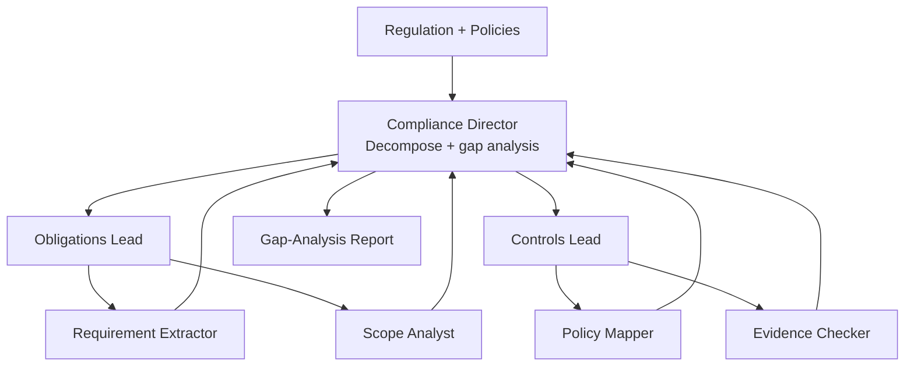

# How to Build a Multi-Agent Regulatory Compliance Checker in Python

Compliance gap analysis splits naturally into "what does the regulation require?" and "what do our
controls actually do?" — then a comparison. This recipe uses the **Hierarchical** pattern: a
compliance director delegates an Obligations team and a Controls team, each with specialists, and
synthesizes their outputs into a gap-analysis audit report.

**Patterns used:** Hierarchical

---

## Architecture



---

## Implementation

```python
import asyncio
from pyagent_patterns.base import Agent
from pyagent_patterns.orchestration import Hierarchical
from pyagent_patterns.orchestration.hierarchical import Team
from pyagent_providers import AnthropicLLM, OpenAILLM

checker = Hierarchical(
    manager=Agent(
        "compliance_director",
        AnthropicLLM("claude-sonnet-4-20250514"),
        system_prompt=(
            "Decompose the review into obligations and controls subtasks. After both teams report, "
            "produce a gap-analysis report: each obligation, the mapped control (or NONE), a "
            "compliance status (Met/Partial/Gap), and a remediation action. Prioritize gaps by risk."
        ),
    ),
    teams=[
        Team(
            name="Obligations",
            lead=Agent(
                "obligations_lead",
                OpenAILLM("gpt-4o-mini"),
                system_prompt="Consolidate the extracted obligations into a clean numbered list.",
            ),
            workers=[
                Agent(
                    "requirement_extractor",
                    OpenAILLM("gpt-4o-mini"),
                    system_prompt="Extract each discrete obligation ('the firm must...') from the regulation.",
                ),
                Agent(
                    "scope_analyst",
                    OpenAILLM("gpt-4o-mini"),
                    system_prompt="For each obligation, note who/what it applies to and any thresholds.",
                ),
            ],
        ),
        Team(
            name="Controls",
            lead=Agent(
                "controls_lead",
                OpenAILLM("gpt-4o-mini"),
                system_prompt="Consolidate the control findings into one mapping table.",
            ),
            workers=[
                Agent(
                    "policy_mapper",
                    OpenAILLM("gpt-4o-mini"),
                    system_prompt="Map internal policies to obligations; mark any obligation with no policy.",
                ),
                Agent(
                    "evidence_checker",
                    OpenAILLM("gpt-4o-mini"),
                    system_prompt="For each mapped control, note whether evidence of operation exists.",
                ),
            ],
        ),
    ],
)

result = asyncio.run(checker.run(
    "Regulation: GDPR Art. 30 (records of processing) and Art. 33 (breach notification). "
    "Internal policies: data-inventory policy v2, incident-response runbook attached."
))
print(result.output)
print(f"Teams: {result.metadata['team_names']}")
```

---

## Expected output

```text
GAP-ANALYSIS REPORT — GDPR Art. 30 & 33

Obligation 1 (records of processing) → Data-Inventory Policy v2 → Met.
Obligation 2 (72-hour breach notification) → Incident-Response Runbook → Partial
   (runbook lacks the 72-hour clock + supervisory-authority template).
Obligation 3 (processor records) → NONE → Gap (high risk).

Remediation (by risk): add processor register; add 72-hour timer + notification template.

Teams: ['Obligations', 'Controls']
```

---

## Customization

### Add an evidence team

```python
from pyagent_patterns.orchestration.hierarchical import Team
checker.teams.append(
    Team(name="Evidence",
         lead=Agent("evidence_lead", OpenAILLM("gpt-4o-mini"), system_prompt="Consolidate control-evidence findings."),
         workers=[Agent("sampler", OpenAILLM("gpt-4o-mini"), system_prompt="Note what evidence would prove each control operates.")]),
)
```

### Severity scoring

```python
checker.manager.system_prompt += " Score each gap by risk (High/Medium/Low) and sort the remediation plan by it."
```

### Multiple regulations at once

Run `checker.run(...)` per regulation with `asyncio.gather` and merge the gap reports.

---

## When to Use

| Situation | Use Hierarchical? |
|-----------|-------------------|
| Work splits into teams (obligations vs controls) with sub-work | ✅ Yes |
| You need one synthesized comparison/report | ✅ Yes |
| A single reviewer iteratively critiques one document | ❌ Use [Cross-Reflection](../../packages/patterns/resolution/cross-reflection.md) |
| A flat pool of workers, no teams | ❌ Use [Orchestrator-Workers](../../packages/patterns/orchestration/orchestrator-workers.md) |

---

## Cost Profile

| Tier | Typical model | Avg cost | Volume (200 reviews/mo) |
|------|--------------|----------|--------------------------|
| Director | claude-sonnet | $0.009 | $1.80 → ×200 = $360… |
| Leads ×2 + workers ×4 | gpt-4o-mini | $0.004 | $0.80 → ×200 = $160 |
| **Per review** | mix | **~$0.013** | **~$2.6k/yr** |

---

## See Also

- [Hierarchical pattern](../../packages/patterns/orchestration/hierarchical.md)
- [Contract Review](contract-review.md) — clause-by-clause reflection on a single document
- [Policy Briefing Pipeline](../government/policy-briefing.md) — hierarchical analysis for policy
- [Browse all recipes](../index.md)
