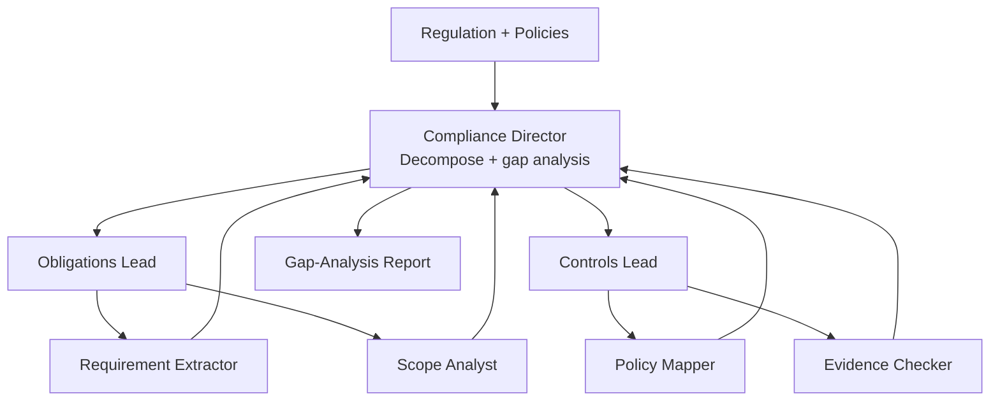

# How to Build a Multi-Agent Regulatory Compliance Checker in Python

Compliance gap analysis splits naturally into "what does the regulation require?" and "what do our
controls actually do?" — then a comparison. This recipe uses the **Hierarchical** pattern: a
compliance director delegates an Obligations team and a Controls team, each with specialists, and
synthesizes their outputs into a gap-analysis audit report.

**Patterns used:** Hierarchical

---

## Requirements

- **Functional** — extract every legal obligation from a regulation, map obligations to existing
  controls, flag gaps where evidence doesn't support a control, and synthesize a single gap-analysis
  report.
- **Non-functional** — the two sub-teams (Obligations, Controls) must be able to work without
  blocking on each other; only the final synthesis depends on both.
- **Audit** — every flagged gap must trace back to the specific obligation and the specific control
  (or absence of one) that produced it.
- **Not required** — no persistent memory across separate compliance checks (each regulation/scope
  is evaluated independently); no human approval gate in this recipe (a gap-analysis report is a
  draft for human review downstream, not an action taken automatically).

## Architecture decisions

| Decision | Why | Why not the alternative |
|---|---|---|
| **Hierarchical** for the two-team structure | Work decomposes into two genuinely distinct sub-teams (Obligations, Controls) that can each work internally in parallel, coordinated by one director. | **Orchestrator-Workers** would imply the team structure itself is discovered dynamically per-input; here it's fixed — every compliance check always needs an Obligations team and a Controls team. |
| Two workers per team lead, not a flat 5-agent Supervisor | `requirement_extractor`+`scope_analyst` and `policy_mapper`+`evidence_checker` are each meaningfully coupled sub-tasks within their team — a flat Supervisor routing to 4 independent specialists would lose that grouping. | A flat structure works when specialists are independent; here Controls' output genuinely depends on Obligations' scope, which the hierarchy expresses naturally via the director's synthesis step. |
| Uniform `fast` model for all 6 leaf workers, `smart` only for the director | Extraction/mapping/checking are pattern-matching tasks; synthesizing a coherent gap-analysis narrative across both teams' outputs needs stronger reasoning. | Using `smart` for every worker would multiply cost by ~7x for tasks that don't need it. |

## Four-pillar mapping

| Requirement | Pillar | Capability |
|---|---|---|
| Two-team decomposition with a synthesizing director | Execution | `Hierarchical` pattern |
| Track daily audit-run spend | Observability | `observability.cost_budget` |
| Trace each team's internal calls | Observability | `observability.tracing` |
| Version the check's scope/config as it evolves | Blueprint | `pyagent-blueprint diff` between revisions |

## Blueprint (declarative form)

The real, verified file at `examples/cookbook/legal-compliance/compliance_checker/blueprint.yaml`,
compiled against `PyAgentAdapter` as part of this repo's test suite:

```yaml
api_version: pyagent/v1
metadata:
  name: compliance-checker
  version: 1.0.0
  description: Director delegates obligations + controls teams; synthesizes gap-analysis report

providers:
  fast:  { model: gpt-4o-mini }
  smart: { model: claude-sonnet-4-20250514 }

agents:
  compliance_director:   { provider: smart, prompt: "Decompose, delegate, then synthesize gap-analysis report." }
  obligations_lead:      { provider: fast,  prompt: "Extract and structure all legal obligations." }
  controls_lead:         { provider: fast,  prompt: "Map obligations to controls; flag gaps." }
  requirement_extractor: { provider: fast,  prompt: "Extract every MUST/SHALL requirement." }
  scope_analyst:         { provider: fast,  prompt: "Identify departments, systems, data in scope." }
  policy_mapper:         { provider: fast,  prompt: "Map obligations to existing policies." }
  evidence_checker:      { provider: fast,  prompt: "Assess whether audit evidence exists for each control." }

workflows:
  check:
    pattern: hierarchical
    agents:
      manager: compliance_director
      teams:
        - { name: Obligations, lead: obligations_lead, workers: [requirement_extractor, scope_analyst] }
        - { name: Controls,    lead: controls_lead,    workers: [policy_mapper, evidence_checker] }

observability:
  tracing: { enabled: true }
  cost_budget: { daily_usd: 100.0, alert_threshold: 0.8 }
```

```bash
pyagent-blueprint validate compliance-checker.yaml
pyagent-blueprint test compliance-checker.yaml
```

## Production checklist

Ran this exact blueprint through `PyAgentAdapter.compile()` and inspected the real diagnostics:

- ✅ **The hierarchical check runs as declared** — `check` compiles and executes against the native
  pattern registry with no diagnostics on the workflow structure itself.
- ⚠️ **`observability.cost_budget` is declared but not auto-enforced** — compiling this blueprint
  emits `BUDGET_UNSUPPORTED`: the $100/day budget is recorded in the spec but nothing stops a run
  from exceeding it. Wire real enforcement via `graph.wire_cost_tracker(tracker)` if you need a hard
  stop.
- **No recovery policy is declared** — if a worker fails mid-run, this blueprint doesn't specify
  a retry/fallback; add one via the recovery block if that's a real requirement for your deployment.
- **No human approval gate** — this composes cleanly with
  [Human-in-the-Loop](../../packages/patterns/advanced/human-in-the-loop.md) as a follow-on step if
  the gap-analysis report needs sign-off before circulating outside the compliance team.

---

## Architecture



---

## Implementation

```python
import asyncio
from pyagent_patterns.base import Agent
from pyagent_patterns.orchestration import Hierarchical
from pyagent_patterns.orchestration.hierarchical import Team
from pyagent_providers import AnthropicLLM, OpenAILLM

checker = Hierarchical(
    manager=Agent(
        "compliance_director",
        AnthropicLLM("claude-sonnet-4-20250514"),
        system_prompt=(
            "Decompose the review into obligations and controls subtasks. After both teams report, "
            "produce a gap-analysis report: each obligation, the mapped control (or NONE), a "
            "compliance status (Met/Partial/Gap), and a remediation action. Prioritize gaps by risk."
        ),
    ),
    teams=[
        Team(
            name="Obligations",
            lead=Agent(
                "obligations_lead",
                OpenAILLM("gpt-4o-mini"),
                system_prompt="Consolidate the extracted obligations into a clean numbered list.",
            ),
            workers=[
                Agent(
                    "requirement_extractor",
                    OpenAILLM("gpt-4o-mini"),
                    system_prompt="Extract each discrete obligation ('the firm must...') from the regulation.",
                ),
                Agent(
                    "scope_analyst",
                    OpenAILLM("gpt-4o-mini"),
                    system_prompt="For each obligation, note who/what it applies to and any thresholds.",
                ),
            ],
        ),
        Team(
            name="Controls",
            lead=Agent(
                "controls_lead",
                OpenAILLM("gpt-4o-mini"),
                system_prompt="Consolidate the control findings into one mapping table.",
            ),
            workers=[
                Agent(
                    "policy_mapper",
                    OpenAILLM("gpt-4o-mini"),
                    system_prompt="Map internal policies to obligations; mark any obligation with no policy.",
                ),
                Agent(
                    "evidence_checker",
                    OpenAILLM("gpt-4o-mini"),
                    system_prompt="For each mapped control, note whether evidence of operation exists.",
                ),
            ],
        ),
    ],
)

result = asyncio.run(checker.run(
    "Regulation: GDPR Art. 30 (records of processing) and Art. 33 (breach notification). "
    "Internal policies: data-inventory policy v2, incident-response runbook attached."
))
print(result.output)
print(f"Teams: {result.metadata['team_names']}")
```

---

## Expected output

```text
GAP-ANALYSIS REPORT — GDPR Art. 30 & 33

Obligation 1 (records of processing) → Data-Inventory Policy v2 → Met.
Obligation 2 (72-hour breach notification) → Incident-Response Runbook → Partial
   (runbook lacks the 72-hour clock + supervisory-authority template).
Obligation 3 (processor records) → NONE → Gap (high risk).

Remediation (by risk): add processor register; add 72-hour timer + notification template.

Teams: ['Obligations', 'Controls']
```

---

## Customization

### Add an evidence team

```python
from pyagent_patterns.orchestration.hierarchical import Team
checker.teams.append(
    Team(name="Evidence",
         lead=Agent("evidence_lead", OpenAILLM("gpt-4o-mini"), system_prompt="Consolidate control-evidence findings."),
         workers=[Agent("sampler", OpenAILLM("gpt-4o-mini"), system_prompt="Note what evidence would prove each control operates.")]),
)
```

### Severity scoring

```python
checker.manager.system_prompt += " Score each gap by risk (High/Medium/Low) and sort the remediation plan by it."
```

### Multiple regulations at once

Run `checker.run(...)` per regulation with `asyncio.gather` and merge the gap reports.

---

## When to Use

| Situation | Use Hierarchical? |
|-----------|-------------------|
| Work splits into teams (obligations vs controls) with sub-work | ✅ Yes |
| You need one synthesized comparison/report | ✅ Yes |
| A single reviewer iteratively critiques one document | ❌ Use [Cross-Reflection](../../packages/patterns/resolution/cross-reflection.md) |
| A flat pool of workers, no teams | ❌ Use [Orchestrator-Workers](../../packages/patterns/orchestration/orchestrator-workers.md) |

---

## Cost Profile

| Tier | Typical model | Avg cost | Volume (200 reviews/mo) |
|------|--------------|----------|--------------------------|
| Director | claude-sonnet | $0.009 | $1.80 → ×200 = $360… |
| Leads ×2 + workers ×4 | gpt-4o-mini | $0.004 | $0.80 → ×200 = $160 |
| **Per review** | mix | **~$0.013** | **~$2.6k/yr** |

---

## See Also

- [Hierarchical pattern](../../packages/patterns/orchestration/hierarchical.md)
- [Contract Review](contract-review.md) — clause-by-clause reflection on a single document
- [Policy Briefing Pipeline](../government/policy-briefing.md) — hierarchical analysis for policy
- [Browse all recipes](../index.md)
