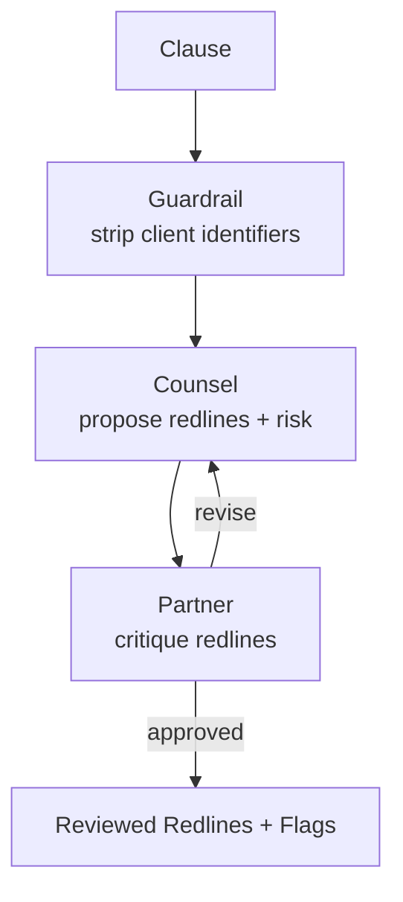

# How to Build a Multi-Agent Contract Review Assistant in Python

A single model reviewing a contract will confidently miss the clause that matters. This recipe uses
**Cross-Reflection**: a drafting "counsel" proposes redlines and risk notes, an independent reviewing
"partner" critiques them, and they iterate until the review is solid — surfacing liability before a
human ever opens the document.

**Patterns used:** [Cross-Reflection](../../packages/patterns/resolution/cross-reflection.md) ·
[Guardrails](../../guides/guardrails.md)

---

## Architecture



---

## Implementation

```bash
pip install pyagent-patterns pyagent-providers
```

```python
import asyncio
from pyagent_patterns.base import Agent
from pyagent_patterns.resolution import CrossReflection
from pyagent_patterns.guardrails import GuardrailChain, PIIGuard
from pyagent_providers import AnthropicLLM

smart_llm = AnthropicLLM("claude-sonnet-4-20250514")

# Keep counterparty / client identifiers out of third-party model logs.
confidentiality_guard = GuardrailChain([PIIGuard(redact=True)])

review = CrossReflection(
    generator=Agent(
        "counsel", smart_llm,
        system_prompt=(
            "You are reviewing counsel. For the clause, propose specific redlines and explain the "
            "risk each one mitigates. Be concrete: quote the language you would change."
        ),
    ),
    reviewer=Agent(
        "partner", smart_llm,
        system_prompt=(
            "You are the reviewing partner. Critique the proposed redlines: flag anything that "
            "increases our liability, weakens an indemnity, or misreads the clause. Reply 'APPROVED' "
            "only when the redlines are sound."
        ),
    ),
    max_rounds=2,
)

CLAUSE = (
    "Limitation of Liability. In no event shall either party's aggregate liability exceed the fees "
    "paid by Customer in the three (3) months preceding the claim. This cap applies to all claims, "
    "including those arising from gross negligence or breach of the confidentiality obligations."
)

async def main():
    safe_clause = confidentiality_guard.check(CLAUSE).sanitized_content or CLAUSE
    result = await review.run(safe_clause)
    print(result.output)   # surface to a human for final sign-off

asyncio.run(main())
```

---

## Expected Output

```text
REVIEWED REDLINES — Limitation of Liability

1. Carve out gross negligence, willful misconduct, and confidentiality breaches from the cap.
   Risk: as written, the 3-month cap shields the counterparty even for a data breach. (partner: agreed,
   highest priority)
2. Increase the cap to 12 months' fees (market standard for this contract value).
3. Make the cap mutual and add a separate, higher cap for IP-indemnity claims.

FLAGS: the original cap is unusually low and applies to gross negligence — do not sign as-is.
```

The partner's critique is what catches the buried "including … gross negligence" — a second,
adversarial reading that a single pass tends to gloss over.

---

## Customization

### Review a whole contract clause-by-clause

```python
async def review_contract(clauses: list[str]) -> list[str]:
    safe = [confidentiality_guard.check(c).sanitized_content or c for c in clauses]
    results = await asyncio.gather(*(review.run(c) for c in safe))
    return [r.output for r in results]
```

### Add a playbook check

Prepend the firm's negotiation playbook to the counsel prompt so redlines follow house positions:

```python
review.generator.system_prompt += "\n\nFollow our playbook: liability cap ≥ 12 months; mutual indemnities."
```

### Gate sign-off behind a human

Pair with [Human-in-the-Loop](../../packages/patterns/advanced/human-in-the-loop.md) so any clause the
partner flags as high-risk routes to an attorney — see the [Support Router](../customer-support/support-router.md).

---

## When to Use

| Situation | Fit |
|-----------|-----|
| A second, independent agent should review the first | ✅ Cross-Reflection |
| Confidential identifiers must be stripped | ✅ Guardrails |
| The same agent should critique its own work | ❌ Use [Self-Reflection](../../packages/patterns/resolution/self-reflection.md) |
| Many reviewers vote on a verdict | ❌ Use [Voting](../../packages/patterns/resolution/voting.md) |

---

## Cost Profile

| Stage | Typical model | Avg cost | Volume (500 contracts/mo, 20 clauses each) |
|-------|--------------|----------|---------------------------------------------|
| Counsel + partner (≤2 rounds) | claude-sonnet | $0.010/clause | ~$100/mo |
| **Per clause** | claude-sonnet | **~$0.010** | **~$100/mo** |

Cross-Reflection roughly doubles per-clause cost vs a single pass — worth it for high-liability clauses;
use a single pass for boilerplate.

---

## See Also

- [Cross-Reflection pattern](../../packages/patterns/resolution/cross-reflection.md) ·
  [Guardrails guide](../../guides/guardrails.md)
- [Regulatory Compliance Checker](compliance-checker.md) — hierarchical gap analysis against regulations
- [Browse all recipes](../index.md)
