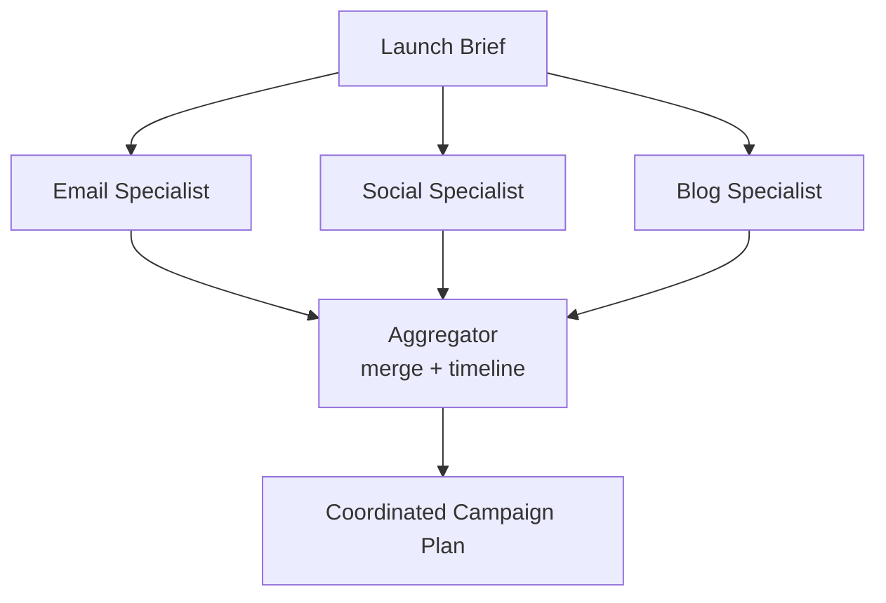

# How to Build a Multi-Agent Marketing Campaign Planner in Python

A launch needs email, social, and blog working together — but drafting them one after another loses
the parallelism and the cross-channel consistency. This recipe uses **Fan-Out / Fan-In**: channel
specialists draft simultaneously, then an aggregator weaves them into one coordinated campaign plan
with a shared timeline and message.

**Patterns used:** [Fan-Out / Fan-In](../../packages/patterns/orchestration/fan-out-fan-in.md)

---

## Architecture



---

## Implementation

```bash
pip install pyagent-patterns pyagent-providers
```

```python
import asyncio
from pyagent_patterns.base import Agent
from pyagent_patterns.orchestration import FanOutFanIn
from pyagent_providers import AnthropicLLM, OpenAILLM

fast_llm = OpenAILLM("gpt-4o-mini")
smart_llm = AnthropicLLM("claude-sonnet-4-20250514")

campaign = FanOutFanIn(
    agents=[
        Agent("email", fast_llm,
              system_prompt="Draft a 3-email launch sequence: teaser, launch, follow-up. Subject + 2 lines each."),
        Agent("social", fast_llm,
              system_prompt="Draft a 1-week social calendar (LinkedIn + X): 5 posts with hooks and CTAs."),
        Agent("blog", fast_llm,
              system_prompt="Outline a launch blog post: title, 5 section headers, and the key takeaway."),
    ],
    aggregator=Agent(
        "planner", smart_llm,
        system_prompt=(
            "Merge the channel drafts into ONE coordinated campaign plan: a shared core message, a "
            "day-by-day timeline across channels, and the single primary call-to-action."
        ),
    ),
)

async def main():
    brief = "Launch: PyAgent 1.0 — multi-agent orchestration for Python. Audience: senior Python engineers."
    result = await campaign.run(brief)
    print(result.output)

asyncio.run(main())
```

---

## Expected Output

```text
CAMPAIGN: PyAgent 1.0 Launch  —  core message: "18 named patterns, zero boilerplate"
Primary CTA: pip install pyagent-all → quickstart

Timeline
  Day 1  Blog goes live + teaser email + LinkedIn announcement post
  Day 2  X thread (pattern of the day) + email "what's new"
  Day 3  Social: benchmark chart post
  Day 5  Follow-up email (cookbook recipes) + LinkedIn case-study post

Assets: 3 emails, 5 social posts, 1 blog outline — all on the shared message.
```

Because the channels are drafted in parallel and merged once, the plan stays consistent and the
wall-clock is one channel's latency, not three.

---

## Customization

### Add a brand-voice review

```python
from pyagent_patterns.orchestration import Pipeline
voice = Agent("brand_voice", fast_llm, system_prompt="Rewrite all copy to match our voice: confident, concrete, no hype.")
campaign_on_brand = Pipeline(stages=[campaign, voice])
```

### Add a paid-ads channel

```python
campaign.agents.append(
    Agent("ads", fast_llm, system_prompt="Draft 3 Google/LinkedIn ad variations with headlines + descriptions.")
)
```

### Localize for multiple markets

```python
async def localize(plan: str, locales: list[str]) -> dict:
    t = Agent("translator", fast_llm, system_prompt="Localize this campaign for the given market, adapting idioms.")
    out = await asyncio.gather(*(t.run(f"{plan}\n\nMarket: {loc}") for loc in locales))
    return dict(zip(locales, (r.output for r in out)))
```

---

## When to Use

| Situation | Fit |
|-----------|-----|
| Independent specialists drafted in parallel, merged once | ✅ Fan-Out / Fan-In |
| Channels must stay consistent under one message | ✅ (aggregator enforces it) |
| Which channels to use depends on the brief | ❌ Use [Orchestrator-Workers](../../packages/patterns/orchestration/orchestrator-workers.md) |
| Drafts must iterate to a quality bar | ❌ Use [Evaluator-Optimizer](../../packages/patterns/resolution/evaluator-optimizer.md) |

---

## Cost Profile

| Stage | Typical model | Avg cost | Volume (200 campaigns/mo) |
|-------|--------------|----------|----------------------------|
| 3 channel specialists | gpt-4o-mini | $0.0012 | $0.24 |
| Aggregator | claude-sonnet | $0.004 | $0.80 |
| **Per campaign** | mix | **~$0.005** | **~$1/mo** |

A great starter recipe — cheap, fast, and the parallel structure generalizes to any multi-channel brief.

---

## See Also

- [Fan-Out / Fan-In pattern](../../packages/patterns/orchestration/fan-out-fan-in.md)
- [Product Launch Planner](../ecommerce-retail/product-launch-planner.md) — orchestrator-driven launch planning
- [Browse all recipes](../index.md)
