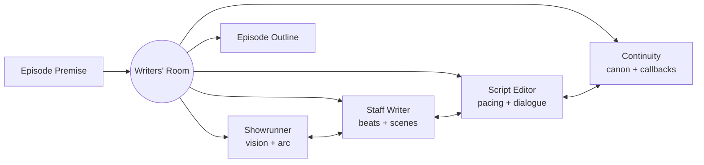

# How to Build a Multi-Agent Writers' Room in Python

A writers' room works because each person holds a distinct role and reacts to the others across
several passes. This recipe uses the **Role-Based** pattern: a showrunner, staff writer, script
editor, and continuity supervisor each contribute from their role and update their view over
multiple rounds, converging on a coherent episode outline.

**Patterns used:** Role-Based

---

## Architecture



---

## Implementation

```python
import asyncio
from pyagent_patterns.base import Agent
from pyagent_patterns.structural import RoleBased
from pyagent_providers import AnthropicLLM

room = RoleBased(
    agents=[
        Agent(
            "showrunner",
            AnthropicLLM("claude-sonnet-4-20250514"),
            system_prompt=(
                "You are the showrunner. Hold the season arc and tone. Set the episode's emotional "
                "throughline and make the final call. Update your view if a better idea surfaces."
            ),
        ),
        Agent(
            "staff_writer",
            AnthropicLLM("claude-sonnet-4-20250514"),
            system_prompt=(
                "You are the staff writer. Break the premise into act beats and key scenes. "
                "Propose concrete story turns that serve the showrunner's throughline."
            ),
        ),
        Agent(
            "script_editor",
            AnthropicLLM("claude-haiku-3-5-20241022"),
            system_prompt=(
                "You are the script editor. Tighten pacing, flag slow scenes, and sharpen the "
                "act breaks. Keep the episode to a 42-minute runtime."
            ),
        ),
        Agent(
            "continuity",
            AnthropicLLM("claude-haiku-3-5-20241022"),
            system_prompt=(
                "You are continuity supervisor. Guard canon: character knowledge, timeline, and "
                "established facts. Suggest callbacks and flag contradictions."
            ),
        ),
    ],
    rounds=2,
)

result = asyncio.run(room.run(
    "Premise: our detective discovers her mentor faked evidence years ago. "
    "Episode 6 of 8. Must move the season's corruption arc forward."
))
print(result.output)
print(f"Roles: {result.metadata['roles']}, rounds: {result.metadata['rounds']}")
```

---

## Expected output

```text
EPISODE 6 — "Chain of Custody"  (cold open + 4 acts, ~42 min)

Act 1: Detective finds the doctored file; chooses silence (showrunner: this is the moral pivot).
Act 2: She tests the theory; staff-writer adds the evidence-locker set piece.
Act 3: Mentor senses she knows (editor trimmed a redundant interrogation).
Act 4: Cliffhanger — she pulls the original case file (continuity: callback to E2 partner death).

Roles: ['showrunner', 'staff_writer', 'script_editor', 'continuity'], rounds: 2
```

---

## Customization

### More revision rounds

```python
room = RoleBased(agents=room._agents, rounds=3)  # deeper iteration for a season finale
```

### Add a network-notes role

```python
room.agents.append(
    Agent("network_exec", AnthropicLLM("claude-haiku-3-5-20241022"),
          system_prompt="Give network notes: broad appeal, ad breaks, and standards-and-practices flags."),
)
```

### Control tone

```python
room.agents[0].system_prompt += " Target tone: grounded prestige drama, no camp."
```

---

## When to Use

| Situation | Use Role-Based? |
|-----------|-----------------|
| Distinct perspectives must collaborate and react over rounds | ✅ Yes |
| Each agent holds a stable role/voice | ✅ Yes |
| Roles map to teams with their own sub-work | ❌ Use [Hierarchical](../../packages/patterns/orchestration/hierarchical.md) |
| You only need parallel opinions merged once | ❌ Use [Fan-Out / Fan-In](../../packages/patterns/orchestration/fan-out-fan-in.md) |

---

## Cost Profile

| Driver | Typical model | Avg cost | Notes |
|--------|--------------|----------|-------|
| 4 roles × 2 rounds | sonnet + haiku mix | $0.018 | senior roles on sonnet |
| **Per episode outline** | mix | **~$0.018** | scales with roles × rounds |

Put the senior roles (showrunner, writer) on a stronger model and support roles on a cheaper one.

---

## See Also

- [Role-Based pattern](../../packages/patterns/structural/role-based.md)
- [Software Startup Simulation](../software-engineering/startup-simulation.md) — role-play with PM/Architect/Engineer/QA
- [Browse all recipes](../index.md)
