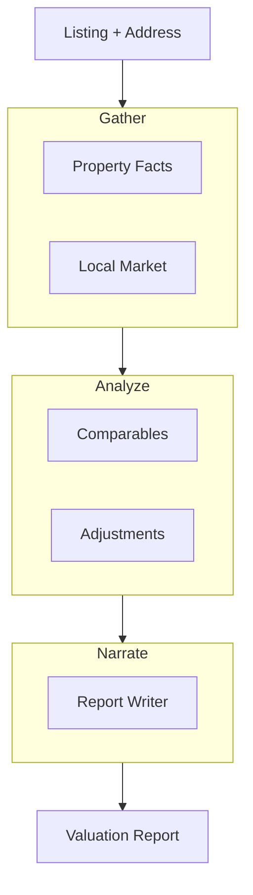

# How to Build a Multi-Agent Property Valuation Pipeline in Python

A property valuation moves through clear levels of abstraction: pull the raw facts, run comparable
analysis, then write the narrative. This recipe uses the **Layered** pattern, where each layer's
agents process the previous layer's output at a coarser granularity — the same separation an
appraiser uses between data collection, analysis, and reporting.

**Patterns used:** Layered

---

## Architecture



---

## Implementation

```python
import asyncio
from pyagent_patterns.base import Agent
from pyagent_patterns.structural import Layered
from pyagent_patterns.structural.layered import Layer
from pyagent_providers import GeminiLLM, AnthropicLLM

valuation = Layered(
    layers=[
        Layer(
            name="gather",
            agents=[
                Agent(
                    "property_facts",
                    GeminiLLM("gemini-2.5-flash"),
                    system_prompt="Extract property facts: beds, baths, sqft, lot, year built, condition.",
                ),
                Agent(
                    "market_facts",
                    GeminiLLM("gemini-2.5-flash"),
                    system_prompt="Summarize the local market: median price/sqft, days on market, trend.",
                ),
            ],
        ),
        Layer(
            name="analyze",
            agents=[
                Agent(
                    "comps",
                    AnthropicLLM("claude-sonnet-4-20250514"),
                    system_prompt="Select 3-5 comparable sales and explain why each is comparable.",
                ),
                Agent(
                    "adjustments",
                    AnthropicLLM("claude-sonnet-4-20250514"),
                    system_prompt="Apply $ adjustments to each comp for size, condition, and location.",
                ),
            ],
        ),
        Layer(
            name="narrate",
            agents=[
                Agent(
                    "report_writer",
                    AnthropicLLM("claude-sonnet-4-20250514"),
                    system_prompt=(
                        "Write a valuation report: estimated value range, the adjusted comps that "
                        "support it, key risks, and a confidence level."
                    ),
                ),
            ],
        ),
    ],
)

result = asyncio.run(valuation.run(
    "123 Maple St: 3 bed / 2 bath, 1,650 sqft, built 1998, good condition, "
    "quiet suburban street. Recent nearby sales attached."
))
print(result.output)
print(f"Layers: {result.metadata['layer_names']}")
```

---

## Expected output

```text
VALUATION REPORT — 123 Maple St

Estimated value: $452,000 – $471,000 (point estimate $462,000)
Comps:    3 adjusted sales within 0.4 mi, +$8k condition / −$5k size adjustments.
Risks:    thin comp set; rising days-on-market suggests softening demand.
Confidence: Medium-High.

Layers: ['gather', 'analyze', 'narrate']
```

Each layer hands a cleaner, more abstract artefact to the next — raw facts → adjusted comps →
narrative — so no single agent has to do everything at once.

---

## Customization

### Add a QA layer

```python
from pyagent_patterns.structural.layered import Layer
valuation.layers.append(
    Layer(name="qa", agents=[Agent("reviewer", AnthropicLLM("claude-sonnet-4-20250514"),
          system_prompt="Sanity-check the value range against the comps; flag unsupported adjustments.")]),
)
```

### Swap in live data sources

Replace the gather-layer prompts with tool-using [ReAct](../../packages/patterns/advanced/react.md) agents
that pull MLS comps and tax records.

### Batch a portfolio

```python
async def value_all(listings: list[str]) -> list[str]:
    out = await asyncio.gather(*(valuation.run(x) for x in listings))
    return [r.output for r in out]
```

---

## When to Use

| Situation | Use Layered? |
|-----------|--------------|
| Work moves through distinct levels of abstraction | ✅ Yes |
| Each level has several agents working in parallel | ✅ Yes |
| It's a single linear chain of agents | ❌ Use [Pipeline](../../packages/patterns/orchestration/pipeline.md) |
| A manager delegates to teams | ❌ Use [Hierarchical](../../packages/patterns/orchestration/hierarchical.md) |

---

## Cost Profile

| Layer | Typical model | Avg cost | Volume (1k valuations/mo) |
|-------|--------------|----------|----------------------------|
| Gather (2 agents) | gemini-flash | $0.0008 | $0.80 → $24/mo |
| Analyze (2 agents) | claude-sonnet | $0.006 | $180/mo |
| Narrate (1 agent) | claude-sonnet | $0.004 | $120/mo |
| **Per valuation** | mix | **~$0.011** | **~$330/mo** |

---

## See Also

- [Layered pattern](../../packages/patterns/structural/layered.md)
- [Property data feeds a Pipeline?](../../packages/patterns/orchestration/pipeline.md) — when the stages are strictly linear
- [Browse all recipes](../index.md)
