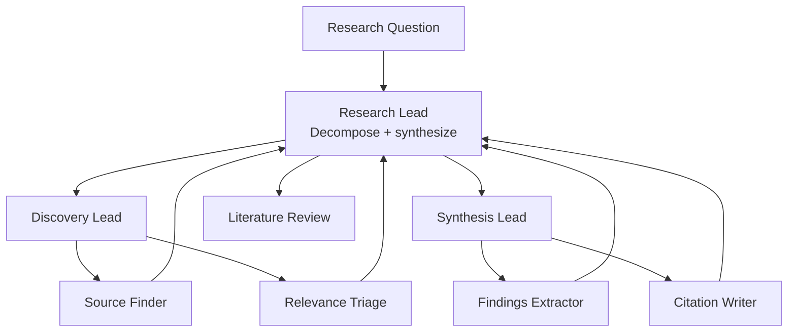

# How to Build a Multi-Agent Literature Review Team in Python

A literature review is team work: some people find and triage sources, others extract findings and
write the synthesis. This recipe uses the **Hierarchical** pattern — a research lead delegates a
Discovery team and a Synthesis team, each with specialists, and merges their output into a cited
review with a clear gap statement.

**Patterns used:** Hierarchical

---

## Architecture



---

## Implementation

```python
import asyncio
from pyagent_patterns.base import Agent
from pyagent_patterns.orchestration import Hierarchical
from pyagent_patterns.orchestration.hierarchical import Team
from pyagent_providers import AnthropicLLM, OpenAILLM

review_team = Hierarchical(
    manager=Agent(
        "research_lead",
        AnthropicLLM("claude-sonnet-4-20250514"),
        system_prompt=(
            "Decompose the question for the Discovery and Synthesis teams. After both report, "
            "write a literature review: themes, key findings with citations, points of consensus "
            "and disagreement, and a 'research gap' statement."
        ),
    ),
    teams=[
        Team(
            name="Discovery",
            lead=Agent(
                "discovery_lead",
                OpenAILLM("gpt-4o-mini"),
                system_prompt="Consolidate candidate sources into a deduplicated, triaged shortlist.",
            ),
            workers=[
                Agent(
                    "source_finder",
                    OpenAILLM("gpt-4o-mini"),
                    system_prompt="Propose the most relevant papers/sources for the question with one-line reasons.",
                ),
                Agent(
                    "relevance_triage",
                    OpenAILLM("gpt-4o-mini"),
                    system_prompt="Rate each source's relevance and recency; drop weak ones.",
                ),
            ],
        ),
        Team(
            name="Synthesis",
            lead=Agent(
                "synthesis_lead",
                OpenAILLM("gpt-4o-mini"),
                system_prompt="Organize extracted findings into themes for the lead.",
            ),
            workers=[
                Agent(
                    "findings_extractor",
                    AnthropicLLM("claude-haiku-3-5-20241022"),
                    system_prompt="Extract each source's key claim, method, and limitation.",
                ),
                Agent(
                    "citation_writer",
                    OpenAILLM("gpt-4o-mini"),
                    system_prompt="Format every cited claim with an inline citation and a reference list.",
                ),
            ],
        ),
    ],
)

result = asyncio.run(review_team.run(
    "Question: does retrieval-augmented generation reduce hallucination in clinical QA?"
))
print(result.output)
print(f"Teams: {result.metadata['team_names']}, workers: {result.metadata['total_workers']}")
```

---

## Expected output

```text
LITERATURE REVIEW — RAG and hallucination in clinical QA

Themes:    grounding quality, retrieval recall, evaluation metrics.
Findings:  RAG cuts unsupported claims when retrieval recall is high [1][3]; gains vanish on
           rare conditions [2]; metric disagreement complicates comparison [4].
Consensus: retrieval quality dominates the effect.
Gap:       few studies test long-tail conditions or use clinician-graded faithfulness.

Teams: ['Discovery', 'Synthesis'], workers: 4
```

For an autonomous, tool-using alternative, see the [Research Assistant](research-assistant.md)
(ReAct + Fan-Out).

---

## Customization

### Live search tools

Give the Discovery team a [ReAct](../../packages/patterns/advanced/react.md) agent that queries arXiv /
Semantic Scholar instead of relying on the model's memory.

### Add a critique team

```python
from pyagent_patterns.orchestration.hierarchical import Team
review_team.teams.append(
    Team(name="Critique",
         lead=Agent("critique_lead", OpenAILLM("gpt-4o-mini"), system_prompt="Consolidate methodological critiques."),
         workers=[Agent("skeptic", OpenAILLM("gpt-4o-mini"), system_prompt="Challenge each finding's validity and bias.")]),
)
```

### Citation format

```python
review_team.manager.system_prompt += " Format references in APA 7th edition."
```

---

## When to Use

| Situation | Use Hierarchical? |
|-----------|-------------------|
| Review work splits into find-then-synthesize teams | ✅ Yes |
| You want one cited deliverable from many specialists | ✅ Yes |
| A single agent should search-and-reason with tools | ❌ Use [ReAct](../../packages/patterns/advanced/react.md) |
| Parallel analysts merged once, no hierarchy | ❌ Use [Fan-Out / Fan-In](../../packages/patterns/orchestration/fan-out-fan-in.md) |

---

## Cost Profile

| Tier | Typical model | Avg cost | Volume (500 reviews/mo) |
|------|--------------|----------|--------------------------|
| Lead (decompose + synthesize) | claude-sonnet | $0.009 | $4.50… ×500 |
| Leads ×2 + workers ×4 | mini + haiku | $0.005 | $2.50 |
| **Per review** | mix | **~$0.014** | **~$7/mo per 500** |

---

## See Also

- [Hierarchical pattern](../../packages/patterns/orchestration/hierarchical.md)
- [Research Assistant](research-assistant.md) — autonomous ReAct + Fan-Out research
- [Browse all recipes](../index.md)
