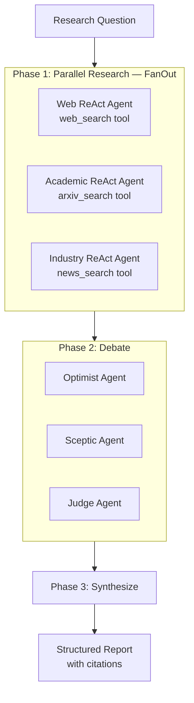

# How to Build a Multi-Agent Research Assistant in Python

A multi-agent research system that parallelizes information gathering, debates findings to surface disagreements, synthesizes into a structured report, and cites sources — all within a controlled token budget.

**Patterns used:** ReAct, FanOutFanIn, Debate, Pipeline, CompressMiddleware

---

## Architecture



---

## Implementation

```python
import asyncio
from pyagent_patterns.base import Agent
from pyagent_patterns.orchestration import FanOutFanIn, Pipeline
from pyagent_patterns.resolution import Debate
from pyagent_patterns.advanced import ReAct
from pyagent_compress import CompressMiddleware, TokenBudget
from pyagent_providers import AnthropicLLM, OpenAILLM

# ── LLMs ──────────────────────────────────────────────────────────────────────
fast_llm   = OpenAILLM("gpt-4o-mini")
smart_llm  = AnthropicLLM("claude-sonnet-4-20250514")
judge_llm  = AnthropicLLM("claude-sonnet-4-20250514")

# ── Token budget ──────────────────────────────────────────────────────────────
budget     = TokenBudget(workflow_limit=80_000, per_agent_limit=15_000)
middleware = CompressMiddleware(target_ratio=0.5, budget=budget)

# ── Tool stubs (replace with real implementations) ───────────────────────────
def web_search(query: str) -> str:
    # In production: call Bing/Google Search API
    return f"[web results for '{query}': revenue +18% YoY, margins at 25%]"

def arxiv_search(query: str) -> str:
    # In production: call arxiv.org API
    return f"[arxiv results for '{query}': 3 papers on scaling laws and efficiency]"

def news_search(query: str) -> str:
    # In production: call NewsAPI or similar
    return f"[news for '{query}': new partnership announced, analyst upgrades to Buy]"

# ── Phase 1: Parallel research via ReAct ─────────────────────────────────────
web_researcher = middleware.wrap(ReAct(
    agent=Agent("web_agent", smart_llm,
                system_prompt=(
                    "You are a web research specialist. Use the search tool to gather "
                    "current facts, statistics, and news about the topic. "
                    "Return findings as bullet points with source URLs."
                )),
    tools={"web_search": web_search},
    max_steps=4,
))

academic_researcher = middleware.wrap(ReAct(
    agent=Agent("academic_agent", smart_llm,
                system_prompt=(
                    "You are an academic research specialist. Search for peer-reviewed "
                    "papers and studies about the topic. Cite paper titles and authors."
                )),
    tools={"arxiv_search": arxiv_search},
    max_steps=3,
))

industry_researcher = middleware.wrap(ReAct(
    agent=Agent("industry_agent", fast_llm,
                system_prompt=(
                    "You are an industry analyst. Find recent news, analyst reports, "
                    "and market developments. Focus on practical business implications."
                )),
    tools={"news_search": news_search},
    max_steps=3,
))

# ── Phase 2: Fan-out to analysis agents, then debate ─────────────────────────
analysis_fanout = FanOutFanIn(
    agents=[
        middleware.wrap(Agent("market_analyst", fast_llm,
                              system_prompt="Analyze market and competitive implications.")),
        middleware.wrap(Agent("tech_analyst",   fast_llm,
                              system_prompt="Analyze technical feasibility and innovation.")),
        middleware.wrap(Agent("risk_analyst",   fast_llm,
                              system_prompt="Identify risks, uncertainties, and failure modes.")),
    ],
    aggregator=Agent("pre_synthesis", fast_llm,
                     system_prompt="Combine all analyses into a unified brief."),
)

debate = Debate(
    debaters=[
        Agent("optimist", fast_llm,
              system_prompt=(
                  "You are an optimist. Argue for the most positive interpretation "
                  "of the research findings. Cite specific evidence."
              )),
        Agent("sceptic",  fast_llm,
              system_prompt=(
                  "You are a sceptic. Challenge assumptions and point out gaps, "
                  "risks, and counter-evidence in the research findings."
              )),
    ],
    judge=Agent("debate_judge", judge_llm,
                system_prompt=(
                    "You are an impartial judge. Evaluate both sides and produce "
                    "a balanced verdict with key uncertainties highlighted."
                )),
    rounds=2,
)

# ── Phase 3: Final synthesis with citations ───────────────────────────────────
synthesizer = Agent(
    "synthesizer", smart_llm,
    system_prompt=(
        "You are a research writer. Synthesize all the research, analysis, and debate "
        "into a structured report with these sections:\n"
        "1. Executive Summary (3 bullets)\n"
        "2. Key Findings (with citations)\n"
        "3. Bull Case\n"
        "4. Bear Case\n"
        "5. Uncertainties\n"
        "6. Recommendation\n"
        "Be specific. Include numbers wherever available."
    ),
)

# ── Main research function ────────────────────────────────────────────────────
async def research(question: str) -> dict:
    print(f"Researching: {question}")

    # Phase 1: gather in parallel
    web_task      = web_researcher.run(question)
    academic_task = academic_researcher.run(question)
    industry_task = industry_researcher.run(question)

    web_r, academic_r, industry_r = await asyncio.gather(
        web_task, academic_task, industry_task
    )

    # Combine gathered research
    combined_research = (
        f"## Web Research\n{web_r.output}\n\n"
        f"## Academic Research\n{academic_r.output}\n\n"
        f"## Industry Findings\n{industry_r.output}"
    )

    # Phase 2: analyze and debate
    analysis_r = await analysis_fanout.run(combined_research)
    debate_r   = await debate.run(
        f"Based on this research:\n{analysis_r.output}\n\nDebate the implications."
    )

    # Phase 3: final report
    final_r = await synthesizer.run(
        f"Research gathered:\n{combined_research}\n\n"
        f"Analysis:\n{analysis_r.output}\n\n"
        f"Debate verdict:\n{debate_r.output}"
    )

    return {
        "report":          final_r.output,
        "debate_verdict":  debate_r.output,
        "budget_summary":  budget.summary(),
        "tokens_used":     budget.total_consumed,
    }


if __name__ == "__main__":
    result = asyncio.run(research("Nvidia's position in the AI infrastructure market"))

    print("=" * 60)
    print(result["report"])
    print("\n--- Token budget ---")
    print(result["budget_summary"])
```

---

## Expected Output

```
Researching: Nvidia's position in the AI infrastructure market

============================================================
## Executive Summary
• Nvidia holds ~80% GPU market share for AI training workloads
• H100/H200 demand exceeds supply by 3-4x; GB200 NVLink racks backlogged
• Key risk: AMD MI300X gaining traction at hyperscalers, custom silicon (TPU/Trainium)

## Key Findings
• Revenue: $44.1B (FY Q3 2025), up 94% YoY — driven by Data Center segment ($30.8B)
• Margins: Gross margin 74.6%, operating margin 62.4% — best-in-class for hardware
• CUDA ecosystem: 4M+ developers, 3,000+ GPU-optimized applications (arxiv: "CUDA Dominance
  in ML Workloads", Chen et al. 2024)
• Announced partnerships with AWS, Azure, GCP for GB200 NVLink rack deployments

## Bull Case
Strong moat: CUDA ecosystem is 10+ years deep and switching costs are very high...

## Bear Case
AMD MI300X achieves 95% of H100 performance at 20% lower cost in benchmarks...

## Uncertainties
• Custom silicon timeline (Apple, Google, Amazon) — 2-3 year horizon unclear
• Export restrictions to China (~15% of historical revenue)
• GB200 yield rates and supply ramp

## Recommendation
Long-term hold. Near-term demand visibility strong through FY2026...

--- Token budget ---
Total consumed: 34,200 / 80,000 (42.8%)
Remaining: 45,800
By agent: {web_agent: 8400, academic_agent: 5100, industry_agent: 3200, ...}
```

---

## Customization

### Add more research sources

```python
def patent_search(query: str) -> str:
    # call Google Patents API
    ...

def sec_filings_search(query: str) -> str:
    # call SEC EDGAR full-text search
    ...

patent_researcher = middleware.wrap(ReAct(
    agent=Agent("patent_agent", fast_llm,
                system_prompt="Search patents filed in the last 2 years related to the topic."),
    tools={"patent_search": patent_search, "sec_search": sec_filings_search},
    max_steps=3,
))
```

### Structured output

```python
import json

final_synthesizer = Agent(
    "structured_writer", smart_llm,
    system_prompt=(
        "Return your report as a JSON object with keys: "
        "executive_summary (list of strings), key_findings (list), "
        "bull_case (string), bear_case (string), recommendation (string), "
        "confidence_score (int 1-10)."
    ),
)

# Parse the output
async def structured_research(question: str) -> dict:
    result = await research(question)
    try:
        return json.loads(result["report"])
    except json.JSONDecodeError:
        return {"raw": result["report"]}
```

### Adjustable depth

```python
RESEARCH_DEPTH = "quick"   # "quick" | "standard" | "deep"

config = {
    "quick":    {"max_steps": 2, "debate_rounds": 1, "target_ratio": 0.3},
    "standard": {"max_steps": 4, "debate_rounds": 2, "target_ratio": 0.5},
    "deep":     {"max_steps": 6, "debate_rounds": 3, "target_ratio": 0.7},
}[RESEARCH_DEPTH]
```

---

## Cost Profile

| Depth | Phase 1 | Phase 2 | Phase 3 | Total |
|-------|---------|---------|---------|-------|
| Quick | ~$0.005 | ~$0.008 | ~$0.004 | ~$0.017 |
| Standard | ~$0.012 | ~$0.018 | ~$0.008 | ~$0.038 |
| Deep | ~$0.025 | ~$0.040 | ~$0.015 | ~$0.080 |

Compression saves ~40-50% vs uncompressed. At 100 research queries/day, standard depth costs ~$115/month.

---

## See Also

- [ReAct pattern](../../packages/patterns/advanced/react.md)
- [Fan-Out / Fan-In pattern](../../packages/patterns/orchestration/fan-out-fan-in.md)
- [Debate pattern](../../packages/patterns/resolution/debate.md)
- [Compression Guide](../../guides/compression.md)
