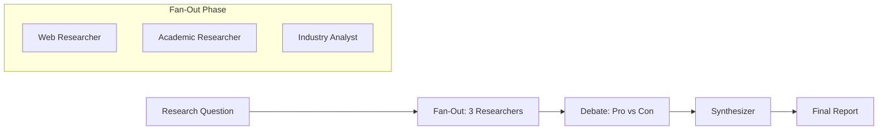

# Cookbook: Research Agent

A multi-agent research system using Fan-Out + Debate + ReAct.

## Architecture



## Implementation

```python
import asyncio
from pyagent_patterns.base import Agent, MockLLM
from pyagent_patterns.orchestration import FanOutFanIn
from pyagent_patterns.resolution import Debate
from pyagent_patterns.advanced import ReAct

# Phase 1: Parallel research with tool use
def web_search(query: str) -> str:
    return f"Web results for: {query}"

def arxiv_search(query: str) -> str:
    return f"Papers found for: {query}"

web_researcher = ReAct(
    agent=Agent("web", research_llm),
    tools={"search": web_search},
    max_steps=3,
)

academic_researcher = ReAct(
    agent=Agent("academic", research_llm),
    tools={"arxiv": arxiv_search},
    max_steps=3,
)

# Phase 2: Fan-out for parallel analysis
analysis = FanOutFanIn(
    agents=[
        Agent("market_analyst", analyst_llm),
        Agent("tech_analyst", analyst_llm),
        Agent("risk_analyst", analyst_llm),
    ],
    aggregator=Agent("synthesizer", synth_llm),
)

# Phase 3: Debate findings
debate = Debate(
    debaters=[
        Agent("optimist", debate_llm),
        Agent("skeptic", debate_llm),
    ],
    judge=Agent("judge", judge_llm),
    rounds=2,
)

async def research(question: str) -> str:
    # Gather research
    web_result = await web_researcher.run(question)
    academic_result = await academic_researcher.run(question)

    # Analyze in parallel
    combined = f"Web: {web_result.output}\nAcademic: {academic_result.output}"
    analysis_result = await analysis.run(combined)

    # Debate conclusions
    debate_result = await debate.run(f"Based on: {analysis_result.output}")

    return debate_result.output
```
