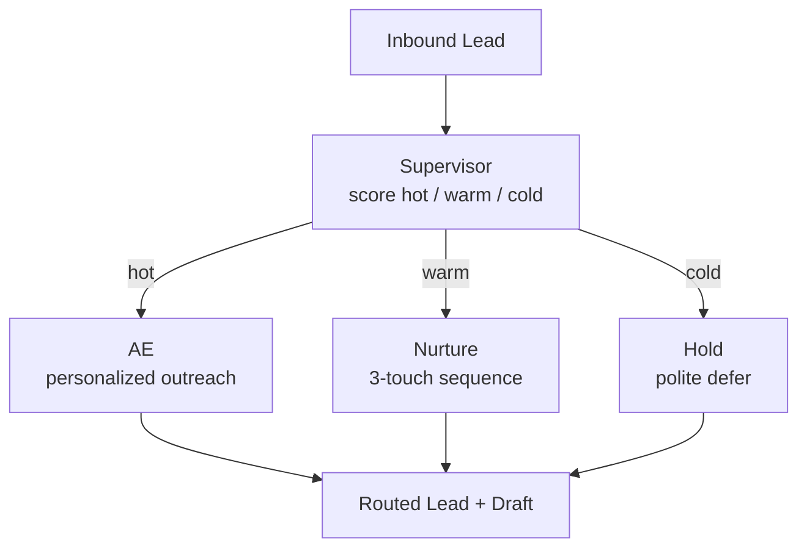

# How to Build a Multi-Agent Lead Qualification Workflow in Python

Inbound leads arrive faster than reps can read them, and the cost of mis-routing a hot lead is a lost
deal. This recipe uses a **Supervisor** to score each lead and route it to the right play — hot leads
get a personalized outreach draft, warm leads enter a nurture sequence, cold leads get a polite hold —
so every lead gets the right next step within seconds.

**Patterns used:** [Supervisor](../../packages/patterns/orchestration/supervisor.md) ·
[Pipeline](../../packages/patterns/orchestration/pipeline.md)

---

## Architecture



---

## Implementation

```bash
pip install pyagent-patterns pyagent-providers
```

```python
import asyncio
from pyagent_patterns.base import Agent
from pyagent_patterns.orchestration import Supervisor
from pyagent_providers import AnthropicLLM, OpenAILLM

fast_llm = OpenAILLM("gpt-4o-mini")
smart_llm = AnthropicLLM("claude-sonnet-4-20250514")

# ── Scorer: classifies the lead into a play ─────────────────────────────────────
scorer = Agent(
    "scorer", fast_llm,
    system_prompt=(
        "Score this inbound lead as exactly one of: hot, warm, cold. "
        "Hot = strong fit + buying signal (title, company size, intent). "
        "Warm = good fit, weak signal. Cold = poor fit or no signal. "
        "Reply with ONLY the label."
    ),
)

# ── Specialist plays per score ──────────────────────────────────────────────────
ae = Agent(
    "account_exec", smart_llm,
    system_prompt=(
        "Draft a 4-sentence personalized outreach email for this hot lead. Reference their role and "
        "the trigger that makes now the right time. End with one specific call-to-action."
    ),
)
nurture = Agent(
    "nurture", fast_llm,
    system_prompt=(
        "Add this warm lead to a 3-touch nurture sequence. Draft touch 1: a useful, no-ask message "
        "with a relevant resource. Outline touches 2 and 3 in one line each."
    ),
)
cold_hold = Agent(
    "cold_hold", fast_llm,
    system_prompt="Write a brief, polite holding reply and tag the lead for a 90-day re-check.",
)

crm = Supervisor(
    classifier=scorer,
    routes={"hot": ae, "warm": nurture, "cold": cold_hold},
    default_route="warm",
)

async def main():
    lead = "VP Eng at a 500-person fintech, downloaded the multi-agent whitepaper twice this week."
    result = await crm.run(lead)
    print(f"Routed to: {result.metadata['route_key']}\n")
    print(result.output)

asyncio.run(main())
```

---

## Expected Output

```text
Routed to: hot

Subject: multi-agent orchestration for fintech-scale reliability

Hi — saw your team is digging into multi-agent patterns (twice on the whitepaper this week!). At a
500-person fintech, the hard part is usually deterministic recovery and cost control across agents,
which is exactly what PyAgent's router + recovery layers handle. Worth a 20-minute walkthrough on how
teams your size cut model spend ~60%? — open to Thursday or Friday?
```

A warm lead would instead return touch 1 of a nurture sequence; a cold lead, a polite hold — all from
the same routing call.

---

## Customization

### Enrich the lead before scoring

Prepend a [Pipeline](../../packages/patterns/orchestration/pipeline.md) stage that pulls firmographics
from your CRM so the scorer sees company size, tech stack, and prior touches:

```python
from pyagent_patterns.orchestration import Pipeline
enrich = Agent("enrich", fast_llm, system_prompt="Add firmographics (size, industry, stack) from CRM context.")
qualified = Pipeline(stages=[enrich, scorer])  # feed the enriched lead into the supervisor
```

### Add an SDR hand-off for hot leads

```python
sdr_handoff = Agent("sdr", fast_llm, system_prompt="Write a Slack hand-off note + suggested meeting slots for the AE.")
crm.routes["hot"] = Pipeline(stages=[ae, sdr_handoff])
```

### Weighted scoring with explicit criteria

```python
scorer.system_prompt += " Weight: title 40%, company size 30%, intent signal 30%. Show the breakdown."
```

---

## When to Use

| Situation | Fit |
|-----------|-----|
| Route each input to one of several mutually-exclusive plays | ✅ Supervisor |
| Enrich → score as ordered stages | ✅ Pipeline |
| Several scorers should vote on borderline leads | ❌ Use [Voting](../../packages/patterns/resolution/voting.md) |
| The plan depends on the lead (variable subtasks) | ❌ Use [Orchestrator-Workers](../../packages/patterns/orchestration/orchestrator-workers.md) |

---

## Cost Profile

| Stage | Typical model | Avg cost | Volume (1k leads/day) |
|-------|--------------|----------|------------------------|
| Scorer | gpt-4o-mini | $0.0002 | $6/mo |
| Hot play (AE draft) | claude-sonnet | $0.003 | applies to ~20% of leads |
| Warm/cold plays | gpt-4o-mini | $0.0004 | majority |
| **Blended per lead** | mix | **~$0.0009** | **~$27/mo** |

Only hot leads hit the premium model, so cost scales with your hot-lead rate, not total volume.

---

## See Also

- [Supervisor pattern](../../packages/patterns/orchestration/supervisor.md) ·
  [Pipeline pattern](../../packages/patterns/orchestration/pipeline.md)
- [Support Router](../customer-support/support-router.md) — the tiered classify-and-route flagship
- [Marketing Campaign Planner](../marketing-content/campaign-planner.md)
- [Browse all recipes](../index.md)
