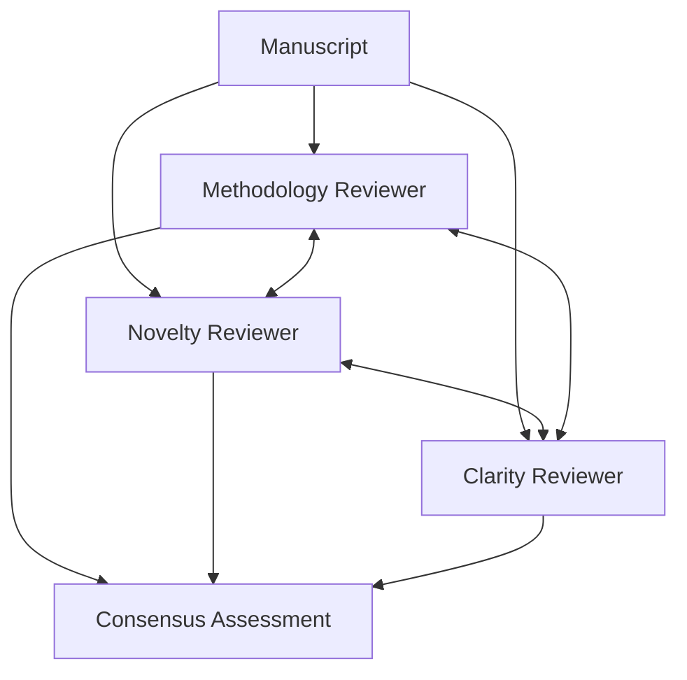

# How to Build a Multi-Agent Peer-Review Mesh in Python

Real peer review isn't a chain — reviewers see each other's comments and reconcile. This recipe
uses the **Topology** pattern in a **mesh** configuration: methodology, novelty, and clarity
reviewers each critique the manuscript and exchange notes over several rounds, converging on a
shared recommendation instead of three disconnected reports.

**Patterns used:** Topology (mesh)

---

## Architecture



---

## Implementation

```python
import asyncio
from pyagent_patterns.base import Agent
from pyagent_patterns.structural import Topology, TopologyType
from pyagent_providers import AnthropicLLM, OpenAILLM

review = Topology(
    agents=[
        Agent(
            "methodology_reviewer",
            AnthropicLLM("claude-sonnet-4-20250514"),
            system_prompt=(
                "Review the manuscript's methods: study design, statistics, reproducibility, and "
                "threats to validity. When you see peers' notes, reconcile your view with theirs."
            ),
        ),
        Agent(
            "novelty_reviewer",
            OpenAILLM("gpt-4o"),
            system_prompt=(
                "Review the manuscript's novelty and contribution relative to prior work. "
                "Adjust your assessment when peers raise points you missed."
            ),
        ),
        Agent(
            "clarity_reviewer",
            OpenAILLM("gpt-4o-mini"),
            system_prompt=(
                "Review writing clarity, figures, and structure. Note where claims outrun evidence. "
                "Reconcile with peers, then help draft the consensus recommendation."
            ),
        ),
    ],
    topology=TopologyType.MESH,
    rounds=2,
)

result = asyncio.run(review.run(
    "Manuscript: 'A Transformer for Protein Folding at Low Compute'. "
    "Abstract, methods, results, and discussion attached."
))
print(result.output)
print(f"Topology: {result.metadata['topology']}")
```

---

## Expected output

```text
CONSENSUS REVIEW — "A Transformer for Protein Folding at Low Compute"

Recommendation: Major revision.
Methodology: ablations missing; baseline comparison not matched on compute (all reviewers agree).
Novelty:      contribution is incremental but the low-compute angle is valuable.
Clarity:      Figure 3 unreadable; claims in §5 overstated relative to results.
Reviewers converged after round 2 on "major revision, resubmit with ablations".

Topology: mesh
```

Because reviewers exchange notes (mesh), the final recommendation is reconciled rather than three
conflicting scores a human editor must referee.

---

## Customization

### Editor-hub (star) topology

```python
review = Topology(agents=review._agents, topology=TopologyType.STAR, hub_index=0)  # reviewer 0 = handling editor
```

### Add a statistics reviewer

```python
review.agents.append(
    Agent("stats_reviewer", OpenAILLM("gpt-4o"),
          system_prompt="Check the statistics: power, multiple comparisons, and appropriate tests."),
)
```

### Deeper reconciliation

```python
review = Topology(agents=review._agents, topology=TopologyType.MESH, rounds=3)
```

---

## When to Use

| Situation | Use Topology (mesh)? |
|-----------|----------------------|
| Peers must see and reconcile each other's views | ✅ Yes — mesh |
| A fixed review order (security → perf → style) | ✅ Use `TopologyType.CHAIN` |
| One coordinator collects from spokes | ✅ Use `TopologyType.STAR` |
| Agents argue opposing sides for a judge | ❌ Use [Debate](../../packages/patterns/resolution/debate.md) |

---

## Cost Profile

| Driver | Typical model | Avg cost | Notes |
|--------|--------------|----------|-------|
| 3 reviewers × 2 rounds | sonnet + gpt-4o mix | $0.024 | mesh = N×rounds calls |
| **Per manuscript** | mix | **~$0.024** | scales with reviewers × rounds |

Mesh is the most expensive topology (every agent runs each round) — keep `rounds` small (2–3).

---

## See Also

- [Topology pattern](../../packages/patterns/structural/topology.md)
- [Loan Origination Workflow](../finance-trading/loan-origination.md) — a chain-topology state machine
- [Browse all recipes](../index.md)
