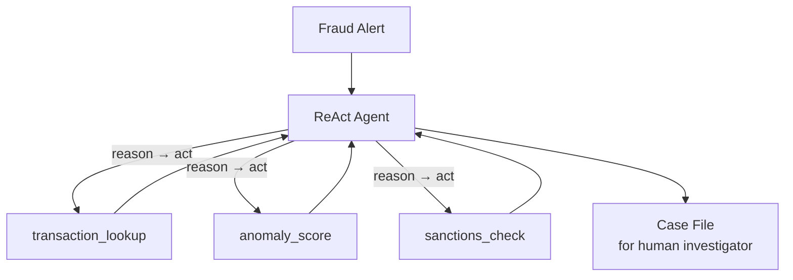

# How to Build a Multi-Agent Fraud Investigation Assistant in Python

A fraud alert needs investigation, not a one-shot verdict: pull the transactions, score anomalies,
check sanctions, then reason about what it means. This recipe uses the **ReAct** pattern — the
agent interleaves reasoning with tool calls, gathering evidence step by step until it can write a
case file for a human investigator.

**Patterns used:** ReAct (with tools)

---

## Architecture



---

## Implementation

```python
import asyncio
from pyagent_patterns.base import Agent
from pyagent_patterns.advanced import ReAct
from pyagent_providers import OpenAILLM


def transaction_lookup(account_id: str) -> str:
    """Return recent transactions for an account (replace with your ledger/API)."""
    ledger = {
        "ACC-8842": "12 txns in 24h; $9,900 ×3 to new payees; 2 logins from new country",
    }
    return ledger.get(account_id.strip(), f"No transactions found for {account_id}")


def anomaly_score(pattern: str) -> str:
    """Score a described transaction pattern 0-100 for fraud likelihood."""
    p = pattern.lower()
    score = 30
    if "9,900" in pattern or "9900" in pattern:
        score += 35  # structuring just under $10k reporting threshold
    if "new payee" in p or "new payees" in p:
        score += 20
    if "new country" in p or "new device" in p:
        score += 15
    return f"anomaly_score={min(score, 100)} (drivers: structuring, new payees, geo)"


def sanctions_check(payee: str) -> str:
    """Check a payee against a sanctions list (replace with OFAC/PEP screening)."""
    flagged = {"shell co ltd"}
    return "MATCH — on watchlist" if payee.strip().lower() in flagged else "no sanctions match"


investigator = ReAct(
    agent=Agent(
        "fraud_analyst",
        OpenAILLM("gpt-4o"),
        system_prompt=(
            "You investigate fraud alerts. Reason step by step and use tools to gather evidence: "
            "look up transactions, score anomalies, and screen payees. When you have enough, write "
            "a case file: summary, evidence, risk level (Low/Medium/High), and recommended action."
        ),
    ),
    tools={
        "transaction_lookup": transaction_lookup,
        "anomaly_score": anomaly_score,
        "sanctions_check": sanctions_check,
    },
    max_steps=6,
)

result = asyncio.run(investigator.run(
    "Alert: account ACC-8842 triggered a velocity rule. Investigate and recommend an action."
))
print(result.output)
print(f"Steps: {result.metadata['steps']}, tools used: {result.metadata['tools_used']}")
```

---

## Expected output

```text
CASE FILE — ACC-8842

Summary:  Three $9,900 transfers to new payees within 24h, plus logins from a new country.
Evidence: transaction_lookup → velocity + structuring; anomaly_score=85; sanctions_check → no match.
Risk:     High — classic structuring below the $10k reporting threshold.
Action:   Freeze outbound transfers, file a SAR, escalate to a human investigator.

Steps: 4, tools used: ['transaction_lookup', 'anomaly_score', 'sanctions_check']
```

The agent decides *which* tools to call and *when*, based on what each step reveals — the core of
ReAct.

---

## Customization

### Add tools

```python
def kyc_lookup(account_id: str) -> str: ...
def device_history(account_id: str) -> str: ...
investigator.tools.update({"kyc_lookup": kyc_lookup, "device_history": device_history})
```

### Bound the investigation

```python
investigator = ReAct(agent=investigator._agent, tools=investigator._tools, max_steps=4)
```

### Wrap with recovery

Wrap the agent in [BoundedExecution](../../guides/recovery.md) so a slow tool call can't hang the queue.

---

## When to Use

| Situation | Use ReAct? |
|-----------|------------|
| The agent must gather evidence via tools before deciding | ✅ Yes |
| Steps depend on intermediate results | ✅ Yes |
| The flow is a fixed sequence of stages | ❌ Use [Pipeline](../../packages/patterns/orchestration/pipeline.md) / [Topology](../../packages/patterns/structural/topology.md) |
| You only need to route to a specialist | ❌ Use [Supervisor](../../packages/patterns/orchestration/supervisor.md) |

---

## Cost Profile

| Driver | Typical model | Avg cost | Notes |
|--------|--------------|----------|-------|
| Reason/act steps (≤6) | gpt-4o | $0.01 | cost scales with steps |
| **Per investigation** | gpt-4o | **~$0.01** | cap with `max_steps` |

Wrap the agent in [Recovery](../../guides/recovery.md) for tool-call timeouts in production.

---

## See Also

- [ReAct pattern](../../packages/patterns/advanced/react.md)
- [Alert Triage](log-triage.md) — pipeline triage of security alerts
- [Loan Origination Workflow](../finance-trading/loan-origination.md) — staged financial workflow
- [Browse all recipes](../index.md)
