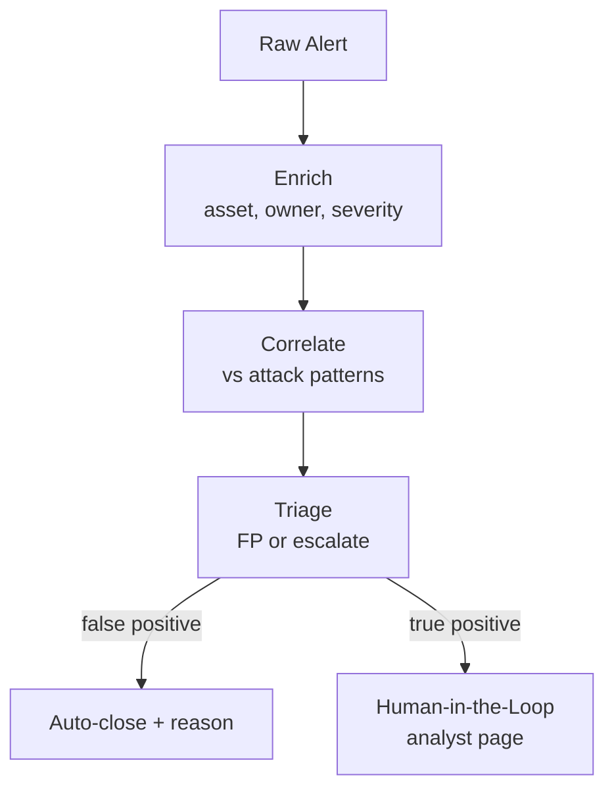

# How to Build a Multi-Agent Security Alert Triage Workflow in Python

A SOC drowns in alerts, most of them noise. This recipe runs each alert through a **Pipeline** that
enriches it with context and correlates it against known attack patterns, then uses
**Human-in-the-Loop** so confirmed true positives — and only those — page a human analyst with a
ready-made case, while false positives are auto-closed with a reason.

**Patterns used:** [Pipeline](../../packages/patterns/orchestration/pipeline.md) ·
[Human-in-the-Loop](../../packages/patterns/advanced/human-in-the-loop.md)

---

## Architecture



---

## Implementation

```bash
pip install pyagent-patterns pyagent-providers
```

```python
import asyncio
from pyagent_patterns.base import Agent
from pyagent_patterns.orchestration import Pipeline
from pyagent_patterns.advanced import HumanInTheLoop
from pyagent_patterns.advanced.human_in_the_loop import HumanDecision
from pyagent_patterns.composite import CompositePattern
from pyagent_providers import AnthropicLLM, OpenAILLM

fast_llm = OpenAILLM("gpt-4o-mini")
smart_llm = AnthropicLLM("claude-sonnet-4-20250514")

# ── Triage pipeline: enrich → correlate → classify ──────────────────────────────
triage_pipeline = Pipeline(stages=[
    Agent(
        "enricher", fast_llm,
        system_prompt=(
            "Enrich this alert with context: affected asset, business owner, data sensitivity, "
            "and a 1-5 severity. State assumptions explicitly. Pass everything forward."
        ),
    ),
    Agent(
        "correlator", smart_llm,
        system_prompt=(
            "Match the enriched alert against known attack patterns (MITRE ATT&CK style). "
            "Give a confidence 0-100 that this is a real attack, with the supporting signals."
        ),
    ),
    Agent(
        "classifier", smart_llm,
        system_prompt=(
            "Decide: FALSE_POSITIVE (confidence < 60) or ESCALATE. For ESCALATE, write a 3-line "
            "case: what happened, why it's likely real, and the recommended first response."
        ),
    ),
])

# ── Human escalation: only true positives reach an analyst ──────────────────────
def page_analyst(output: str, metadata: dict) -> HumanDecision:
    """Create a case in your SOAR / ticketing system and page on-call."""
    if "FALSE_POSITIVE" in output:
        return HumanDecision(approved=True, modified_output=f"Auto-closed: {output}")
    case_id = _create_soc_case(summary=output[:200], metadata=metadata)  # your integration
    print(f"[PAGED] analyst on-call — case {case_id}")
    return HumanDecision(approved=True, modified_output=f"Escalated as case {case_id}\n{output}")

soc = CompositePattern(patterns=[triage_pipeline])
soc_with_human = HumanInTheLoop(
    agent=Agent("case_writer", fast_llm, system_prompt="Format the triage result as a SOC case note."),
    review_fn=page_analyst,
    high_risk_keywords=["ransomware", "exfiltration", "domain admin", "lateral movement"],
)

SAMPLE_ALERT = (
    '{"rule":"impossible travel","user":"j.doe","from":"US","to":"RU","delta_min":12,'
    '"asset":"vpn-gw-01","mfa":"failed x3"}'
)

async def main():
    triaged = await soc.run(SAMPLE_ALERT)
    final = await soc_with_human.run(triaged.output)
    print(final.output)

asyncio.run(main())
```

---

## Expected Output

```text
[PAGED] analyst on-call — case SOC-4471
Escalated as case SOC-4471
ESCALATE (confidence 88)
What: impossible-travel sign-in to vpn-gw-01 for j.doe, US→RU in 12 min, 3 failed MFA pushes.
Why real: geo-velocity + MFA fatigue pattern (ATT&CK T1110/T1621).
First response: disable session, force re-auth, check VPN logs for successful auth from RU.
```

A clear false positive (e.g. a known corporate VPN egress) closes itself with a reason; only the
high-confidence case pages a human — which is the whole point of triage.

---

## Customization

### Add live enrichment with a ReAct tool agent

Swap the static enricher for a [ReAct](../../packages/patterns/advanced/react.md) agent that queries
your asset DB and threat-intel feeds — see the [Fraud Investigation Assistant](fraud-investigation.md).

### Tune the escalation threshold

```python
# Raise the bar during a noisy migration; lower it during an active incident.
classifier_prompt = "Decide FALSE_POSITIVE only if confidence < 75; otherwise ESCALATE."
```

### Batch the overnight queue

```python
async def triage_queue(alerts: list[str]) -> list[str]:
    results = await asyncio.gather(*(soc.run(a) for a in alerts))
    return [r.output for r in results]
```

---

## When to Use

| Situation | Fit |
|-----------|-----|
| Fixed enrich → correlate → classify stages | ✅ Pipeline |
| Only confirmed positives should page a human | ✅ Human-in-the-Loop |
| The agent must call tools to gather evidence | ❌ Use [ReAct](../../packages/patterns/advanced/react.md) ([Fraud Investigation](fraud-investigation.md)) |
| You need several detectors to vote | ❌ Use [Voting](../../packages/patterns/resolution/voting.md) |

---

## Cost Profile

| Stage | Typical model | Avg cost | Volume (50k alerts/day) |
|-------|--------------|----------|--------------------------|
| Enrich | gpt-4o-mini | $0.0003 | $450/mo |
| Correlate + classify | claude-sonnet | $0.006 | $9,000/mo |
| **Per alert** | mix | **~$0.0063** | **~$9.5k/mo** |

Run a cheap pre-filter (regex / allow-list) before the LLM pipeline to cut volume on known-benign rules.

---

## See Also

- [Pipeline pattern](../../packages/patterns/orchestration/pipeline.md) ·
  [Human-in-the-Loop pattern](../../packages/patterns/advanced/human-in-the-loop.md)
- [Fraud Investigation Assistant](fraud-investigation.md) — tool-using ReAct investigation
- [Incident Triage](../devops-sre/incident-triage.md) — the same shape for ops incidents
- [Browse all recipes](../index.md)
