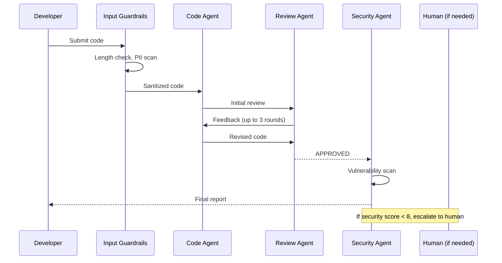

# How to Build a Multi-Agent Code Review System in Python

A production-grade multi-agent code review system that automatically guards inputs, performs iterative peer review, scans for security issues, and routes to human reviewers when needed.

**Patterns used:** CrossReflection, Pipeline, HumanInTheLoop, GuardrailChain, RouterMiddleware

---

## Requirements

- **Functional** — iteratively review code for correctness/maintainability until a reviewer agent
  approves it; separately scan for security vulnerabilities; escalate low security scores to a
  human.
- **Non-functional** — the review loop must terminate (bounded rounds), not iterate indefinitely on
  a disagreement between generator and reviewer.
- **Audit** — every approval must show the specific review round and reviewer feedback that led to
  it; every escalation must show the security score that triggered it.
- **Not required** — no automatic merge action — this recipe produces a review verdict and, for
  low-security-score cases, a human-readable escalation; it doesn't itself touch the repository.

## Architecture decisions

| Decision | Why | Why not the alternative |
|---|---|---|
| **Cross-Reflection** for the review loop | The reviewer is a genuinely different agent/expertise from the code generator — an independent second opinion, not self-review. | **Self-Reflection** would have the code-writing agent critique its own work, losing the independent-perspective signal that catches blind spots. |
| Security scan as its own **Pipeline**, not folded into the review loop | Security scanning is a single-pass check, not an iterative negotiation — it doesn't need Cross-Reflection's multi-round structure. | Folding it into the review loop would force every review round to re-run a security scan, wasting cost on an unchanging concern. |
| **Human-in-the-Loop** gates only escalation, not every review | Bounded, iterative peer review runs at machine speed for the common case; only genuinely low security scores need a human. | Gating every review round on a human would eliminate the whole point of automating iterative review. |
| Dedicated `security` provider tier, separate from `fast`/`smart` | Security scanning benefits from a specific model choice independent of the cost/quality tradeoff driving the other two tiers. | Reusing `smart` for security scanning would work, but conflates two independent provider decisions (review quality vs. security-scan model choice) into one knob. |

## Four-pillar mapping

| Requirement | Pillar | Capability |
|---|---|---|
| Iterative review until approved | Execution | `CrossReflection` pattern |
| Security vulnerability scan | Execution | `Pipeline` pattern |
| Escalate low scores to a human | Execution | `HumanInTheLoop` pattern |
| Track daily review spend | Observability | `observability.cost_budget` |
| Trace each review round | Observability | `observability.tracing` |

## Blueprint (declarative form)

The real, verified file at `examples/cookbook/software-engineering/code_review/blueprint.yaml`,
compiled against `PyAgentAdapter` as part of this repo's test suite:

```yaml
api_version: pyagent/v1
metadata:
  name: code-review
  version: 1.0.0
  description: Iterative review + security scan with human escalation

providers:
  fast:     { model: gpt-4o-mini }
  smart:    { model: claude-sonnet-4-20250514 }
  security: { model: gpt-4o }

agents:
  code_agent:       { provider: smart,    prompt: "Review for correctness, maintainability, best practices." }
  review_agent:     { provider: smart,    prompt: "Review clarity, test gaps, design. Return APPROVED when ready." }
  security_agent:   { provider: security, prompt: "Scan for vulns. Score 1-10. If < 8, escalate." }
  escalation_agent: { provider: fast,     prompt: "Summarize security finding for human review." }

workflows:
  review:
    pattern: cross_reflection
    agents: { generator: code_agent, reviewer: review_agent }
    config: { max_rounds: 3, stop_phrase: APPROVED }
  security:
    pattern: pipeline
    agents: { stages: [security_agent] }
  escalate:
    pattern: human_in_the_loop
    agents: { agent: escalation_agent }

observability:
  tracing: { enabled: true }
  cost_budget: { daily_usd: 50.0, alert_threshold: 0.8 }
```

```bash
pyagent-blueprint validate code-review.yaml
pyagent-blueprint test code-review.yaml
```

## Production checklist

Ran this exact blueprint through `PyAgentAdapter.compile()` and inspected the real diagnostics:

- ✅ **All three workflows run as declared** — `review`, `security`, and `escalate` each compile
  and execute against the native pattern registry with no diagnostics on workflow structure.
- ⚠️ **`observability.cost_budget` is declared but not auto-enforced** — compiling emits
  `BUDGET_UNSUPPORTED`: the $50/day budget is recorded but not enforced. Wire real enforcement via
  `graph.wire_cost_tracker(tracker)`.
- **The three workflows aren't sequenced by the blueprint itself** — deciding to run `security` and
  `escalate` only when the security score is below threshold is caller logic, not declared in the
  spec. If that branching needs to be reviewable/diffable, it currently isn't.
- **The `GuardrailChain`/`RouterMiddleware` behavior shown in some Python variants of this recipe
  isn't represented in this blueprint** — the blueprint captures the three named patterns' structure,
  not every middleware layer a full production deployment might add.

---

## Architecture



---

## Implementation

```python
import asyncio
from pyagent_patterns.base import Agent
from pyagent_patterns.resolution import CrossReflection
from pyagent_patterns.orchestration import Pipeline
from pyagent_patterns.advanced import HumanInTheLoop
from pyagent_patterns.composite import CompositePattern
from pyagent_patterns.guardrails import GuardrailChain, LengthGuard, PIIGuard, ContentGuard
from pyagent_router.middleware import RouterMiddleware
from pyagent_providers import AnthropicLLM, OpenAILLM

# ── LLMs ──────────────────────────────────────────────────────────────────────
fast_llm      = OpenAILLM("gpt-4o-mini")
smart_llm     = AnthropicLLM("claude-sonnet-4-20250514")
security_llm  = OpenAILLM("gpt-4o")

model_registry = {
    "gpt-4o-mini":              fast_llm,
    "gpt-4o":                   security_llm,
    "claude-sonnet-4-20250514": smart_llm,
}
router = RouterMiddleware(model_registry=model_registry)

# ── Guardrails ─────────────────────────────────────────────────────────────────
input_guard = GuardrailChain([
    LengthGuard(max_chars=50_000, truncate=False),   # hard reject huge pastes
    PIIGuard(redact=True),                            # redact emails/tokens in comments
    ContentGuard(deny_patterns=[                      # block embedded secrets
        __import__("re").compile(r"sk-[A-Za-z0-9]{20,}"),
        __import__("re").compile(r"ghp_[A-Za-z0-9]{36}"),
    ]),
])

# ── Stage 1: iterative code review via cross-reflection ───────────────────────
code_review = CrossReflection(
    generator=router.wrap(
        Agent("author", smart_llm,
              system_prompt=(
                  "You are a senior Python engineer. Review and improve the submitted code. "
                  "Focus on: correctness, edge cases, type hints, docstrings, and performance."
              )),
    ),
    reviewer=router.wrap(
        Agent("critic", smart_llm,
              system_prompt=(
                  "You are a principal engineer doing code review. "
                  "Point out specific issues with line references. "
                  "Reply APPROVED when the code meets production standards."
              )),
    ),
    max_rounds=3,
)

# ── Stage 2: security scan ────────────────────────────────────────────────────
security_pipeline = Pipeline(stages=[
    Agent("security", security_llm,
          system_prompt=(
              "You are a security engineer. Scan the code for: SQL injection, "
              "XSS, insecure deserialization, hardcoded secrets, path traversal, "
              "and OWASP Top 10 issues. Score security 1-10. List every finding."
          )),
])

# ── Stage 3: human escalation for low security scores ────────────────────────
def needs_human_review(result) -> bool:
    """Escalate to human if security score < 8."""
    import re
    match = re.search(r"[Ss]core[:\s]+(\d+)", result.output)
    if match:
        return int(match.group(1)) >= 8
    return True   # pass if no score found

human_escalation = HumanInTheLoop(
    agent=Agent("prep", fast_llm,
                system_prompt="Summarize the security issues for the human reviewer."),
    review_fn=lambda output, meta: _queue_human_review(output),
    high_risk_keywords=["critical", "injection", "hardcoded"],
)

full_pipeline = CompositePattern(
    patterns=[security_pipeline, human_escalation],
    quality_check=needs_human_review,
)

# ── Main review function ───────────────────────────────────────────────────────
async def review_code(code: str) -> dict:
    # 1. Guardrail check
    check = input_guard.check(code)
    if not check.passed:
        return {"error": check.message, "blocked": True}
    safe_code = check.sanitized_content or code

    # 2. Iterative code review
    review_result = await code_review.run(
        f"Review and improve this code:\n\n```python\n{safe_code}\n```"
    )

    # 3. Security scan + optional human escalation
    security_result = await full_pipeline.run(
        f"Security scan:\n\n```python\n{review_result.output}\n```"
    )

    return {
        "improved_code": review_result.output,
        "security_report": security_result.output,
        "review_rounds": review_result.metadata.get("rounds", 0),
        "escalated_to_human": security_result.metadata.get("escalation_level", 0) > 0,
    }


def _queue_human_review(summary: str):
    """Post security findings to the review queue and return a holding decision."""
    import httpx, os
    r = httpx.post(
        os.environ["REVIEW_QUEUE_URL"] + "/reviews",
        json={"summary": summary[:500], "priority": "high", "source": "code-review-agent"},
        headers={"Authorization": f"Bearer {os.environ['REVIEW_QUEUE_TOKEN']}"},
        timeout=15.0,
    )
    r.raise_for_status()
    ticket_id = r.json()["ticket_id"]
    print(f"[SECURITY REVIEW] ticket={ticket_id}")
    from pyagent_patterns.advanced.human_in_the_loop import HumanDecision
    return HumanDecision(approved=True, modified_output=f"[Ticket {ticket_id}]\n{summary}")


# ── Run it ─────────────────────────────────────────────────────────────────────
if __name__ == "__main__":
    code = '''
def get_user(user_id):
    query = "SELECT * FROM users WHERE id = " + user_id
    return db.execute(query)
    '''

    result = asyncio.run(review_code(code))
    print("=== Improved Code ===")
    print(result["improved_code"])
    print("\n=== Security Report ===")
    print(result["security_report"])
    print(f"\nReview rounds: {result['review_rounds']}")
    print(f"Escalated to human: {result['escalated_to_human']}")
```

---

## Expected Output

Running the SQL injection example above:

```
=== Improved Code ===
def get_user(user_id: int) -> dict | None:
    """Fetch a user by ID.

    Args:
        user_id: The integer user ID to look up.

    Returns:
        User dict or None if not found.
    """
    query = "SELECT * FROM users WHERE id = ?"
    return db.execute(query, (user_id,))

=== Security Report ===
Security Score: 3/10

CRITICAL — SQL Injection (original code):
  Line 2: String concatenation used in SQL query.
  Fix: Use parameterized queries (? placeholder). Applied in improved code.

MEDIUM — Missing input validation:
  user_id is typed as `int` but callers may pass strings from HTTP params.
  Fix: Add isinstance(user_id, int) or use a Pydantic model at the boundary.

Review rounds: 2
Escalated to human: True   ← score was 3, below threshold of 8
```

---

## Customization

### Change the review focus

```python
# Security-focused review
Agent("author", smart_llm,
      system_prompt="Review for security vulnerabilities only. OWASP Top 10.")

# Performance-focused review
Agent("author", smart_llm,
      system_prompt="Review for performance. Focus on O(n) complexity, DB queries, caching.")

# Style-focused review
Agent("author", smart_llm,
      system_prompt="Review for PEP 8, type hints, and Google docstring format.")
```

### Adjust escalation threshold

```python
# Always pass to human (security-critical systems)
def always_human(result) -> bool:
    return False   # never passes quality check → always escalates

# Only escalate on critical findings
def only_critical(result) -> bool:
    return "CRITICAL" not in result.output.upper()
```

### Add language support

```python
# Detect language and route to the right specialist
def language_aware_prompt(code: str) -> str:
    if "def " in code or "import " in code:
        return f"Review this Python code:\n\n```python\n{code}\n```"
    elif "function " in code or "const " in code:
        return f"Review this JavaScript/TypeScript code:\n\n```js\n{code}\n```"
    return f"Review this code:\n\n```\n{code}\n```"
```

---

## Cost Profile

| Code snippet | Review rounds | Models used | Approx cost |
|-------------|--------------|-------------|-------------|
| 50-line function | 1–2 | gpt-4o-mini × 2 | $0.001 |
| 200-line class | 2–3 | claude-sonnet × 3 | $0.008 |
| 500-line module | 3 + security | claude-sonnet + gpt-4o | $0.025 |
| Human escalation | — | + human time | $0.002 + human |

---

## See Also

- [CrossReflection pattern](../../packages/patterns/resolution/cross-reflection.md)
- [Guardrails Guide](../../guides/guardrails.md)
- [Routing Guide](../../guides/router.md)
- [HumanInTheLoop pattern](../../packages/patterns/advanced/human-in-the-loop.md)
