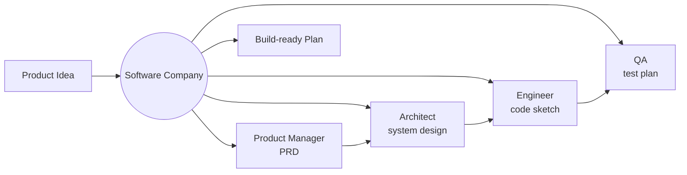

# How to Simulate a Software Startup with Multi-Agent Role-Play in Python

Inspired by MetaGPT's software-company simulation, this recipe uses the **Role-Based** pattern to
turn a one-line idea into a buildable plan. A Product Manager, Architect, Engineer, and QA each
hold their role and react to one another over rounds, producing a PRD, a system design, a code
sketch, and a test plan — the standardized hand-offs a real team uses.

**Patterns used:** Role-Based

---

## Architecture



---

## Implementation

```python
import asyncio
from pyagent_patterns.base import Agent
from pyagent_patterns.structural import RoleBased
from pyagent_providers import AnthropicLLM, OpenAILLM

company = RoleBased(
    agents=[
        Agent(
            "product_manager",
            AnthropicLLM("claude-sonnet-4-20250514"),
            system_prompt=(
                "You are the Product Manager. Write a tight PRD: problem, target user, 3-5 user "
                "stories, and success metrics. Keep scope to an MVP."
            ),
        ),
        Agent(
            "architect",
            AnthropicLLM("claude-sonnet-4-20250514"),
            system_prompt=(
                "You are the Architect. From the PRD, define components, data model, key APIs, and "
                "the tech stack. Note the single riskiest technical decision."
            ),
        ),
        Agent(
            "engineer",
            OpenAILLM("gpt-4o"),
            system_prompt=(
                "You are the Engineer. From the design, sketch the core modules and a minimal code "
                "skeleton (function/class signatures, not full bodies). Flag unknowns for QA."
            ),
        ),
        Agent(
            "qa",
            OpenAILLM("gpt-4o-mini"),
            system_prompt=(
                "You are QA. From the PRD and code sketch, write a test plan: critical paths, edge "
                "cases, and acceptance criteria per user story."
            ),
        ),
    ],
    rounds=2,
)

result = asyncio.run(company.run(
    "Idea: a CLI that summarizes a git repo's recent activity into a weekly stand-up note."
))
print(result.output)
print(f"Roles: {result.metadata['roles']}, rounds: {result.metadata['rounds']}")
```

---

## Expected output

```text
BUILD-READY PLAN — "standup-cli"

PRD:       summarize commits + PRs into a weekly note; users = small dev teams; metric = adoption.
Design:    git-log parser → grouping → LLM summarizer; stack Python + Click; risk = noisy diffs.
Code:      modules collect.py / group.py / summarize.py with signatures sketched.
QA:        tests for empty repo, huge diffs, merge commits; acceptance per user story.

Roles: ['product_manager', 'architect', 'engineer', 'qa'], rounds: 2
```

---

## Customization

### Add a designer role

```python
company.agents.insert(2,
    Agent("designer", AnthropicLLM("claude-sonnet-4-20250514"),
          system_prompt="You are the Designer. Define the core user flows and a minimal UI spec."),
)
```

### Deeper iteration

```python
company = RoleBased(agents=company._agents, rounds=3)
```

### Emit structured artifacts

Append a [Pipeline](../../packages/patterns/orchestration/pipeline.md) stage that serialises the PRD,
design, and test plan to JSON for your issue tracker.

---

## When to Use

| Situation | Use Role-Based? |
|-----------|-----------------|
| A fixed cast of roles hands work down a chain and iterates | ✅ Yes |
| You want standardized role outputs (PRD, design, tests) | ✅ Yes |
| Roles map to whole teams with sub-workers | ❌ Use [Hierarchical](../../packages/patterns/orchestration/hierarchical.md) |
| You just need code reviewed and improved | ❌ Use [Code Review](code-review.md) |

---

## Cost Profile

| Driver | Typical model | Avg cost | Notes |
|--------|--------------|----------|-------|
| 4 roles × 2 rounds | sonnet + gpt-4o mix | $0.02 | senior roles on stronger models |
| **Per simulation** | mix | **~$0.02** | scales with roles × rounds |

---

## See Also

- [Role-Based pattern](../../packages/patterns/structural/role-based.md)
- [Writers' Room](../media-entertainment/writers-room.md) — the same pattern for creative work
- [Code Review](code-review.md) — iterative review of real code
- [Browse all recipes](../index.md)
