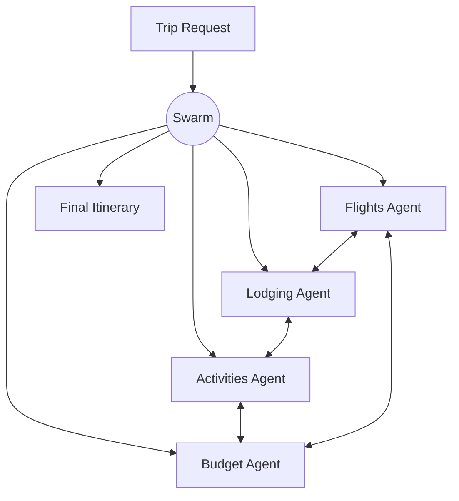

# How to Build a Multi-Agent Trip Planner in Python

Planning a trip means flights, lodging, activities, and budget all influencing each other — change
the flight and the budget shifts, which changes the hotel. This recipe uses the **Swarm** pattern:
specialist agents self-organize, each updating its plan as it sees neighbors' choices, until the
itinerary settles into a consistent whole.

**Patterns used:** Swarm

---

## Architecture



---

## Implementation

```python
import asyncio
from pyagent_patterns.base import Agent
from pyagent_patterns.advanced import Swarm
from pyagent_providers import GeminiLLM

planner = Swarm(
    agents=[
        Agent(
            "flights",
            GeminiLLM("gemini-2.5-flash"),
            system_prompt=(
                "You plan flights. Propose routes and times within budget. When neighbors change "
                "lodging or budget, adjust your picks to stay consistent."
            ),
        ),
        Agent(
            "lodging",
            GeminiLLM("gemini-2.5-flash"),
            system_prompt=(
                "You plan lodging near the chosen activities and airport. Update your choice when "
                "flight times or budget change."
            ),
        ),
        Agent(
            "activities",
            GeminiLLM("gemini-2.5-flash"),
            system_prompt=(
                "You plan day-by-day activities for the destination and dates. Keep them reachable "
                "from the lodging and within the remaining budget."
            ),
        ),
        Agent(
            "budget",
            GeminiLLM("gemini-2.5-flash"),
            system_prompt=(
                "You keep the trip within total budget. Flag overruns and push neighbors to trade "
                "off. Converge on a balanced allocation across flights, lodging, and activities."
            ),
        ),
    ],
    rounds=3,
    neighbor_count=2,
    aggregation="last",
)

result = asyncio.run(planner.run(
    "7-day trip to Lisbon for two in May, total budget $3,500. "
    "Prefer central lodging, food + history, minimal early flights."
))
print(result.output)
print(f"Agents: {result.metadata['agents']}, rounds: {result.metadata['rounds']}")
```

---

## Expected output

```text
LISBON ITINERARY (7 days, 2 people) — total ~$3,420

Flights:  midday round-trip, $1,180 (budget pushed flights off the early slot).
Lodging:  central Baixa apartment, 6 nights, $1,140.
Activities: Alfama food walk, Belém, Sintra day trip, ... $640.
Budget:   $460 buffer; all agents converged by round 3.

Agents: ['flights', 'lodging', 'activities', 'budget'], rounds: 3
```

No central planner dictates the trip — the agents negotiate to a consistent itinerary, the way a
group of friends each owning one job would.

---

## Customization

### Tune convergence

```python
planner = Swarm(agents=planner._agents, rounds=4, neighbor_count=3)  # more cross-talk → tighter consistency
```

### Add a local-guide agent

```python
planner.agents.append(
    Agent("local_guide", GeminiLLM("gemini-2.5-flash"),
          system_prompt="Add authentic local food and neighbourhood picks; avoid tourist traps."),
)
```

### Hard budget cap

```python
planner.agents[-1].system_prompt += " The total MUST stay under the stated budget; cut activities before lodging."
```

---

## When to Use

| Situation | Use Swarm? |
|-----------|------------|
| Interdependent choices that must settle to consistency | ✅ Yes |
| You want decentralized negotiation, no single coordinator | ✅ Yes |
| A manager should assign and synthesize | ❌ Use [Orchestrator-Workers](../../packages/patterns/orchestration/orchestrator-workers.md) |
| Agents coordinate through shared named state | ❌ Use [Blackboard](../../packages/patterns/structural/blackboard.md) |

---

## Cost Profile

| Driver | Typical model | Avg cost | Notes |
|--------|--------------|----------|-------|
| 4 agents × 3 rounds | gemini-flash | $0.0048 | N × rounds calls |
| **Per itinerary** | gemini-flash | **~$0.005** | scales with agents × rounds |

`neighbor_count` and `rounds` trade convergence quality against cost — start at 2 / 3.

---

## See Also

- [Swarm pattern](../../packages/patterns/advanced/swarm.md)
- [Emergent NPC World](../gaming/npc-world.md) — decentralized coordination via a blackboard
- [Browse all recipes](../index.md)
