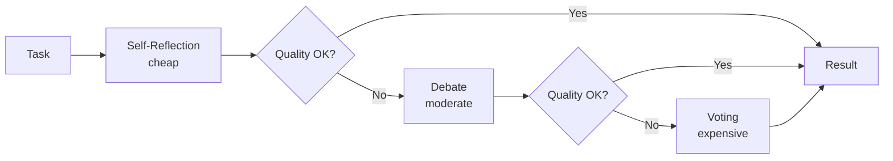

# Composition Guide

Combine multiple patterns so the system escalates automatically when output quality isn't good enough. `CompositePattern` runs patterns in order, checks quality after each, and moves to the next only when the current one falls short — giving you the cheapest adequate result rather than always using the most expensive approach.

---

## The Idea

Running `claude-sonnet` with a 3-round debate for every task is overkill. Most tasks pass a single self-reflection. A few need debate. Very few need human review.



The quality check runs after each pattern. If it passes, escalation stops. Cost is proportional to how hard the task actually is — not the hardest task you might ever get.

---

## Basic Composition

```python
import asyncio
from pyagent_patterns.base import Agent
from pyagent_patterns.composite import CompositePattern, min_length_check
from pyagent_patterns.resolution import SelfReflection, Debate, Voting
from pyagent_providers import AnthropicLLM, OpenAILLM

cheap_llm     = OpenAILLM("gpt-4o-mini")
expensive_llm = AnthropicLLM("claude-sonnet-4-20250514")

# Level 0 — cheapest: quick self-reflection
reflection = SelfReflection(
    agent=Agent("analyst", cheap_llm, system_prompt="Analyze concisely."),
    max_rounds=2,
)

# Level 1 — moderate: debate between two perspectives
debate = Debate(
    debaters=[
        Agent("optimist", cheap_llm, system_prompt="Argue the bullish case."),
        Agent("sceptic",  cheap_llm, system_prompt="Argue the bearish case."),
    ],
    judge=Agent("judge", expensive_llm, system_prompt="Give a balanced verdict."),
    rounds=2,
)

# Level 2 — expensive: majority vote across multiple agents
voting = Voting(
    voters=[
        Agent(f"expert_{i}", expensive_llm, system_prompt="Give your expert opinion.")
        for i in range(3)
    ],
)

composite = CompositePattern(
    patterns=[reflection, debate, voting],
    quality_check=min_length_check(200),   # must produce ≥ 200 chars
)

result = asyncio.run(composite.run("Should we invest in Nvidia at $3.2T?"))
print(f"Escalated to level: {result.metadata['escalation_level']}")
print(f"Patterns tried:     {result.metadata['total_patterns_tried']}")
print(result.output)
```

---

## Quality Checks

The quality check is a callable that receives the `Result` and returns `True` (good enough) or `False` (escalate).

### Built-in check

```python
from pyagent_patterns.composite import min_length_check

# Must produce at least 150 characters
composite = CompositePattern(
    patterns=[reflection, debate, voting],
    quality_check=min_length_check(150),
)
```

### Custom checks

```python
# Require at least one number in the output (useful for financial analysis)
def contains_numbers(result) -> bool:
    return any(c.isdigit() for c in result.output)

# Require high confidence score from the pattern
def high_confidence(result) -> bool:
    return result.metadata.get("final_score", 0) >= 8

# Require JSON structure
import json
def valid_json(result) -> bool:
    try:
        json.loads(result.output)
        return True
    except json.JSONDecodeError:
        return False

# Combine checks
def both_checks(result) -> bool:
    return contains_numbers(result) and len(result.output) >= 100

composite = CompositePattern(
    patterns=[reflection, debate],
    quality_check=both_checks,
)
```

### No quality check — always run all patterns

Omit `quality_check` to run every pattern and return the last result (useful for ensemble approaches where you want all perspectives regardless of quality):

```python
composite = CompositePattern(
    patterns=[fast_agent, thorough_agent, expert_agent],
    # No quality_check — all three always run
)
```

---

## Real-World Escalation Scenarios

### Code generation

```python
from pyagent_patterns.resolution import SelfReflection, CrossReflection

# Level 0: agent writes and reviews its own code
self_review = SelfReflection(
    agent=Agent("coder", cheap_llm, system_prompt="Write and review Python code."),
    max_rounds=3,
)

# Level 1: second agent reviews the first's code
peer_review = CrossReflection(
    generator=Agent("author",   cheap_llm,     system_prompt="Write the code."),
    reviewer=Agent("reviewer",  expensive_llm, system_prompt="Review for bugs and style."),
    max_rounds=2,
)

# Level 2: human reviews if both automated passes fail
from pyagent_patterns.advanced import HumanInTheLoop
human_review = HumanInTheLoop(
    agent=Agent("prep", cheap_llm, system_prompt="Prepare a code review summary."),
    review_fn=lambda output, meta: queue_for_human(output),
)

def compiles_and_has_docstrings(result) -> bool:
    try:
        compile(result.output, "<string>", "exec")
    except SyntaxError:
        return False
    return '"""' in result.output or "'''" in result.output

code_pipeline = CompositePattern(
    patterns=[self_review, peer_review, human_review],
    quality_check=compiles_and_has_docstrings,
)
```

### Financial analysis

```python
from pyagent_patterns.resolution import SelfReflection, Debate, EvaluatorOptimizer

# Level 0: quick reflection
quick = SelfReflection(
    agent=Agent("analyst", cheap_llm, system_prompt="Analyze concisely."),
    max_rounds=1,
)

# Level 1: debate bull vs bear
adversarial = Debate(
    debaters=[
        Agent("bull",  cheap_llm, system_prompt="Strongest bullish case."),
        Agent("bear",  cheap_llm, system_prompt="Strongest bearish case."),
    ],
    judge=Agent("judge", expensive_llm),
    rounds=2,
)

# Level 2: criteria-based optimization
optimized = EvaluatorOptimizer(
    generator=Agent("writer",    expensive_llm, system_prompt="Write the investment memo."),
    evaluator=Agent("evaluator", expensive_llm,
                    system_prompt="Score 1-10 on: accuracy, balance, actionability."),
    max_rounds=3,
    score_threshold=8,
)

# Must mention a number (quantitative insight) AND be long enough
def has_quantitative_insight(result) -> bool:
    return any(c.isdigit() for c in result.output) and len(result.output) > 300

analysis_pipeline = CompositePattern(
    patterns=[quick, adversarial, optimized],
    quality_check=has_quantitative_insight,
)
```

---

## Combining Composition with Recovery

Quality-based escalation (`CompositePattern`) handles _bad output_. Failure-based recovery (`BoundedExecution`) handles _API errors, timeouts, and token limits_. They serve different purposes and compose cleanly.

```python
from pyagent_patterns.composite import CompositePattern, min_length_check
from pyagent_patterns.recovery import BoundedExecution

# Inner: escalate on quality
escalation = CompositePattern(
    patterns=[cheap_pattern, moderate_pattern, expensive_pattern],
    quality_check=min_length_check(150),
)

# Outer: recover on failure
safe = BoundedExecution(
    pattern=escalation,
    fallback=Pipeline(stages=[Agent("emergency", cheap_llm,
                                    system_prompt="Give a brief summary.")]),
    max_retries=1,
    timeout_seconds=60.0,
)

result = asyncio.run(safe.run("Analyze this document"))
print(f"Escalation level: {result.metadata.get('escalation_level', 0)}")
print(f"Recovery level:   {result.metadata.get('recovery_level', 0)}")
```

---

## Cost Profile

Escalation rarely reaches level 2 for typical tasks — most requests pass at level 0 or 1:

| Level | Pattern | Typical task hit rate | LLM calls |
|-------|---------|----------------------|-----------|
| 0 | SelfReflection | ~70% | 2–4 |
| 1 | Debate | ~25% | 5–8 |
| 2 | Voting / Human | ~5% | 9+ / human |

The result: most requests run cheap, hard requests escalate automatically.

---

## See Also

- [Recovery Guide](recovery.md) — failure-based recovery with `BoundedExecution`
- [Patterns Package](../packages/patterns/index.md) — all pattern classes
- [Routing Guide](router.md) — complement composition with model-level routing
- [API Reference](../api/patterns/composition-safety.md)
